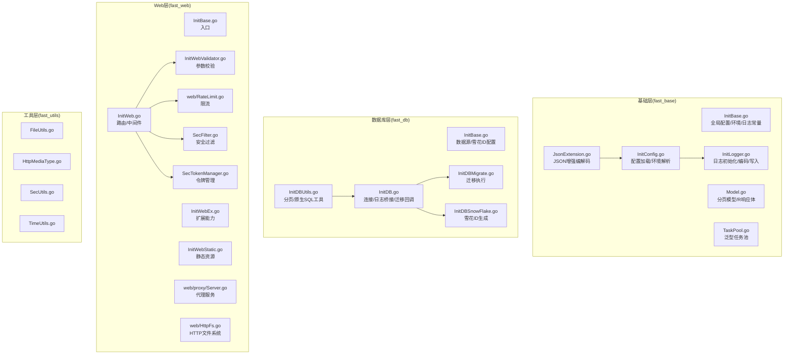
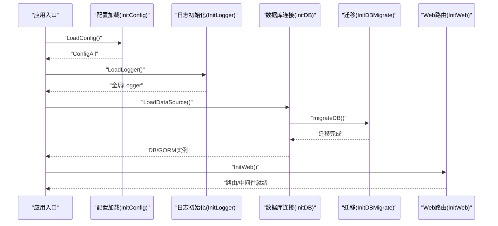
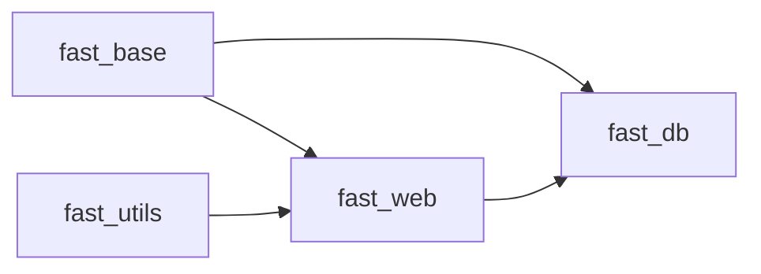

# API 参考

<cite>
**本文引用的文件**
- [fast_base/InitBase.go](file://fast_base/InitBase.go)
- [fast_base/InitConfig.go](file://fast_base/InitConfig.go)
- [fast_base/InitLogger.go](file://fast_base/InitLogger.go)
- [fast_base/Model.go](file://fast_base/Model.go)
- [fast_base/TaskPool.go](file://fast_base/TaskPool.go)
- [fast_base/JsonExtension.go](file://fast_base/JsonExtension.go)
- [fast_db/InitBase.go](file://fast_db/InitBase.go)
- [fast_db/InitDB.go](file://fast_db/InitDB.go)
- [fast_db/InitDBMigrate.go](file://fast_db/InitDBMigrate.go)
- [fast_db/InitDBSnowFlake.go](file://fast_db/InitDBSnowFlake.go)
- [fast_db/InitDBUtils.go](file://fast_db/InitDBUtils.go)
- [fast_web/InitBase.go](file://fast_web/InitBase.go)
- [fast_web/InitWeb.go](file://fast_web/InitWeb.go)
- [fast_web/InitWebEx.go](file://fast_web/InitWebEx.go)
- [fast_web/InitWebStatic.go](file://fast_web/InitWebStatic.go)
- [fast_web/InitWebValidator.go](file://fast_web/InitWebValidator.go)
- [fast_web/web/proxy/Server.go](file://fast_web/web/proxy/Server.go)
- [fast_web/web/HttpFs.go](file://fast_web/web/HttpFs.go)
- [fast_web/web/RateLimit.go](file://fast_web/web/RateLimit.go)
- [fast_web/SecFilter.go](file://fast_web/SecFilter.go)
- [fast_web/SecTokenManager.go](file://fast_web/SecTokenManager.go)
- [fast_utils/FileUtils.go](file://fast_utils/FileUtils.go)
- [fast_utils/HttpMediaType.go](file://fast_utils/HttpMediaType.go)
- [fast_utils/SecUtils.go](file://fast_utils/SecUtils.go)
- [fast_utils/TimeUtils.go](file://fast_utils/TimeUtils.go)
</cite>

## 目录
1. [简介](#简介)
2. [项目结构](#项目结构)
3. [核心组件](#核心组件)
4. [架构总览](#架构总览)
5. [详细组件分析](#详细组件分析)
6. [依赖关系分析](#依赖关系分析)
7. [性能考虑](#性能考虑)
8. [故障排查指南](#故障排查指南)
9. [结论](#结论)
10. [附录](#附录)

## 简介
本文件为 Fast-Go 框架的 API 参考文档，覆盖配置管理、Web 服务、数据库、日志与工具等模块的公共接口规范。文档提供各 API 的函数签名、参数说明、返回值描述、使用示例、参数校验规则、版本兼容性与废弃策略提示、错误码与异常处理机制说明，以及最佳实践与性能优化建议。为确保准确性与实时性，本文所有接口定义均以仓库源码为依据。

## 项目结构
Fast-Go 采用多模块分层设计，核心模块包括基础能力（fast_base）、数据库（fast_db）、Web 服务（fast_web）、工具集（fast_utils），以及代码生成与 Swagger 支持（fast_wgen）。模块间通过统一的配置中心与日志中心进行耦合，数据库模块基于 GORM 与 MySQL 驱动，Web 层基于 Gin 并集成安全过滤与限流策略。

图表来源
- [fast_base/InitConfig.go:1-108](file://fast_base/InitConfig.go#L1-L108)
- [fast_base/InitLogger.go:1-147](file://fast_base/InitLogger.go#L1-L147)
- [fast_db/InitDB.go:1-238](file://fast_db/InitDB.go#L1-L238)
- [fast_db/InitDBMigrate.go:1-69](file://fast_db/InitDBMigrate.go#L1-L69)
- [fast_db/InitDBSnowFlake.go:1-102](file://fast_db/InitDBSnowFlake.go#L1-L102)
- [fast_db/InitDBUtils.go:1-123](file://fast_db/InitDBUtils.go#L1-L123)
- [fast_web/InitWeb.go:1-200](file://fast_web/InitWeb.go#L1-L200)
- [fast_web/InitWebValidator.go:1-200](file://fast_web/InitWebValidator.go#L1-L200)
- [fast_web/web/RateLimit.go:1-200](file://fast_web/web/RateLimit.go#L1-L200)
- [fast_web/SecFilter.go:1-200](file://fast_web/SecFilter.go#L1-L200)
- [fast_web/SecTokenManager.go:1-200](file://fast_web/SecTokenManager.go#L1-L200)

章节来源
- [fast_base/InitBase.go:1-50](file://fast_base/InitBase.go#L1-L50)
- [fast_base/InitConfig.go:1-108](file://fast_base/InitConfig.go#L1-L108)
- [fast_base/InitLogger.go:1-147](file://fast_base/InitLogger.go#L1-L147)
- [fast_db/InitBase.go:1-39](file://fast_db/InitBase.go#L1-L39)
- [fast_db/InitDB.go:1-238](file://fast_db/InitDB.go#L1-L238)
- [fast_db/InitDBMigrate.go:1-69](file://fast_db/InitDBMigrate.go#L1-L69)
- [fast_db/InitDBSnowFlake.go:1-102](file://fast_db/InitDBSnowFlake.go#L1-L102)
- [fast_db/InitDBUtils.go:1-123](file://fast_db/InitDBUtils.go#L1-L123)
- [fast_web/InitWeb.go:1-200](file://fast_web/InitWeb.go#L1-L200)
- [fast_web/InitWebValidator.go:1-200](file://fast_web/InitWebValidator.go#L1-L200)
- [fast_web/web/RateLimit.go:1-200](file://fast_web/web/RateLimit.go#L1-L200)
- [fast_web/SecFilter.go:1-200](file://fast_web/SecFilter.go#L1-L200)
- [fast_web/SecTokenManager.go:1-200](file://fast_web/SecTokenManager.go#L1-L200)

## 核心组件
- 配置管理：支持多数据源合并、环境解析、默认值与覆盖、路径搜索与 JSON 扩展注册。
- 日志系统：基于 Zap，支持生产/控制台编码、文件切割、多写入器、调用者信息注入。
- 数据库：GORM 集成、慢查询日志桥接、连接池配置、迁移、雪花 ID 生成。
- Web 服务：Gin 路由、参数校验、安全过滤、限流、静态资源、代理。
- 工具集：文件、HTTP 媒体类型、安全工具、时间工具。

章节来源
- [fast_base/InitConfig.go:21-50](file://fast_base/InitConfig.go#L21-L50)
- [fast_base/InitLogger.go:15-44](file://fast_base/InitLogger.go#L15-L44)
- [fast_db/InitDB.go:18-100](file://fast_db/InitDB.go#L18-L100)
- [fast_web/InitWeb.go:1-200](file://fast_web/InitWeb.go#L1-L200)
- [fast_utils/FileUtils.go:1-200](file://fast_utils/FileUtils.go#L1-L200)

## 架构总览
下图展示从配置加载到日志初始化、数据库连接、Web 路由与安全过滤的整体流程。

图表来源
- [fast_base/InitConfig.go:21-50](file://fast_base/InitConfig.go#L21-L50)
- [fast_base/InitLogger.go:15-44](file://fast_base/InitLogger.go#L15-L44)
- [fast_db/InitDB.go:18-100](file://fast_db/InitDB.go#L18-L100)
- [fast_db/InitDBMigrate.go:12-28](file://fast_db/InitDBMigrate.go#L12-L28)
- [fast_web/InitWeb.go:1-200](file://fast_web/InitWeb.go#L1-L200)

## 详细组件分析

### 配置管理 API
- LoadConfig
  - 功能：加载默认与环境配置，合并优先级，注册 JSON 扩展。
  - 参数：无
  - 返回：错误
  - 优先级：命令行 > 环境变量 > 默认配置 > 默认值
  - 示例：参见 [InitConfig.go:21-50](file://fast_base/InitConfig.go#L21-L50)
- getEnv
  - 功能：解析运行环境标识
  - 参数：viper 实例、默认值
  - 返回：环境字符串
  - 示例：参见 [InitConfig.go:65-87](file://fast_base/InitConfig.go#L65-L87)
- ExecPath
  - 功能：获取可执行文件所在目录
  - 参数：无
  - 返回：绝对路径
  - 示例：参见 [InitConfig.go:98-107](file://fast_base/InitConfig.go#L98-L107)
- IfStr
  - 功能：三元条件字符串选择
  - 参数：cond, a, b
  - 返回：字符串
  - 示例：参见 [InitConfig.go:89-94](file://fast_base/InitConfig.go#L89-L94)

章节来源
- [fast_base/InitConfig.go:21-107](file://fast_base/InitConfig.go#L21-L107)

### 日志 API
- LoadLogger
  - 功能：按配置初始化全局 Logger，支持 JSON/Console 编码、文件切割、控制台输出
  - 参数：无
  - 返回：错误
  - 示例：参见 [InitLogger.go:15-44](file://fast_base/InitLogger.go#L15-L44)
- getEncoder
  - 功能：选择编码器（JSON 或 Console）
  - 参数：LogConfig
  - 返回：Encoder
  - 示例：参见 [InitLogger.go:46-76](file://fast_base/InitLogger.go#L46-L76)
- getLogWriter
  - 功能：构造 WriteSyncer（文件/控制台/多写入器）
  - 参数：LogConfig
  - 返回：WriteSyncer, 错误
  - 示例：参见 [InitLogger.go:78-110](file://fast_base/InitLogger.go#L78-L110)
- 日志便捷方法
  - LogInfo, LogDebug, LogError
  - PrintfWithCaller, PrintfWithoutCaller
  - 示例：参见 [InitLogger.go:118-147](file://fast_base/InitLogger.go#L118-L147)

章节来源
- [fast_base/InitLogger.go:15-147](file://fast_base/InitLogger.go#L15-L147)

### 数据库 API
- LoadDataSource
  - 功能：加载数据源与雪花配置，执行迁移，建立 GORM 连接，配置连接池与日志桥接
  - 参数：无
  - 返回：无
  - 示例：参见 [InitDB.go:18-100](file://fast_db/InitDB.go#L18-L100)
- customGormLogger / GormLogger
  - 功能：将 GORM 日志桥接到 Zap，支持慢查询标记与调用者追踪
  - 参数：logger.Config, zapcore.Level
  - 返回：logger.Interface
  - 示例：参见 [InitDB.go:109-238](file://fast_db/InitDB.go#L109-L238)
- migrateDB
  - 功能：执行数据库迁移（up）
  - 参数：无
  - 返回：无
  - 示例：参见 [InitDBMigrate.go:12-28](file://fast_db/InitDBMigrate.go#L12-L28)
- SnowFlake
  - NewSnowWorker
  - GetIdForTable / GetIdForStruct
  - GetId / GetIdStr / GetIdStrForTable / GetIdStrForStruct
  - 示例：参见 [InitDBSnowFlake.go:27-102](file://fast_db/InitDBSnowFlake.go#L27-L102)
- 数据库工具
  - QueryPageListByDB / QueryPageListBySql / GetListBySql
  - GetById / GetOne / CheckExists / CountNum
  - removeOrderBy
  - 示例：参见 [InitDBUtils.go:10-123](file://fast_db/InitDBUtils.go#L10-L123)

章节来源
- [fast_db/InitDB.go:18-238](file://fast_db/InitDB.go#L18-L238)
- [fast_db/InitDBMigrate.go:12-69](file://fast_db/InitDBMigrate.go#L12-L69)
- [fast_db/InitDBSnowFlake.go:27-102](file://fast_db/InitDBSnowFlake.go#L27-L102)
- [fast_db/InitDBUtils.go:10-123](file://fast_db/InitDBUtils.go#L10-L123)

### Web 服务 API
- 路由与中间件
  - InitWeb：初始化路由、中间件、静态资源与代理
  - 示例：参见 [fast_web/InitWeb.go:1-200](file://fast_web/InitWeb.go#L1-L200)
  - InitWebEx：扩展能力
  - InitWebStatic：静态资源
  - InitWebValidator：参数校验
  - 示例：参见 [fast_web/InitWebValidator.go:1-200](file://fast_web/InitWebValidator.go#L1-L200)
- 安全与限流
  - SecFilter：安全过滤
  - SecTokenManager：令牌管理
  - RateLimit：限流
  - 示例：参见 [fast_web/SecFilter.go:1-200](file://fast_web/SecFilter.go#L1-L200), [fast_web/SecTokenManager.go:1-200](file://fast_web/SecTokenManager.go#L1-L200), [fast_web/web/RateLimit.go:1-200](file://fast_web/web/RateLimit.go#L1-L200)
- 代理与文件系统
  - web/proxy/Server：代理服务
  - web/HttpFs：HTTP 文件系统
  - 示例：参见 [fast_web/web/proxy/Server.go:1-200](file://fast_web/web/proxy/Server.go#L1-L200), [fast_web/web/HttpFs.go:1-200](file://fast_web/web/HttpFs.go#L1-L200)

章节来源
- [fast_web/InitWeb.go:1-200](file://fast_web/InitWeb.go#L1-L200)
- [fast_web/InitWebValidator.go:1-200](file://fast_web/InitWebValidator.go#L1-L200)
- [fast_web/SecFilter.go:1-200](file://fast_web/SecFilter.go#L1-L200)
- [fast_web/SecTokenManager.go:1-200](file://fast_web/SecTokenManager.go#L1-L200)
- [fast_web/web/RateLimit.go:1-200](file://fast_web/web/RateLimit.go#L1-L200)
- [fast_web/web/proxy/Server.go:1-200](file://fast_web/web/proxy/Server.go#L1-L200)
- [fast_web/web/HttpFs.go:1-200](file://fast_web/web/HttpFs.go#L1-L200)

### 工具 API
- 文件工具
  - FileUtils：文件操作
  - 示例：参见 [fast_utils/FileUtils.go:1-200](file://fast_utils/FileUtils.go#L1-L200)
- HTTP 媒体类型
  - HttpMediaType：媒体类型判断
  - 示例：参见 [fast_utils/HttpMediaType.go:1-200](file://fast_utils/HttpMediaType.go#L1-L200)
- 安全工具
  - SecUtils：安全相关工具
  - 示例：参见 [fast_utils/SecUtils.go:1-200](file://fast_utils/SecUtils.go#L1-L200)
- 时间工具
  - TimeUtils：时间处理
  - 示例：参见 [fast_utils/TimeUtils.go:1-200](file://fast_utils/TimeUtils.go#L1-L200)

章节来源
- [fast_utils/FileUtils.go:1-200](file://fast_utils/FileUtils.go#L1-L200)
- [fast_utils/HttpMediaType.go:1-200](file://fast_utils/HttpMediaType.go#L1-L200)
- [fast_utils/SecUtils.go:1-200](file://fast_utils/SecUtils.go#L1-L200)
- [fast_utils/TimeUtils.go:1-200](file://fast_utils/TimeUtils.go#L1-L200)

### JSON 扩展 API
- Json
  - 全局 JSON 配置（兼容标准库）
  - 示例：参见 [fast_base/JsonExtension.go:24-26](file://fast_base/JsonExtension.go#L24-L26)
- DictCodec / DictSqlCodec
  - 字典映射与 SQL 查询映射增强
  - 示例：参见 [fast_base/JsonExtension.go:27-104](file://fast_base/JsonExtension.go#L27-L104)
- JsonExtension.UpdateStructDescriptor
  - 通过标签启用 Dict/SQl 编码器
  - 示例：参见 [fast_base/JsonExtension.go:206-274](file://fast_base/JsonExtension.go#L206-L274)
- 反序列化兼容
  - 字符串/数字互转、空字符串处理
  - 示例：参见 [fast_base/JsonExtension.go:124-204](file://fast_base/JsonExtension.go#L124-L204)

章节来源
- [fast_base/JsonExtension.go:24-346](file://fast_base/JsonExtension.go#L24-L346)

### 统一响应与分页模型
- R
  - 统一响应体：code/message/data
  - 方法：SetData/SetMessage/SetCode/Success/Error
  - 示例：参见 [fast_base/Model.go:82-116](file://fast_base/Model.go#L82-L116)
- PageParam / PageParams
  - 分页参数接口与实现
  - 示例：参见 [fast_base/Model.go:9-46](file://fast_base/Model.go#L9-L46)
- PageResult[T]
  - 泛型分页结果：包含分页参数、总数、总页数与列表
  - 方法：From/Set
  - 示例：参见 [fast_base/Model.go:34-56](file://fast_base/Model.go#L34-L56)

章节来源
- [fast_base/Model.go:9-116](file://fast_base/Model.go#L9-L116)

### 任务池 API
- TaskPool[T]
  - Build：创建工作协程池，返回通道
  - Add：向通道投递任务
  - Wait：关闭通道并等待所有工作协程结束
  - 示例：参见 [fast_base/TaskPool.go:15-55](file://fast_base/TaskPool.go#L15-L55)

章节来源
- [fast_base/TaskPool.go:15-55](file://fast_base/TaskPool.go#L15-L55)

## 依赖关系分析
- fast_db 依赖 fast_base（配置、日志、JSON 扩展）
- fast_web 依赖 fast_base（配置、日志、工具）、fast_utils（安全/时间/HTTP）
- fast_web 与 fast_db 在应用层组合使用，形成 Web + DB 的典型后端架构

图表来源
- [fast_db/InitDB.go:18-100](file://fast_db/InitDB.go#L18-L100)
- [fast_web/InitWeb.go:1-200](file://fast_web/InitWeb.go#L1-L200)

章节来源
- [fast_db/InitDB.go:18-100](file://fast_db/InitDB.go#L18-L100)
- [fast_web/InitWeb.go:1-200](file://fast_web/InitWeb.go#L1-L200)

## 性能考虑
- 日志
  - 使用 lumberjack 切割，合理设置文件大小、备份数与保留天数，避免 IO 抖动
  - 控制台输出与文件输出双写时注意同步开销
- 数据库
  - 连接池参数需结合 CPU 核心数与磁盘性能设置
  - 启用 PrepareStmt 与 SingularTable 规范化命名，减少 SQL 解析成本
  - 慢查询阈值建议与业务场景匹配，避免过多告警噪声
- Web
  - 参数校验与限流前置，降低下游压力
  - 静态资源与代理缓存策略配合 CDN
- JSON
  - int64 转字符串避免 JS 精度丢失；启用模糊解码提升兼容性

## 故障排查指南
- 配置加载失败
  - 检查配置文件路径与键名，确认环境参数与默认值覆盖顺序
  - 参考：[InitConfig.go:21-87](file://fast_base/InitConfig.go#L21-L87)
- 日志初始化失败
  - 检查日志路径权限与格式配置，确认编码器与写入器组合
  - 参考：[InitLogger.go:78-110](file://fast_base/InitLogger.go#L78-L110)
- 数据库连接失败
  - 校验 DNS、用户名密码、网络连通性；检查迁移是否成功
  - 参考：[InitDB.go:42-61](file://fast_db/InitDB.go#L42-L61), [InitDBMigrate.go:12-28](file://fast_db/InitDBMigrate.go#L12-L28)
- GORM 日志异常
  - 检查日志级别映射与 Zap 级别对应关系
  - 参考：[InitDB.go:109-150](file://fast_db/InitDB.go#L109-L150)
- Web 路由/中间件问题
  - 校验中间件顺序与参数校验规则；检查限流与安全过滤策略
  - 参考：[fast_web/InitWeb.go:1-200](file://fast_web/InitWeb.go#L1-L200), [fast_web/InitWebValidator.go:1-200](file://fast_web/InitWebValidator.go#L1-L200)

章节来源
- [fast_base/InitConfig.go:21-87](file://fast_base/InitConfig.go#L21-L87)
- [fast_base/InitLogger.go:78-110](file://fast_base/InitLogger.go#L78-L110)
- [fast_db/InitDB.go:42-61](file://fast_db/InitDB.go#L42-L61)
- [fast_db/InitDBMigrate.go:12-28](file://fast_db/InitDBMigrate.go#L12-L28)
- [fast_db/InitDB.go:109-150](file://fast_db/InitDB.go#L109-L150)
- [fast_web/InitWeb.go:1-200](file://fast_web/InitWeb.go#L1-L200)
- [fast_web/InitWebValidator.go:1-200](file://fast_web/InitWebValidator.go#L1-L200)

## 结论
本 API 参考文档基于仓库源码梳理了 Fast-Go 框架的关键接口与行为，覆盖配置、日志、数据库、Web 与工具模块。建议在实际使用中遵循参数校验与错误处理规范，结合性能与安全策略进行优化，并通过版本与废弃策略管理确保长期维护性。

## 附录
- 版本兼容性与废弃策略
  - 当前模块版本在 go.mod 中声明，升级时请关注依赖变更与接口行为差异
  - 建议通过语义化版本管理与变更日志跟踪破坏性改动
- 错误码与异常处理
  - 统一响应体 R 提供 code/message/data；数据库与 Web 层异常通过日志与错误传播
  - 参考：[fast_base/Model.go:82-116](file://fast_base/Model.go#L82-L116), [fast_db/InitDB.go:188-225](file://fast_db/InitDB.go#L188-L225)