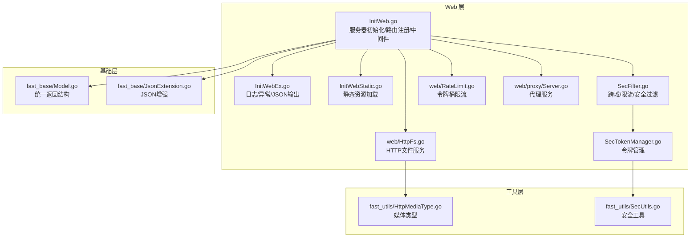
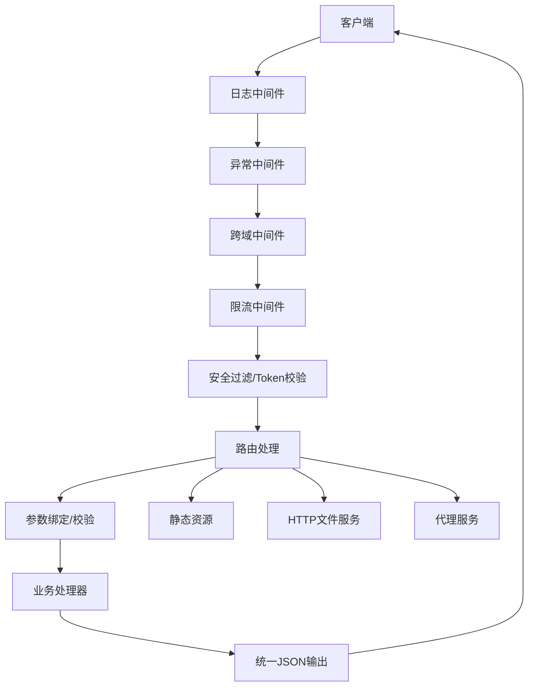
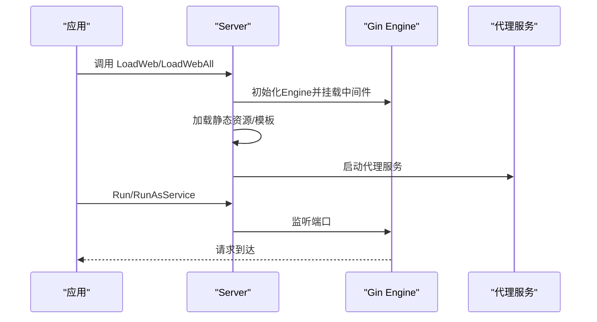
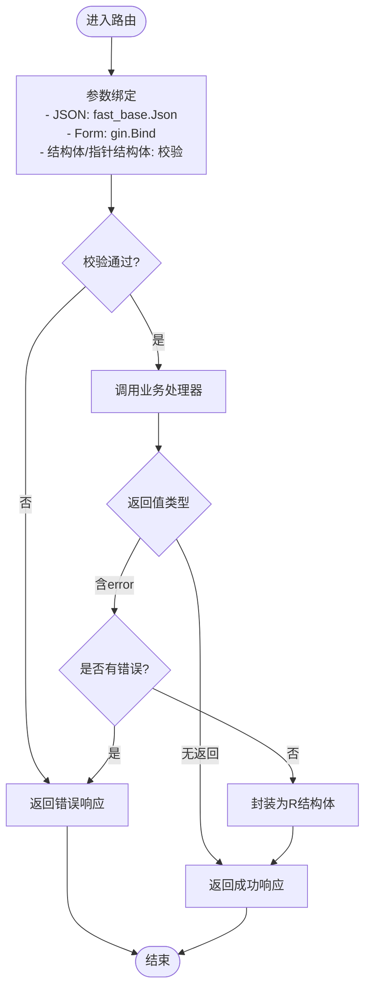
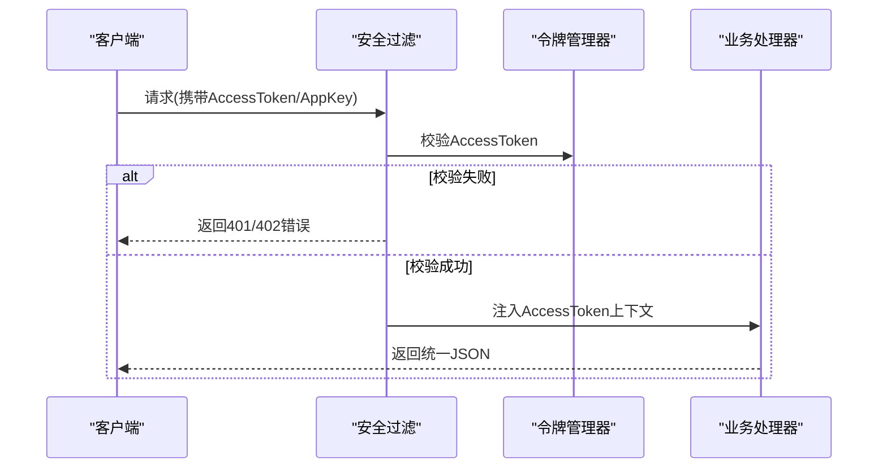
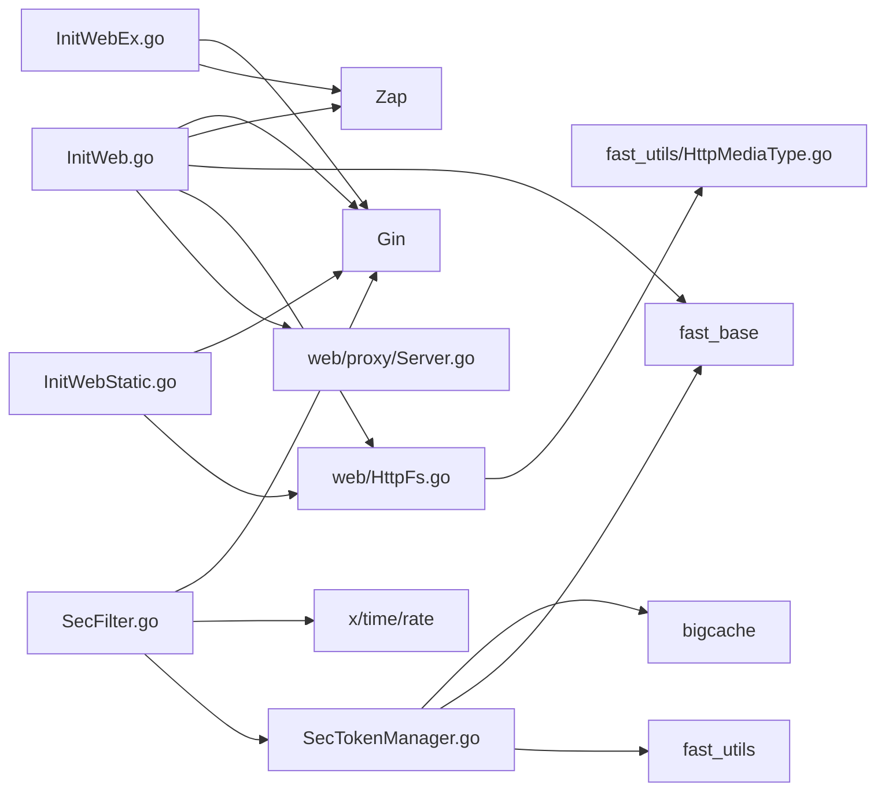

# Web 服务 API

<cite>
**本文引用的文件**
- [fast_web/InitWeb.go](file://fast_web/InitWeb.go)
- [fast_web/InitWebEx.go](file://fast_web/InitWebEx.go)
- [fast_web/InitWebStatic.go](file://fast_web/InitWebStatic.go)
- [fast_web/SecFilter.go](file://fast_web/SecFilter.go)
- [fast_web/SecTokenManager.go](file://fast_web/SecTokenManager.go)
- [fast_web/web/HttpFs.go](file://fast_web/web/HttpFs.go)
- [fast_web/web/RateLimit.go](file://fast_web/web/RateLimit.go)
- [fast_web/web/proxy/Server.go](file://fast_web/web/proxy/Server.go)
- [fast_base/Model.go](file://fast_base/Model.go)
- [fast_base/JsonExtension.go](file://fast_base/JsonExtension.go)
- [fast_utils/HttpMediaType.go](file://fast_utils/HttpMediaType.go)
- [fast_utils/SecUtils.go](file://fast_utils/SecUtils.go)
</cite>

## 目录
1. [简介](#简介)
2. [项目结构](#项目结构)
3. [核心组件](#核心组件)
4. [架构总览](#架构总览)
5. [详细组件分析](#详细组件分析)
6. [依赖分析](#依赖分析)
7. [性能考虑](#性能考虑)
8. [故障排查指南](#故障排查指南)
9. [结论](#结论)
10. [附录](#附录)

## 简介
本文件为 Fast-Go 框架的 Web 服务 API 参考文档，覆盖 Web 服务器初始化、路由注册、中间件配置、请求处理流程、响应格式规范、错误处理机制、静态资源与文件服务、文件上传下载、跨域处理、安全过滤器、CSRF 防护、限流机制、以及最佳实践与性能优化建议。文档面向不同技术背景的读者，既提供高层概览，也给出可追溯到源码的细节说明与图示。

## 项目结构
Fast-Go 的 Web 层位于 fast_web 目录，围绕 Gin Engine 构建，提供统一的服务器初始化、路由注册、静态资源、模板渲染、跨域、安全过滤、限流、代理等功能；基础能力来自 fast_base、fast_utils；文件系统与 HTTP 文件服务来自 fast_web/web 下的实现。

图表来源
- [fast_web/InitWeb.go:1-367](file://fast_web/InitWeb.go#L1-L367)
- [fast_web/InitWebEx.go:1-318](file://fast_web/InitWebEx.go#L1-L318)
- [fast_web/InitWebStatic.go:1-59](file://fast_web/InitWebStatic.go#L1-L59)
- [fast_web/SecFilter.go:1-130](file://fast_web/SecFilter.go#L1-L130)
- [fast_web/SecTokenManager.go:1-216](file://fast_web/SecTokenManager.go#L1-L216)
- [fast_web/web/HttpFs.go:1-1020](file://fast_web/web/HttpFs.go#L1-L1020)
- [fast_web/web/RateLimit.go:1-346](file://fast_web/web/RateLimit.go#L1-L346)
- [fast_web/web/proxy/Server.go:1-170](file://fast_web/web/proxy/Server.go#L1-L170)
- [fast_base/Model.go:1-116](file://fast_base/Model.go#L1-L116)
- [fast_base/JsonExtension.go:1-346](file://fast_base/JsonExtension.go#L1-L346)
- [fast_utils/HttpMediaType.go](file://fast_utils/HttpMediaType.go)
- [fast_utils/SecUtils.go](file://fast_utils/SecUtils.go)

章节来源
- [fast_web/InitWeb.go:1-367](file://fast_web/InitWeb.go#L1-L367)
- [fast_web/InitWebEx.go:1-318](file://fast_web/InitWebEx.go#L1-L318)
- [fast_web/InitWebStatic.go:1-59](file://fast_web/InitWebStatic.go#L1-L59)
- [fast_web/SecFilter.go:1-130](file://fast_web/SecFilter.go#L1-L130)
- [fast_web/SecTokenManager.go:1-216](file://fast_web/SecTokenManager.go#L1-L216)
- [fast_web/web/HttpFs.go:1-1020](file://fast_web/web/HttpFs.go#L1-L1020)
- [fast_web/web/RateLimit.go:1-346](file://fast_web/web/RateLimit.go#L1-L346)
- [fast_web/web/proxy/Server.go:1-170](file://fast_web/web/proxy/Server.go#L1-L170)
- [fast_base/Model.go:1-116](file://fast_base/Model.go#L1-L116)
- [fast_base/JsonExtension.go:1-346](file://fast_base/JsonExtension.go#L1-L346)
- [fast_utils/HttpMediaType.go](file://fast_utils/HttpMediaType.go)
- [fast_utils/SecUtils.go](file://fast_utils/SecUtils.go)

## 核心组件
- 服务器与路由
  - 服务器初始化：加载配置、日志、验证器、跨域、静态资源、模板、健康/关闭端点。
  - 路由注册：支持函数式注册与反射自动注册两种方式，统一参数绑定、校验与返回格式。
- 中间件
  - 日志中间件：基于 Zap 的结构化日志输出，支持彩色控制台。
  - 异常中间件：捕获 panic 并输出堆栈，避免服务崩溃。
  - 跨域中间件：标准 CORS 头配置，支持预检请求。
  - 限流中间件：基于令牌桶，支持按路径前缀保护。
- 安全与认证
  - 密码模式限流：通过查询参数进行简单鉴权。
  - Token 模式：AccessToken 校验与上下文注入，配合令牌管理器持久化与过期控制。
- 静态资源与文件服务
  - 静态资源：基于 Gin StaticFs，支持路径前缀与通配符。
  - HTTP 文件服务：兼容 Range、ETag、Last-Modified、gzip 预压缩文件等。
- 代理服务
  - 正向代理：支持 HTTP/HTTPS CONNECT 劫持与转发，可选自签证书。
- JSON 输出与统一返回
  - JSON 输出：基于 jsoniter，统一渲染器，保证 Content-Type 与编码。
  - 统一返回：R 结构体，约定 code/message/data 字段。

章节来源
- [fast_web/InitWeb.go:42-111](file://fast_web/InitWeb.go#L42-L111)
- [fast_web/InitWeb.go:122-184](file://fast_web/InitWeb.go#L122-L184)
- [fast_web/InitWebEx.go:52-146](file://fast_web/InitWebEx.go#L52-L146)
- [fast_web/InitWebEx.go:150-224](file://fast_web/InitWebEx.go#L150-L224)
- [fast_web/SecFilter.go:11-129](file://fast_web/SecFilter.go#L11-L129)
- [fast_web/InitWebStatic.go:12-27](file://fast_web/InitWebStatic.go#L12-L27)
- [fast_web/web/HttpFs.go:221-376](file://fast_web/web/HttpFs.go#L221-L376)
- [fast_web/web/proxy/Server.go:30-73](file://fast_web/web/proxy/Server.go#L30-L73)
- [fast_base/Model.go:82-116](file://fast_base/Model.go#L82-L116)
- [fast_base/JsonExtension.go:297-318](file://fast_base/JsonExtension.go#L297-L318)

## 架构总览
Web 服务以 Gin Engine 为核心，通过中间件链路串联日志、异常、跨域、限流、安全过滤等能力；路由层负责参数绑定、校验与统一返回；静态资源与文件服务提供高效的内容分发；代理服务支持内网穿透与 HTTPS 代理。

图表来源
- [fast_web/InitWeb.go:64-72](file://fast_web/InitWeb.go#L64-L72)
- [fast_web/SecFilter.go:11-16](file://fast_web/SecFilter.go#L11-L16)
- [fast_web/SecFilter.go:40-81](file://fast_web/SecFilter.go#L40-L81)
- [fast_web/InitWeb.go:198-338](file://fast_web/InitWeb.go#L198-L338)
- [fast_web/InitWebEx.go:315-318](file://fast_web/InitWebEx.go#L315-L318)
- [fast_web/InitWebStatic.go:12-27](file://fast_web/InitWebStatic.go#L12-L27)
- [fast_web/web/HttpFs.go:624-713](file://fast_web/web/HttpFs.go#L624-L713)
- [fast_web/web/proxy/Server.go:50-73](file://fast_web/web/proxy/Server.go#L50-L73)

## 详细组件分析

### 服务器初始化与运行
- 初始化流程
  - 加载配置与日志
  - 初始化验证器
  - 创建 Gin Engine，挂载日志与异常中间件
  - 条件性挂载跨域中间件
  - 静态资源与模板加载
  - 注册健康/关闭端点
- 运行方式
  - Run：阻塞监听
  - RunAsService：非阻塞监听，便于优雅关闭
  - Shutdown：优雅关闭

图表来源
- [fast_web/InitWeb.go:42-111](file://fast_web/InitWeb.go#L42-L111)
- [fast_web/InitWeb.go:340-367](file://fast_web/InitWeb.go#L340-L367)
- [fast_web/web/proxy/Server.go:30-73](file://fast_web/web/proxy/Server.go#L30-L73)

章节来源
- [fast_web/InitWeb.go:42-111](file://fast_web/InitWeb.go#L42-L111)
- [fast_web/InitWeb.go:340-367](file://fast_web/InitWeb.go#L340-L367)
- [fast_web/web/proxy/Server.go:30-73](file://fast_web/web/proxy/Server.go#L30-L73)

### 路由注册与处理流程
- 函数式注册
  - 通过 LoadRouters 注入 HandlerFunc，内部直接调用 Gin 的 HTTP 方法注册。
- 反射自动注册（已标注弃用）
  - 通过反射扫描 ApiGroup 的方法，自动推断 HTTP 方法与路径，封装为 HandlerFuncWrapper。
- 参数绑定与校验
  - 支持 gin.Context、SecToken、结构体、指针结构体、map、字符串等参数类型。
  - JSON 使用 fast_base.Json 的扩展解析；Form 使用 gin 绑定；校验使用 validator。
- 返回格式
  - 统一通过 JSONIter 输出 R 结构体，支持成功/错误与数据封装。

图表来源
- [fast_web/InitWeb.go:198-338](file://fast_web/InitWeb.go#L198-L338)
- [fast_web/InitWebValidator.go:67-88](file://fast_web/InitWebValidator.go#L67-L88)
- [fast_base/Model.go:82-116](file://fast_base/Model.go#L82-L116)
- [fast_base/JsonExtension.go:297-318](file://fast_base/JsonExtension.go#L297-L318)

章节来源
- [fast_web/InitWeb.go:122-184](file://fast_web/InitWeb.go#L122-L184)
- [fast_web/InitWeb.go:198-338](file://fast_web/InitWeb.go#L198-L338)
- [fast_web/InitWebValidator.go:67-88](file://fast_web/InitWebValidator.go#L67-L88)
- [fast_base/Model.go:82-116](file://fast_base/Model.go#L82-L116)
- [fast_base/JsonExtension.go:297-318](file://fast_base/JsonExtension.go#L297-L318)

### 中间件配置
- 日志中间件
  - 基于 Zap，支持彩色输出与延迟计算耗时。
- 异常中间件
  - 捕获 panic，输出堆栈与请求摘要，防止服务崩溃。
- 跨域中间件
  - 设置 Allow-Origin/Credentials/Headers/Methods，处理 OPTIONS 预检。
- 限流中间件
  - 基于令牌桶，支持按路径前缀保护，超限返回统一错误。

章节来源
- [fast_web/InitWebEx.go:52-146](file://fast_web/InitWebEx.go#L52-L146)
- [fast_web/InitWebEx.go:150-224](file://fast_web/InitWebEx.go#L150-L224)
- [fast_web/SecFilter.go:111-129](file://fast_web/SecFilter.go#L111-L129)
- [fast_web/SecFilter.go:83-100](file://fast_web/SecFilter.go#L83-L100)

### 安全过滤与认证
- 密码模式限流
  - 通过查询参数 tt 进行简单鉴权，匹配失败返回统一错误。
- Token 模式
  - 从 Header 获取 AccessToken/AppKey，校验通过后注入上下文，供后续处理器使用。
- 令牌管理
  - 基于 BigCache 的内存缓存，支持持久化到文件，定时刷盘；提供创建、刷新、清理用户历史令牌等能力。

图表来源
- [fast_web/SecFilter.go:39-81](file://fast_web/SecFilter.go#L39-L81)
- [fast_web/SecTokenManager.go:90-112](file://fast_web/SecTokenManager.go#L90-L112)
- [fast_web/SecTokenManager.go:191-215](file://fast_web/SecTokenManager.go#L191-L215)

章节来源
- [fast_web/SecFilter.go:18-37](file://fast_web/SecFilter.go#L18-L37)
- [fast_web/SecFilter.go:39-81](file://fast_web/SecFilter.go#L39-L81)
- [fast_web/SecTokenManager.go:90-112](file://fast_web/SecTokenManager.go#L90-L112)
- [fast_web/SecTokenManager.go:191-215](file://fast_web/SecTokenManager.go#L191-L215)

### 静态资源与文件服务
- 静态资源
  - 支持路径前缀与通配符，StripPrefix 后交由 FileServer 处理。
- HTTP 文件服务
  - 支持 Range、ETag、Last-Modified、gzip 预压缩文件；自动选择 .gz 或原始文件；处理目录索引与重定向。

章节来源
- [fast_web/InitWebStatic.go:12-27](file://fast_web/InitWebStatic.go#L12-L27)
- [fast_web/web/HttpFs.go:624-713](file://fast_web/web/HttpFs.go#L624-L713)
- [fast_web/web/HttpFs.go:221-376](file://fast_web/web/HttpFs.go#L221-L376)

### 代理服务
- 功能
  - HTTP CONNECT 劫持，建立隧道转发 HTTPS 流量；普通 HTTP 请求直接转发。
  - 可选 TLS 证书，支持自签证书生成。
- 生命周期
  - StartProxy 启动；StopProxy 关闭。

章节来源
- [fast_web/web/proxy/Server.go:30-73](file://fast_web/web/proxy/Server.go#L30-L73)
- [fast_web/web/proxy/Server.go:75-116](file://fast_web/web/proxy/Server.go#L75-L116)
- [fast_web/web/proxy/Server.go:126-170](file://fast_web/web/proxy/Server.go#L126-L170)

### JSON 输出与统一返回
- JSON 输出
  - JSONIterRenderer 实现自定义渲染器，设置 Content-Type 并使用 fast_base.Json 编码。
- 统一返回
  - R 结构体包含 code/message/data，提供 Success/Error 工具方法。

章节来源
- [fast_base/JsonExtension.go:297-318](file://fast_base/JsonExtension.go#L297-L318)
- [fast_base/Model.go:82-116](file://fast_base/Model.go#L82-L116)

## 依赖分析
- 组件耦合
  - InitWeb 依赖 Gin、Zap、fast_base、fast_web/web、proxy。
  - SecFilter 依赖 Gin、x/time/rate、SecTokenManager。
  - SecTokenManager 依赖 bigcache、fast_base、fast_utils。
  - InitWebStatic 依赖 Gin、web.FileServer。
  - InitWebEx 依赖 Gin、Zap、net/http、runtime。
  - web/HttpFs 为独立的 HTTP 文件服务实现。
  - web/RateLimit 为独立的令牌桶实现。
  - web/proxy 为独立的代理服务。
- 外部依赖
  - Gin、Zap、jsoniter、bigcache、validator、time/rate。

图表来源
- [fast_web/InitWeb.go:1-17](file://fast_web/InitWeb.go#L1-L17)
- [fast_web/SecFilter.go:1-9](file://fast_web/SecFilter.go#L1-L9)
- [fast_web/SecTokenManager.go:1-11](file://fast_web/SecTokenManager.go#L1-L11)
- [fast_web/InitWebStatic.go:1-10](file://fast_web/InitWebStatic.go#L1-L10)
- [fast_web/InitWebEx.go:1-18](file://fast_web/InitWebEx.go#L1-L18)
- [fast_web/web/HttpFs.go:1-27](file://fast_web/web/HttpFs.go#L1-L27)
- [fast_web/web/proxy/Server.go:1-17](file://fast_web/web/proxy/Server.go#L1-L17)
- [fast_utils/HttpMediaType.go](file://fast_utils/HttpMediaType.go)

章节来源
- [fast_web/InitWeb.go:1-17](file://fast_web/InitWeb.go#L1-L17)
- [fast_web/SecFilter.go:1-9](file://fast_web/SecFilter.go#L1-L9)
- [fast_web/SecTokenManager.go:1-11](file://fast_web/SecTokenManager.go#L1-L11)
- [fast_web/InitWebStatic.go:1-10](file://fast_web/InitWebStatic.go#L1-L10)
- [fast_web/InitWebEx.go:1-18](file://fast_web/InitWebEx.go#L1-L18)
- [fast_web/web/HttpFs.go:1-27](file://fast_web/web/HttpFs.go#L1-L27)
- [fast_web/web/proxy/Server.go:1-17](file://fast_web/web/proxy/Server.go#L1-L17)
- [fast_utils/HttpMediaType.go](file://fast_utils/HttpMediaType.go)

## 性能考虑
- JSON 序列化
  - 使用 jsoniter，提升序列化/反序列化性能，支持容错与扩展。
- 限流策略
  - 短周期高 QPS 场景建议使用 gin 内置限流；长周期/复杂规则可使用 web/RateLimit 的令牌桶实现。
- 静态资源
  - 启用 gzip 预压缩文件，减少 CPU 开销；合理设置缓存头。
- 日志
  - 控制日志级别与输出频率，避免 IO 抖动。
- 代理
  - HTTPS CONNECT 劫持会增加连接开销，建议仅在必要时开启。

章节来源
- [fast_base/JsonExtension.go:24-25](file://fast_base/JsonExtension.go#L24-L25)
- [fast_web/web/RateLimit.go:1-346](file://fast_web/web/RateLimit.go#L1-L346)
- [fast_web/web/HttpFs.go:637-642](file://fast_web/web/HttpFs.go#L637-L642)
- [fast_web/InitWebEx.go:52-109](file://fast_web/InitWebEx.go#L52-L109)
- [fast_web/web/proxy/Server.go:75-96](file://fast_web/web/proxy/Server.go#L75-L96)

## 故障排查指南
- 路由注册失败
  - 检查路径是否包含 URL 参数（静态资源不允许），确认 HandlerFunc 是否正确传入。
- 参数绑定/校验失败
  - 确认请求体类型与绑定方式匹配；查看校验错误消息；检查自定义校验器注册。
- 跨域问题
  - 确认跨域中间件已启用；检查浏览器预检请求是否被拦截。
- 限流触发
  - 调整令牌桶参数或针对特定路径放宽限制；检查限流中间件挂载顺序。
- 代理异常
  - 检查代理端口配置与证书生成；确认目标主机可达；查看劫持与转发日志。
- 日志与异常
  - 查看 Panic 堆栈与请求摘要；确认日志级别与输出位置。

章节来源
- [fast_web/InitWebStatic.go:17-19](file://fast_web/InitWebStatic.go#L17-L19)
- [fast_web/InitWebValidator.go:31-49](file://fast_web/InitWebValidator.go#L31-L49)
- [fast_web/SecFilter.go:111-129](file://fast_web/SecFilter.go#L111-L129)
- [fast_web/SecFilter.go:83-100](file://fast_web/SecFilter.go#L83-L100)
- [fast_web/web/proxy/Server.go:30-73](file://fast_web/web/proxy/Server.go#L30-L73)
- [fast_web/InitWebEx.go:150-224](file://fast_web/InitWebEx.go#L150-L224)

## 结论
Fast-Go 的 Web 层以 Gin 为基础，提供了完善的中间件生态、统一的参数绑定与校验、安全过滤与限流、静态资源与文件服务、以及代理能力。通过 JSON 输出与统一返回结构，确保前后端交互的一致性与可观测性。建议在生产环境中结合限流策略、日志级别与缓存策略，持续优化性能与稳定性。

## 附录

### API 使用方法与规范

- 服务器初始化与运行
  - 初始化：调用 LoadWeb/LoadWebAll 完成配置、日志、验证器、跨域、静态资源、模板与健康端点的加载。
  - 运行：Run 阻塞监听；RunAsService 非阻塞监听，便于优雅关闭。
  - 关闭：Shutdown 优雅关闭，同时停止代理服务。

- 路由注册
  - 函数式注册：通过 LoadRouters 注入 HandlerFunc。
  - 反射注册：LoadRouter（已弃用），自动推断 HTTP 方法与路径，封装参数绑定与校验。

- 参数绑定与校验
  - 支持 gin.Context、SecToken、结构体、指针结构体、map、字符串等。
  - JSON 使用 fast_base.Json 解析；Form 使用 gin 绑定；校验使用 validator。
  - 自定义校验器与翻译器已在 LoadValidator 中注册。

- 响应格式规范
  - 统一使用 JSONIter 输出 R 结构体，包含 code/message/data。
  - 成功/错误分别通过 Success/Error 工具方法构造。

- 错误处理机制
  - 参数绑定/校验失败：返回统一错误。
  - 业务处理器返回 error：统一包装为错误响应。
  - 未返回 error：若存在数据返回，则封装为成功响应。

- 静态资源服务
  - LoadStatic/LoadStaticFs 支持路径前缀与通配符，StripPrefix 后交由 FileServer 处理。
  - 支持 gzip 预压缩文件与 Range 请求。

- 文件上传下载
  - 上传：使用 gin 的文件绑定与校验；下载：通过静态资源或 FileServer 提供。
  - 媒体类型：参考 fast_utils/HttpMediaType.go。

- 跨域处理
  - 通过 CORSMiddleware 设置标准 CORS 头，处理 OPTIONS 预检。

- 安全过滤与 CSRF 防护
  - 密码模式：通过查询参数 tt 进行简单鉴权。
  - Token 模式：校验 AccessToken/AppKey，通过 SecTokenManager 管理令牌生命周期。
  - CSRF：未内置 CSRF 中间件，建议在业务层自行实现或引入第三方方案。

- 限流机制
  - gin 内置限流：适合短周期高 QPS。
  - 令牌桶：web/RateLimit 提供更灵活的限流策略，适合长周期或复杂规则。

- 代理服务
  - StartProxy/StopProxy 控制代理生命周期；支持 HTTPS CONNECT 劫持与转发，可选自签证书。

章节来源
- [fast_web/InitWeb.go:42-111](file://fast_web/InitWeb.go#L42-L111)
- [fast_web/InitWeb.go:122-184](file://fast_web/InitWeb.go#L122-L184)
- [fast_web/InitWeb.go:198-338](file://fast_web/InitWeb.go#L198-L338)
- [fast_web/InitWebValidator.go:67-88](file://fast_web/InitWebValidator.go#L67-L88)
- [fast_base/Model.go:82-116](file://fast_base/Model.go#L82-L116)
- [fast_web/InitWebStatic.go:12-27](file://fast_web/InitWebStatic.go#L12-L27)
- [fast_web/web/HttpFs.go:624-713](file://fast_web/web/HttpFs.go#L624-L713)
- [fast_web/SecFilter.go:111-129](file://fast_web/SecFilter.go#L111-L129)
- [fast_web/SecFilter.go:83-100](file://fast_web/SecFilter.go#L83-L100)
- [fast_web/web/proxy/Server.go:30-73](file://fast_web/web/proxy/Server.go#L30-L73)
- [fast_utils/HttpMediaType.go](file://fast_utils/HttpMediaType.go)