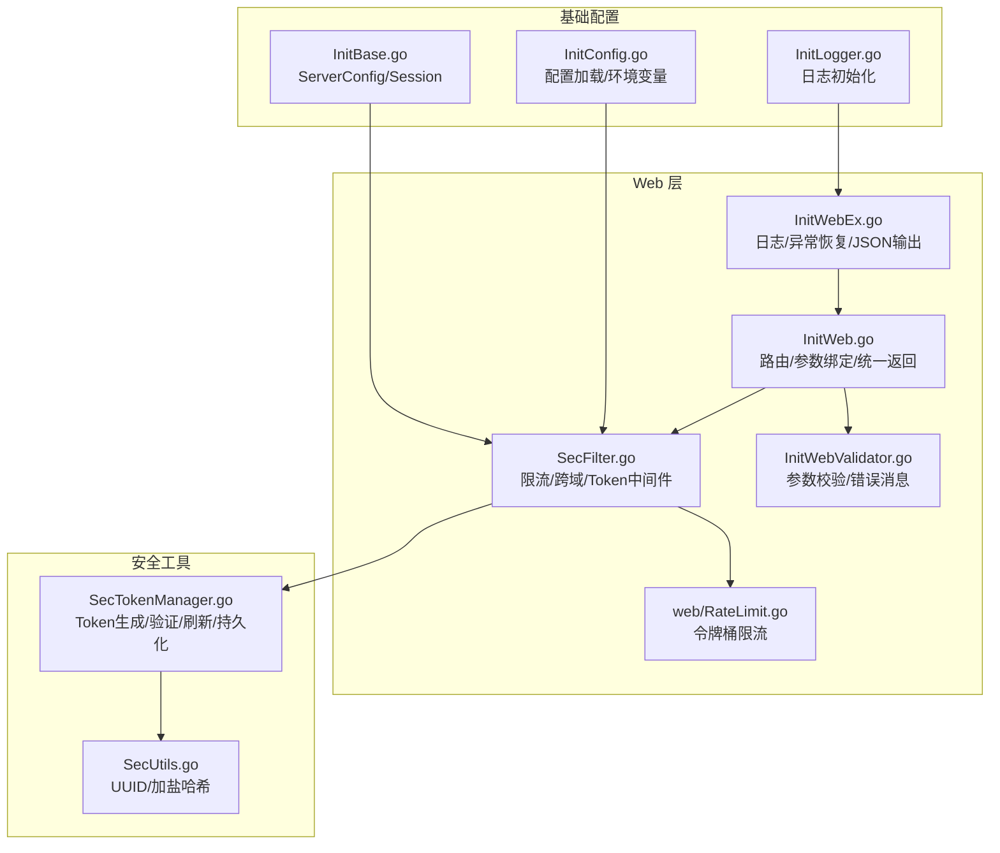
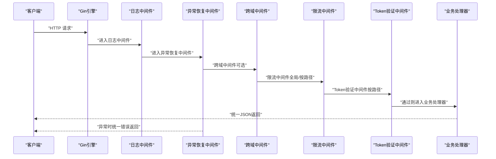
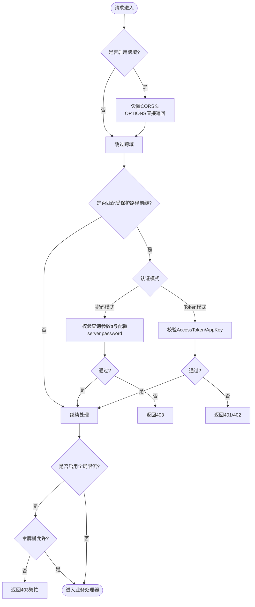
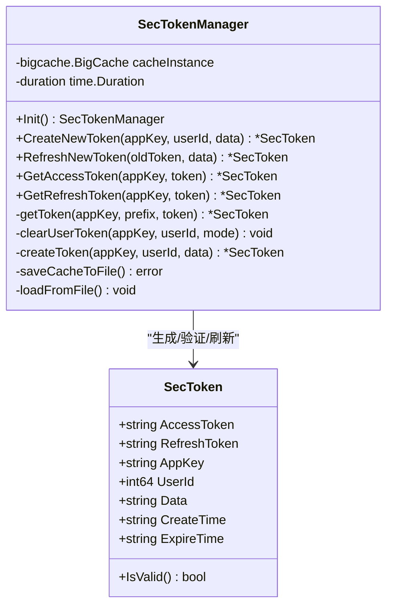
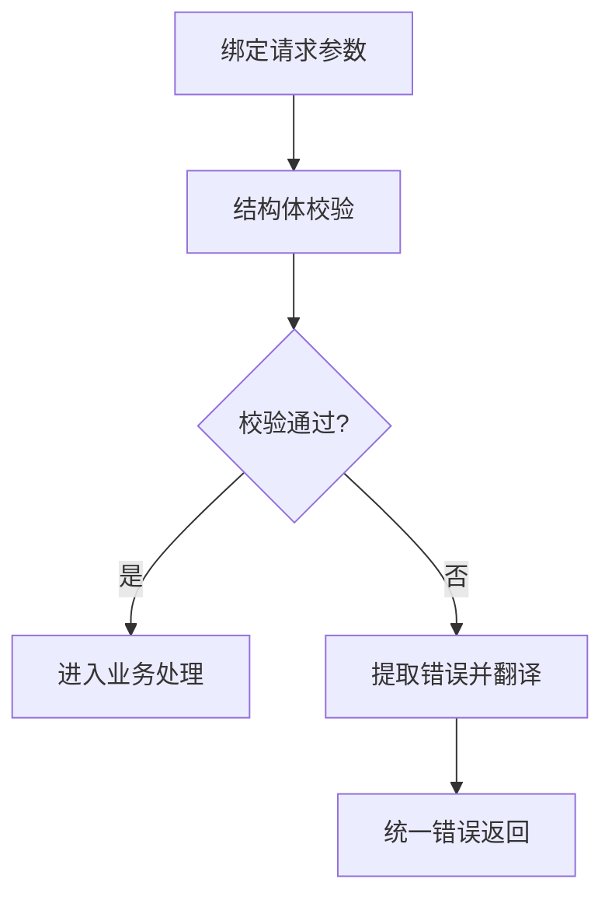
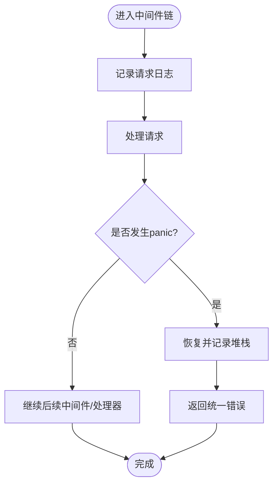
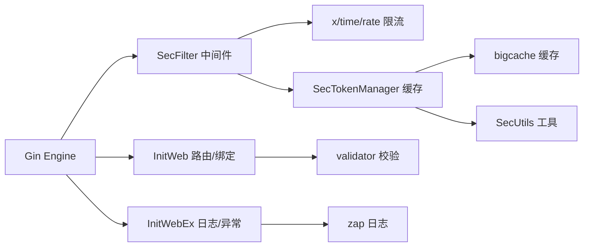

# 安全防护 API

<cite>
**本文引用的文件**
- [SecFilter.go](file://fast_web/SecFilter.go)
- [SecTokenManager.go](file://fast_web/SecTokenManager.go)
- [RateLimit.go](file://fast_web/web/RateLimit.go)
- [SecUtils.go](file://fast_utils/SecUtils.go)
- [InitWeb.go](file://fast_web/InitWeb.go)
- [InitWebValidator.go](file://fast_web/InitWebValidator.go)
- [InitWebEx.go](file://fast_web/InitWebEx.go)
- [InitBase.go](file://fast_web/InitBase.go)
- [InitConfig.go](file://fast_base/InitConfig.go)
- [InitLogger.go](file://fast_base/InitLogger.go)
</cite>

## 目录
1. [简介](#简介)
2. [项目结构](#项目结构)
3. [核心组件](#核心组件)
4. [架构总览](#架构总览)
5. [详细组件分析](#详细组件分析)
6. [依赖分析](#依赖分析)
7. [性能考虑](#性能考虑)
8. [故障排查指南](#故障排查指南)
9. [结论](#结论)
10. [附录](#附录)

## 简介
本文件为 Fast-Go 框架的安全防护 API 参考文档，覆盖以下能力：
- 安全过滤器与限流机制
- CSRF 防护与跨域策略
- Token 管理系统（生成、验证、刷新）
- 安全中间件配置与自定义规则
- 会话管理、权限控制与访问审计
- 安全事件监控、威胁检测与应急响应
- 安全开发最佳实践与漏洞防护建议

说明：
- 文档严格基于仓库现有代码实现进行描述，不臆造未实现的功能。
- 若某模块在当前版本未提供实现，将在对应章节明确标注“未实现”。

## 项目结构
围绕安全相关的关键文件组织如下：
- fast_web/SecFilter.go：限流、跨域、Token 验证中间件入口
- fast_web/SecTokenManager.go：Token 管理器（生成、缓存、过期、持久化）
- fast_web/web/RateLimit.go：独立的令牌桶限流实现
- fast_utils/SecUtils.go：安全工具（UUID、加盐哈希等）
- fast_web/InitWeb.go：路由注册、参数绑定、统一返回、中间件注入
- fast_web/InitWebValidator.go：参数校验与国际化错误消息
- fast_web/InitWebEx.go：日志、异常恢复、JSON 输出
- fast_web/InitBase.go：服务端配置（含 Session.Duration）
- fast_base/InitConfig.go：配置加载（含 server.password）
- fast_base/InitLogger.go：日志初始化

**图表来源**
- [SecFilter.go:1-130](file://fast_web/SecFilter.go#L1-L130)
- [SecTokenManager.go:1-216](file://fast_web/SecTokenManager.go#L1-L216)
- [RateLimit.go:1-346](file://fast_web/web/RateLimit.go#L1-L346)
- [SecUtils.go:1-40](file://fast_utils/SecUtils.go#L1-L40)
- [InitWeb.go:1-367](file://fast_web/InitWeb.go#L1-L367)
- [InitWebValidator.go:1-88](file://fast_web/InitWebValidator.go#L1-L88)
- [InitWebEx.go:1-318](file://fast_web/InitWebEx.go#L1-L318)
- [InitBase.go:1-46](file://fast_web/InitBase.go#L1-L46)
- [InitConfig.go:1-108](file://fast_base/InitConfig.go#L1-L108)
- [InitLogger.go:1-147](file://fast_base/InitLogger.go#L1-L147)

**章节来源**
- [SecFilter.go:1-130](file://fast_web/SecFilter.go#L1-L130)
- [SecTokenManager.go:1-216](file://fast_web/SecTokenManager.go#L1-L216)
- [RateLimit.go:1-346](file://fast_web/web/RateLimit.go#L1-L346)
- [SecUtils.go:1-40](file://fast_utils/SecUtils.go#L1-L40)
- [InitWeb.go:1-367](file://fast_web/InitWeb.go#L1-L367)
- [InitWebValidator.go:1-88](file://fast_web/InitWebValidator.go#L1-L88)
- [InitWebEx.go:1-318](file://fast_web/InitWebEx.go#L1-L318)
- [InitBase.go:1-46](file://fast_web/InitBase.go#L1-L46)
- [InitConfig.go:1-108](file://fast_base/InitConfig.go#L1-L108)
- [InitLogger.go:1-147](file://fast_base/InitLogger.go#L1-L147)

## 核心组件
- 安全过滤器（限流、跨域、Token 验证）
- 令牌管理器（Token 生成、验证、刷新、持久化）
- 参数校验与国际化错误消息
- 日志与异常恢复中间件
- 配置加载与日志初始化

**章节来源**
- [SecFilter.go:11-129](file://fast_web/SecFilter.go#L11-L129)
- [SecTokenManager.go:13-216](file://fast_web/SecTokenManager.go#L13-L216)
- [InitWebValidator.go:14-87](file://fast_web/InitWebValidator.go#L14-L87)
- [InitWebEx.go:52-318](file://fast_web/InitWebEx.go#L52-L318)
- [InitBase.go:7-46](file://fast_web/InitBase.go#L7-L46)
- [InitConfig.go:21-108](file://fast_base/InitConfig.go#L21-L108)
- [InitLogger.go:15-147](file://fast_base/InitLogger.go#L15-L147)

## 架构总览
安全相关流程在 Gin Engine 中通过中间件链路串联，典型顺序：
- 日志与异常恢复中间件
- 跨域中间件（可选）
- 限流中间件（全局或按路径）
- Token 验证中间件（按路径）
- 路由处理器（自动注入参数绑定、校验与统一返回）

**图表来源**
- [InitWebEx.go:52-155](file://fast_web/InitWebEx.go#L52-L155)
- [SecFilter.go:11-129](file://fast_web/SecFilter.go#L11-L129)
- [InitWeb.go:65-110](file://fast_web/InitWeb.go#L65-L110)

**章节来源**
- [InitWebEx.go:52-155](file://fast_web/InitWebEx.go#L52-L155)
- [SecFilter.go:11-129](file://fast_web/SecFilter.go#L11-L129)
- [InitWeb.go:65-110](file://fast_web/InitWeb.go#L65-L110)

## 详细组件分析

### 安全过滤器与限流
- 公共限流：在全局中间件链上挂载令牌桶限流，适用于全站流量控制。
- 按路径限流（密码模式）：对指定前缀的路径进行查询参数校验，适合简单场景。
- 按路径限流（Token 模式）：对指定前缀的路径要求携带 AccessToken 与 AppKey，校验失败返回统一错误。
- 跨域中间件：设置允许的 Origin、Methods、Headers，OPTIONS 预检直接返回状态码。

**图表来源**
- [SecFilter.go:11-129](file://fast_web/SecFilter.go#L11-L129)

**章节来源**
- [SecFilter.go:11-129](file://fast_web/SecFilter.go#L11-L129)

### 令牌管理器（Token 系统）
- 数据模型：包含 AccessToken、RefreshToken、AppKey、UserId、Data、CreateTime、ExpireTime。
- 生命周期：基于 Session.Duration 配置（分钟），默认 60 分钟。
- 生成：创建新 Token 并立即挤掉用户旧的登录；同时持久化到内存缓存。
- 验证：按 AppKey+Token 查询缓存，自动过期校验；过期则删除并返回无效。
- 刷新：标记旧 Token（延迟删除或快速失效），生成新 Token 并更新缓存。
- 持久化：定时将缓存落盘至文件，应用重启时从文件恢复。

**图表来源**
- [SecTokenManager.go:13-216](file://fast_web/SecTokenManager.go#L13-L216)

**章节来源**
- [SecTokenManager.go:13-216](file://fast_web/SecTokenManager.go#L13-L216)
- [InitBase.go:33-35](file://fast_web/InitBase.go#L33-L35)

### 参数校验与国际化错误消息
- 使用 validator/v10 进行结构体参数校验，支持自定义标签与翻译。
- 支持中文错误消息与结构体字段别名映射。
- 在路由处理器中自动绑定请求体/表单并进行校验，失败时返回统一错误。

**图表来源**
- [InitWebValidator.go:31-87](file://fast_web/InitWebValidator.go#L31-L87)
- [InitWeb.go:226-247](file://fast_web/InitWeb.go#L226-L247)

**章节来源**
- [InitWebValidator.go:14-87](file://fast_web/InitWebValidator.go#L14-L87)
- [InitWeb.go:226-247](file://fast_web/InitWeb.go#L226-L247)

### 日志与异常恢复
- 日志中间件：记录请求路径、方法、耗时、状态码、错误信息，支持彩色输出与级别控制。
- 异常恢复中间件：捕获 panic，输出堆栈与请求头摘要，避免崩溃并返回统一错误。
- JSON 输出：统一 JSON 渲染器，确保响应格式一致。

**图表来源**
- [InitWebEx.go:52-224](file://fast_web/InitWebEx.go#L52-L224)

**章节来源**
- [InitWebEx.go:52-224](file://fast_web/InitWebEx.go#L52-L224)

### 配置与日志初始化
- 配置加载：支持多数据源优先级（命令行、环境变量、配置文件、默认值），并合并环境配置。
- 日志初始化：支持 JSON/控制台编码、文件切割、颜色开关、调用者信息。
- 服务配置：包含 Host、Port、静态资源、模板、上传目录、日志级别、跨域开关、Session.Duration 等。

**章节来源**
- [InitConfig.go:21-108](file://fast_base/InitConfig.go#L21-L108)
- [InitLogger.go:15-147](file://fast_base/InitLogger.go#L15-L147)
- [InitBase.go:7-46](file://fast_web/InitBase.go#L7-L46)

## 依赖分析
- Gin 引擎作为 HTTP 服务器与中间件容器。
- x/time/rate 提供轻量级限流算法。
- bigcache 提供高性能内存缓存与定期持久化。
- go-playground/validator 提供参数校验与国际化。
- go.uber.org/zap 提供高性能日志。
- json-iterator 提供高性能 JSON 编解码。

**图表来源**
- [SecFilter.go:3-9](file://fast_web/SecFilter.go#L3-L9)
- [SecTokenManager.go:3-11](file://fast_web/SecTokenManager.go#L3-L11)
- [InitWebValidator.go:3-11](file://fast_web/InitWebValidator.go#L3-L11)
- [InitWebEx.go:7-17](file://fast_web/InitWebEx.go#L7-L17)

**章节来源**
- [SecFilter.go:3-9](file://fast_web/SecFilter.go#L3-L9)
- [SecTokenManager.go:3-11](file://fast_web/SecTokenManager.go#L3-L11)
- [InitWebValidator.go:3-11](file://fast_web/InitWebValidator.go#L3-L11)
- [InitWebEx.go:7-17](file://fast_web/InitWebEx.go#L7-L17)

## 性能考虑
- 限流策略
  - 全局令牌桶限流：适合对整体吞吐进行约束，建议仅对关键接口开启细粒度限流。
  - 独立令牌桶实现：支持更灵活的速率与容量配置，适合长周期或高并发场景。
- 缓存与持久化
  - 内存缓存（bigcache）具备高性能，配合定时落盘减少重启损失。
  - 建议合理设置 Session.Duration 与缓存容量，避免内存压力。
- 日志与异常
  - 日志中间件按级别输出，生产环境建议降低日志级别，避免 I/O 抖动。
  - 异常恢复中间件会输出堆栈，生产环境需谨慎开启调试信息。

[本节为通用性能建议，无需特定文件引用]

## 故障排查指南
- 401/402 未授权
  - 检查请求头是否包含 AccessToken 与 AppKey。
  - 确认 Token 未过期，必要时调用刷新接口。
- 403 服务器繁忙
  - 触发限流，检查限流配置与请求频率。
- 403 登录/请登录
  - 密码模式下检查查询参数 tt 与配置 server.password。
- 跨域失败
  - 检查跨域中间件是否启用，确认允许的 Headers 与 Methods。
- 日志与异常
  - 生产环境出现异常时，查看日志输出与堆栈信息，定位具体路由与参数。

**章节来源**
- [SecFilter.go:21-78](file://fast_web/SecFilter.go#L21-L78)
- [SecFilter.go:87-100](file://fast_web/SecFilter.go#L87-L100)
- [InitWebEx.go:149-224](file://fast_web/InitWebEx.go#L149-L224)

## 结论
Fast-Go 框架提供了完整的 Web 安全基础设施：
- 通过中间件链路实现跨域、限流与 Token 验证。
- 令牌管理器提供生成、验证、刷新与持久化能力。
- 参数校验与日志/异常中间件保障输入质量与可观测性。
- 建议结合业务场景选择合适的限流策略与 Token 生命周期，并持续优化日志与异常处理策略。

[本节为总结性内容，无需特定文件引用]

## 附录

### 接口规范与使用说明

- 安全过滤器
  - 全局限流：在服务启动时挂载公共限流中间件，适用于全站流量控制。
  - 按路径限流（密码模式）：对指定前缀路径启用查询参数校验，适合简单场景。
  - 按路径限流（Token 模式）：对指定前缀路径启用 AccessToken/AppKey 校验，失败返回统一错误。
  - 跨域中间件：按需启用，设置允许的 Origin/Methods/Headers，OPTIONS 预检直接返回。
  
  **章节来源**
  - [SecFilter.go:11-129](file://fast_web/SecFilter.go#L11-L129)

- 令牌管理系统
  - 生成 Token：传入 AppKey、UserId、Data，立即挤掉旧登录并生成新 Token。
  - 验证 Token：按 AppKey+Token 查询缓存，自动过期校验。
  - 刷新 Token：标记旧 Token（延迟删除或快速失效），生成新 Token 并更新缓存。
  - 持久化：定时落盘，应用重启时从文件恢复。
  
  **章节来源**
  - [SecTokenManager.go:114-138](file://fast_web/SecTokenManager.go#L114-L138)
  - [SecTokenManager.go:191-215](file://fast_web/SecTokenManager.go#L191-L215)
  - [SecTokenManager.go:36-88](file://fast_web/SecTokenManager.go#L36-L88)

- 参数校验与国际化
  - 结构体绑定与校验：自动解析 JSON/表单，失败返回统一错误。
  - 自定义校验标签：支持密码强度等自定义规则。
  - 错误消息翻译：支持中文与字段别名映射。
  
  **章节来源**
  - [InitWeb.go:226-247](file://fast_web/InitWeb.go#L226-L247)
  - [InitWebValidator.go:59-87](file://fast_web/InitWebValidator.go#L59-L87)

- 日志与异常恢复
  - 日志中间件：记录请求路径、方法、耗时、状态码、错误信息。
  - 异常恢复中间件：捕获 panic，输出堆栈与请求头摘要。
  - JSON 输出：统一 JSON 渲染器。
  
  **章节来源**
  - [InitWebEx.go:52-224](file://fast_web/InitWebEx.go#L52-L224)

- 配置与会话管理
  - 配置加载：支持多数据源优先级与环境配置合并。
  - 会话配置：Session.Duration 控制 Token 过期时间（分钟）。
  - 跨域开关：server.cross.allow 控制是否启用跨域中间件。
  - 密码模式：server.password 用于密码模式限流校验。
  
  **章节来源**
  - [InitConfig.go:21-108](file://fast_base/InitConfig.go#L21-L108)
  - [InitBase.go:7-46](file://fast_web/InitBase.go#L7-L46)
  - [SecFilter.go:23-25](file://fast_web/SecFilter.go#L23-L25)

- 权限控制与访问审计
  - 权限控制：通过 Token 验证中间件在路由层实现访问控制。
  - 访问审计：日志中间件记录请求详情，便于审计与追踪。
  
  **章节来源**
  - [SecFilter.go:40-81](file://fast_web/SecFilter.go#L40-L81)
  - [InitWebEx.go:52-109](file://fast_web/InitWebEx.go#L52-L109)

- 安全事件监控、威胁检测与应急响应
  - 安全事件监控：日志中间件输出请求与错误信息，便于接入外部监控系统。
  - 威胁检测：可通过限流策略与 Token 验证中间件识别异常行为。
  - 应急响应：异常恢复中间件统一错误返回，避免系统崩溃。
  
  **章节来源**
  - [InitWebEx.go:149-224](file://fast_web/InitWebEx.go#L149-L224)

- 最佳实践与漏洞防护建议
  - 限流策略：仅对关键接口启用细粒度限流，避免影响正常业务。
  - Token 生命周期：合理设置 Session.Duration，定期清理过期 Token。
  - 参数校验：使用结构体标签与自定义校验规则，确保输入安全。
  - 日志与异常：生产环境降低日志级别，避免敏感信息泄露。
  - 跨域配置：最小化允许的 Origin/Headers/Methods，避免过度宽松。
  
  [本节为通用建议，无需特定文件引用]