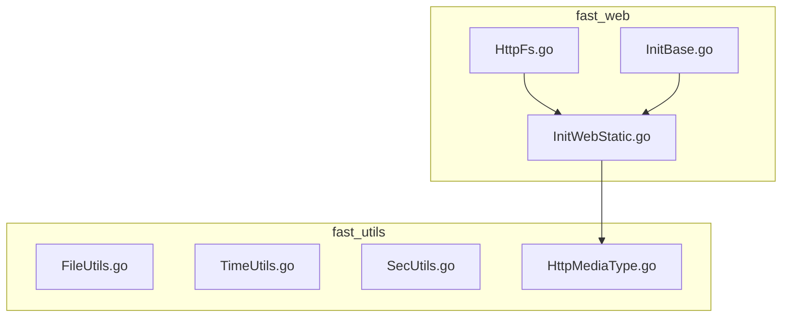
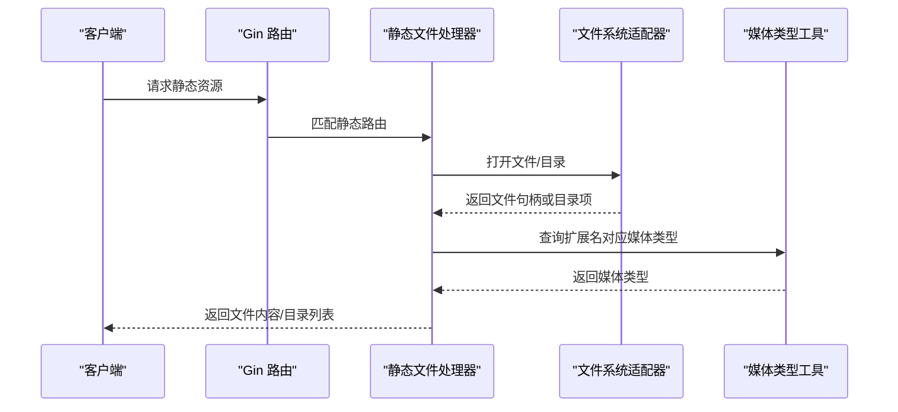
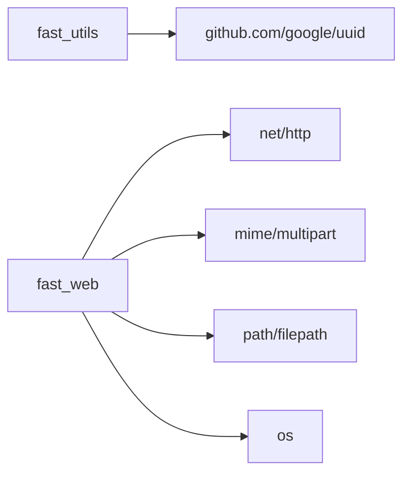

# 工具函数 API

<cite>
**本文引用的文件**
- [FileUtils.go](file://fast_utils/FileUtils.go)
- [TimeUtils.go](file://fast_utils/TimeUtils.go)
- [SecUtils.go](file://fast_utils/SecUtils.go)
- [HttpMediaType.go](file://fast_utils/HttpMediaType.go)
- [InitWebStatic.go](file://fast_web/InitWebStatic.go)
- [HttpFs.go](file://fast_web/web/HttpFs.go)
- [InitBase.go](file://fast_web/InitBase.go)
- [go.mod（fast_utils）](file://fast_utils/go.mod)
- [go.mod（fast_base）](file://fast_base/go.mod)
</cite>

## 目录
1. [简介](#简介)
2. [项目结构](#项目结构)
3. [核心组件](#核心组件)
4. [架构总览](#架构总览)
5. [详细组件分析](#详细组件分析)
6. [依赖分析](#依赖分析)
7. [性能考虑](#性能考虑)
8. [故障排查指南](#故障排查指南)
9. [结论](#结论)
10. [附录](#附录)

## 简介
本文件为 Fast-Go 框架的工具函数 API 参考文档，覆盖以下能力域：
- 文件操作：文件类型识别、文件 MD5 计算
- 时间处理：时间字符串格式化、日期字符串格式化、字符串解析为时间
- 安全与加密：随机盐生成、带盐密码摘要、UUID 生成、整数转字符串
- HTTP 媒体类型：基于扩展名的媒体类型识别
- HTTP 静态资源与文件服务：静态目录挂载、文件服务、范围请求、内容协商与编码选择

文档同时提供使用方法、最佳实践、性能优化建议以及常见问题排查。

## 项目结构
工具函数位于 fast_utils 模块，HTTP 文件服务与静态资源挂载位于 fast_web 模块。模块间通过导入关系耦合，fast_web 依赖 fast_utils 的媒体类型识别能力，并通过自研文件系统适配器提供静态文件服务。

图表来源
- [InitWebStatic.go:1-27](file://fast_web/InitWebStatic.go#L1-L27)
- [HttpFs.go:1-200](file://fast_web/web/HttpFs.go#L1-L200)
- [HttpMediaType.go:1-56](file://fast_utils/HttpMediaType.go#L1-L56)

章节来源
- [InitWebStatic.go:1-27](file://fast_web/InitWebStatic.go#L1-L27)
- [HttpFs.go:1-200](file://fast_web/web/HttpFs.go#L1-L200)
- [go.mod（fast_utils）:1-6](file://fast_utils/go.mod#L1-L6)
- [go.mod（fast_base）:1-37](file://fast_base/go.mod#L1-L37)

## 核心组件
- 文件工具：提供文件类型识别与文件 MD5 计算
- 时间工具：提供时间/日期格式化与字符串解析
- 安全工具：提供随机盐生成、带盐摘要、UUID 生成、整数转字符串
- HTTP 媒体类型：根据扩展名映射常见媒体类型
- HTTP 静态文件服务：静态目录挂载、文件服务、范围请求、内容协商

章节来源
- [FileUtils.go:1-31](file://fast_utils/FileUtils.go#L1-L31)
- [TimeUtils.go:1-38](file://fast_utils/TimeUtils.go#L1-L38)
- [SecUtils.go:1-40](file://fast_utils/SecUtils.go#L1-L40)
- [HttpMediaType.go:1-56](file://fast_utils/HttpMediaType.go#L1-L56)
- [InitWebStatic.go:1-27](file://fast_web/InitWebStatic.go#L1-L27)
- [HttpFs.go:259-331](file://fast_web/web/HttpFs.go#L259-L331)

## 架构总览
下图展示从 Web 层到工具层的调用关系与数据流：

图表来源
- [InitWebStatic.go:12-27](file://fast_web/InitWebStatic.go#L12-L27)
- [HttpFs.go:624-658](file://fast_web/web/HttpFs.go#L624-L658)
- [HttpMediaType.go:6-55](file://fast_utils/HttpMediaType.go#L6-L55)

## 详细组件分析

### 文件工具 API
- GetFileType
  - 功能：提取文件扩展名并统一转为小写
  - 输入：文件名字符串
  - 输出：扩展名字符串（如 .jpg）
  - 典型用途：根据扩展名进行简单分类或过滤
  - 章节来源
    - [FileUtils.go:12-15](file://fast_utils/FileUtils.go#L12-L15)

- GetFileMD5
  - 功能：对文件内容进行 MD5 摘要计算
  - 输入：文件路径
  - 输出：十六进制字符串形式的 MD5 值；失败返回空串
  - 注意事项：内部以流式方式复制文件内容，避免一次性加载大文件导致内存压力
  - 章节来源
    - [FileUtils.go:17-30](file://fast_utils/FileUtils.go#L17-L30)

最佳实践
- 对于超大文件，建议结合分块校验策略或外部校验工具
- 在多并发场景下，注意文件打开权限与并发访问冲突

性能建议
- 尽量避免重复计算同一文件的 MD5
- 使用缓冲读取，减少系统调用次数

章节来源
- [FileUtils.go:1-31](file://fast_utils/FileUtils.go#L1-L31)

### 时间工具 API
- GetTimeStr
  - 功能：将时间格式化为“年-月-日 时:分:秒”字符串
  - 输入：可空指针；为空则使用当前时间
  - 输出：格式化后的字符串
  - 章节来源
    - [TimeUtils.go:13-18](file://fast_utils/TimeUtils.go#L13-L18)

- GetTimeSSSStr
  - 功能：将时间格式化为“年-月-日 时:分:秒.毫秒”字符串
  - 输入：可空指针；为空则使用当前时间
  - 输出：格式化后的字符串
  - 章节来源
    - [TimeUtils.go:20-25](file://fast_utils/TimeUtils.go#L20-L25)

- GetDateStr
  - 功能：将时间格式化为“年-月-日”字符串
  - 输入：可空指针；为空则使用当前时间
  - 输出：格式化后的字符串
  - 章节来源
    - [TimeUtils.go:27-32](file://fast_utils/TimeUtils.go#L27-L32)

- ToTime
  - 功能：将“年-月-日 时:分:秒”字符串解析为 time.Time（本地时区）
  - 输入：字符串
  - 输出：时间对象
  - 章节来源
    - [TimeUtils.go:34-37](file://fast_utils/TimeUtils.go#L34-L37)

最佳实践
- 明确时区需求时，建议使用标准库 time.ParseInLocation 或时区转换工具
- 在日志与数据库存储中统一采用 UTC 或固定时区，避免跨时区歧义

章节来源
- [TimeUtils.go:1-38](file://fast_utils/TimeUtils.go#L1-L38)

### 安全与加密工具 API
- GenerateSalt
  - 功能：生成指定长度的随机盐（十六进制字符串）
  - 输入：盐长度（字节数）
  - 输出：随机盐字符串；失败返回错误
  - 章节来源
    - [SecUtils.go:13-19](file://fast_utils/SecUtils.go#L13-L19)

- HashPasswordWithSalt
  - 功能：对“前缀+盐+明文+后缀”的组合进行 MD5 摘要
  - 输入：明文密码、盐
  - 输出：MD5 十六进制字符串
  - 注意：该实现为教学演示用途，生产环境建议使用更强的密码散列算法（如 bcrypt、scrypt、argon2）
  - 章节来源
    - [SecUtils.go:22-30](file://fast_utils/SecUtils.go#L22-L30)

- GetUUIDStr
  - 功能：生成标准 UUID 字符串
  - 输入：无
  - 输出：UUID 字符串
  - 依赖：github.com/google/uuid
  - 章节来源
    - [SecUtils.go:33-35](file://fast_utils/SecUtils.go#L33-L35)
    - [go.mod（fast_utils）:5-5](file://fast_utils/go.mod#L5-L5)

- IntToStr
  - 功能：将 int64 转换为十进制字符串
  - 输入：整数值
  - 输出：字符串
  - 章节来源
    - [SecUtils.go:37-39](file://fast_utils/SecUtils.go#L37-L39)

最佳实践
- 密码存储必须使用强散列算法与独立盐，避免使用 MD5
- 盐长度建议至少 16 字节（128 位），并保证唯一性
- UUID 适合用于分布式唯一标识，但不适合替代密码学安全随机数

章节来源
- [SecUtils.go:1-40](file://fast_utils/SecUtils.go#L1-L40)
- [go.mod（fast_utils）:1-6](file://fast_utils/go.mod#L1-L6)

### HTTP 媒体类型工具 API
- GetFileMediaType
  - 功能：根据文件扩展名返回常见 MIME 类型；未匹配时返回默认二进制类型
  - 输入：文件名
  - 输出：媒体类型字符串（如 image/png、application/json 等）
  - 支持类型：图片、音频、视频、文档、压缩包、文本等常见扩展
  - 章节来源
    - [HttpMediaType.go:6-55](file://fast_utils/HttpMediaType.go#L6-L55)

最佳实践
- 当扩展名不可靠时，结合内容探测（Content-Type sniffing）作为补充
- 对于动态生成内容，建议显式设置 Content-Type，避免浏览器误判

章节来源
- [HttpMediaType.go:1-56](file://fast_utils/HttpMediaType.go#L1-L56)

### HTTP 静态文件服务与文件系统
- 静态目录挂载
  - LoadStatic：将本地目录挂载为静态资源路径
  - LoadStaticFs：将任意 http.FileSystem 实现挂载为静态资源路径
  - 章节来源
    - [InitWebStatic.go:12-27](file://fast_web/InitWebStatic.go#L12-L27)

- 文件服务与内容协商
  - 文件打开与安全路径处理：防止路径穿越
  - 内容类型推断：优先使用扩展名映射，其次进行内容探测
  - 编码选择：优先返回已存在的 gzip 文件，否则回退到原始文件
  - 范围请求：支持 Content-Range，返回部分响应
  - 章节来源
    - [HttpFs.go:76-92](file://fast_web/web/HttpFs.go#L76-L92)
    - [HttpFs.go:259-331](file://fast_web/web/HttpFs.go#L259-L331)
    - [HttpFs.go:624-658](file://fast_web/web/HttpFs.go#L624-L658)

- 服务器配置（上传目录）
  - Upload：上传目录根路径，默认指向相对路径
  - 章节来源
    - [InitBase.go:7-14](file://fast_web/InitBase.go#L7-L14)

最佳实践
- 上传目录应具备严格的访问控制与大小限制
- 对外暴露的静态资源建议启用缓存与压缩
- 启用范围请求以提升大文件传输体验

章节来源
- [InitWebStatic.go:1-27](file://fast_web/InitWebStatic.go#L1-L27)
- [HttpFs.go:1-200](file://fast_web/web/HttpFs.go#L1-L200)
- [InitBase.go:1-45](file://fast_web/InitBase.go#L1-L45)

## 依赖分析
- fast_utils 模块
  - 依赖：github.com/google/uuid（用于 UUID 生成）
  - 章节来源
    - [go.mod（fast_utils）:1-6](file://fast_utils/go.mod#L1-L6)

- fast_web 模块
  - 依赖：gin、net/http、mime、mime/multipart、os、path/filepath 等标准库
  - 章节来源
    - [HttpFs.go:9-27](file://fast_web/web/HttpFs.go#L9-L27)
    - [go.mod（fast_base）:1-37](file://fast_base/go.mod#L1-L37)

图表来源
- [go.mod（fast_utils）:5-5](file://fast_utils/go.mod#L5-L5)
- [HttpFs.go:9-27](file://fast_web/web/HttpFs.go#L9-L27)

章节来源
- [go.mod（fast_utils）:1-6](file://fast_utils/go.mod#L1-L6)
- [go.mod（fast_base）:1-37](file://fast_base/go.mod#L1-L37)
- [HttpFs.go:1-200](file://fast_web/web/HttpFs.go#L1-L200)

## 性能考虑
- 文件 MD5 计算
  - 使用流式复制，避免一次性读入内存；对超大文件建议分块校验或外部工具
- 静态文件服务
  - 优先返回已存在的 .gz 文件，减少带宽占用
  - 合理设置缓存头与 ETag，降低重复传输
- 时间格式化
  - 复用常量格式字符串，避免重复构造
- 安全散列
  - 生产环境请改用 bcrypt/argon2 等强散列算法，避免 MD5

## 故障排查指南
- 文件 MD5 返回空串
  - 可能原因：文件不存在、权限不足、读取失败
  - 建议：检查文件路径与权限，确认文件可读
- 媒体类型识别为默认类型
  - 可能原因：扩展名不在映射表中
  - 建议：补充扩展名映射或在服务端设置 Content-Type
- 静态文件 404 或路径穿越
  - 可能原因：非法路径、未正确挂载
  - 建议：确认路由模式不含通配符参数，检查挂载路径与文件系统实现
- 范围请求失败
  - 可能原因：客户端 Range 头不合法或文件不可 Seek
  - 建议：检查 Range 解析逻辑与文件句柄类型

章节来源
- [FileUtils.go:17-30](file://fast_utils/FileUtils.go#L17-L30)
- [HttpMediaType.go:6-55](file://fast_utils/HttpMediaType.go#L6-L55)
- [InitWebStatic.go:17-19](file://fast_web/InitWebStatic.go#L17-L19)
- [HttpFs.go:293-300](file://fast_web/web/HttpFs.go#L293-L300)

## 结论
Fast-Go 的工具函数 API 提供了文件、时间、安全与 HTTP 媒体类型的基础能力，配合 fast_web 的静态文件服务，能够满足常见的静态资源托管与内容协商需求。生产环境中建议在安全与性能方面做进一步强化，例如替换 MD5 为强散列算法、启用更细粒度的缓存与压缩策略。

## 附录
- 常见 MIME 类型映射（节选）
  - 图片：image/jpeg、image/png、image/gif、image/webp、image/svg+xml、image/x-icon
  - 文档：application/pdf、application/json、text/html、text/css、application/javascript
  - 办公：application/msword、application/vnd.openxmlformats-officedocument.wordprocessingml.document
  - 电子表格：application/vnd.ms-excel、application/vnd.openxmlformats-officedocument.spreadsheetml.sheet
  - 演示：application/vnd.ms-powerpoint、application/vnd.openxmlformats-officedocument.presentationml.presentation
  - 压缩：application/zip、application/x-rar-compressed、application/x-tar、application/gzip、application/x-7z-compressed
  - 视频：video/mp4、video/x-msvideo、video/x-ms-wmv、video/x-flv
  - 音频：audio/mpeg、audio/wav
  - 文本：text/csv、text/plain
  - 章节来源
    - [HttpMediaType.go:9-44](file://fast_utils/HttpMediaType.go#L9-L44)