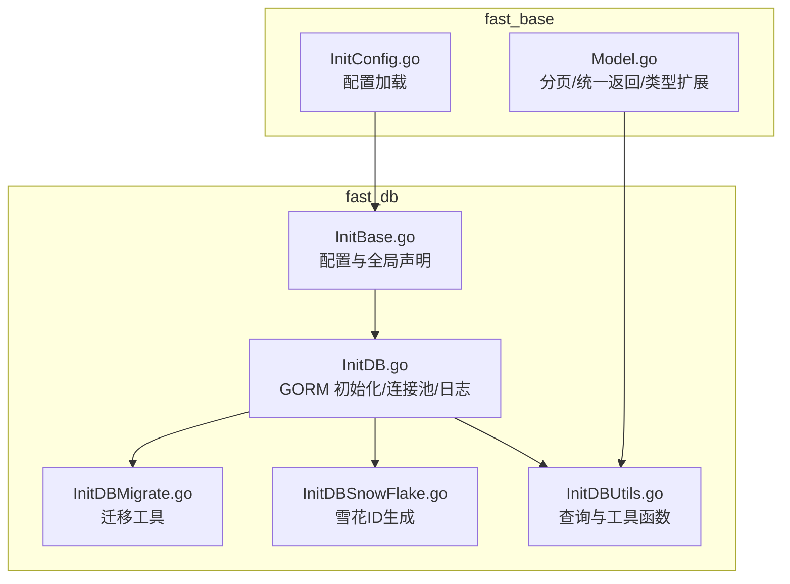
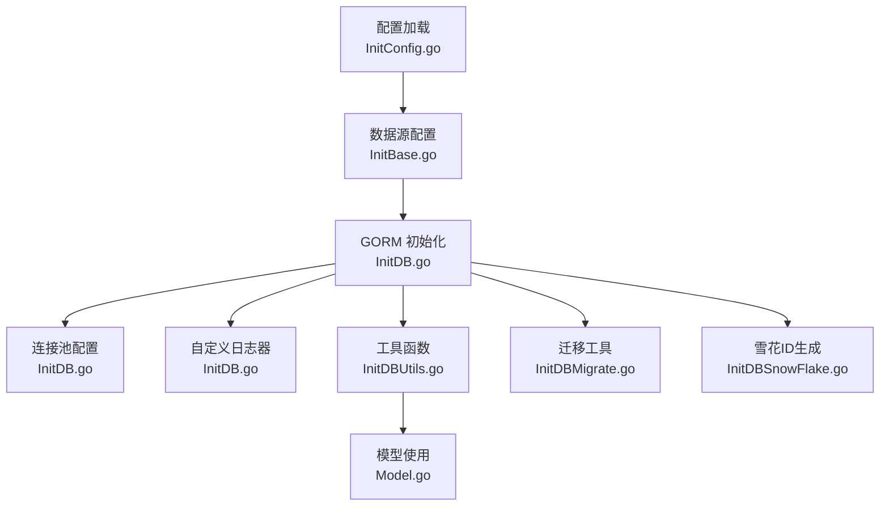
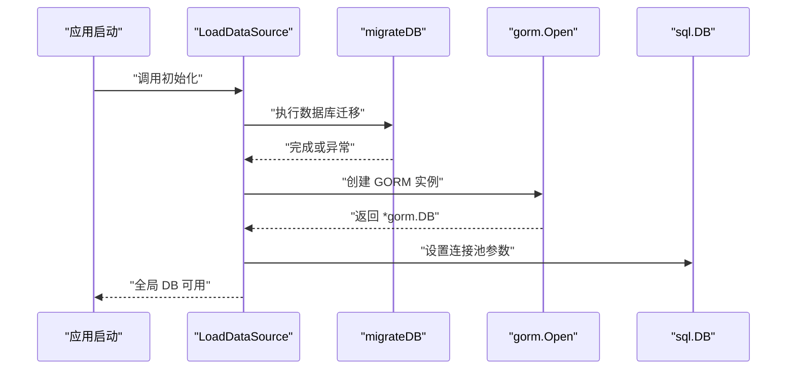
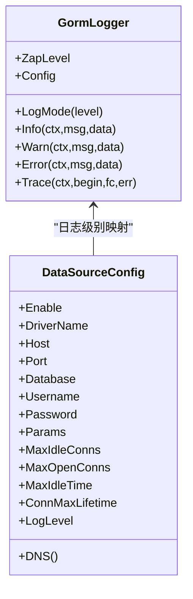
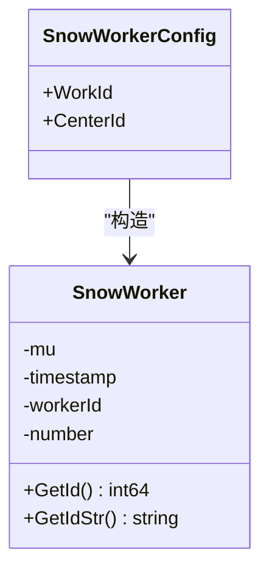
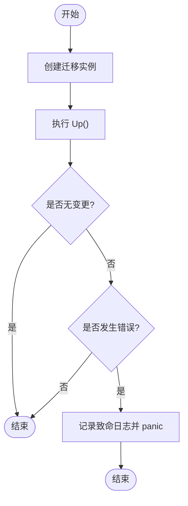
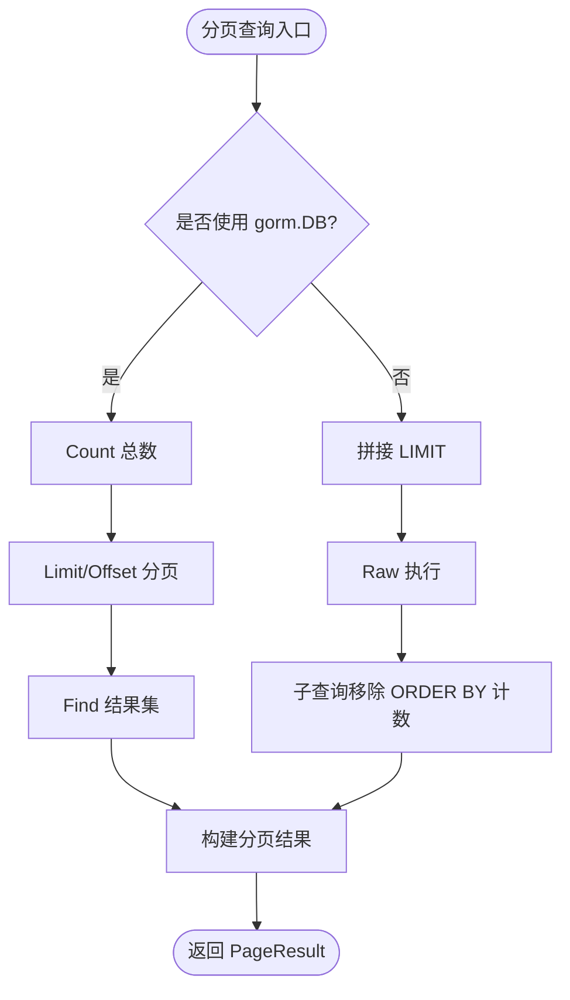
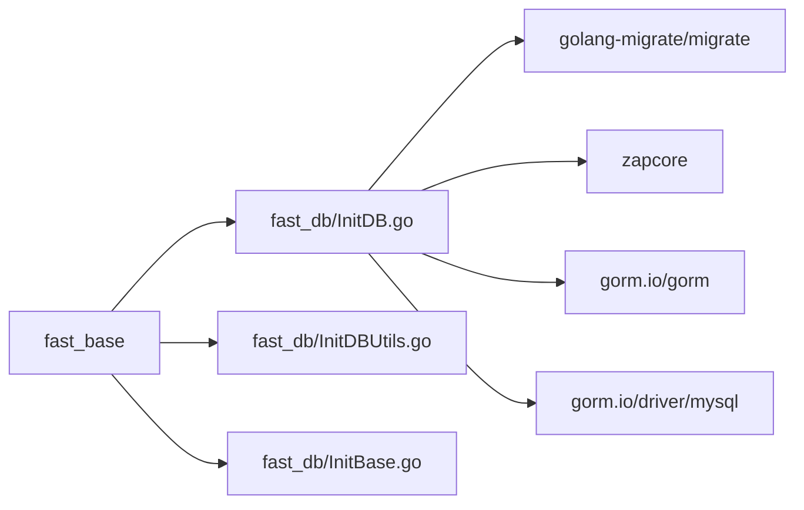

# 数据库 API

<cite>
**本文引用的文件**
- [fast_db/InitDB.go](file://fast_db/InitDB.go)
- [fast_db/InitBase.go](file://fast_db/InitBase.go)
- [fast_db/InitDBMigrate.go](file://fast_db/InitDBMigrate.go)
- [fast_db/InitDBSnowFlake.go](file://fast_db/InitDBSnowFlake.go)
- [fast_db/InitDBUtils.go](file://fast_db/InitDBUtils.go)
- [fast_base/Model.go](file://fast_base/Model.go)
- [fast_base/InitConfig.go](file://fast_base/InitConfig.go)
</cite>

## 目录
1. [简介](#简介)
2. [项目结构](#项目结构)
3. [核心组件](#核心组件)
4. [架构总览](#架构总览)
5. [详细组件分析](#详细组件分析)
6. [依赖分析](#依赖分析)
7. [性能考虑](#性能考虑)
8. [故障排查指南](#故障排查指南)
9. [结论](#结论)
10. [附录](#附录)

## 简介
本文件为 Fast-Go 框架数据库 API 的权威参考文档，覆盖数据库连接初始化、GORM ORM 集成、数据库操作接口、配置参数、连接池设置、事务处理机制、模型定义、查询与分页、迁移工具、索引管理、性能优化、雪花 ID 生成、工具函数与批量操作等主题。文档以仓库现有实现为准，提供面向开发与运维的实用指南。

## 项目结构
数据库相关能力集中在 fast_db 模块，配合 fast_base 提供的通用模型与配置加载能力：
- fast_db/InitDB.go：GORM 初始化、连接池配置、自定义日志器、全局 DB 实例与字典查询桥接
- fast_db/InitBase.go：数据源与雪花 ID 配置、全局 DB 与 SnowMaker 声明
- fast_db/InitDBMigrate.go：基于 golang-migrate 的数据库迁移工具
- fast_db/InitDBSnowFlake.go：分布式 ID（雪花算法）生成器
- fast_db/InitDBUtils.go：分页查询、原生 SQL 查询、存在性检查、计数等常用工具
- fast_base/Model.go：分页参数与结果、统一返回体、字符串化整型等基础类型
- fast_base/InitConfig.go：配置加载与环境变量解析

图表来源
- [fast_db/InitDB.go:1-238](file://fast_db/InitDB.go#L1-L238)
- [fast_db/InitBase.go:1-39](file://fast_db/InitBase.go#L1-L39)
- [fast_db/InitDBMigrate.go:1-69](file://fast_db/InitDBMigrate.go#L1-L69)
- [fast_db/InitDBSnowFlake.go:1-102](file://fast_db/InitDBSnowFlake.go#L1-L102)
- [fast_db/InitDBUtils.go:1-123](file://fast_db/InitDBUtils.go#L1-L123)
- [fast_base/Model.go:1-116](file://fast_base/Model.go#L1-L116)
- [fast_base/InitConfig.go:1-108](file://fast_base/InitConfig.go#L1-L108)

章节来源
- [fast_db/InitDB.go:18-100](file://fast_db/InitDB.go#L18-L100)
- [fast_db/InitBase.go:9-39](file://fast_db/InitBase.go#L9-L39)
- [fast_db/InitDBMigrate.go:12-28](file://fast_db/InitDBMigrate.go#L12-L28)
- [fast_db/InitDBSnowFlake.go:20-86](file://fast_db/InitDBSnowFlake.go#L20-L86)
- [fast_db/InitDBUtils.go:10-123](file://fast_db/InitDBUtils.go#L10-L123)
- [fast_base/Model.go:10-116](file://fast_base/Model.go#L10-L116)
- [fast_base/InitConfig.go:21-50](file://fast_base/InitConfig.go#L21-L50)

## 核心组件
- 数据源配置与全局 DB 实例
  - 配置项：启用开关、驱动名、主机、端口、数据库名、用户名、密码、连接参数、连接池上限、空闲连接数、空闲与生命周期、日志级别
  - DNS 构造：按模板拼接用户名、密码、主机、端口、数据库与参数
  - 全局 DB：gorm.DB 实例，后续所有读写操作基于此
- GORM 配置与自定义日志器
  - 命名策略：单数表名
  - 预编译语句：提升执行效率
  - 自定义日志器：与 Zap 日志级别映射，区分 info/warn/error 输出，支持慢查询阈值
- 连接池设置
  - 最大打开连接数、最大空闲连接数、空闲最大时长、连接最大生命周期
- 雪花 ID 生成
  - 支持按表名或结构体生成独立工作节点，线程安全，毫秒级时间戳+工作节点+序列号组合
- 迁移工具
  - 基于 golang-migrate 的 MySQL 迁移，支持一次性同步与逐步执行
- 工具函数
  - 分页查询（基于 gorm.DB 与原生 SQL）
  - 原生 SQL 列表查询
  - 主键查询、首条查询、存在性检查、计数
  - 移除 SQL 中 ORDER BY 子句辅助函数

章节来源
- [fast_db/InitBase.go:9-39](file://fast_db/InitBase.go#L9-L39)
- [fast_db/InitDB.go:42-89](file://fast_db/InitDB.go#L42-L89)
- [fast_db/InitDB.go:110-238](file://fast_db/InitDB.go#L110-L238)
- [fast_db/InitDBSnowFlake.go:20-102](file://fast_db/InitDBSnowFlake.go#L20-L102)
- [fast_db/InitDBMigrate.go:12-68](file://fast_db/InitDBMigrate.go#L12-L68)
- [fast_db/InitDBUtils.go:10-123](file://fast_db/InitDBUtils.go#L10-L123)

## 架构总览
下图展示数据库模块在应用中的角色与交互：

图表来源
- [fast_base/InitConfig.go:21-50](file://fast_base/InitConfig.go#L21-L50)
- [fast_db/InitBase.go:9-39](file://fast_db/InitBase.go#L9-L39)
- [fast_db/InitDB.go:42-89](file://fast_db/InitDB.go#L42-L89)
- [fast_db/InitDBUtils.go:10-123](file://fast_db/InitDBUtils.go#L10-L123)
- [fast_db/InitDBMigrate.go:12-28](file://fast_db/InitDBMigrate.go#L12-L28)
- [fast_db/InitDBSnowFlake.go:20-86](file://fast_db/InitDBSnowFlake.go#L20-L86)
- [fast_base/Model.go:10-116](file://fast_base/Model.go#L10-L116)

## 详细组件分析

### 数据库连接与初始化
- 初始化流程
  - 解析配置 dataSource 与 snowWorker
  - 若未启用则跳过；启用则执行迁移、初始化雪花 ID、建立 GORM 连接
  - 将 gorm.DB 设为全局实例，设置连接池参数
  - 注册字典查询桥接函数，通过 DB.Raw 执行 SQL 并扫描结果
- 关键点
  - 日志级别映射：Zap 级别转为 GORM 日志级别
  - 慢查询阈值：毫秒级阈值控制慢日志输出
  - 连接池：最大打开连接数、空闲连接数、空闲最大时长、连接最大生命周期

图表来源
- [fast_db/InitDB.go:19-100](file://fast_db/InitDB.go#L19-L100)
- [fast_db/InitDBMigrate.go:12-28](file://fast_db/InitDBMigrate.go#L12-L28)

章节来源
- [fast_db/InitDB.go:18-100](file://fast_db/InitDB.go#L18-L100)
- [fast_db/InitDB.go:66-89](file://fast_db/InitDB.go#L66-L89)
- [fast_db/InitDB.go:92-99](file://fast_db/InitDB.go#L92-L99)

### GORM 配置与自定义日志器
- 配置要点
  - 命名策略：单数表名
  - 预编译语句：PrepareStmt
  - 自定义 Logger：与 Zap 日志级别映射，支持彩色输出
  - 慢查询阈值：毫秒级阈值
- 日志器行为
  - Info/Warn/Error 分级输出
  - 慢查询标记与行数统计
  - 调用栈定位：过滤 gorm.io 调用，定位业务调用者

图表来源
- [fast_db/InitDB.go:110-238](file://fast_db/InitDB.go#L110-L238)
- [fast_db/InitBase.go:15-33](file://fast_db/InitBase.go#L15-L33)

章节来源
- [fast_db/InitDB.go:45-58](file://fast_db/InitDB.go#L45-L58)
- [fast_db/InitDB.go:110-150](file://fast_db/InitDB.go#L110-L150)
- [fast_db/InitDB.go:167-225](file://fast_db/InitDB.go#L167-L225)
- [fast_db/InitDB.go:227-237](file://fast_db/InitDB.go#L227-L237)

### 连接池设置
- 参数说明
  - 最大打开连接数：受数据库 max_connections 限制
  - 最大空闲连接数：需小于最大打开连接数
  - 空闲最大时长：超过后连接被回收
  - 连接最大生命周期：需小于数据库 wait_timeout
- 建议
  - maxOpenConns ≈ CPU 核数 × 2 + 磁盘数量
  - MaxIdleTime 建议设为 0 不主动回收空闲连接
  - ConnMaxLifetime 小于 wait_timeout

章节来源
- [fast_db/InitDB.go:66-89](file://fast_db/InitDB.go#L66-L89)

### 雪花 ID 生成
- 结构与常量
  - workerBits、numberBits、timeShift、workerShift、startTime
  - 工作节点范围校验与并发安全
- 接口
  - NewSnowWorker：创建工作节点
  - GetId/GetIdStr：生成 ID（整型/字符串）
  - GetIdForTable/GetIdForStruct：按表名或结构体名生成 ID
- 使用建议
  - 为不同表/结构体维护独立工作节点，避免冲突
  - workId 与 centerId 来源于配置

图表来源
- [fast_db/InitDBSnowFlake.go:20-86](file://fast_db/InitDBSnowFlake.go#L20-L86)
- [fast_db/InitBase.go:35-39](file://fast_db/InitBase.go#L35-L39)

章节来源
- [fast_db/InitDBSnowFlake.go:20-102](file://fast_db/InitDBSnowFlake.go#L20-L102)
- [fast_db/InitBase.go:35-39](file://fast_db/InitBase.go#L35-L39)

### 数据库迁移工具
- 功能
  - migrateDB：一次性同步到最新版本
  - migrateDBStepByStep：逐步执行迁移（显式 Ping 与 Up）
- 依赖
  - golang-migrate + mysql 驱动 + file:// 源
- 错误处理
  - 失败时记录致命日志并 panic
  - 忽略“无变更”错误

图表来源
- [fast_db/InitDBMigrate.go:12-28](file://fast_db/InitDBMigrate.go#L12-L28)
- [fast_db/InitDBMigrate.go:30-68](file://fast_db/InitDBMigrate.go#L30-L68)

章节来源
- [fast_db/InitDBMigrate.go:12-28](file://fast_db/InitDBMigrate.go#L12-L28)
- [fast_db/InitDBMigrate.go:30-68](file://fast_db/InitDBMigrate.go#L30-L68)

### 数据库操作接口与工具函数
- 分页查询
  - QueryPageListByDB：基于 gorm.DB，先 Count 再 Limit/Offset 查询
  - QueryPageListBySql：基于原生 SQL，拼接 LIMIT，使用子查询移除 ORDER BY 计算总数
- 列表查询
  - GetListBySql：直接执行原生 SQL 返回切片
- 单条查询
  - GetById：按主键查询
  - GetOne：按原生 SQL 查询首条
- 存在性与计数
  - CheckExists：统计大于 0 视为存在
  - CountNum：返回整型计数
- 辅助
  - removeOrderBy：移除 SQL 中 ORDER BY 子句

图表来源
- [fast_db/InitDBUtils.go:10-63](file://fast_db/InitDBUtils.go#L10-L63)
- [fast_db/InitDBUtils.go:65-78](file://fast_db/InitDBUtils.go#L65-L78)
- [fast_db/InitDBUtils.go:80-94](file://fast_db/InitDBUtils.go#L80-L94)
- [fast_db/InitDBUtils.go:96-113](file://fast_db/InitDBUtils.go#L96-L113)
- [fast_db/InitDBUtils.go:115-122](file://fast_db/InitDBUtils.go#L115-L122)

章节来源
- [fast_db/InitDBUtils.go:10-63](file://fast_db/InitDBUtils.go#L10-L63)
- [fast_db/InitDBUtils.go:65-78](file://fast_db/InitDBUtils.go#L65-L78)
- [fast_db/InitDBUtils.go:80-94](file://fast_db/InitDBUtils.go#L80-L94)
- [fast_db/InitDBUtils.go:96-113](file://fast_db/InitDBUtils.go#L96-L113)
- [fast_db/InitDBUtils.go:115-122](file://fast_db/InitDBUtils.go#L115-L122)

### 模型定义与基础类型
- 分页参数与结果
  - PageParam/PageParams： pageIndex/pageSize 默认值与边界处理
  - PageResult[T]：封装分页结果、总数、总页数与列表
- 统一返回体
  - R：统一响应结构，提供便捷方法设置 code/message/data
- 字符串化整型
  - StringInt64：实现 driver.Valuer 与 sql.Scanner，便于数据库与 JSON 序列化

章节来源
- [fast_base/Model.go:10-56](file://fast_base/Model.go#L10-L56)
- [fast_base/Model.go:82-116](file://fast_base/Model.go#L82-L116)
- [fast_base/Model.go:57-81](file://fast_base/Model.go#L57-L81)

### 事务处理机制
- 当前实现
  - 未在 fast_db 模块内提供显式的事务封装函数
- 建议
  - 在业务层使用 gorm.DB.Begin/Commit/Rollback 进行事务控制
  - 对于批量写入场景，结合连接池与预编译语句提升吞吐

[本节为概念性说明，不直接分析具体文件]

### 索引管理
- 当前实现
  - 未提供专门的索引管理工具函数
- 建议
  - 使用原生 SQL 或迁移脚本进行索引创建/删除
  - 在模型层面通过标签声明索引（如 DeletedAt 的 index）

[本节为概念性说明，不直接分析具体文件]

### 性能优化接口
- 已实现
  - 预编译语句：PrepareStmt
  - 连接池参数：MaxOpenConns、MaxIdleConns、MaxIdleTime、ConnMaxLifetime
  - 慢查询日志：SlowThreshold
- 建议
  - 合理设置连接池参数，避免过度连接
  - 使用分页查询避免一次性加载大量数据
  - 对热点查询建立合适索引

章节来源
- [fast_db/InitDB.go:48-58](file://fast_db/InitDB.go#L48-L58)
- [fast_db/InitDB.go:66-89](file://fast_db/InitDB.go#L66-L89)
- [fast_db/InitDB.go:52-57](file://fast_db/InitDB.go#L52-L57)

### 批量操作
- 当前实现
  - 未提供专门的批量插入/更新/删除工具函数
- 建议
  - 使用 gorm.Model 的批量操作或原生 SQL 批处理
  - 结合事务与连接池参数优化吞吐

[本节为概念性说明，不直接分析具体文件]

## 依赖分析
- 模块耦合
  - fast_db/InitDB.go 依赖 fast_base 的配置与日志映射
  - fast_db/InitDBUtils.go 依赖 fast_base 的分页模型与全局 DB
  - fast_db/InitDBMigrate.go 依赖 golang-migrate 与 MySQL 驱动
  - fast_db/InitDBSnowFlake.go 为纯本地逻辑，无外部依赖
- 外部依赖
  - gorm.io/gorm、gorm.io/driver/mysql、golang-migrate/migrate、zapcore

图表来源
- [fast_db/InitDB.go:3-16](file://fast_db/InitDB.go#L3-L16)
- [fast_db/InitDBMigrate.go:3-10](file://fast_db/InitDBMigrate.go#L3-L10)
- [fast_base/Model.go:1-116](file://fast_base/Model.go#L1-L116)

章节来源
- [fast_db/InitDB.go:3-16](file://fast_db/InitDB.go#L3-L16)
- [fast_db/InitDBMigrate.go:3-10](file://fast_db/InitDBMigrate.go#L3-L10)
- [fast_base/Model.go:1-116](file://fast_base/Model.go#L1-L116)

## 性能考虑
- 连接池参数建议
  - MaxOpenConns：根据 CPU 核数与磁盘数量估算
  - MaxIdleConns：小于 MaxOpenConns
  - MaxIdleTime：建议 0，避免主动回收
  - ConnMaxLifetime：小于数据库 wait_timeout
- 查询优化
  - 使用分页与 LIMIT
  - 避免 N+1 查询，合理使用关联
  - 为高频字段建立索引
- 日志与监控
  - 合理设置慢查询阈值
  - 结合业务日志定位性能瓶颈

[本节提供通用指导，不直接分析具体文件]

## 故障排查指南
- 连接失败
  - 检查 DNS 拼接与数据库可达性
  - 查看致命日志与 panic 信息
- 迁移失败
  - 检查 migration 目录与源路径
  - 确认数据库凭据与网络连通
- 慢查询
  - 查看慢查询日志与行数统计
  - 审视 SQL 与索引设计
- 分页异常
  - 确认 PageParam 默认值与边界
  - 检查 SQL 中 ORDER BY 的移除逻辑

章节来源
- [fast_db/InitDB.go:59-61](file://fast_db/InitDB.go#L59-L61)
- [fast_db/InitDBMigrate.go:19-27](file://fast_db/InitDBMigrate.go#L19-L27)
- [fast_db/InitDBMigrate.go:37-44](file://fast_db/InitDBMigrate.go#L37-L44)
- [fast_db/InitDB.go:195-214](file://fast_db/InitDB.go#L195-L214)

## 结论
Fast-Go 的数据库模块以 GORM 为核心，提供了完善的连接初始化、连接池配置、自定义日志、迁移工具与常用查询工具。结合雪花 ID 生成与分页模型，能够满足大多数业务场景的数据访问需求。建议在生产环境中合理配置连接池参数、关注慢查询与索引设计，并在业务层做好事务与批量操作的优化。

## 附录

### 配置参数一览
- 数据源配置（DataSourceConfig）
  - enable：是否启用数据库
  - driverName：驱动名称（如 mysql）
  - host/port/database/username/password：连接参数
  - params：连接参数字符串
  - maxOpenConns/maxIdleConns/maxIdleTime/connMaxLifetime：连接池参数
  - logLevel：日志级别
- 雪花 ID 配置（SnowWorkerConfig）
  - workId：工作节点 ID
  - centerId：数据中心 ID

章节来源
- [fast_db/InitBase.go:15-39](file://fast_db/InitBase.go#L15-L39)