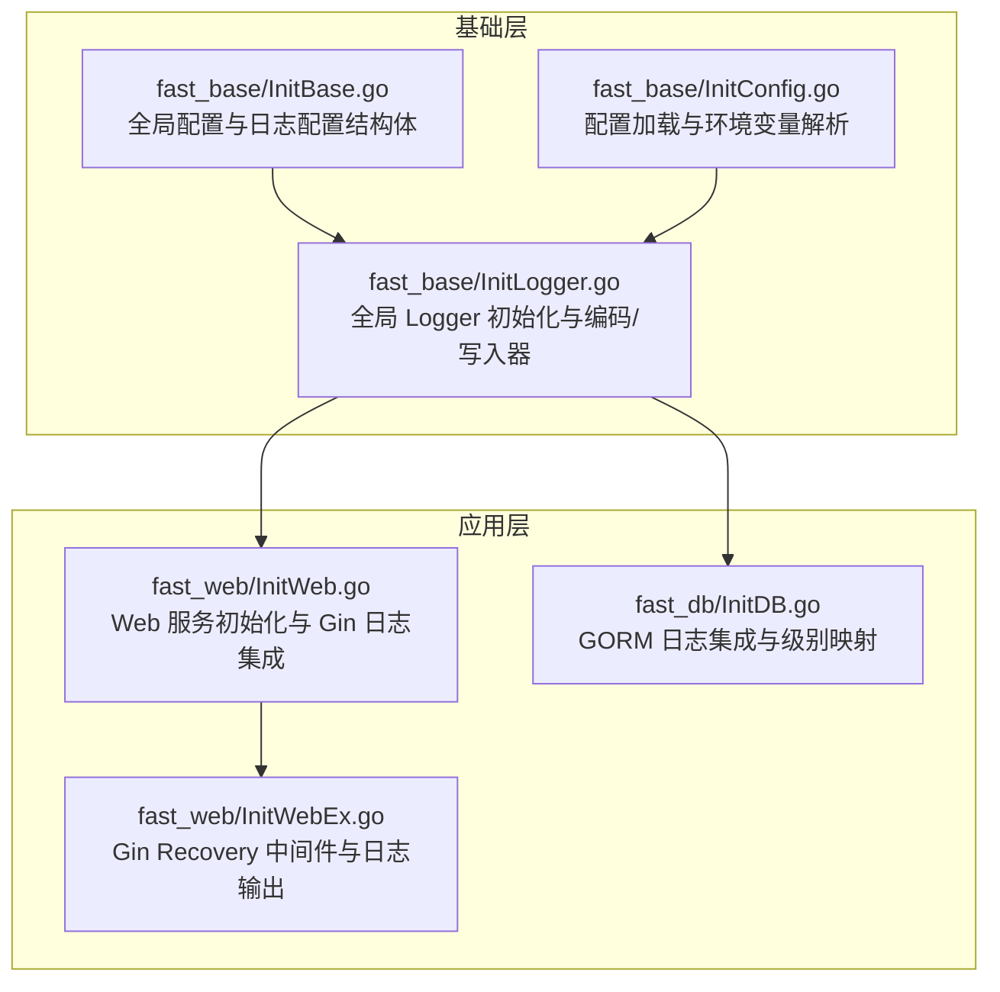
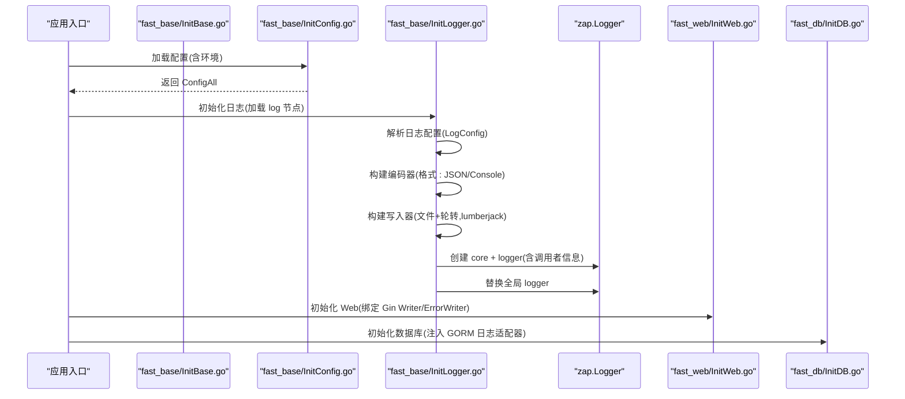
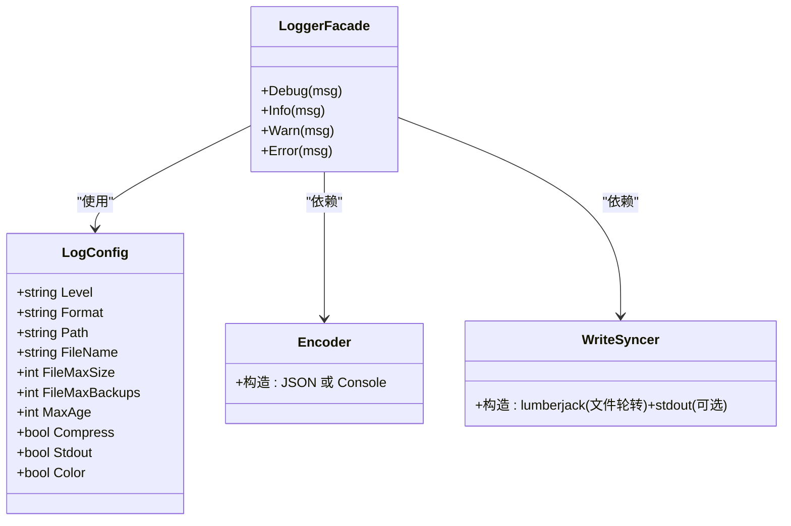
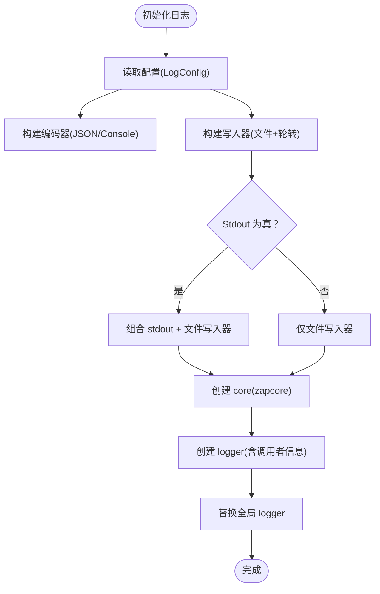
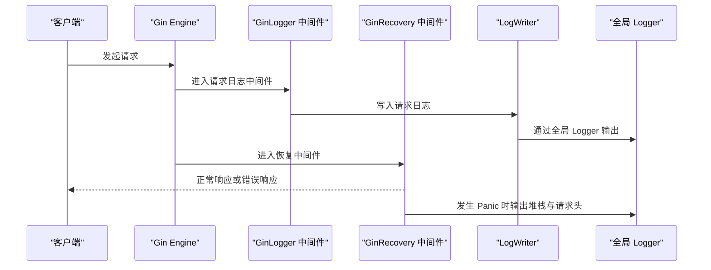
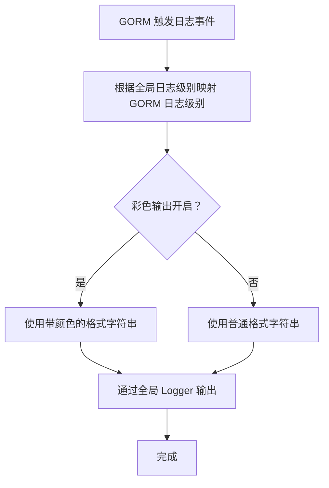
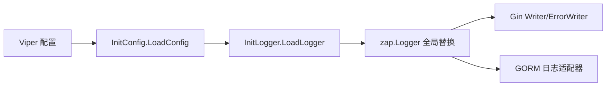

# 日志系统 API

<cite>
**本文引用的文件**   
- [fast_base/InitLogger.go](file://fast_base/InitLogger.go)
- [fast_base/InitBase.go](file://fast_base/InitBase.go)
- [fast_base/InitConfig.go](file://fast_base/InitConfig.go)
- [fast_db/InitDB.go](file://fast_db/InitDB.go)
- [fast_web/InitWeb.go](file://fast_web/InitWeb.go)
- [fast_web/InitWebEx.go](file://fast_web/InitWebEx.go)
</cite>

## 目录
1. [简介](#简介)
2. [项目结构](#项目结构)
3. [核心组件](#核心组件)
4. [架构总览](#架构总览)
5. [详细组件分析](#详细组件分析)
6. [依赖分析](#依赖分析)
7. [性能考虑](#性能考虑)
8. [故障排查指南](#故障排查指南)
9. [结论](#结论)
10. [附录](#附录)

## 简介
本文件为 Fast-Go 框架的日志系统 API 参考文档，覆盖以下主题：
- 全局日志对象 Logger 的可用方法与使用方式
- 日志配置项的作用与设置方法（级别、格式、输出位置、轮转策略等）
- 日志格式化选项、结构化日志记录思路与性能优化建议
- 日志文件管理、轮转机制与清理策略的实现细节
- 日志使用的最佳实践与常见问题解决方案

## 项目结构
日志系统主要位于 fast_base 模块，围绕全局 Logger 对象进行初始化与配置；fast_web 与 fast_db 模块分别对 Web 中间件与数据库日志进行集成。

**图表来源**
- [fast_base/InitBase.go:16-40](file://fast_base/InitBase.go#L16-L40)
- [fast_base/InitLogger.go:15-44](file://fast_base/InitLogger.go#L15-L44)
- [fast_base/InitConfig.go:21-50](file://fast_base/InitConfig.go#L21-L50)
- [fast_web/InitWeb.go:42-66](file://fast_web/InitWeb.go#L42-L66)
- [fast_web/InitWebEx.go:52-109](file://fast_web/InitWebEx.go#L52-L109)
- [fast_db/InitDB.go:35-58](file://fast_db/InitDB.go#L35-L58)

**章节来源**
- [fast_base/InitBase.go:16-40](file://fast_base/InitBase.go#L16-L40)
- [fast_base/InitLogger.go:15-44](file://fast_base/InitLogger.go#L15-L44)
- [fast_base/InitConfig.go:21-50](file://fast_base/InitConfig.go#L21-L50)
- [fast_web/InitWeb.go:42-66](file://fast_web/InitWeb.go#L42-L66)
- [fast_web/InitWebEx.go:52-109](file://fast_web/InitWebEx.go#L52-L109)
- [fast_db/InitDB.go:35-58](file://fast_db/InitDB.go#L35-L58)

## 核心组件
- 全局 Logger 对象：通过初始化函数构建并替换全局 zap.Logger，提供 Debug、Info、Warn、Error 等日志方法。
- 日志配置结构体：包含日志级别、输出格式、文件路径、文件名、单文件大小限制、备份数量、保留天数、是否输出到控制台、是否压缩、是否彩色输出等。
- 编码器与写入器：生产环境编码器配置，支持 JSON 与 Console 两种格式；写入器结合 lumberjack 实现文件轮转与多目标输出。
- Web/GORM 集成：Web 中间件将请求日志接入全局 Logger；GORM 日志通过自定义适配器与全局日志级别联动。

**章节来源**
- [fast_base/InitBase.go:9-40](file://fast_base/InitBase.go#L9-L40)
- [fast_base/InitLogger.go:15-44](file://fast_base/InitLogger.go#L15-L44)
- [fast_web/InitWeb.go:53-54](file://fast_web/InitWeb.go#L53-L54)
- [fast_db/InitDB.go:51-57](file://fast_db/InitDB.go#L51-L57)

## 架构总览
全局 Logger 初始化流程与关键交互如下：

**图表来源**
- [fast_base/InitConfig.go:21-50](file://fast_base/InitConfig.go#L21-L50)
- [fast_base/InitLogger.go:15-44](file://fast_base/InitLogger.go#L15-L44)
- [fast_web/InitWeb.go:42-66](file://fast_web/InitWeb.go#L42-L66)
- [fast_db/InitDB.go:35-58](file://fast_db/InitDB.go#L35-L58)

## 详细组件分析

### 全局日志对象与方法
- 初始化入口：初始化函数负责从配置中读取日志节点，构建编码器与写入器，创建 core 与 logger，并替换全局 zap.Logger。
- 全局方法：通过全局 Logger 对象提供的方法进行日志输出，包括 Debug、Info、Warn、Error 等。
- 调用者信息：初始化时开启调用者信息，便于定位日志来源文件与行号。

**图表来源**
- [fast_base/InitLogger.go:15-44](file://fast_base/InitLogger.go#L15-L44)
- [fast_base/InitBase.go:22-33](file://fast_base/InitBase.go#L22-L33)

**章节来源**
- [fast_base/InitLogger.go:15-44](file://fast_base/InitLogger.go#L15-L44)
- [fast_base/InitLogger.go:135-147](file://fast_base/InitLogger.go#L135-L147)

### 日志配置参数详解
- 日志级别 Level：支持 debug、info、warn、error，映射到 zapcore.Level。
- 输出格式 Format：支持 json 与 console（默认）。
- 文件路径 Path 与文件名 FileName：日志文件存放目录与文件名。
- 文件大小限制 FileMaxSize（MB）、备份数量 FileMaxBackups、保留天数 MaxAge：lumberjack 轮转策略参数。
- 是否输出到控制台 Stdout：同时输出到 stdout 与文件。
- 是否压缩 Compress：启用压缩。
- 彩色输出 Color：影响控制台输出颜色（Web/GORM 集成处使用）。

上述配置项均来自日志配置结构体，初始化时从配置中心读取并生效。

**章节来源**
- [fast_base/InitBase.go:22-33](file://fast_base/InitBase.go#L22-L33)
- [fast_base/InitLogger.go:78-110](file://fast_base/InitLogger.go#L78-L110)

### 编码器与写入器
- 编码器：生产环境编码器配置，时间格式固定为“年-月-日 时:分:秒.毫秒”，级别序列化为大写字符串；Format 为 json 时使用 JSON 编码器，否则使用 Console 编码器。
- 写入器：基于 lumberjack 的文件写入器，支持按大小轮转、保留天数、备份数量与压缩；若 Stdout 为真，则同时输出到标准输出与文件。

**图表来源**
- [fast_base/InitLogger.go:46-76](file://fast_base/InitLogger.go#L46-L76)
- [fast_base/InitLogger.go:78-110](file://fast_base/InitLogger.go#L78-L110)
- [fast_base/InitLogger.go:15-44](file://fast_base/InitLogger.go#L15-L44)

**章节来源**
- [fast_base/InitLogger.go:46-76](file://fast_base/InitLogger.go#L46-L76)
- [fast_base/InitLogger.go:78-110](file://fast_base/InitLogger.go#L78-L110)

### Web 中间件与日志集成
- Gin 默认 Writer 与 ErrorWriter：通过自定义 LogWriter 将 Gin 的请求日志与错误日志接入全局 Logger，并携带调用者信息。
- 请求日志中间件：计算耗时、状态码、客户端 IP、路径等，按配置级别输出。
- Panic 恢复：在 Recovery 中间件中输出堆栈与请求头信息，便于问题定位。

**图表来源**
- [fast_web/InitWeb.go:53-54](file://fast_web/InitWeb.go#L53-L54)
- [fast_web/InitWebEx.go:24-36](file://fast_web/InitWebEx.go#L24-L36)
- [fast_web/InitWebEx.go:52-109](file://fast_web/InitWebEx.go#L52-L109)
- [fast_web/InitWebEx.go:204-224](file://fast_web/InitWebEx.go#L204-L224)

**章节来源**
- [fast_web/InitWeb.go:53-54](file://fast_web/InitWeb.go#L53-L54)
- [fast_web/InitWebEx.go:24-36](file://fast_web/InitWebEx.go#L24-L36)
- [fast_web/InitWebEx.go:52-109](file://fast_web/InitWebEx.go#L52-L109)
- [fast_web/InitWebEx.go:204-224](file://fast_web/InitWebEx.go#L204-L224)

### GORM 日志集成
- GORM 日志适配器：将 GORM 的 Info/Warn/Error 日志映射到全局 Logger 的对应级别，并在彩色模式下使用 ANSI 颜色输出。
- 级别映射：根据全局日志级别将 GORM 日志级别转换为 Info/Warn/Error/Silent。
- 慢查询阈值：可通过配置调整慢查询阈值，便于性能监控。

**图表来源**
- [fast_db/InitDB.go:110-139](file://fast_db/InitDB.go#L110-L139)
- [fast_db/InitDB.go:140-150](file://fast_db/InitDB.go#L140-L150)
- [fast_db/InitDB.go:51-57](file://fast_db/InitDB.go#L51-L57)

**章节来源**
- [fast_db/InitDB.go:110-139](file://fast_db/InitDB.go#L110-L139)
- [fast_db/InitDB.go:140-150](file://fast_db/InitDB.go#L140-L150)
- [fast_db/InitDB.go:51-57](file://fast_db/InitDB.go#L51-L57)

## 依赖分析
- 初始化顺序：配置加载 → 日志初始化 → Web 初始化 → 数据库初始化。
- 关键依赖：zap 用于高性能日志；lumberjack 用于文件轮转；Viper 用于配置加载与合并。
- 集成点：Web 层通过 Gin Writer/ErrorWriter 接入；数据库层通过自定义 GORM 日志适配器接入。

**图表来源**
- [fast_base/InitConfig.go:21-50](file://fast_base/InitConfig.go#L21-L50)
- [fast_base/InitLogger.go:15-44](file://fast_base/InitLogger.go#L15-L44)
- [fast_web/InitWeb.go:53-54](file://fast_web/InitWeb.go#L53-L54)
- [fast_db/InitDB.go:51-57](file://fast_db/InitDB.go#L51-L57)

**章节来源**
- [fast_base/InitConfig.go:21-50](file://fast_base/InitConfig.go#L21-L50)
- [fast_base/InitLogger.go:15-44](file://fast_base/InitLogger.go#L15-L44)
- [fast_web/InitWeb.go:53-54](file://fast_web/InitWeb.go#L53-L54)
- [fast_db/InitDB.go:51-57](file://fast_db/InitDB.go#L51-L57)

## 性能考虑
- 编码器选择：生产环境推荐 JSON 编码器，便于结构化采集与检索；Console 编码器适合开发调试。
- 轮转策略：合理设置单文件大小、备份数量与保留天数，避免磁盘占用过大；启用压缩可节省空间但会增加 CPU 开销。
- 输出目标：Stdout 与文件同时输出会增加 I/O 压力，建议在容器或集中式日志场景下仅输出到文件并通过外部收集器采集。
- 调用者信息：开启调用者信息会带来一定开销，建议仅在开发或问题定位阶段开启。
- GORM 日志：慢查询阈值需结合业务实际调整，避免产生大量低价值日志。

## 故障排查指南
- 日志不输出或路径异常
  - 检查日志路径是否存在，初始化时会对路径不存在的情况进行处理并尝试创建；确认 Path 与 FileName 配置正确。
  - 若 Stdout 为真，确认标准输出是否被重定向或屏蔽。
- 日志级别无效
  - 确认配置中的 Level 是否为 debug/info/warn/error 之一；初始化时若无效将回退到 info。
- JSON/Console 格式不符预期
  - 确认 Format 配置为 json 或空（空表示 Console）；编码器时间格式固定为“年-月-日 时:分:秒.毫秒”。
- Web 请求日志缺失
  - 确认 Gin 已正确绑定默认 Writer 与 ErrorWriter；检查中间件注册顺序。
- Panic 未被捕获
  - 确认已启用 Recovery 中间件；查看日志中 Panic 相关输出与堆栈信息。
- GORM 日志未显示
  - 确认数据库已启用；检查 DataSourceConfig.LogLevel 与全局日志级别映射关系；确认彩色输出配置。

**章节来源**
- [fast_base/InitLogger.go:78-110](file://fast_base/InitLogger.go#L78-L110)
- [fast_base/InitLogger.go:25-29](file://fast_base/InitLogger.go#L25-L29)
- [fast_web/InitWeb.go:53-54](file://fast_web/InitWeb.go#L53-L54)
- [fast_web/InitWebEx.go:204-224](file://fast_web/InitWebEx.go#L204-L224)
- [fast_db/InitDB.go:35-58](file://fast_db/InitDB.go#L35-L58)

## 结论
Fast-Go 框架的日志系统以 zap 为核心，结合 lumberjack 实现高性能、可配置的日志输出与轮转；通过全局 Logger 对象与多模块集成，满足 Web 与数据库场景下的日志需求。合理配置日志级别、格式与轮转策略，可在保证可观测性的同时兼顾性能与运维成本。

## 附录

### 日志配置项一览
- Level：日志级别（debug/info/warn/error）
- Format：输出格式（json/console）
- Path：日志文件路径
- FileName：日志文件名
- FileMaxSize：单文件最大大小（MB）
- FileMaxBackups：备份数量
- MaxAge：保留天数
- Compress：是否压缩
- Stdout：是否输出到控制台
- Color：是否彩色输出（影响控制台输出）

**章节来源**
- [fast_base/InitBase.go:22-33](file://fast_base/InitBase.go#L22-L33)