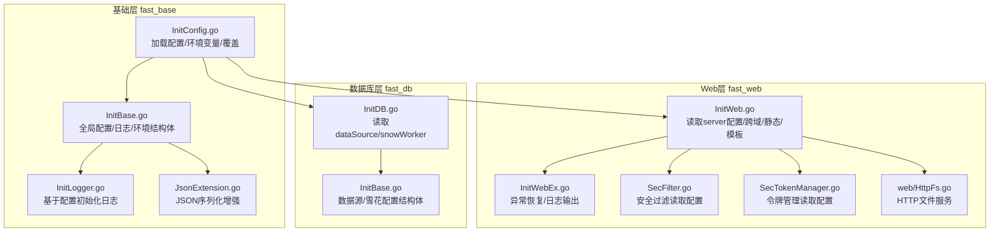
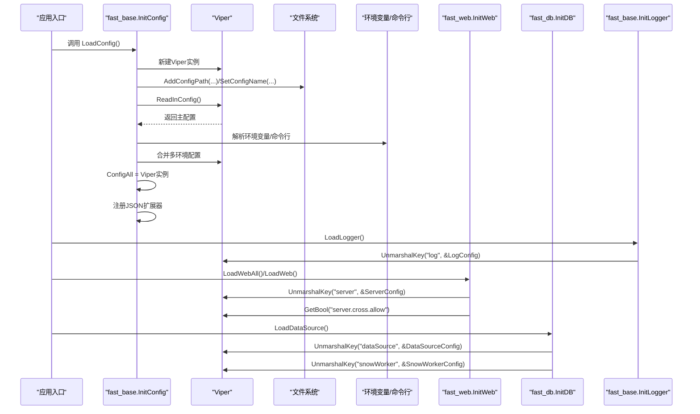
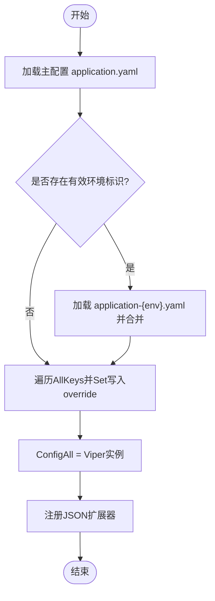
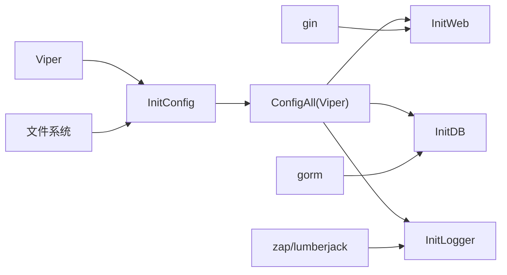

# 配置管理 API

<cite>
**本文引用的文件列表**
- [fast_base/InitConfig.go](file://fast_base/InitConfig.go)
- [fast_base/InitBase.go](file://fast_base/InitBase.go)
- [fast_base/InitLogger.go](file://fast_base/InitLogger.go)
- [fast_base/JsonExtension.go](file://fast_base/JsonExtension.go)
- [fast_web/InitWeb.go](file://fast_web/InitWeb.go)
- [fast_db/InitDB.go](file://fast_db/InitDB.go)
- [fast_web/InitWebEx.go](file://fast_web/InitWebEx.go)
- [fast_db/InitBase.go](file://fast_db/InitBase.go)
- [fast_web/SecFilter.go](file://fast_web/SecFilter.go)
- [fast_web/SecTokenManager.go](file://fast_web/SecTokenManager.go)
- [fast_web/web/HttpFs.go](file://fast_web/web/HttpFs.go)
- [fast_web/InitWebValidator.go](file://fast_web/InitWebValidator.go)
</cite>

## 目录
1. [简介](#简介)
2. [项目结构与定位](#项目结构与定位)
3. [核心组件总览](#核心组件总览)
4. [架构概览](#架构概览)
5. [详细组件分析](#详细组件分析)
6. [依赖关系分析](#依赖关系分析)
7. [性能与可靠性考量](#性能与可靠性考量)
8. [故障排查指南](#故障排查指南)
9. [结论](#结论)
10. [附录：配置项与最佳实践](#附录配置项与最佳实践)

## 简介
本文件为 Fast-Go 框架的“配置管理 API”提供权威参考，涵盖配置初始化、读取、设置与验证流程；重点说明 ConfigAll 全局配置对象的使用方法，LogConfig 与 EnvConfig 结构体的字段含义与默认值；解释配置文件加载顺序、环境变量覆盖机制；给出配置验证规则、错误处理策略以及热更新能力的现状与建议；并提供实际使用示例与最佳实践。

## 项目结构与定位
- 配置核心位于 fast_base 包，负责：
  - 配置初始化与加载（Viper + YAML）
  - 全局配置对象 ConfigAll 的创建与暴露
  - 日志配置结构体 LogConfig 的默认值与映射
  - 环境配置结构体 EnvConfig 的默认值与应用标识生成
- Web 层（fast_web）通过 ConfigAll 读取 server、跨域、静态资源、模板等配置
- 数据库层（fast_db）通过 ConfigAll 读取 dataSource、snowWorker 等配置
- JSON 扩展器（JsonExtension）增强序列化/反序列化行为，配合配置使用

图表来源
- [fast_base/InitConfig.go:1-108](file://fast_base/InitConfig.go#L1-L108)
- [fast_base/InitBase.go:1-50](file://fast_base/InitBase.go#L1-L50)
- [fast_base/InitLogger.go:1-44](file://fast_base/InitLogger.go#L1-L44)
- [fast_base/JsonExtension.go:1-346](file://fast_base/JsonExtension.go#L1-L346)
- [fast_web/InitWeb.go:1-200](file://fast_web/InitWeb.go#L1-L200)
- [fast_web/InitWebEx.go:178-209](file://fast_web/InitWebEx.go#L178-L209)
- [fast_web/SecFilter.go:23](file://fast_web/SecFilter.go#L23)
- [fast_web/SecTokenManager.go:161-200](file://fast_web/SecTokenManager.go#L161-L200)
- [fast_web/web/HttpFs.go:365-477](file://fast_web/web/HttpFs.go#L365-L477)
- [fast_db/InitDB.go:1-46](file://fast_db/InitDB.go#L1-L46)
- [fast_db/InitBase.go:1-38](file://fast_db/InitBase.go#L1-L38)

章节来源
- [fast_base/InitConfig.go:1-108](file://fast_base/InitConfig.go#L1-L108)
- [fast_base/InitBase.go:1-50](file://fast_base/InitBase.go#L1-L50)

## 核心组件总览
- 配置初始化与加载
  - 通过 Viper 从多个路径加载 YAML 配置文件，支持主配置与多环境配置叠加
  - 支持命令行参数、环境变量、配置文件、默认值的优先级覆盖
- 全局配置对象 ConfigAll
  - 类型为 Viper 实例，提供统一的键值读取与结构体映射能力
- 日志配置结构体 LogConfig
  - 默认值覆盖：日志级别、输出格式、文件路径、文件名、滚动大小、备份数、保留天数、压缩、控制台输出、颜色
- 环境配置结构体 EnvConfig
  - 默认值覆盖：环境标识、应用名；提供应用标识生成方法

章节来源
- [fast_base/InitConfig.go:21-50](file://fast_base/InitConfig.go#L21-L50)
- [fast_base/InitBase.go:13-49](file://fast_base/InitBase.go#L13-L49)

## 架构概览
下图展示配置加载与使用的端到端流程，包括配置文件查找、环境变量覆盖、结构体映射以及各子系统的使用点。

图表来源
- [fast_base/InitConfig.go:21-50](file://fast_base/InitConfig.go#L21-L50)
- [fast_base/InitLogger.go:15-44](file://fast_base/InitLogger.go#L15-L44)
- [fast_web/InitWeb.go:42-97](file://fast_web/InitWeb.go#L42-L97)
- [fast_db/InitDB.go:18-34](file://fast_db/InitDB.go#L18-L34)

## 详细组件分析

### 配置初始化与加载流程（LoadConfig）
- 主配置加载
  - 通过 Viper 从多个路径搜索 application.yaml，支持 conf、根目录、可执行文件所在目录及其 conf/bin/conf 子目录
- 环境配置叠加
  - 通过 getEnv 解析环境标识（命令行 > 环境变量 > 配置文件默认值 > 默认），若存在则加载 application-{env}.yaml 并与主配置合并
- 覆盖与优先级
  - 通过遍历 AllKeys 并 Set 写入 override，确保后续环境变量合并生效
- JSON 扩展器注册
  - 在配置加载完成后注册 JsonExtension，增强 JSON 序列化/反序列化行为

图表来源
- [fast_base/InitConfig.go:21-50](file://fast_base/InitConfig.go#L21-L50)

章节来源
- [fast_base/InitConfig.go:21-50](file://fast_base/InitConfig.go#L21-L50)
- [fast_base/InitConfig.go:52-63](file://fast_base/InitConfig.go#L52-L63)
- [fast_base/InitConfig.go:65-87](file://fast_base/InitConfig.go#L65-L87)

### 环境变量与命令行覆盖机制
- 命令行参数
  - 通过 flag 定义 -env 参数，优先级最高
- 环境变量
  - 读取 GO_ENV 环境变量，次之
- 配置文件默认值
  - 若上述两者均未设置，则读取配置文件中的 env 字段
- 默认值兜底
  - 若仍为空，则使用传入的默认值

章节来源
- [fast_base/InitConfig.go:65-87](file://fast_base/InitConfig.go#L65-L87)

### 全局配置对象 ConfigAll 的使用方法
- 类型与作用
  - ConfigAll 是 Viper 实例，提供统一的键值读取、布尔/整数/字符串读取以及结构体映射能力
- 常见用法
  - 读取结构体：ConfigAll.UnmarshalKey("key", &struct)
  - 读取布尔/字符串/整数：GetBool/GetString/GetInt
  - 读取嵌套键：例如 "server.cross.allow"
- 使用示例（路径）
  - Web 层读取 server 配置与跨域开关：[fast_web/InitWeb.go:50-72](file://fast_web/InitWeb.go#L50-L72)
  - 数据库层读取 dataSource 与 snowWorker：[fast_db/InitDB.go:20-22](file://fast_db/InitDB.go#L20-L22)
  - 日志层读取 log 配置：[fast_base/InitLogger.go:17-18](file://fast_base/InitLogger.go#L17-L18)

章节来源
- [fast_base/InitBase.go:13-14](file://fast_base/InitBase.go#L13-L14)
- [fast_web/InitWeb.go:50-72](file://fast_web/InitWeb.go#L50-L72)
- [fast_db/InitDB.go:20-22](file://fast_db/InitDB.go#L20-L22)
- [fast_base/InitLogger.go:17-18](file://fast_base/InitLogger.go#L17-L18)

### 日志配置结构体 LogConfig 字段与默认值
- 字段说明
  - Level：日志级别（debug/info/warn/error）
  - Format：输出格式（logFormat/json）
  - Path：日志文件路径
  - FileName：日志文件名
  - FileMaxSize：单文件最大大小（MB）
  - FileMaxBackups：日志备份数量
  - MaxAge：日志保留天数
  - Compress：是否压缩
  - Stdout：是否输出到控制台
  - Color：是否启用颜色输出
- 默认值
  - Level: "info"
  - Format: 空字符串
  - Path: 可执行文件所在目录 + "/logs/"
  - FileName: "fast.log"
  - FileMaxSize: 10
  - FileMaxBackups: 100
  - MaxAge: 30
  - Compress: true
  - Stdout: true
  - Color: true
- 映射关系
  - Level 到 zapcore.Level 的映射：debug/info/warn/error 对应 zapcore 的对应级别

章节来源
- [fast_base/InitBase.go:16-40](file://fast_base/InitBase.go#L16-L40)

### 环境配置结构体 EnvConfig 字段与默认值
- 字段说明
  - Env：环境标识（如 dev/test/prod）
  - Name：应用名
- 默认值
  - Env: "dev"
  - Name: "tpl"
- 应用标识生成
  - GetApplicationId 返回 Name_env 组合的应用标识

章节来源
- [fast_base/InitBase.go:19-49](file://fast_base/InitBase.go#L19-L49)

### 配置验证规则与错误处理
- 配置读取与映射
  - 通过 UnmarshalKey 将配置映射到结构体，若字段缺失或类型不匹配，将采用结构体默认值或零值
- 日志级别映射
  - 若配置的 Level 不在映射表中，将回退到 "info"
- Web 层配置读取
  - 通过 GetBool 读取布尔配置，若键不存在或类型不符，返回 false
- 错误处理与恢复
  - Web 异常恢复中间件捕获 panic，记录请求头（敏感头如 Authorization 已脱敏），区分断开连接与普通异常
- JSON 扩展器容错
  - 反序列化时对字符串与数字互转、空数组作为对象等进行容错处理

章节来源
- [fast_base/InitLogger.go:26-29](file://fast_base/InitLogger.go#L26-L29)
- [fast_web/InitWeb.go:67-72](file://fast_web/InitWeb.go#L67-L72)
- [fast_web/InitWebEx.go:178-209](file://fast_web/InitWebEx.go#L178-L209)
- [fast_base/JsonExtension.go:124-204](file://fast_base/JsonExtension.go#L124-L204)

### 配置热更新支持现状与建议
- 现状
  - 当前配置加载在应用启动阶段一次性完成，未发现内置的热重载监听机制
- 建议
  - 若需热更新，可在业务侧引入文件监控（如 fsnotify）或外部配置中心（如 etcd），在检测到变更后重新加载 Viper 配置并触发相应模块的刷新逻辑
  - 对于日志配置，可考虑在运行期动态调整日志级别（需结合具体日志库能力）

章节来源
- [fast_base/InitConfig.go:21-50](file://fast_base/InitConfig.go#L21-L50)

### 配置使用示例与最佳实践
- 示例一：Web 服务器配置
  - 读取 server 配置并设置跨域、静态资源与模板
  - 参考路径：[fast_web/InitWeb.go:50-97](file://fast_web/InitWeb.go#L50-L97)
- 示例二：数据库配置
  - 读取 dataSource 与 snowWorker 配置，按需启用数据库与雪花算法
  - 参考路径：[fast_db/InitDB.go:20-34](file://fast_db/InitDB.go#L20-L34)
- 示例三：日志配置
  - 读取 log 配置并初始化日志器
  - 参考路径：[fast_base/InitLogger.go:17-44](file://fast_base/InitLogger.go#L17-L44)
- 示例四：安全过滤与令牌管理
  - 读取 server.password 等配置用于安全过滤与令牌管理
  - 参考路径：[fast_web/SecFilter.go:23](file://fast_web/SecFilter.go#L23)、[fast_web/SecTokenManager.go:161-200](file://fast_web/SecTokenManager.go#L161-L200)
- 最佳实践
  - 将关键配置集中在一个 YAML 中，按环境拆分文件，避免分散配置
  - 使用命令行参数快速切换环境，便于容器化部署
  - 对外暴露的敏感配置通过环境变量注入，避免硬编码
  - 在生产环境开启日志压缩与合理的保留周期，平衡磁盘占用与审计需求

章节来源
- [fast_web/InitWeb.go:50-97](file://fast_web/InitWeb.go#L50-L97)
- [fast_db/InitDB.go:20-34](file://fast_db/InitDB.go#L20-L34)
- [fast_base/InitLogger.go:17-44](file://fast_base/InitLogger.go#L17-L44)
- [fast_web/SecFilter.go:23](file://fast_web/SecFilter.go#L23)
- [fast_web/SecTokenManager.go:161-200](file://fast_web/SecTokenManager.go#L161-L200)

## 依赖关系分析
- 配置加载依赖
  - fast_base.InitConfig 依赖 Viper 与 YAML 文件系统
  - fast_base.InitLogger 依赖 zap 与 lumberjack
  - fast_web.InitWeb 依赖 gin 与 fast_base.ConfigAll
  - fast_db.InitDB 依赖 gorm 与 fast_base.ConfigAll
- 配置消费依赖
  - Web 层通过 ConfigAll 读取 server、cross、static、template 等配置
  - 数据库层通过 ConfigAll 读取 dataSource、snowWorker 等配置
  - 日志层通过 ConfigAll 读取 log 配置

图表来源
- [fast_base/InitConfig.go:1-108](file://fast_base/InitConfig.go#L1-L108)
- [fast_web/InitWeb.go:1-200](file://fast_web/InitWeb.go#L1-L200)
- [fast_db/InitDB.go:1-46](file://fast_db/InitDB.go#L1-L46)
- [fast_base/InitLogger.go:1-44](file://fast_base/InitLogger.go#L1-L44)

章节来源
- [fast_base/InitConfig.go:1-108](file://fast_base/InitConfig.go#L1-L108)
- [fast_web/InitWeb.go:1-200](file://fast_web/InitWeb.go#L1-L200)
- [fast_db/InitDB.go:1-46](file://fast_db/InitDB.go#L1-L46)
- [fast_base/InitLogger.go:1-44](file://fast_base/InitLogger.go#L1-L44)

## 性能与可靠性考量
- 配置加载性能
  - Viper 仅在启动阶段加载一次，避免频繁 IO
  - 合理设置配置文件路径，减少不必要的搜索
- 日志性能
  - 合理设置 FileMaxSize、FileMaxBackups、MaxAge，避免过多滚动文件导致 IO 压力
  - 控制日志级别，生产环境建议使用 info 或更高
- 可靠性
  - 对于关键配置（如数据库连接、跨域开关），建议在启动阶段进行显式校验与错误提示
  - 对外敏感配置通过环境变量注入，避免明文写入配置文件

[本节为通用建议，无需特定文件引用]

## 故障排查指南
- 配置未生效
  - 检查配置文件路径是否正确，确认 application.yaml 与 application-{env}.yaml 是否存在
  - 确认命令行参数 -env 与环境变量 GO_ENV 是否设置正确
- 日志不输出或异常
  - 检查 LogConfig 的 Path/FileName/Level/Color 等字段是否合理
  - 确认日志目录权限与磁盘空间
- Web 跨域或静态资源异常
  - 检查 server.cross.allow 与 server.static 配置
  - 确认静态资源路径中 ${execPath} 是否被正确替换
- 数据库连接失败
  - 检查 dataSource.host/port/database/username/password/params 等字段
  - 确认数据库服务可达与网络策略允许

章节来源
- [fast_base/InitConfig.go:52-63](file://fast_base/InitConfig.go#L52-L63)
- [fast_base/InitLogger.go:17-44](file://fast_base/InitLogger.go#L17-L44)
- [fast_web/InitWeb.go:67-97](file://fast_web/InitWeb.go#L67-L97)
- [fast_db/InitDB.go:31-46](file://fast_db/InitDB.go#L31-L46)

## 结论
Fast-Go 的配置管理以 Viper 为核心，提供了清晰的配置加载、环境覆盖与结构体映射能力。通过 ConfigAll 统一访问，Web 与数据库模块能够便捷地读取各自所需的配置。建议在生产环境中结合命令行与环境变量进行灵活切换，并对关键配置进行显式校验与错误提示，以提升系统的稳定性与可观测性。

[本节为总结，无需特定文件引用]

## 附录：配置项与最佳实践

### 配置项清单与默认值
- 全局配置对象
  - 类型：Viper 实例
  - 用途：统一读取键值与结构体映射
- 日志配置（LogConfig）
  - Level: "info"
  - Format: 空字符串
  - Path: 可执行文件所在目录 + "/logs/"
  - FileName: "fast.log"
  - FileMaxSize: 10
  - FileMaxBackups: 100
  - MaxAge: 30
  - Compress: true
  - Stdout: true
  - Color: true
- 环境配置（EnvConfig）
  - Env: "dev"
  - Name: "tpl"
  - 应用标识：Name_env

章节来源
- [fast_base/InitBase.go:16-49](file://fast_base/InitBase.go#L16-L49)

### 配置加载与覆盖优先级
- 优先级（从高到低）
  - 显式 Set 值
  - 命令行参数（-env）
  - 环境变量（GO_ENV）
  - 配置文件（application.yaml / application-{env}.yaml）
  - 默认值

章节来源
- [fast_base/InitConfig.go:13-19](file://fast_base/InitConfig.go#L13-L19)
- [fast_base/InitConfig.go:65-87](file://fast_base/InitConfig.go#L65-L87)

### 配置验证与错误处理要点
- 结构体映射
  - 通过 UnmarshalKey 映射，字段缺失或类型不匹配采用默认值或零值
- 日志级别映射
  - 不在映射表中的 Level 回退到 "info"
- Web 配置读取
  - GetBool 返回 false 时需显式处理
- 异常恢复
  - Web 中间件捕获 panic，记录请求头并区分断开连接与普通异常

章节来源
- [fast_base/InitLogger.go:26-29](file://fast_base/InitLogger.go#L26-L29)
- [fast_web/InitWeb.go:67-72](file://fast_web/InitWeb.go#L67-L72)
- [fast_web/InitWebEx.go:178-209](file://fast_web/InitWebEx.go#L178-L209)

### 热更新建议
- 当前未内置热重载机制
- 建议引入文件监控或外部配置中心，在变更后重新加载并触发模块刷新

章节来源
- [fast_base/InitConfig.go:21-50](file://fast_base/InitConfig.go#L21-L50)