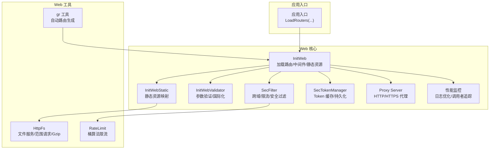
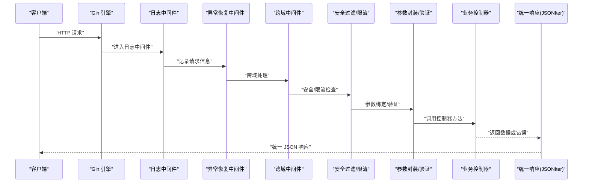
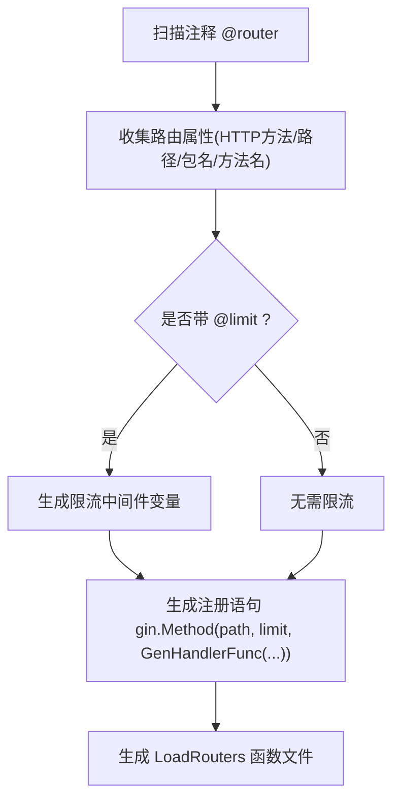
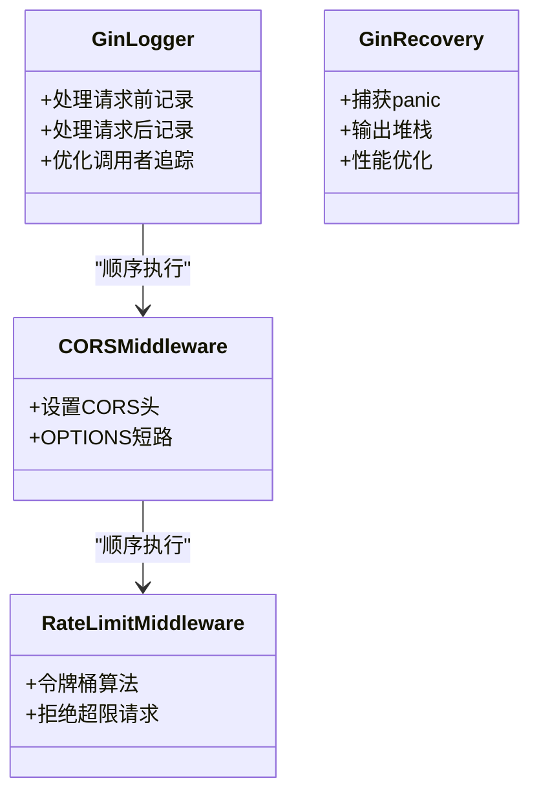
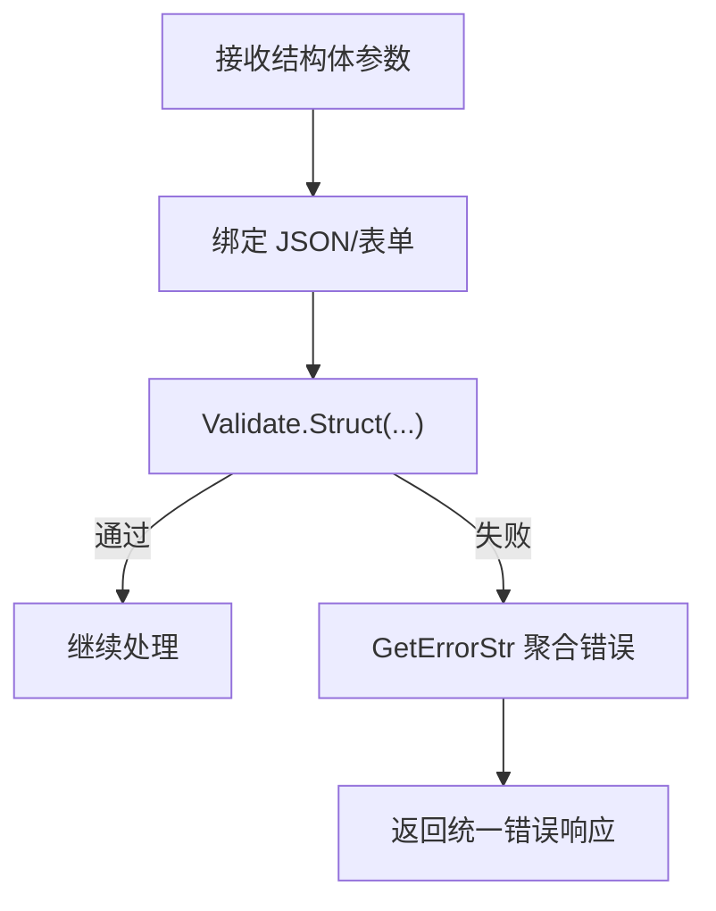
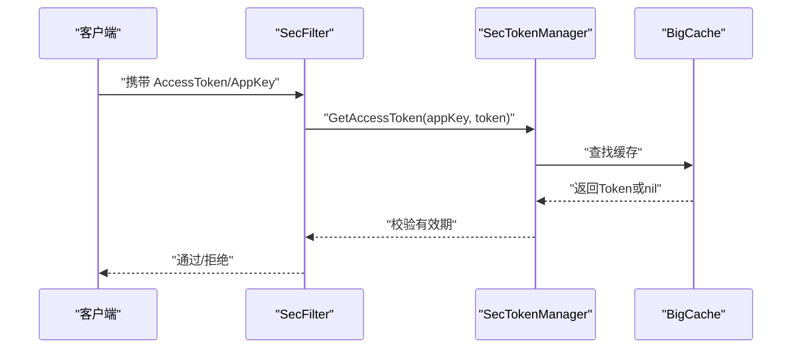
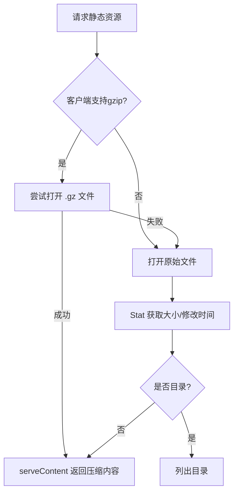
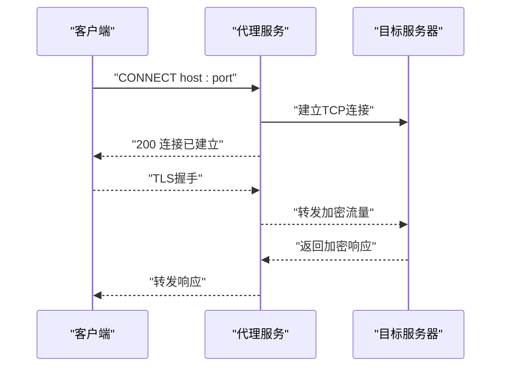
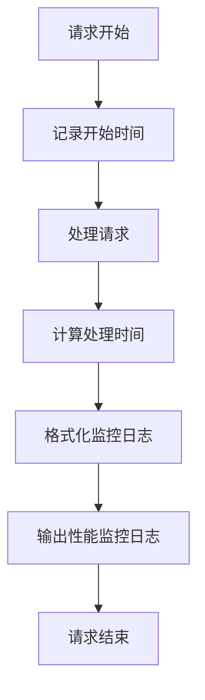
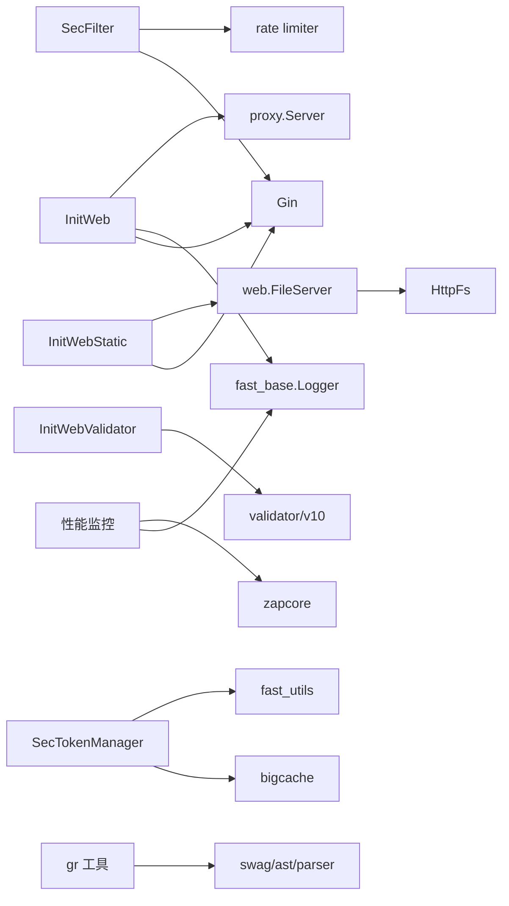

# Web 服务开发

<cite>
**本文引用的文件**
- [Readme.md](file://Readme.md)
- [InitWeb.go](file://fast_web/InitWeb.go)
- [SecFilter.go](file://fast_web/SecFilter.go)
- [InitWebValidator.go](file://fast_web/InitWebValidator.go)
- [InitWebStatic.go](file://fast_web/InitWebStatic.go)
- [HttpFs.go](file://fast_web/web/HttpFs.go)
- [RateLimit.go](file://fast_web/web/RateLimit.go)
- [SecTokenManager.go](file://fast_web/SecTokenManager.go)
- [Server.go](file://fast_web/web/proxy/Server.go)
- [InitBase.go](file://fast_web/InitBase.go)
- [InitWebEx.go](file://fast_web/InitWebEx.go)
- [gr.go](file://fast_wgen/gr.go)
- [InitLogger.go](file://fast_base/InitLogger.go)
- [Model.go](file://fast_base/Model.go)
- [InitDB.go](file://fast_db/InitDB.go)
</cite>

## 更新摘要
**变更内容**
- 增强性能监控能力，优化请求处理时间计算逻辑
- 提升日志记录效率，改进调用者信息追踪机制
- 优化日志格式化和输出性能
- 增强异常恢复中间件的性能表现

## 目录
1. [简介](#简介)
2. [项目结构](#项目结构)
3. [核心组件](#核心组件)
4. [架构总览](#架构总览)
5. [详细组件分析](#详细组件分析)
6. [依赖关系分析](#依赖关系分析)
7. [性能考量](#性能考量)
8. [故障排查指南](#故障排查指南)
9. [结论](#结论)
10. [附录](#附录)

## 简介
本文件面向使用 Fast-Go Web 框架进行服务开发的工程师，系统性讲解基于 Gin 的 Web 服务架构与实现细节，覆盖：
- 路由系统与自动路由生成
- 中间件机制（日志、异常恢复、跨域、限流、安全过滤）
- 参数验证与国际化错误消息
- 安全过滤器与 Token 管理
- 静态资源服务、文件上传下载、Gzip 压缩
- 性能监控与日志优化
- 完整的 Web 服务开发流程（从控制器编写到 API 发布）

## 项目结构
Fast-Go 将 Web 层拆分为多个子模块：
- fast_web：Web 服务核心，包含路由、中间件、静态资源、安全过滤、Token 管理、代理等
- fast_wgen：自动路由生成工具，基于注释解析生成 LoadRouters 函数
- fast_base/fast_db/fast_utils：基础能力（配置、日志、数据库、通用工具）

**图表来源**
- [InitWeb.go:42-111](file://fast_web/InitWeb.go#L42-L111)
- [SecFilter.go:11-129](file://fast_web/SecFilter.go#L11-L129)
- [InitWebValidator.go:67-87](file://fast_web/InitWebValidator.go#L67-L87)
- [InitWebStatic.go:12-27](file://fast_web/InitWebStatic.go#L12-L27)
- [HttpFs.go:624-713](file://fast_web/web/HttpFs.go#L624-L713)
- [RateLimit.go:42-165](file://fast_web/web/RateLimit.go#L42-L165)
- [SecTokenManager.go:90-112](file://fast_web/SecTokenManager.go#L90-L112)
- [Server.go:30-73](file://fast_web/web/proxy/Server.go#L30-L73)
- [gr.go:50-135](file://fast_wgen/gr.go#L50-L135)
- [InitWebEx.go:52-163](file://fast_web/InitWebEx.go#L52-L163)

**章节来源**
- [InitWeb.go:42-111](file://fast_web/InitWeb.go#L42-L111)
- [InitWebStatic.go:12-27](file://fast_web/InitWebStatic.go#L12-L27)
- [SecFilter.go:11-129](file://fast_web/SecFilter.go#L11-L129)
- [InitWebValidator.go:67-87](file://fast_web/InitWebValidator.go#L67-L87)
- [HttpFs.go:624-713](file://fast_web/web/HttpFs.go#L624-L713)
- [RateLimit.go:42-165](file://fast_web/web/RateLimit.go#L42-L165)
- [SecTokenManager.go:90-112](file://fast_web/SecTokenManager.go#L90-L112)
- [Server.go:30-73](file://fast_web/web/proxy/Server.go#L30-L73)
- [gr.go:50-135](file://fast_wgen/gr.go#L50-L135)

## 核心组件
- 服务器容器与路由加载：通过 Server 结构持有 gin.Engine，提供 LoadRouters、Run、RunAsService、Shutdown 等能力
- 自动路由生成：gr 工具解析注释生成 LoadRouters，支持限流中间件注入
- 中间件体系：日志、异常恢复、跨域、限流、安全过滤
- 参数验证：基于 validator/v10，支持自定义标签与国际化
- 安全过滤：Token 校验、密码校验、CORS、限流
- 静态资源：Gzip 压缩、范围请求、缓存控制、目录浏览
- 代理服务：HTTP/HTTPS 正向代理，可选自签证书
- **性能监控**：优化的请求处理时间计算、高效的日志记录机制

**章节来源**
- [InitWeb.go:117-131](file://fast_web/InitWeb.go#L117-L131)
- [InitWeb.go:122-184](file://fast_web/InitWeb.go#L122-L184)
- [InitWeb.go:340-367](file://fast_web/InitWeb.go#L340-L367)
- [gr.go:50-135](file://fast_wgen/gr.go#L50-L135)
- [InitWebEx.go:52-109](file://fast_web/InitWebEx.go#L52-L109)
- [SecFilter.go:11-129](file://fast_web/SecFilter.go#L11-L129)
- [InitWebValidator.go:67-87](file://fast_web/InitWebValidator.go#L67-L87)
- [InitWebStatic.go:12-27](file://fast_web/InitWebStatic.go#L12-L27)
- [HttpFs.go:624-713](file://fast_web/web/HttpFs.go#L624-L713)
- [Server.go:30-73](file://fast_web/web/proxy/Server.go#L30-L73)

## 架构总览
下面的序列图展示了请求从进入 Web 层到响应返回的完整链路，以及各中间件与组件的协作关系。

**图表来源**
- [InitWebEx.go:52-109](file://fast_web/InitWebEx.go#L52-L109)
- [SecFilter.go:11-129](file://fast_web/SecFilter.go#L11-L129)
- [InitWeb.go:198-338](file://fast_web/InitWeb.go#L198-L338)

**章节来源**
- [InitWebEx.go:52-109](file://fast_web/InitWebEx.go#L52-L109)
- [SecFilter.go:11-129](file://fast_web/SecFilter.go#L11-L129)
- [InitWeb.go:198-338](file://fast_web/InitWeb.go#L198-L338)

## 详细组件分析

### 路由系统与自动路由生成
- 手动路由：通过 Server.LoadRouter 或 LoadRouters 注册，支持反射封装处理器，自动参数绑定、验证与统一响应
- 自动路由：gr 工具扫描注释 @router，生成 LoadRouters 函数；可按 @limit 注释注入限流中间件
- 路由封装：HandlerFuncWrapper 支持结构体参数、JSON/表单绑定、验证、返回值统一处理

**图表来源**
- [gr.go:50-135](file://fast_wgen/gr.go#L50-L135)
- [gr.go:384-450](file://fast_wgen/gr.go#L384-L450)

**章节来源**
- [InitWeb.go:134-184](file://fast_web/InitWeb.go#L134-L184)
- [InitWeb.go:186-196](file://fast_web/InitWeb.go#L186-L196)
- [InitWeb.go:198-338](file://fast_web/InitWeb.go#L198-L338)
- [gr.go:50-135](file://fast_wgen/gr.go#L50-L135)

### 中间件机制
- 日志中间件：格式化请求日志，支持彩色输出与级别控制，**优化了调用者追踪机制**
- 异常恢复中间件：捕获 panic 并输出堆栈，避免服务崩溃，**改进了性能表现**
- 跨域中间件：设置标准 CORS 头，OPTIONS 预检短路
- 限流中间件：基于令牌桶算法，支持按路径前缀匹配

**图表来源**
- [InitWebEx.go:52-109](file://fast_web/InitWebEx.go#L52-L109)
- [InitWebEx.go:150-224](file://fast_web/InitWebEx.go#L150-L224)
- [SecFilter.go:115-129](file://fast_web/SecFilter.go#L115-L129)
- [SecFilter.go:87-100](file://fast_web/SecFilter.go#L87-L100)

**章节来源**
- [InitWebEx.go:52-109](file://fast_web/InitWebEx.go#L52-L109)
- [InitWebEx.go:150-224](file://fast_web/InitWebEx.go#L150-L224)
- [SecFilter.go:115-129](file://fast_web/SecFilter.go#L115-L129)
- [SecFilter.go:87-100](file://fast_web/SecFilter.go#L87-L100)

### 参数验证与国际化
- 初始化：注册中文翻译器，注册 tag 名称函数，注册自定义验证器与翻译
- 错误处理：将 validator 的 ValidationErrors 转换为可读字符串，支持自定义字段错误消息
- 自定义规则：示例包含 password 规则（大小写+数字+长度），可扩展更多规则

**图表来源**
- [InitWeb.go:243-247](file://fast_web/InitWeb.go#L243-L247)
- [InitWebValidator.go:31-49](file://fast_web/InitWebValidator.go#L31-L49)
- [InitWebValidator.go:67-87](file://fast_web/InitWebValidator.go#L67-L87)

**章节来源**
- [InitWebValidator.go:22-29](file://fast_web/InitWebValidator.go#L22-L29)
- [InitWebValidator.go:31-49](file://fast_web/InitWebValidator.go#L31-L49)
- [InitWebValidator.go:67-87](file://fast_web/InitWebValidator.go#L67-L87)
- [InitWeb.go:243-247](file://fast_web/InitWeb.go#L243-L247)

### 安全过滤与 Token 管理
- 密码模式：通过查询参数 tt 校验，适合简单场景
- Token 模式：从请求头 AccessToken/AppKey 读取并校验，通过 SecTokenManager 校验有效期
- Token 管理：基于 bigcache 内存缓存，支持持久化到文件，定时刷盘；提供创建、刷新、清理用户历史 Token

**图表来源**
- [SecFilter.go:40-81](file://fast_web/SecFilter.go#L40-L81)
- [SecTokenManager.go:191-215](file://fast_web/SecTokenManager.go#L191-L215)
- [SecTokenManager.go:90-112](file://fast_web/SecTokenManager.go#L90-L112)

**章节来源**
- [SecFilter.go:18-37](file://fast_web/SecFilter.go#L18-L37)
- [SecFilter.go:40-81](file://fast_web/SecFilter.go#L40-L81)
- [SecTokenManager.go:90-112](file://fast_web/SecTokenManager.go#L90-L112)
- [SecTokenManager.go:191-215](file://fast_web/SecTokenManager.go#L191-L215)

### 静态资源服务、文件上传下载与 Gzip 压缩
- 静态资源映射：支持多模式路径与根目录替换，StripPrefix 后交由 FileServer 处理
- 文件服务：支持目录浏览、范围请求、条件请求（If-Modified-Since/If-None-Match）、Last-Modified、ETag
- Gzip 压缩：优先返回 .gz 文件，设置 Content-Encoding 与 Vary 头，支持 Range 多段传输

**图表来源**
- [InitWebStatic.go:29-58](file://fast_web/InitWebStatic.go#L29-L58)
- [HttpFs.go:624-713](file://fast_web/web/HttpFs.go#L624-L713)
- [HttpFs.go:252-376](file://fast_web/web/HttpFs.go#L252-L376)

**章节来源**
- [InitWebStatic.go:12-27](file://fast_web/InitWebStatic.go#L12-L27)
- [InitWebStatic.go:29-58](file://fast_web/InitWebStatic.go#L29-L58)
- [HttpFs.go:624-713](file://fast_web/web/HttpFs.go#L624-L713)
- [HttpFs.go:252-376](file://fast_web/web/HttpFs.go#L252-L376)

### 代理服务（HTTP/HTTPS）
- 支持 HTTP 正向代理与 HTTPS CONNECT 劫持
- 可选启用 TLS，自动生成证书
- 通过 Hijack 实现双向转发

**图表来源**
- [Server.go:75-96](file://fast_web/web/proxy/Server.go#L75-L96)
- [Server.go:98-110](file://fast_web/web/proxy/Server.go#L98-L110)

**章节来源**
- [Server.go:30-73](file://fast_web/web/proxy/Server.go#L30-L73)
- [Server.go:75-96](file://fast_web/web/proxy/Server.go#L75-L96)
- [Server.go:98-110](file://fast_web/web/proxy/Server.go#L98-L110)

### 性能监控与日志优化
- **优化的请求处理时间计算**：采用精确的时间戳记录和 Truncate 方法，支持分钟级以上的请求处理时间显示
- **高效的日志记录机制**：通过 LogWriter 结构体优化日志输出，减少不必要的格式化操作
- **智能调用者追踪**：findGinCaller 函数优化了调用栈追踪，避免调试信息干扰
- **性能监控日志格式**：统一的 "[Monitor]" 前缀格式，便于日志分析和性能监控

**图表来源**
- [InitWebEx.go:61-109](file://fast_web/InitWebEx.go#L61-L109)
- [InitWebEx.go:112-147](file://fast_web/InitWebEx.go#L112-L147)
- [InitWebEx.go:39-50](file://fast_web/InitWebEx.go#L39-L50)

**章节来源**
- [InitWebEx.go:61-109](file://fast_web/InitWebEx.go#L61-L109)
- [InitWebEx.go:112-147](file://fast_web/InitWebEx.go#L112-L147)
- [InitWebEx.go:39-50](file://fast_web/InitWebEx.go#L39-L50)

## 依赖关系分析
- InitWeb 依赖 Gin、fast_base、fast_web/web/proxy
- SecFilter 依赖 Gin、x/time/rate、fast_base
- InitWebValidator 依赖 validator/v10、locales/zh、universal-translator
- InitWebStatic 依赖 Gin、web.FileServer
- HttpFs 提供文件服务与范围请求
- SecTokenManager 依赖 bigcache、fast_base、fast_utils
- Proxy Server 依赖 net/http、crypto/tls
- gr 工具依赖 swag、go/ast、go/parser
- **性能监控**：InitWebEx 依赖 fast_base 的日志系统，提供优化的性能监控能力

**图表来源**
- [InitWeb.go:3-17](file://fast_web/InitWeb.go#L3-L17)
- [SecFilter.go:3-9](file://fast_web/SecFilter.go#L3-L9)
- [InitWebValidator.go:3-11](file://fast_web/InitWebValidator.go#L3-L11)
- [InitWebStatic.go:3-10](file://fast_web/InitWebStatic.go#L3-L10)
- [HttpFs.go:9-27](file://fast_web/web/HttpFs.go#L9-L27)
- [SecTokenManager.go:3-11](file://fast_web/SecTokenManager.go#L3-L11)
- [Server.go:3-17](file://fast_web/web/proxy/Server.go#L3-L17)
- [gr.go:3-18](file://fast_wgen/gr.go#L3-L18)
- [InitWebEx.go:1-19](file://fast_web/InitWebEx.go#L1-L19)

**章节来源**
- [InitWeb.go:3-17](file://fast_web/InitWeb.go#L3-L17)
- [SecFilter.go:3-9](file://fast_web/SecFilter.go#L3-L9)
- [InitWebValidator.go:3-11](file://fast_web/InitWebValidator.go#L3-L11)
- [InitWebStatic.go:3-10](file://fast_web/InitWebStatic.go#L3-L10)
- [HttpFs.go:9-27](file://fast_web/web/HttpFs.go#L9-L27)
- [SecTokenManager.go:3-11](file://fast_web/SecTokenManager.go#L3-L11)
- [Server.go:3-17](file://fast_web/web/proxy/Server.go#L3-L17)
- [gr.go:3-18](file://fast_wgen/gr.go#L3-L18)

## 性能考量
- 限流策略：优先使用令牌桶限流，针对关键接口按需开启；对高频接口可考虑更细粒度的限流策略
- 静态资源：启用 .gz 文件优先返回，减少带宽；合理设置缓存头与 Last-Modified
- 日志与异常：仅在必要级别输出日志，避免频繁格式化；异常恢复中间件避免重复序列化
- Token 管理：大并发场景下注意缓存命中率与持久化频率，避免磁盘抖动
- **性能监控**：优化的请求处理时间计算，支持分钟级以上的处理时间显示；高效的日志输出机制，减少性能开销
- **调用者追踪**：智能的调用栈追踪，避免调试信息干扰，提升日志分析效率

**章节来源**
- [InitWebEx.go:120-122](file://fast_web/InitWebEx.go#L120-L122)
- [InitWebEx.go:25-37](file://fast_web/InitWebEx.go#L25-L37)
- [InitWebEx.go:39-50](file://fast_web/InitWebEx.go#L39-L50)

## 故障排查指南
- 路由未生效：确认是否使用 gr 自动生成 LoadRouters，或手动调用 LoadRouters
- 参数验证失败：检查结构体标签与国际化翻译是否正确，关注 GetErrorStr 返回的聚合错误
- 跨域问题：核对 CORS 头设置与 OPTIONS 预检是否被拦截
- 静态资源 404：确认静态路径映射与根目录替换是否正确，路径中是否包含非法字符
- 代理异常：检查代理端口配置与 TLS 证书生成是否成功
- **性能监控异常**：检查日志级别配置，确认 "[Monitor]" 前缀的日志是否正常输出
- **日志格式问题**：确认调用者追踪是否正确，检查 findGinCaller 函数的调用栈

**章节来源**
- [Readme.md:1-67](file://Readme.md#L1-L67)
- [InitWeb.go:122-184](file://fast_web/InitWeb.go#L122-L184)
- [InitWebValidator.go:31-49](file://fast_web/InitWebValidator.go#L31-L49)
- [SecFilter.go:115-129](file://fast_web/SecFilter.go#L115-L129)
- [InitWebStatic.go:12-27](file://fast_web/InitWebStatic.go#L12-L27)
- [Server.go:30-73](file://fast_web/web/proxy/Server.go#L30-L73)

## 结论
Fast-Go Web 层以 Gin 为核心，结合自动路由生成、参数验证、安全过滤与静态资源服务，提供了开箱即用的 Web 开发体验。通过合理的中间件组合与配置，可在保证安全性的同时获得良好的性能与可观测性。**新增的性能监控能力进一步提升了系统的可观测性和运维效率**。建议在生产环境中：
- 使用 gr 自动生成路由并按需注入限流
- 配置 CORS 与 Token 校验
- 启用 Gzip 与缓存头优化静态资源
- 结合日志与异常恢复中间件提升可观测性
- **充分利用性能监控功能，优化请求处理时间计算和日志记录效率**

## 附录

### Web 服务开发流程（从控制器编写到 API 发布）
- 编写控制器方法并在注释中声明路由与限流
- 使用 gr 工具生成 LoadRouters 文件
- 在应用入口加载路由与中间件
- 配置静态资源与模板
- 启动服务并发布

**章节来源**
- [gr.go:50-135](file://fast_wgen/gr.go#L50-L135)
- [InitWeb.go:42-111](file://fast_web/InitWeb.go#L42-L111)
- [InitWebStatic.go:12-27](file://fast_web/InitWebStatic.go#L12-L27)
- [Readme.md:1-67](file://Readme.md#L1-L67)

### 性能监控最佳实践
- **启用性能监控**：确保日志级别配置正确，能够输出 "[Monitor]" 前缀的日志
- **优化日志格式**：利用 Truncate 方法处理长时间请求，提升日志可读性
- **调用者追踪**：合理使用 findGinCaller 函数，避免调试信息干扰
- **监控指标分析**：重点关注请求处理时间和错误信息，及时发现性能瓶颈

**章节来源**
- [InitWebEx.go:112-147](file://fast_web/InitWebEx.go#L112-L147)
- [InitWebEx.go:39-50](file://fast_web/InitWebEx.go#L39-L50)
- [InitWebEx.go:120-122](file://fast_web/InitWebEx.go#L120-L122)