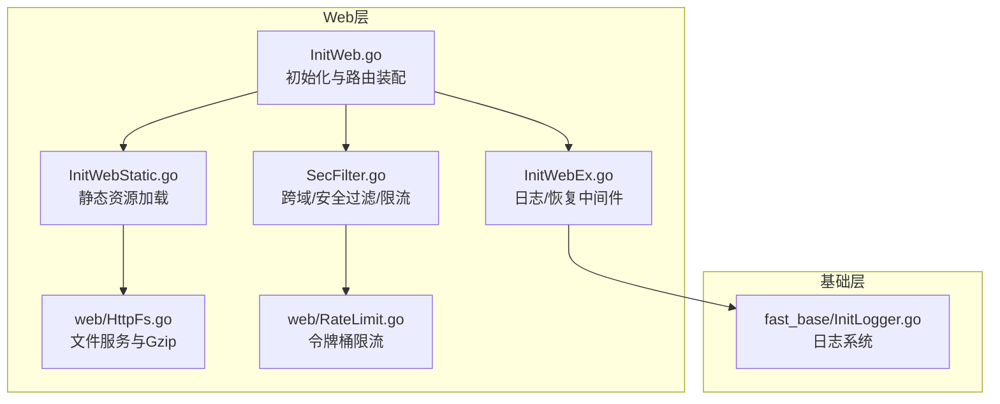
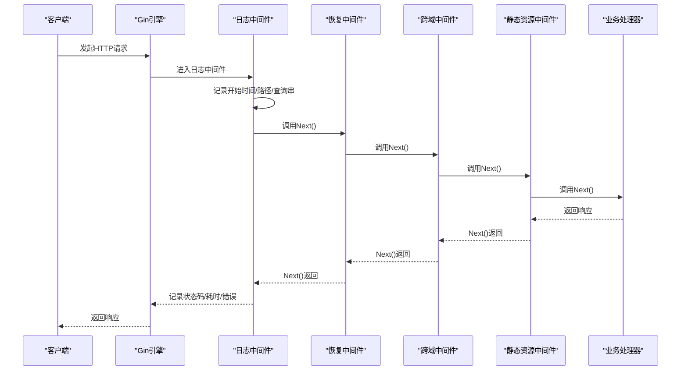
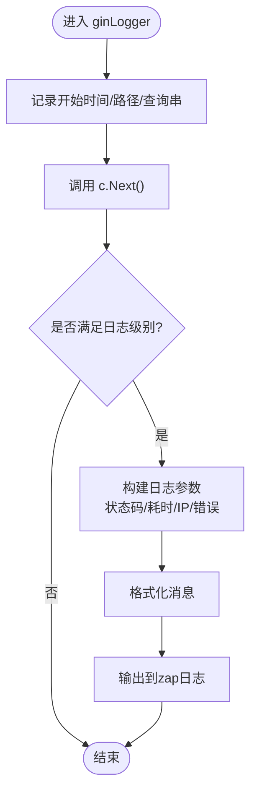
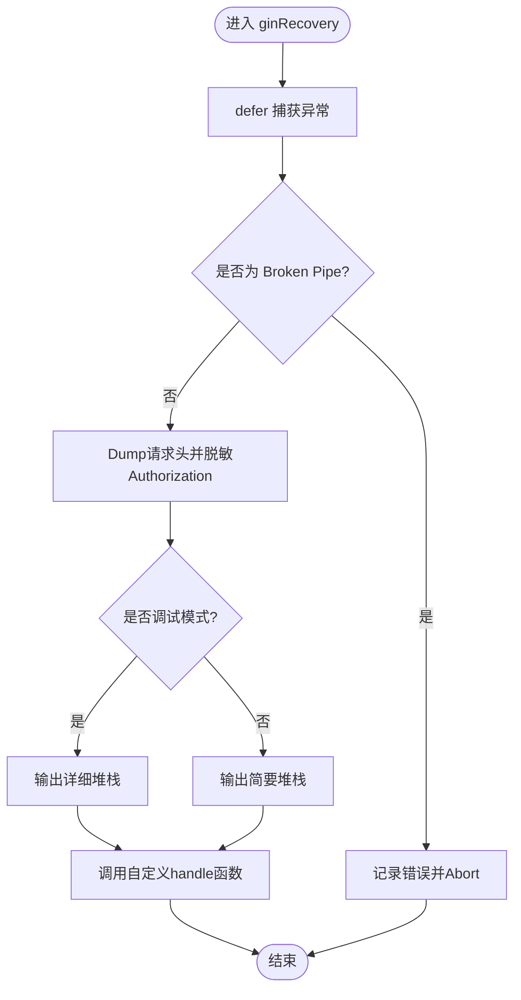
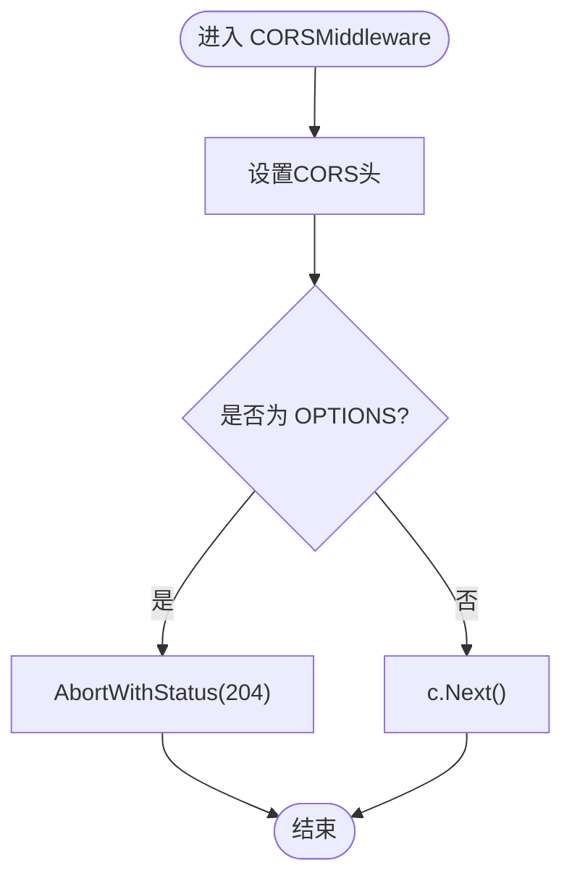
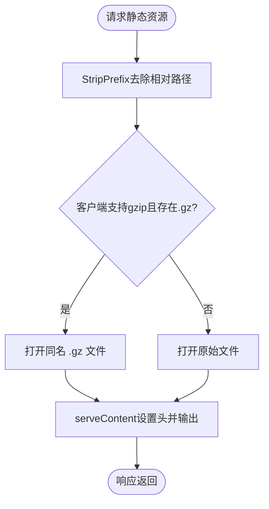
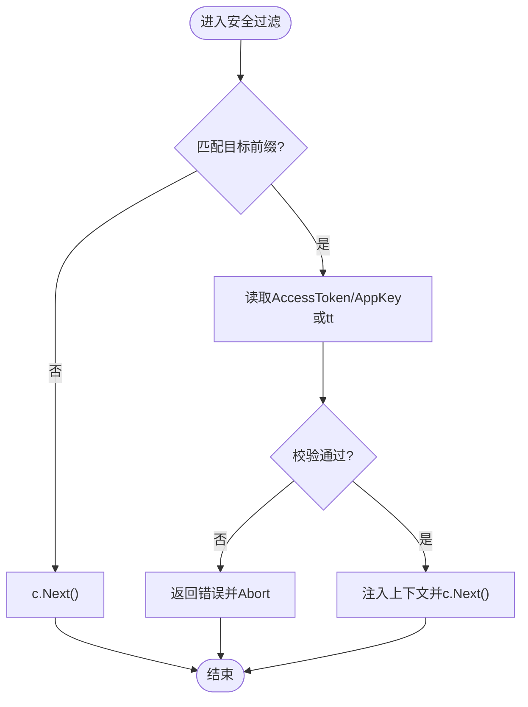
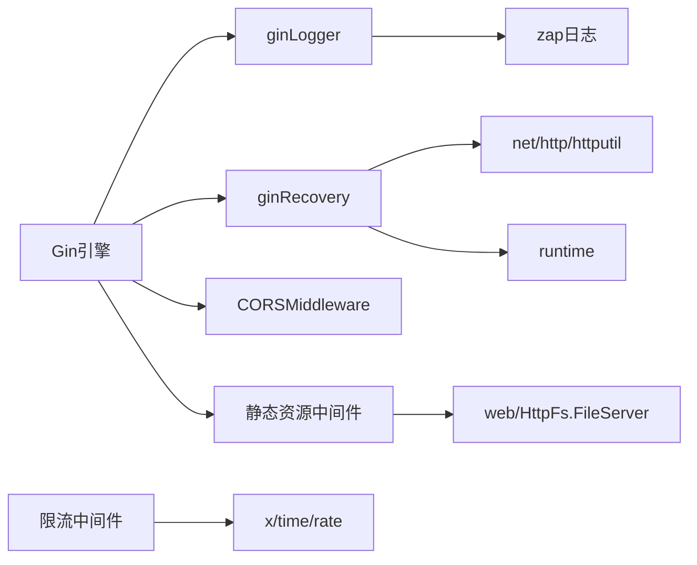

# 中间件系统

<cite>
**本文引用的文件**
- [InitWeb.go](file://fast_web/InitWeb.go)
- [InitWebEx.go](file://fast_web/InitWebEx.go)
- [InitWebStatic.go](file://fast_web/InitWebStatic.go)
- [HttpFs.go](file://fast_web/web/HttpFs.go)
- [SecFilter.go](file://fast_web/SecFilter.go)
- [RateLimit.go](file://fast_web/web/RateLimit.go)
- [InitLogger.go](file://fast_base/InitLogger.go)
</cite>

## 目录
1. [简介](#简介)
2. [项目结构](#项目结构)
3. [核心组件](#核心组件)
4. [架构总览](#架构总览)
5. [详细组件分析](#详细组件分析)
6. [依赖分析](#依赖分析)
7. [性能考量](#性能考量)
8. [故障排查指南](#故障排查指南)
9. [结论](#结论)
10. [附录](#附录)

## 简介
本文件系统性梳理 Fast-Go 的中间件体系，重点覆盖：
- Gin 中间件的集成与使用：日志中间件、恢复中间件、跨域中间件、静态资源中间件
- ginLogger 与 ginRecovery 的工作机制：请求日志记录、响应状态跟踪、异常恢复处理
- 跨域中间件的配置选项与安全考虑
- 静态资源中间件的实现：文件系统映射、Gzip 压缩、缓存策略
- 中间件开发最佳实践与性能优化建议

## 项目结构
Fast-Go 的 Web 层位于 fast_web 目录，中间件相关代码主要分布在以下文件：
- 初始化与路由装配：InitWeb.go
- 日志与恢复中间件：InitWebEx.go
- 跨域与安全过滤：SecFilter.go
- 静态资源与文件服务：InitWebStatic.go、web/HttpFs.go
- 令牌与限流工具：SecFilter.go、web/RateLimit.go
- 日志系统：fast_base/InitLogger.go

图表来源
- [InitWeb.go:61-97](file://fast_web/InitWeb.go#L61-L97)
- [InitWebEx.go:52-109](file://fast_web/InitWebEx.go#L52-L109)
- [SecFilter.go:115-129](file://fast_web/SecFilter.go#L115-L129)
- [InitWebStatic.go:12-27](file://fast_web/InitWebStatic.go#L12-L27)
- [HttpFs.go:624-713](file://fast_web/web/HttpFs.go#L624-L713)
- [RateLimit.go:42-73](file://fast_web/web/RateLimit.go#L42-L73)
- [InitLogger.go:16-44](file://fast_base/InitLogger.go#L16-L44)

章节来源
- [InitWeb.go:61-111](file://fast_web/InitWeb.go#L61-L111)
- [InitWebEx.go:52-109](file://fast_web/InitWebEx.go#L52-L109)
- [SecFilter.go:115-129](file://fast_web/SecFilter.go#L115-L129)
- [InitWebStatic.go:12-27](file://fast_web/InitWebStatic.go#L12-L27)
- [HttpFs.go:624-713](file://fast_web/web/HttpFs.go#L624-L713)
- [RateLimit.go:42-73](file://fast_web/web/RateLimit.go#L42-L73)
- [InitLogger.go:16-44](file://fast_base/InitLogger.go#L16-L44)

## 核心组件
- 日志中间件 ginLogger：基于 gin 日志参数与 zap 日志框架，记录请求路径、状态码、耗时、客户端 IP、错误信息等
- 恢复中间件 ginRecovery：捕获 panic，区分“Broken Pipe”等可忽略错误，输出堆栈与请求头摘要，返回统一错误响应
- 跨域中间件 CORSMiddleware：设置标准 CORS 头，支持 OPTIONS 预检短路
- 静态资源中间件：基于 Gin 的 http.FileSystem 与自定义 FileServer，支持 Gzip 预压缩文件与 Range 请求
- 安全过滤与限流：基于 Header 的 Token 校验与基于令牌桶的限流

章节来源
- [InitWebEx.go:52-109](file://fast_web/InitWebEx.go#L52-L109)
- [InitWebEx.go:150-224](file://fast_web/InitWebEx.go#L150-L224)
- [SecFilter.go:115-129](file://fast_web/SecFilter.go#L115-L129)
- [InitWebStatic.go:12-27](file://fast_web/InitWebStatic.go#L12-L27)
- [HttpFs.go:624-713](file://fast_web/web/HttpFs.go#L624-L713)
- [SecFilter.go:87-100](file://fast_web/SecFilter.go#L87-L100)

## 架构总览
中间件在应用启动时被注册到 Gin 引擎，形成如下控制流：
- 请求进入 -> 日志中间件 -> 恢复中间件 -> 跨域中间件（可选） -> 静态资源中间件（可选） -> 用户路由处理器
- 异常发生时，恢复中间件捕获并记录，必要时短路返回

图表来源
- [InitWeb.go:64-72](file://fast_web/InitWeb.go#L64-L72)
- [InitWebEx.go:52-109](file://fast_web/InitWebEx.go#L52-L109)
- [InitWebEx.go:150-224](file://fast_web/InitWebEx.go#L150-L224)
- [SecFilter.go:115-129](file://fast_web/SecFilter.go#L115-L129)
- [InitWebStatic.go:12-27](file://fast_web/InitWebStatic.go#L12-L27)

## 详细组件分析

### 日志中间件 ginLogger
- 作用：在请求处理前后收集上下文信息，输出结构化日志
- 关键点：
  - 使用 gin.LogFormatterParams 收集请求、响应、状态码、BodySize、Latency 等
  - 通过 zap 日志框架输出，支持彩色与非彩色
  - 对查询串进行解码显示，避免 URL 编码干扰
  - 仅在满足日志级别时输出，避免不必要的开销
- 性能影响：日志输出为同步 IO，建议在生产环境合理设置日志级别与开关

图表来源
- [InitWebEx.go:52-109](file://fast_web/InitWebEx.go#L52-L109)

章节来源
- [InitWebEx.go:52-109](file://fast_web/InitWebEx.go#L52-L109)
- [InitLogger.go:16-44](file://fast_base/InitLogger.go#L16-L44)

### 恢复中间件 ginRecovery
- 作用：捕获 panic，区分“Broken Pipe”等可忽略错误，输出堆栈与请求头摘要，返回统一错误响应
- 关键点：
  - 自定义 customRecover 包裹 defer，捕获异常后构造堆栈与请求头摘要
  - 对“Broken Pipe”连接断开进行特殊处理，避免写回状态码
  - 在调试模式下输出更详细的堆栈信息
  - 返回统一错误响应，确保前端一致性
- 安全性：对 Authorization 头进行脱敏处理，避免敏感信息泄露

图表来源
- [InitWebEx.go:150-224](file://fast_web/InitWebEx.go#L150-L224)

章节来源
- [InitWebEx.go:150-224](file://fast_web/InitWebEx.go#L150-L224)

### 跨域中间件 CORSMiddleware
- 作用：为跨域请求设置标准 CORS 头，支持 OPTIONS 预检短路
- 配置项：
  - Access-Control-Allow-Origin：允许的源，默认为 *
  - Access-Control-Allow-Methods：允许的 HTTP 方法
  - Access-Control-Allow-Headers：允许的请求头
  - Access-Control-Allow-Credentials：是否允许携带凭据
- 安全考虑：
  - 默认允许所有源（*），在生产环境中应限制为可信域名
  - 若需携带 Cookie 或自定义头，请谨慎配置 Allow-Credentials 并指定具体源
  - 预检请求（OPTIONS）直接短路返回，减少额外开销

图表来源
- [SecFilter.go:115-129](file://fast_web/SecFilter.go#L115-L129)

章节来源
- [SecFilter.go:115-129](file://fast_web/SecFilter.go#L115-L129)

### 静态资源中间件
- 作用：将指定 URL 前缀映射到本地文件系统，提供静态文件服务
- 实现要点：
  - 使用 Gin 的 http.FileSystem 与自定义 FileServer
  - 通过 http.StripPrefix 去除相对路径前缀，定位真实文件
  - 支持 Gzip 预压缩文件：若客户端支持 gzip 且存在同名 .gz 文件，则优先返回 .gz 内容并设置相应响应头
  - 支持 Range 请求与条件缓存：Last-Modified、If-Modified-Since、If-None-Match 等
  - 目录索引：自动查找 index.html，不存在时列出目录内容
- 性能与安全：
  - Gzip 预压缩可显著降低带宽占用
  - 条件缓存减少重复传输
  - 注意路径遍历与权限控制，避免暴露敏感文件

图表来源
- [InitWebStatic.go:29-58](file://fast_web/InitWebStatic.go#L29-L58)
- [HttpFs.go:624-713](file://fast_web/web/HttpFs.go#L624-L713)
- [HttpFs.go:252-376](file://fast_web/web/HttpFs.go#L252-L376)

章节来源
- [InitWebStatic.go:12-27](file://fast_web/InitWebStatic.go#L12-L27)
- [InitWebStatic.go:29-58](file://fast_web/InitWebStatic.go#L29-L58)
- [HttpFs.go:624-713](file://fast_web/web/HttpFs.go#L624-L713)
- [HttpFs.go:252-376](file://fast_web/web/HttpFs.go#L252-L376)

### 安全过滤与限流
- Token 校验：从请求头读取 AccessToken/AppKey，校验有效性后注入上下文，供后续处理器使用
- 密码模式：通过查询参数 tt 进行简单鉴权，适合内部或测试场景
- 限流中间件：基于令牌桶算法，按每秒生成速率与容量限制请求频率；可针对特定前缀启用

图表来源
- [SecFilter.go:40-81](file://fast_web/SecFilter.go#L40-L81)
- [SecFilter.go:18-37](file://fast_web/SecFilter.go#L18-L37)
- [SecFilter.go:87-100](file://fast_web/SecFilter.go#L87-L100)

章节来源
- [SecFilter.go:40-81](file://fast_web/SecFilter.go#L40-L81)
- [SecFilter.go:18-37](file://fast_web/SecFilter.go#L18-L37)
- [SecFilter.go:87-100](file://fast_web/SecFilter.go#L87-L100)
- [RateLimit.go:42-73](file://fast_web/web/RateLimit.go#L42-L73)

## 依赖分析
- 中间件注册顺序：日志 -> 恢复 -> 跨域（可选）-> 静态资源（可选）
- 日志中间件依赖 zap 日志系统，恢复中间件依赖 net/http/httputil 与 runtime
- 静态资源中间件依赖 Gin 的 http.FileSystem 与自定义 FileServer
- 限流中间件依赖 golang.org/x/time/rate

图表来源
- [InitWeb.go:64-72](file://fast_web/InitWeb.go#L64-L72)
- [InitWebEx.go:52-109](file://fast_web/InitWebEx.go#L52-L109)
- [InitWebEx.go:150-224](file://fast_web/InitWebEx.go#L150-L224)
- [SecFilter.go:115-129](file://fast_web/SecFilter.go#L115-L129)
- [InitWebStatic.go:12-27](file://fast_web/InitWebStatic.go#L12-L27)
- [HttpFs.go:887-898](file://fast_web/web/HttpFs.go#L887-L898)
- [RateLimit.go:87-100](file://fast_web/web/RateLimit.go#L87-L100)

章节来源
- [InitWeb.go:64-72](file://fast_web/InitWeb.go#L64-L72)
- [InitWebEx.go:52-109](file://fast_web/InitWebEx.go#L52-L109)
- [InitWebEx.go:150-224](file://fast_web/InitWebEx.go#L150-L224)
- [SecFilter.go:115-129](file://fast_web/SecFilter.go#L115-L129)
- [InitWebStatic.go:12-27](file://fast_web/InitWebStatic.go#L12-L27)
- [HttpFs.go:887-898](file://fast_web/web/HttpFs.go#L887-L898)
- [RateLimit.go:87-100](file://fast_web/web/RateLimit.go#L87-L100)

## 性能考量
- 日志中间件
  - 合理设置日志级别，避免在高并发下产生大量 IO
  - 使用结构化日志，减少字符串拼接成本
- 恢复中间件
  - 在调试模式下输出堆栈会带来额外开销，生产环境建议关闭
  - 对“Broken Pipe”快速短路，避免无效的响应写入
- 跨域中间件
  - 预检请求短路可减少一次完整处理流程
  - 生产环境限制 Allow-Origin，避免不必要的跨域风险
- 静态资源中间件
  - Gzip 预压缩可显著降低带宽，但需维护 .gz 文件一致性
  - 条件缓存与 Range 请求提升大文件传输效率
  - 目录列表与 index.html 查找应避免在热点路径上频繁触发
- 限流中间件
  - 令牌桶算法计算开销极低，适合高频请求场景
  - 合理设置速率与容量，避免误伤正常流量

## 故障排查指南
- 日志缺失
  - 检查日志级别配置与中间件注册顺序
  - 确认 zap 日志初始化正确
- 异常导致服务崩溃
  - 恢复中间件会捕获 panic 并输出堆栈，关注 Authorization 头脱敏情况
  - “Broken Pipe”属于常见网络异常，无需过度担心
- 跨域问题
  - 确认 CORS 头是否正确设置，特别是 Allow-Credentials 与 Allow-Origin
  - 预检请求是否被正确短路
- 静态资源 404 或 500
  - 检查相对路径与根目录映射是否正确
  - 确认 .gz 文件是否存在且与原始文件一致
  - 目录权限与路径遍历保护
- 限流误伤
  - 检查限流规则与目标前缀匹配
  - 调整速率与容量参数，观察效果

章节来源
- [InitWebEx.go:52-109](file://fast_web/InitWebEx.go#L52-L109)
- [InitWebEx.go:150-224](file://fast_web/InitWebEx.go#L150-L224)
- [SecFilter.go:115-129](file://fast_web/SecFilter.go#L115-L129)
- [InitWebStatic.go:12-27](file://fast_web/InitWebStatic.go#L12-L27)
- [HttpFs.go:624-713](file://fast_web/web/HttpFs.go#L624-L713)
- [SecFilter.go:87-100](file://fast_web/SecFilter.go#L87-L100)

## 结论
Fast-Go 的中间件体系围绕 Gin 提供了完善的日志、异常处理、跨域、静态资源与安全限流能力。通过合理的配置与安全策略，可在保证性能的同时提升可观测性与安全性。建议在生产环境中：
- 明确 CORS 策略，限制 Allow-Origin
- 合理设置日志级别与输出格式
- 使用 Gzip 预压缩与条件缓存优化静态资源
- 对关键接口启用限流，避免雪崩效应

## 附录
- 中间件注册顺序与时机
  - 日志与恢复中间件必须在最前，确保所有请求均被记录与兜底
  - 跨域中间件在静态资源之前，避免静态资源处理前的 CORS 丢失
- 开发最佳实践
  - 将中间件功能模块化，便于按需启用/禁用
  - 对外部依赖（日志、限流）进行抽象，便于替换与测试
  - 在网关或代理层统一处理跨域与缓存策略，减轻应用负担