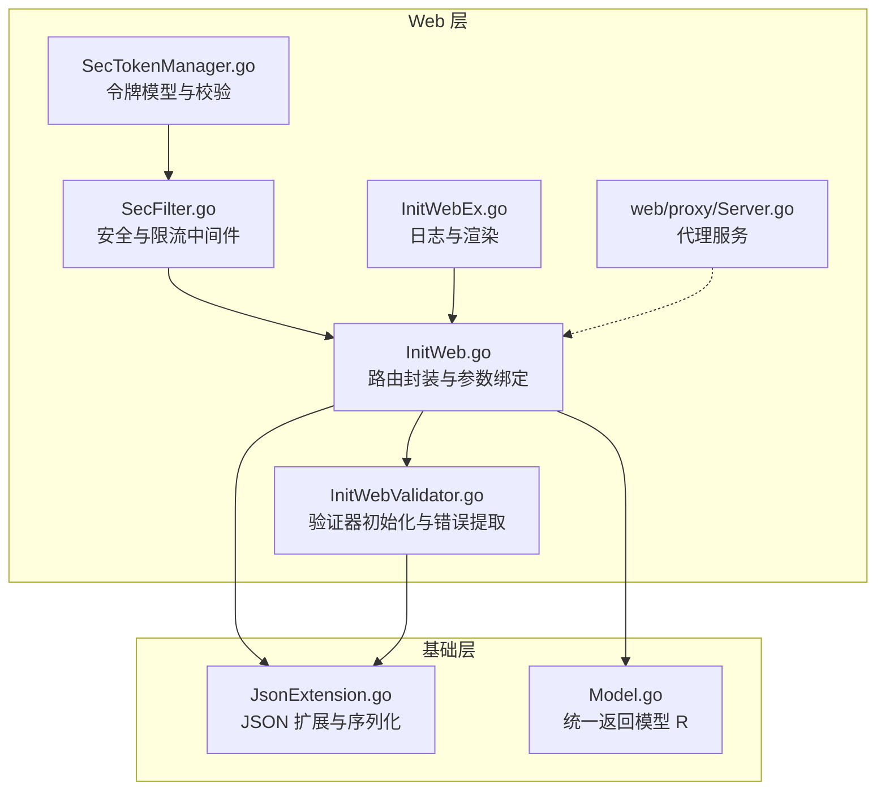
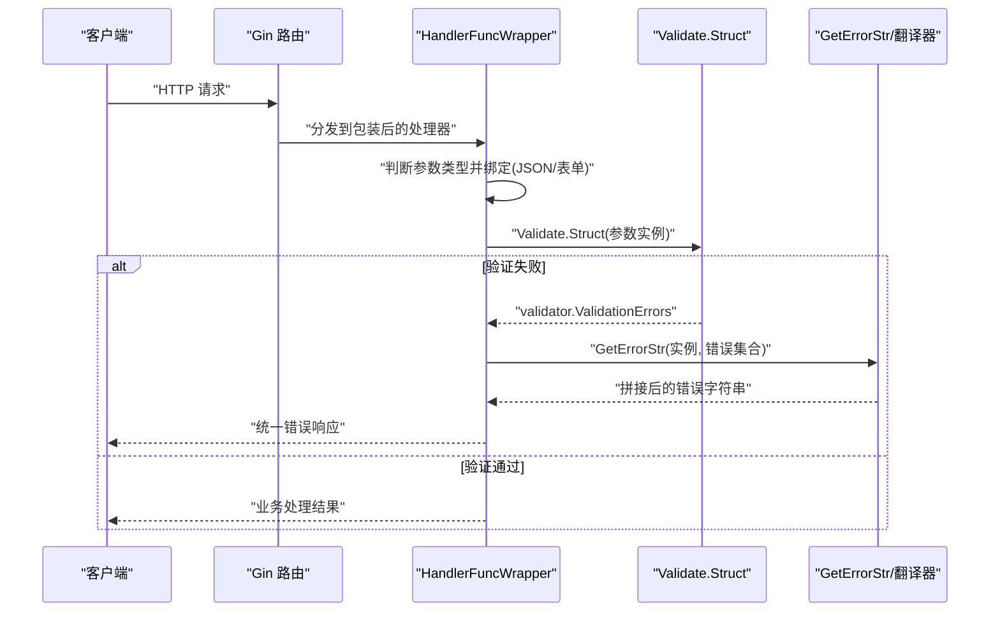
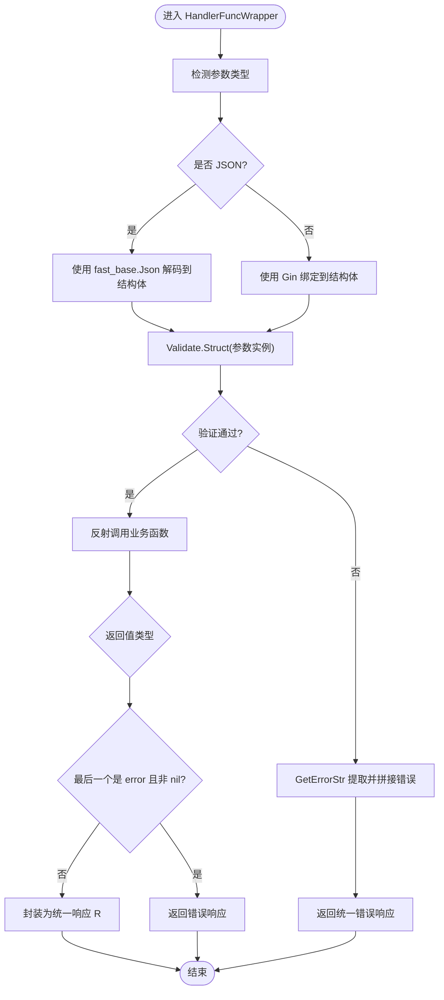
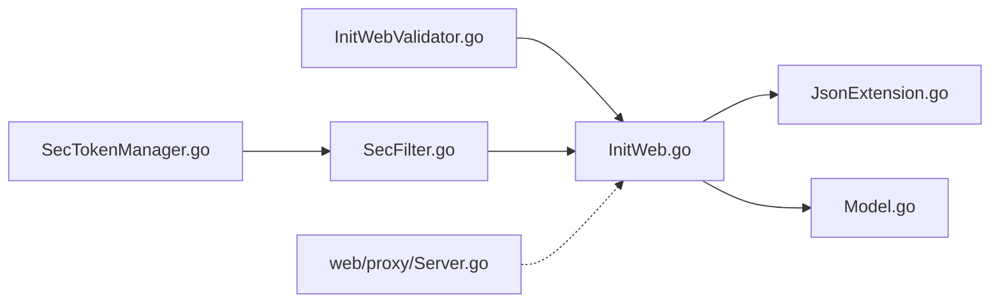

# 参数验证系统

<cite>
**本文引用的文件**
- [fast_web/InitWebValidator.go](file://fast_web/InitWebValidator.go)
- [fast_web/InitWeb.go](file://fast_web/InitWeb.go)
- [fast_web/SecFilter.go](file://fast_web/SecFilter.go)
- [fast_web/SecTokenManager.go](file://fast_web/SecTokenManager.go)
- [fast_web/web/proxy/Server.go](file://fast_web/web/proxy/Server.go)
- [fast_web/InitWebEx.go](file://fast_web/InitWebEx.go)
- [fast_base/JsonExtension.go](file://fast_base/JsonExtension.go)
- [fast_base/Model.go](file://fast_base/Model.go)
</cite>

## 目录
1. [简介](#简介)
2. [项目结构](#项目结构)
3. [核心组件](#核心组件)
4. [架构总览](#架构总览)
5. [详细组件分析](#详细组件分析)
6. [依赖分析](#依赖分析)
7. [性能考虑](#性能考虑)
8. [故障排查指南](#故障排查指南)
9. [结论](#结论)
10. [附录](#附录)

## 简介
本文件系统性阐述 Fast-Go 的参数验证体系，围绕基于 go-playground/validator 的验证机制展开，覆盖以下主题：
- 结构体标签与字段命名映射策略
- 自定义验证规则与翻译注册
- 错误提取与多语言支持
- Validate.Struct 的调用时机与整体验证流程（含 JSON 解析、表单绑定与结果处理）
- 常见标签用法与复杂场景实践（嵌套结构、条件验证、自定义验证器）

## 项目结构
Fast-Go 的 Web 层通过 Gin 框架承载，参数验证能力集中在 fast_web 模块中，配合 fast_base 的 JSON 扩展与统一返回模型，形成“路由封装 → 参数绑定 → 结构体验证 → 统一错误输出”的闭环。

图表来源
- [fast_web/InitWeb.go:42-111](file://fast_web/InitWeb.go#L42-L111)
- [fast_web/InitWebValidator.go:18-87](file://fast_web/InitWebValidator.go#L18-L87)
- [fast_web/SecFilter.go:11-129](file://fast_web/SecFilter.go#L11-L129)
- [fast_web/SecTokenManager.go:13-216](file://fast_web/SecTokenManager.go#L13-L216)
- [fast_web/web/proxy/Server.go:30-73](file://fast_web/web/proxy/Server.go#L30-L73)
- [fast_base/JsonExtension.go:24-346](file://fast_base/JsonExtension.go#L24-L346)
- [fast_base/Model.go:82-116](file://fast_base/Model.go#L82-L116)

章节来源
- [fast_web/InitWeb.go:42-111](file://fast_web/InitWeb.go#L42-L111)
- [fast_web/InitWebValidator.go:18-87](file://fast_web/InitWebValidator.go#L18-L87)

## 核心组件
- 验证器与翻译器
  - 全局验证器实例与翻译器初始化，注册中文默认翻译与自定义标签翻译。
  - 字段标签名映射函数，支持 tag 标签优先。
- 参数绑定与验证流程
  - 基于 Gin 的绑定策略区分 JSON 与表单；使用 fast_base 的 JSON 解码器增强容错；随后调用 Validate.Struct 执行结构体级验证。
  - 错误提取函数将 validator.ValidationErrors 转换为可读字符串，支持按字段+标签的自定义消息覆盖与多语言翻译。
- 统一返回模型
  - 统一响应结构体 R，便于前端消费与错误展示。

章节来源
- [fast_web/InitWebValidator.go:18-87](file://fast_web/InitWebValidator.go#L18-L87)
- [fast_web/InitWeb.go:216-322](file://fast_web/InitWeb.go#L216-L322)
- [fast_base/Model.go:82-116](file://fast_base/Model.go#L82-L116)

## 架构总览
下图展示了从请求进入至参数验证与错误输出的关键交互：

图表来源
- [fast_web/InitWeb.go:198-338](file://fast_web/InitWeb.go#L198-L338)
- [fast_web/InitWebValidator.go:31-49](file://fast_web/InitWebValidator.go#L31-L49)

## 详细组件分析

### 验证器初始化与翻译
- 初始化步骤
  - 创建中文翻译器并注册默认翻译。
  - 注册自定义标签与对应验证函数及翻译。
  - 注册字段标签名映射函数，使 tag 标签优先于 json 标签作为字段显示名。
- 自定义标签
  - password：复合强度要求（大小写字母+数字，长度≥8）。
  - 注册翻译模板，占位符替换为字段名，确保错误信息友好。
- 字段名映射
  - 通过 RegisterTagNameFunc 读取 tag 标签的首个片段作为字段显示名，便于错误信息本地化与统一。

章节来源
- [fast_web/InitWebValidator.go:18-87](file://fast_web/InitWebValidator.go#L18-L87)

### 参数绑定与验证流程
- 绑定策略
  - JSON：使用 fast_base.Json.NewDecoder 从请求体解码到参数结构体，增强对字符串数字兼容等场景。
  - 表单：使用 Gin 的 context.Bind 绑定。
- 结构体验证
  - Validate.Struct(data.Interface()) 在绑定完成后立即执行。
  - 若出现验证错误，交由 GetErrorStr 提取并拼接为字符串，统一返回。
- 返回处理
  - 业务函数返回值统一包装为 fast_base.R，若最后返回值为 error 且非 nil，则直接返回错误信息。

图表来源
- [fast_web/InitWeb.go:216-322](file://fast_web/InitWeb.go#L216-L322)
- [fast_web/InitWebValidator.go:31-49](file://fast_web/InitWebValidator.go#L31-L49)

章节来源
- [fast_web/InitWeb.go:216-322](file://fast_web/InitWeb.go#L216-L322)

### 错误提取与多语言支持
- 错误提取机制
  - GetErrorStr 接收结构体实例与验证错误集合。
  - 若实例实现了自定义 Validator 接口（提供 ValidatorMessages 映射），则优先按“字段名.标签”匹配自定义消息；否则回退到翻译器提供的本地化文本。
  - 去除层级前缀（移除顶层结构体名），仅保留字段路径，便于前端定位。
- 多语言支持
  - 初始化时注册中文翻译器与默认翻译。
  - 自定义标签翻译通过 RegisterTranslation 注册，结合占位符实现动态替换。

章节来源
- [fast_web/InitWebValidator.go:31-57](file://fast_web/InitWebValidator.go#L31-L57)
- [fast_web/InitWebValidator.go:18-29](file://fast_web/InitWebValidator.go#L18-L29)

### JSON 解析与表单绑定增强
- JSON 解析
  - 使用 fast_base.Json（jsoniter）替代标准库，提升性能与兼容性（如字符串数字互转、大整数安全等）。
- 表单绑定
  - 使用 Gin 的 context.Bind，适配 application/x-www-form-urlencoded 与 multipart/form-data。
- 统一错误响应
  - 绑定失败或验证失败均以统一的 fast_base.R 返回，状态码与消息由上层逻辑决定。

章节来源
- [fast_web/InitWeb.go:226-247](file://fast_web/InitWeb.go#L226-L247)
- [fast_base/JsonExtension.go:24-346](file://fast_base/JsonExtension.go#L24-L346)

### 自定义验证规则与标签
- password 规则
  - 强度要求：至少包含一个小写字母、一个大写字母、一个数字，长度不少于 8。
  - 注册验证函数与中文翻译，确保错误信息本地化。
- 标签注册与翻译
  - RegisterValidation 与 RegisterTranslation 完成自定义标签与翻译的绑定。
  - 字段标签名映射通过 RegisterTagNameFunc 实现，优先使用 tag 标签。

章节来源
- [fast_web/InitWebValidator.go:59-87](file://fast_web/InitWebValidator.go#L59-L87)

### 统一返回模型与安全中间件
- 统一返回模型
  - R 结构体包含 code、message、data，便于前后端约定一致的数据结构。
- 安全与限流
  - SecFilter 提供基于 Token 与密码的访问控制中间件，以及基于令牌桶的限流中间件。
  - SecTokenManager 提供令牌生成、刷新、校验与持久化能力。

章节来源
- [fast_base/Model.go:82-116](file://fast_base/Model.go#L82-L116)
- [fast_web/SecFilter.go:11-129](file://fast_web/SecFilter.go#L11-L129)
- [fast_web/SecTokenManager.go:13-216](file://fast_web/SecTokenManager.go#L13-L216)

## 依赖分析
- 组件耦合
  - InitWebValidator 与 InitWeb 之间通过全局 Validate 实例与 GetErrorStr 协作，耦合点清晰。
  - InitWeb 依赖 Gin 绑定与 fast_base JSON 解码器，形成“绑定→验证→返回”的链路。
- 外部依赖
  - go-playground/validator：结构体验证与翻译。
  - Gin：路由与绑定。
  - jsoniter：高性能 JSON 编解码与扩展。

图表来源
- [fast_web/InitWebValidator.go:18-87](file://fast_web/InitWebValidator.go#L18-L87)
- [fast_web/InitWeb.go:42-111](file://fast_web/InitWeb.go#L42-L111)
- [fast_base/JsonExtension.go:24-346](file://fast_base/JsonExtension.go#L24-L346)
- [fast_base/Model.go:82-116](file://fast_base/Model.go#L82-L116)
- [fast_web/SecFilter.go:11-129](file://fast_web/SecFilter.go#L11-L129)
- [fast_web/SecTokenManager.go:13-216](file://fast_web/SecTokenManager.go#L13-L216)
- [fast_web/web/proxy/Server.go:30-73](file://fast_web/web/proxy/Server.go#L30-L73)

## 性能考虑
- JSON 解码优化
  - 使用 jsoniter 并启用模糊解码，减少前后端数据类型不一致导致的错误与重试成本。
- 验证器注册
  - 将翻译与标签注册集中于应用启动阶段，避免运行时重复注册带来的开销。
- 绑定与验证分离
  - 先绑定后验证，避免无效验证计算；同时利用 Gin 的绑定中间件减少重复逻辑。

## 故障排查指南
- 常见问题
  - JSON 解码失败：检查请求体格式与字段类型，确认 fast_base.Json 的容错行为是否满足预期。
  - 表单绑定失败：确认 Content-Type 与字段标签是否匹配。
  - 验证失败但错误信息不明确：确认是否实现 Validator 接口并正确提供 ValidatorMessages；检查自定义标签与翻译是否注册。
- 定位手段
  - 使用 Gin 日志中间件查看请求路径、状态码与耗时。
  - 检查 GetErrorStr 的返回字符串，确认字段路径与消息来源（自定义或翻译器）。

章节来源
- [fast_web/InitWebEx.go:51-146](file://fast_web/InitWebEx.go#L51-L146)
- [fast_web/InitWeb.go:226-247](file://fast_web/InitWeb.go#L226-L247)
- [fast_web/InitWebValidator.go:31-49](file://fast_web/InitWebValidator.go#L31-L49)

## 结论
Fast-Go 的参数验证系统以 go-playground/validator 为核心，结合 Gin 的绑定能力与 fast_base 的 JSON 扩展，在启动阶段完成翻译与标签注册，运行时通过统一的 HandlerFuncWrapper 完成参数绑定、结构体验证与错误输出，形成高内聚、低耦合的验证链路。通过自定义标签与翻译，系统在保证一致性的同时兼顾本地化体验。

## 附录

### 常见验证标签与用法
- required：必填字段
- email：邮箱格式
- min/max：数值或长度范围
- 自定义标签：如 password（大小写字母+数字，长度≥8）

使用建议
- 在结构体标签中优先使用 tag 作为字段显示名，便于统一错误提示。
- 对复杂业务场景，优先采用自定义标签与翻译，减少重复逻辑。

章节来源
- [fast_web/InitWebValidator.go:69-87](file://fast_web/InitWebValidator.go#L69-L87)

### 复杂验证场景实践
- 嵌套结构验证
  - 在子结构体上同样使用结构体标签与验证标签，Validate.Struct 会递归验证。
- 条件验证
  - 可通过自定义验证函数在 FieldLevel 上读取上下文字段，实现条件分支校验。
- 自定义验证器开发
  - 使用 RegisterValidation 注册函数，结合 RegisterTranslation 提供本地化消息。
  - 字段名映射通过 RegisterTagNameFunc 控制，确保错误信息可读性强。

章节来源
- [fast_web/InitWebValidator.go:59-87](file://fast_web/InitWebValidator.go#L59-L87)