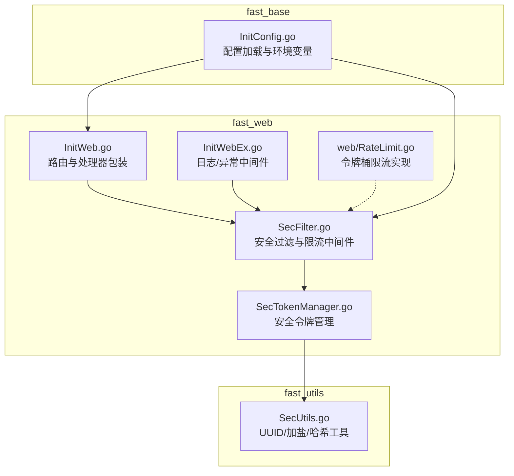
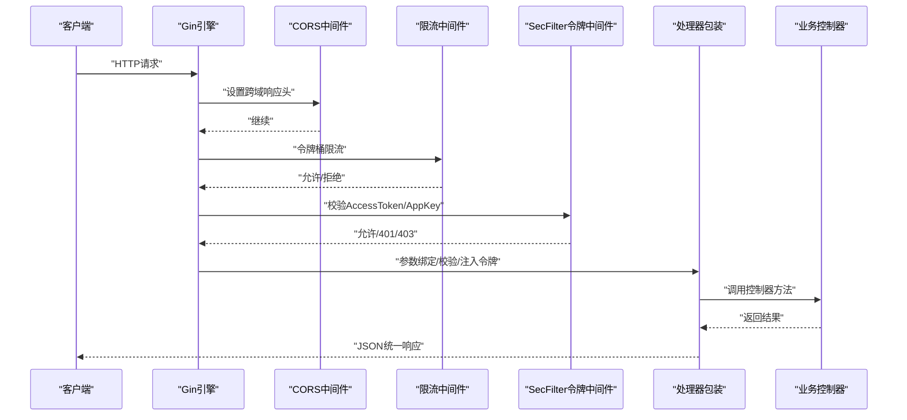
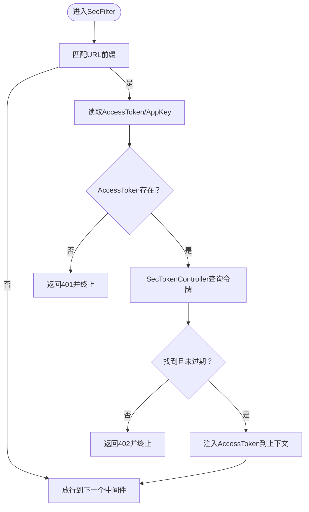
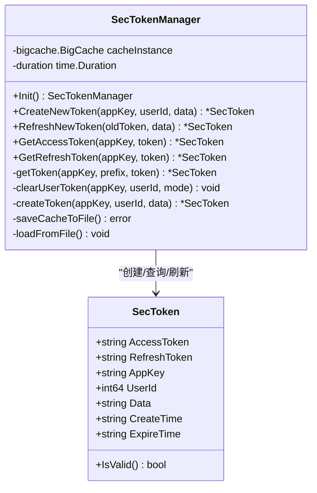
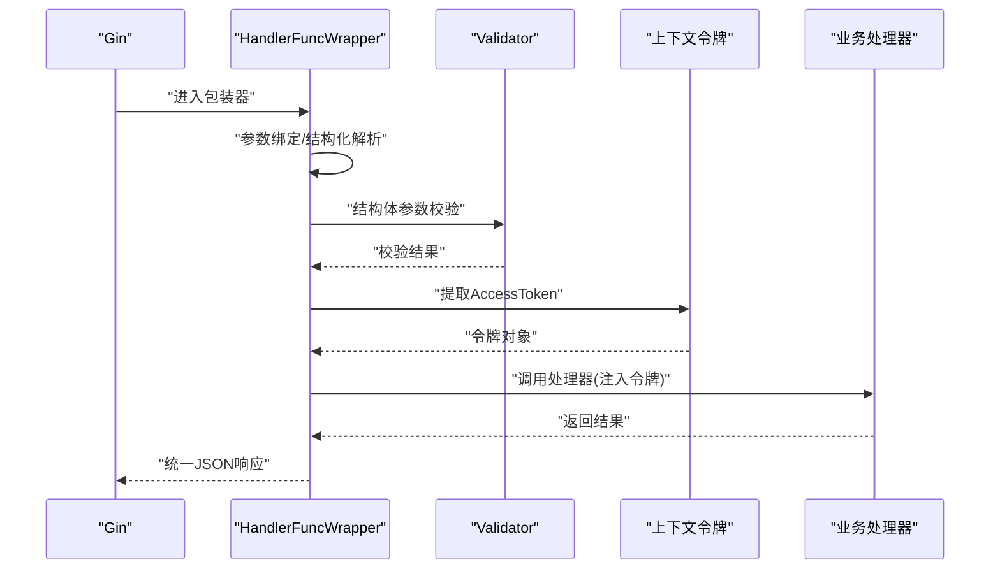
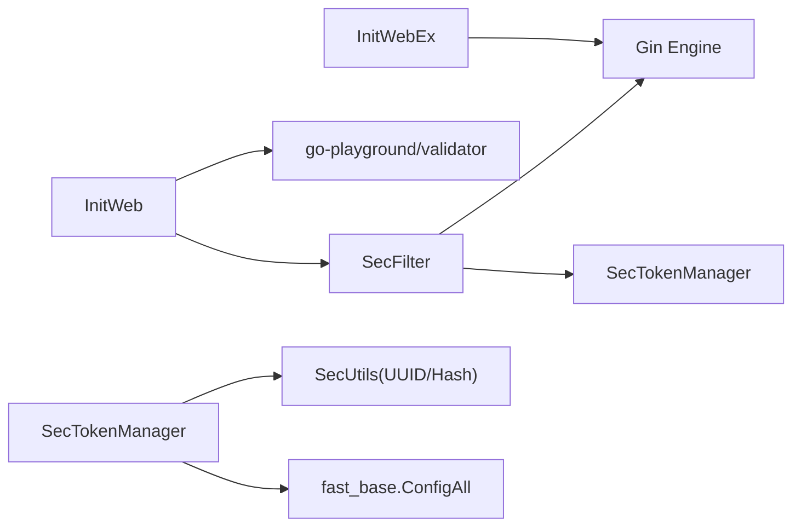

# 安全过滤系统

<cite>
**本文引用的文件**
- [fast_web/SecFilter.go](file://fast_web/SecFilter.go)
- [fast_web/SecTokenManager.go](file://fast_web/SecTokenManager.go)
- [fast_web/InitWeb.go](file://fast_web/InitWeb.go)
- [fast_web/InitWebEx.go](file://fast_web/InitWebEx.go)
- [fast_web/web/RateLimit.go](file://fast_web/web/RateLimit.go)
- [fast_utils/SecUtils.go](file://fast_utils/SecUtils.go)
- [fast_web/InitWebValidator.go](file://fast_web/InitWebValidator.go)
- [fast_base/InitConfig.go](file://fast_base/InitConfig.go)
</cite>

## 目录
1. [简介](#简介)
2. [项目结构](#项目结构)
3. [核心组件](#核心组件)
4. [架构总览](#架构总览)
5. [组件详解](#组件详解)
6. [依赖关系分析](#依赖关系分析)
7. [性能考量](#性能考量)
8. [故障排查指南](#故障排查指南)
9. [结论](#结论)
10. [附录](#附录)

## 简介
本文件面向 Fast-Go 安全过滤系统，聚焦以下主题：
- CSRF 防护与安全令牌管理机制
- 请求头验证、Referer 检查与令牌验证的过滤逻辑
- SecFilter 的过滤流程与安全中间件配置
- SecTokenManager 的令牌生成、存储与验证流程
- 安全最佳实践：敏感数据处理、输入清理、输出编码
- 常见安全威胁与防护措施，以及安全审计与监控建议

说明：
- 当前仓库未提供显式的 CSRF Token 生成与校验逻辑（例如 X-CSRF-Token 头部的生成与校验）。本文在“CSRF 防护”部分仅基于现有代码进行客观分析；若需完整 CSRF 防护能力，可在现有 SecFilter 与 SecTokenManager 基础上扩展 Referer 校验与前端页面注入 CSRF Token 的流程。

## 项目结构
安全相关能力主要分布在 fast_web 模块，配合 fast_utils 提供通用安全工具，fast_base 提供配置加载能力。

图表来源
- [fast_web/SecFilter.go:1-130](file://fast_web/SecFilter.go#L1-L130)
- [fast_web/SecTokenManager.go:1-216](file://fast_web/SecTokenManager.go#L1-L216)
- [fast_web/InitWeb.go:1-367](file://fast_web/InitWeb.go#L1-L367)
- [fast_web/InitWebEx.go:1-318](file://fast_web/InitWebEx.go#L1-L318)
- [fast_web/web/RateLimit.go:1-346](file://fast_web/web/RateLimit.go#L1-L346)
- [fast_utils/SecUtils.go:1-40](file://fast_utils/SecUtils.go#L1-L40)
- [fast_base/InitConfig.go:1-108](file://fast_base/InitConfig.go#L1-L108)

章节来源
- [fast_web/SecFilter.go:1-130](file://fast_web/SecFilter.go#L1-L130)
- [fast_web/SecTokenManager.go:1-216](file://fast_web/SecTokenManager.go#L1-L216)
- [fast_web/InitWeb.go:1-367](file://fast_web/InitWeb.go#L1-L367)
- [fast_web/InitWebEx.go:1-318](file://fast_web/InitWebEx.go#L1-L318)
- [fast_web/web/RateLimit.go:1-346](file://fast_web/web/RateLimit.go#L1-L346)
- [fast_utils/SecUtils.go:1-40](file://fast_utils/SecUtils.go#L1-L40)
- [fast_base/InitConfig.go:1-108](file://fast_base/InitConfig.go#L1-L108)

## 核心组件
- SecFilter：提供跨域中间件、限流中间件、基于密码与基于令牌的安全中间件，以及匹配前缀的辅助函数。
- SecTokenManager：负责安全令牌的生成、存储、刷新、查询与过期清理，采用本地缓存持久化。
- InitWeb：路由注册、处理器包装、自动注入 SecToken 对象到上下文。
- InitWebEx：日志与异常中间件，增强可观测性与安全性。
- SecUtils：提供 UUID、加盐与哈希等基础安全工具。
- InitConfig：配置加载与环境变量解析，为安全组件提供配置来源。

章节来源
- [fast_web/SecFilter.go:1-130](file://fast_web/SecFilter.go#L1-L130)
- [fast_web/SecTokenManager.go:1-216](file://fast_web/SecTokenManager.go#L1-L216)
- [fast_web/InitWeb.go:198-338](file://fast_web/InitWeb.go#L198-L338)
- [fast_web/InitWebEx.go:52-224](file://fast_web/InitWebEx.go#L52-L224)
- [fast_utils/SecUtils.go:12-35](file://fast_utils/SecUtils.go#L12-L35)
- [fast_base/InitConfig.go:21-87](file://fast_base/InitConfig.go#L21-L87)

## 架构总览
下图展示安全过滤系统在请求生命周期中的作用点与交互关系。

图表来源
- [fast_web/SecFilter.go:115-129](file://fast_web/SecFilter.go#L115-L129)
- [fast_web/SecFilter.go:87-100](file://fast_web/SecFilter.go#L87-L100)
- [fast_web/SecFilter.go:40-81](file://fast_web/SecFilter.go#L40-L81)
- [fast_web/InitWeb.go:198-338](file://fast_web/InitWeb.go#L198-L338)

## 组件详解

### SecFilter：安全过滤与限流
- 跨域中间件（CORS）
  - 设置允许的 Origin、Methods、Headers、Credentials。
  - 对于预检请求 OPTIONS 直接返回状态码。
- 限流中间件（RateLimitMiddleware）
  - 基于令牌桶算法，限制每秒通过的请求数量。
  - 对所有接口生效，建议仅对关键接口启用。
- 基于密码的访问控制（LoadLimitByPassword）
  - 通过查询参数 tt 与服务端配置 server.password 对比，匹配则放行。
- 基于令牌的访问控制（LoadLimitByToken）
  - 从请求头读取 AccessToken 与 AppKey。
  - 通过 SecTokenController 查询令牌有效性与过期状态。
  - 将令牌对象注入到上下文，供后续处理器使用。

图表来源
- [fast_web/SecFilter.go:40-81](file://fast_web/SecFilter.go#L40-L81)
- [fast_web/SecFilter.go:102-109](file://fast_web/SecFilter.go#L102-L109)

章节来源
- [fast_web/SecFilter.go:11-16](file://fast_web/SecFilter.go#L11-L16)
- [fast_web/SecFilter.go:18-37](file://fast_web/SecFilter.go#L18-L37)
- [fast_web/SecFilter.go:39-81](file://fast_web/SecFilter.go#L39-L81)
- [fast_web/SecFilter.go:83-100](file://fast_web/SecFilter.go#L83-L100)
- [fast_web/SecFilter.go:115-129](file://fast_web/SecFilter.go#L115-L129)

### SecTokenManager：令牌生成、存储与验证
- 数据模型
  - SecToken：包含 AccessToken、RefreshToken、AppKey、UserId、Data、CreateTime、ExpireTime。
  - IsValid：基于当前时间与 ExpireTime 的过期判断。
- 初始化与持久化
  - 从配置读取过期时长（分钟），创建本地缓存实例。
  - 启动后台定时任务，周期性将缓存序列化写入文件。
  - 启动时尝试从持久化文件恢复缓存。
- 令牌生成与替换
  - CreateNewToken：清除用户历史令牌，生成新令牌并写回缓存。
  - RefreshNewToken：标记旧令牌（延迟删除或缩短有效期），生成新令牌并写回缓存。
- 查询与清理
  - GetAccessToken/GetRefreshToken：按 AppKey+前缀+令牌键查询，自动过期校验。
  - clearUserToken：按用户维度清理旧令牌，支持立即删除或延时删除。

图表来源
- [fast_web/SecTokenManager.go:13-27](file://fast_web/SecTokenManager.go#L13-L27)
- [fast_web/SecTokenManager.go:31-34](file://fast_web/SecTokenManager.go#L31-L34)
- [fast_web/SecTokenManager.go:90-112](file://fast_web/SecTokenManager.go#L90-L112)
- [fast_web/SecTokenManager.go:114-138](file://fast_web/SecTokenManager.go#L114-L138)
- [fast_web/SecTokenManager.go:140-158](file://fast_web/SecTokenManager.go#L140-L158)
- [fast_web/SecTokenManager.go:191-215](file://fast_web/SecTokenManager.go#L191-L215)

章节来源
- [fast_web/SecTokenManager.go:13-27](file://fast_web/SecTokenManager.go#L13-L27)
- [fast_web/SecTokenManager.go:31-34](file://fast_web/SecTokenManager.go#L31-L34)
- [fast_web/SecTokenManager.go:90-112](file://fast_web/SecTokenManager.go#L90-L112)
- [fast_web/SecTokenManager.go:114-138](file://fast_web/SecTokenManager.go#L114-L138)
- [fast_web/SecTokenManager.go:140-158](file://fast_web/SecTokenManager.go#L140-L158)
- [fast_web/SecTokenManager.go:191-215](file://fast_web/SecTokenManager.go#L191-L215)

### 处理器包装与令牌注入（InitWeb）
- HandlerFuncWrapper
  - 支持多种参数类型：gin.Context、结构体、映射、字符串等。
  - 对结构体参数进行 JSON 或表单绑定，并使用 validator 进行校验。
  - 若方法签名包含 SecToken 参数，则从上下文提取并注入。
- 统一返回
  - 通过 JSONIter 渲染统一响应结构，保证错误与成功的一致性。

图表来源
- [fast_web/InitWeb.go:198-338](file://fast_web/InitWeb.go#L198-L338)
- [fast_web/InitWebValidator.go:67-87](file://fast_web/InitWebValidator.go#L67-L87)

章节来源
- [fast_web/InitWeb.go:198-338](file://fast_web/InitWeb.go#L198-L338)
- [fast_web/InitWebValidator.go:67-87](file://fast_web/InitWebValidator.go#L67-L87)

### 安全中间件与配置
- CORS 中间件
  - 设置 Access-Control-Allow-Origin/Credentials/Headers/Methods。
  - 预检请求直接返回 204。
- 限流中间件
  - 通过 golang.org/x/time/rate 实现每秒令牌数与容量控制。
  - 对高频接口建议单独使用 web/RateLimit 的 Bucket 实现。
- 配置来源
  - InitConfig 提供多数据源优先级的配置加载，支持命令行、环境变量、配置文件与默认值。

章节来源
- [fast_web/SecFilter.go:115-129](file://fast_web/SecFilter.go#L115-L129)
- [fast_web/SecFilter.go:83-100](file://fast_web/SecFilter.go#L83-L100)
- [fast_web/web/RateLimit.go:42-165](file://fast_web/web/RateLimit.go#L42-L165)
- [fast_base/InitConfig.go:13-50](file://fast_base/InitConfig.go#L13-L50)

## 依赖关系分析
- SecFilter 依赖 Gin 引擎与 SecTokenController，同时受 InitWeb 的处理器包装影响。
- SecTokenManager 依赖 fast_utils 的 UUID 工具与 fast_base 的配置与日志。
- InitWeb 依赖 validator 进行参数校验，依赖 InitWebEx 提供日志与异常中间件。
- InitConfig 为上述组件提供配置来源。

图表来源
- [fast_web/SecFilter.go:3-9](file://fast_web/SecFilter.go#L3-L9)
- [fast_web/SecTokenManager.go:3-11](file://fast_web/SecTokenManager.go#L3-L11)
- [fast_web/InitWeb.go:3-17](file://fast_web/InitWeb.go#L3-L17)
- [fast_web/InitWebValidator.go:3-11](file://fast_web/InitWebValidator.go#L3-L11)
- [fast_base/InitConfig.go:21-50](file://fast_base/InitConfig.go#L21-L50)

章节来源
- [fast_web/SecFilter.go:3-9](file://fast_web/SecFilter.go#L3-L9)
- [fast_web/SecTokenManager.go:3-11](file://fast_web/SecTokenManager.go#L3-L11)
- [fast_web/InitWeb.go:3-17](file://fast_web/InitWeb.go#L3-L17)
- [fast_web/InitWebValidator.go:3-11](file://fast_web/InitWebValidator.go#L3-L11)
- [fast_base/InitConfig.go:21-50](file://fast_base/InitConfig.go#L21-L50)

## 性能考量
- 限流策略
  - SecFilter 的 RateLimitMiddleware 适合短周期高 QPS 的通用限流。
  - 对于更精细的速率控制（如每 N 秒 M 次），可参考 web/RateLimit 的 Bucket 实现。
- 缓存与持久化
  - SecTokenManager 使用本地大缓存，定期刷盘，兼顾性能与重启恢复。
  - 建议根据并发与令牌数量调整缓存容量与过期时长。
- 日志与异常
  - InitWebEx 的日志中间件支持彩色输出与调用栈定位，有助于快速定位问题。

章节来源
- [fast_web/SecFilter.go:83-100](file://fast_web/SecFilter.go#L83-L100)
- [fast_web/web/RateLimit.go:42-165](file://fast_web/web/RateLimit.go#L42-L165)
- [fast_web/SecTokenManager.go:90-112](file://fast_web/SecTokenManager.go#L90-L112)
- [fast_web/InitWebEx.go:52-109](file://fast_web/InitWebEx.go#L52-L109)

## 故障排查指南
- 401 未授权
  - 检查请求头是否包含 AccessToken 与 AppKey。
  - 确认 SecFilter 的前缀匹配是否正确。
- 402 需要重新登录
  - 令牌不存在或已过期；检查 SecTokenManager 的过期时间与缓存状态。
- 403 服务器繁忙
  - 限流触发；调整限流参数或对特定接口降载。
- 跨域失败
  - 检查 CORS 中间件是否启用，以及 Allow-Headers 是否包含所需头部。
- 异常与崩溃
  - 查看 InitWebEx 的异常中间件日志，关注 Authorization 头部脱敏后的请求头信息。

章节来源
- [fast_web/SecFilter.go:40-81](file://fast_web/SecFilter.go#L40-L81)
- [fast_web/SecFilter.go:83-100](file://fast_web/SecFilter.go#L83-L100)
- [fast_web/SecFilter.go:115-129](file://fast_web/SecFilter.go#L115-L129)
- [fast_web/SecTokenManager.go:191-215](file://fast_web/SecTokenManager.go#L191-L215)
- [fast_web/InitWebEx.go:149-224](file://fast_web/InitWebEx.go#L149-L224)

## 结论
Fast-Go 的安全过滤系统通过中间件与令牌管理实现了基础的访问控制、跨域支持与限流能力。结合 InitWeb 的参数绑定与校验，可进一步提升输入安全。若需完整的 CSRF 防护，可在现有基础上扩展 Referer 校验与前端注入 CSRF Token 的流程。建议在生产环境中：
- 仅对关键接口启用限流
- 合理设置令牌过期时间与缓存容量
- 开启 CORS 白名单与最小权限原则
- 强化日志与异常监控，定期审计访问记录

## 附录

### CSRF 防护现状与建议
- 现状
  - 未发现显式 X-CSRF-Token 头部生成与校验逻辑。
- 建议
  - 在前端页面模板中注入 CSRF Token，并在每次请求头携带 X-CSRF-Token。
  - 在 SecFilter 中增加 Referer 校验与 Token 校验步骤，仅允许同源或白名单域名。
  - 对关键写操作（POST/PUT/DELETE）强制校验 CSRF Token。

章节来源
- [fast_web/SecFilter.go:115-129](file://fast_web/SecFilter.go#L115-L129)

### XSS 防护现状与建议
- 现状
  - 未发现专门的 XSS 过滤器或输出编码器。
- 建议
  - 在模板渲染与 JSON 输出前进行 HTML 转义。
  - 对富文本输入采用白名单过滤或安全编辑器。
  - 配置 Content-Security-Policy 头部限制脚本执行来源。

章节来源
- [fast_web/InitWebEx.go:314-318](file://fast_web/InitWebEx.go#L314-L318)

### 安全最佳实践清单
- 输入清理
  - 使用 validator 对结构体参数进行严格校验。
  - 对路径参数与查询参数进行白名单校验。
- 输出编码
  - 模板输出与 JSON 输出均应进行 HTML 转义。
- 敏感数据处理
  - 密码使用加盐哈希存储，避免明文或弱加密。
  - 日志中避免输出敏感头（如 Authorization）。
- 令牌管理
  - 严格控制 AccessToken/RefreshToken 生命周期。
  - 用户登出时立即失效对应令牌。
- 审计与监控
  - 记录关键操作的访问日志与异常日志。
  - 对异常 IP/频率进行告警与封禁策略。

章节来源
- [fast_web/InitWebValidator.go:67-87](file://fast_web/InitWebValidator.go#L67-L87)
- [fast_utils/SecUtils.go:21-30](file://fast_utils/SecUtils.go#L21-L30)
- [fast_web/InitWebEx.go:194-224](file://fast_web/InitWebEx.go#L194-L224)