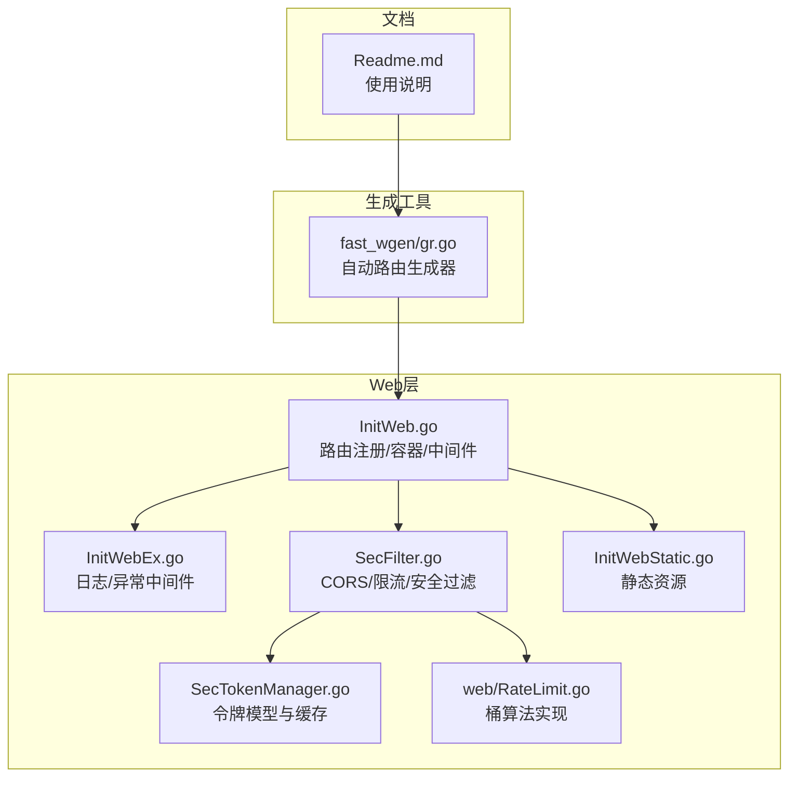
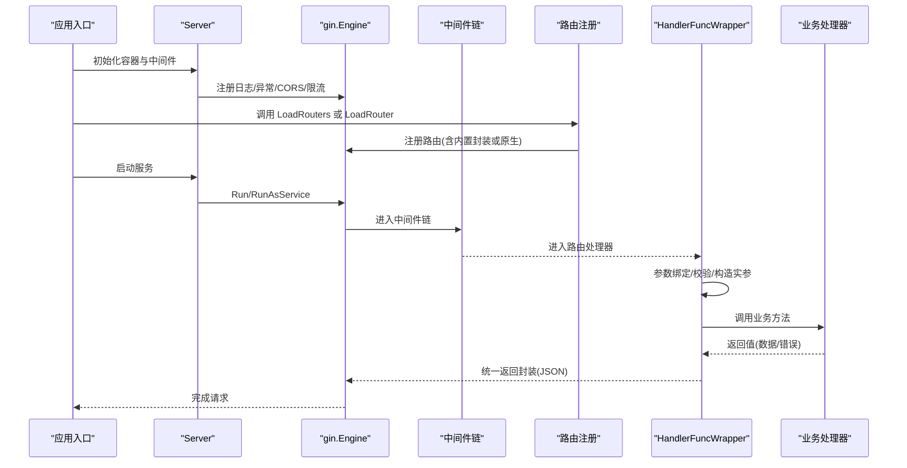
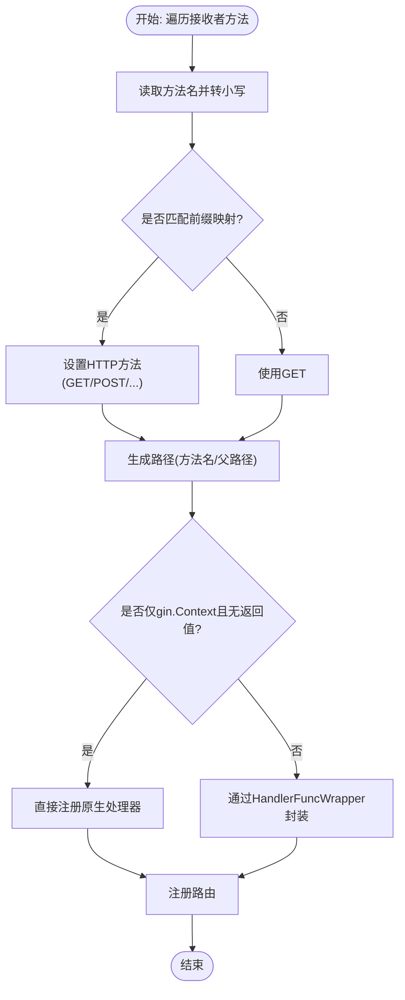
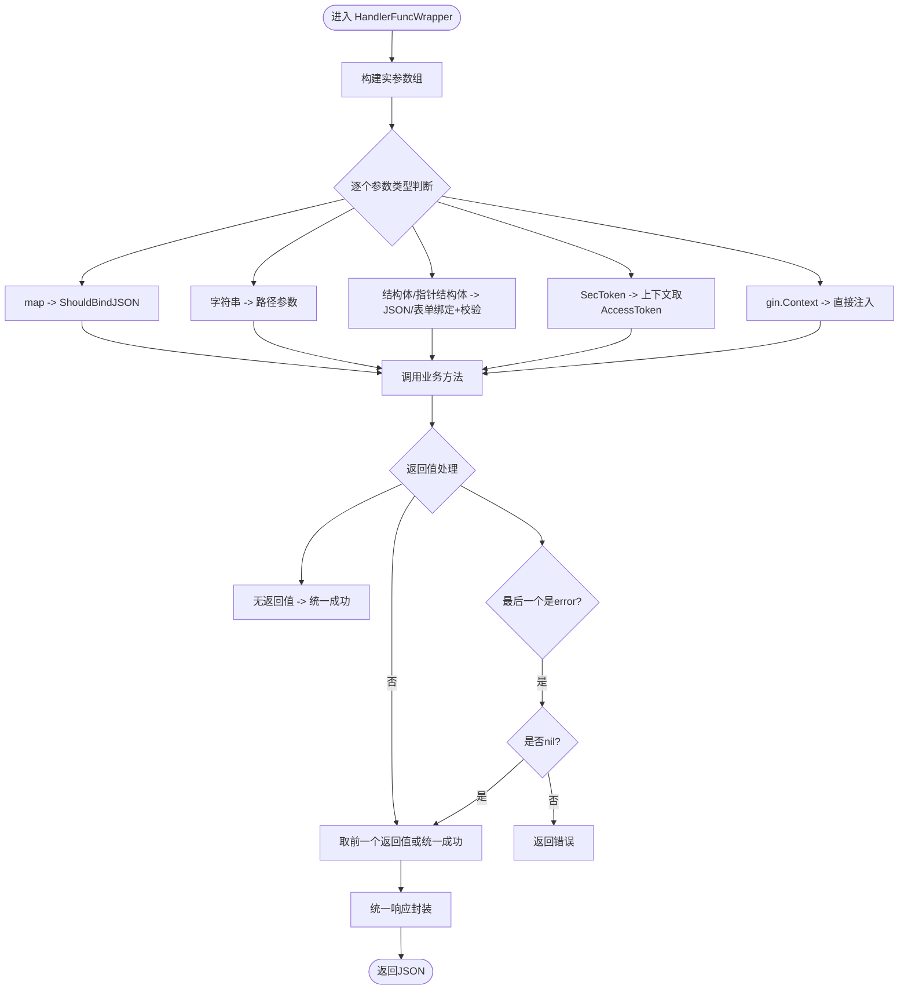
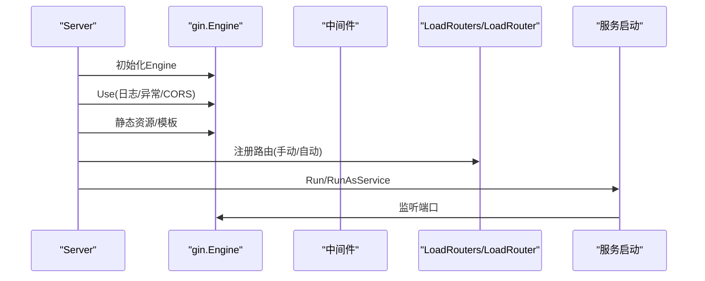
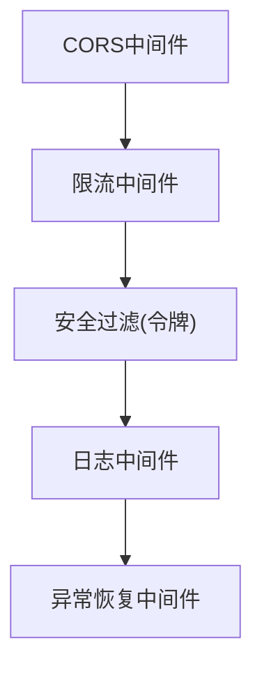
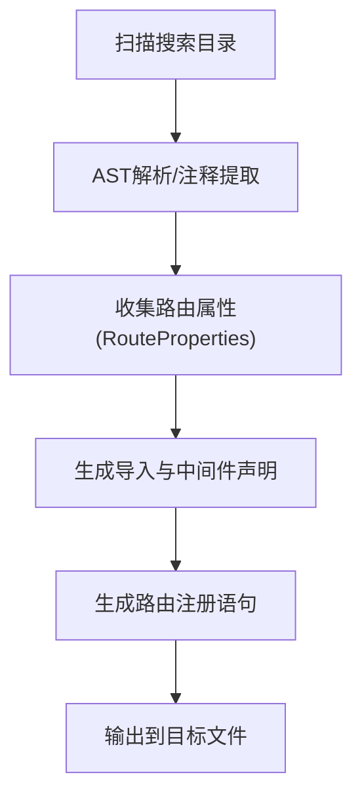
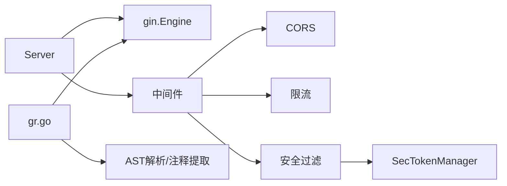

# 路由系统

<cite>
**本文引用的文件**
- [InitWeb.go](file://fast_web/InitWeb.go)
- [InitWebEx.go](file://fast_web/InitWebEx.go)
- [SecFilter.go](file://fast_web/SecFilter.go)
- [InitWebStatic.go](file://fast_web/InitWebStatic.go)
- [RateLimit.go](file://fast_web/web/RateLimit.go)
- [SecTokenManager.go](file://fast_web/SecTokenManager.go)
- [gr.go](file://fast_wgen/gr.go)
- [Readme.md](file://Readme.md)
</cite>

## 目录
1. [简介](#简介)
2. [项目结构](#项目结构)
3. [核心组件](#核心组件)
4. [架构总览](#架构总览)
5. [详细组件分析](#详细组件分析)
6. [依赖分析](#依赖分析)
7. [性能考量](#性能考量)
8. [故障排查指南](#故障排查指南)
9. [结论](#结论)
10. [附录](#附录)

## 简介
本文件系统性阐述 Fast-Go 的路由系统，围绕基于 Gin 的路由注册机制展开，重点覆盖：
- 自动路由生成与手动路由配置
- 反射机制在路由注册中的应用
- LoadRouter 方法的工作原理（方法名映射到 HTTP 方法、路径生成规则、参数提取机制）
- HandlerFuncWrapper 的实现细节（参数类型识别、结构体绑定、表单处理、JSON 解析、统一返回封装）
- 路由容器的管理方式与路由加载流程
- 提供从简单 RESTful API 到复杂嵌套路由结构的完整开发示例

## 项目结构
Fast-Go 的 Web 层位于 fast_web 目录，路由系统主要由以下文件构成：
- 路由注册与容器：InitWeb.go
- 中间件与日志：InitWebEx.go
- 安全与限流：SecFilter.go、SecTokenManager.go、web/RateLimit.go
- 静态资源：InitWebStatic.go
- 路由生成工具：fast_wgen/gr.go
- 使用说明：Readme.md

图表来源
- [InitWeb.go:42-111](file://fast_web/InitWeb.go#L42-L111)
- [InitWebEx.go:52-109](file://fast_web/InitWebEx.go#L52-L109)
- [SecFilter.go:115-129](file://fast_web/SecFilter.go#L115-L129)
- [SecTokenManager.go:13-31](file://fast_web/SecTokenManager.go#L13-L31)
- [InitWebStatic.go:12-27](file://fast_web/InitWebStatic.go#L12-L27)
- [RateLimit.go:42-73](file://fast_web/web/RateLimit.go#L42-L73)
- [gr.go:50-135](file://fast_wgen/gr.go#L50-L135)
- [Readme.md:1-67](file://Readme.md#L1-L67)

章节来源
- [InitWeb.go:42-111](file://fast_web/InitWeb.go#L42-L111)
- [InitWebEx.go:52-109](file://fast_web/InitWebEx.go#L52-L109)
- [SecFilter.go:115-129](file://fast_web/SecFilter.go#L115-L129)
- [SecTokenManager.go:13-31](file://fast_web/SecTokenManager.go#L13-L31)
- [InitWebStatic.go:12-27](file://fast_web/InitWebStatic.go#L12-L27)
- [RateLimit.go:42-73](file://fast_web/web/RateLimit.go#L42-L73)
- [gr.go:50-135](file://fast_wgen/gr.go#L50-L135)
- [Readme.md:1-67](file://Readme.md#L1-L67)

## 核心组件
- 路由容器与引擎
  - Server 结构持有 gin.Engine，并提供 LoadRouters、Run、RunAsService 等方法，负责路由装载与服务启动。
- 自动路由注册
  - LoadRouter 通过反射遍历接收者类型的方法，按约定将方法名映射到 HTTP 方法，生成路径并注册。
- 手动路由注册
  - LoadRouters 接受外部函数式路由注册器，便于集中管理路由。
- 参数绑定与统一返回
  - HandlerFuncWrapper 负责将 gin.Context 参数解析为 Go 类型，支持结构体、指针结构体、字符串、map、gin.Context、SecToken 等；并将返回值统一封装为统一响应结构。
- 中间件体系
  - 日志中间件、异常恢复中间件、CORS 中间件、限流中间件、安全过滤中间件（令牌校验）。
- 静态资源与模板
  - 支持静态资源目录映射与模板加载。
- 路由生成器
  - fast_wgen/gr.go 基于 AST 分析与注释提取，自动生成路由注册代码，可选包裹内置封装。

章节来源
- [InitWeb.go:117-131](file://fast_web/InitWeb.go#L117-L131)
- [InitWeb.go:132-184](file://fast_web/InitWeb.go#L132-L184)
- [InitWeb.go:198-338](file://fast_web/InitWeb.go#L198-L338)
- [InitWeb.go:122-125](file://fast_web/InitWeb.go#L122-L125)
- [InitWebEx.go:52-109](file://fast_web/InitWebEx.go#L52-L109)
- [SecFilter.go:115-129](file://fast_web/SecFilter.go#L115-L129)
- [SecFilter.go:87-100](file://fast_web/SecFilter.go#L87-L100)
- [InitWebStatic.go:12-27](file://fast_web/InitWebStatic.go#L12-L27)
- [gr.go:50-135](file://fast_wgen/gr.go#L50-L135)

## 架构总览
下图展示路由系统的关键交互：Server 容器承载 gin.Engine，中间件在路由注册前注入；自动/手动路由注册完成后，服务启动并处理请求；请求进入 HandlerFuncWrapper 后进行参数绑定与校验，最终统一返回。

图表来源
- [InitWeb.go:49-111](file://fast_web/InitWeb.go#L49-L111)
- [InitWeb.go:122-125](file://fast_web/InitWeb.go#L122-L125)
- [InitWeb.go:132-184](file://fast_web/InitWeb.go#L132-L184)
- [InitWeb.go:198-338](file://fast_web/InitWeb.go#L198-L338)
- [InitWebEx.go:52-109](file://fast_web/InitWebEx.go#L52-L109)
- [SecFilter.go:115-129](file://fast_web/SecFilter.go#L115-L129)
- [SecFilter.go:87-100](file://fast_web/SecFilter.go#L87-L100)

## 详细组件分析

### 自动路由注册：LoadRouter
- 方法名到 HTTP 方法映射
  - 默认使用 GET；若方法名以特定前缀开头，则映射到 POST/PUT/DELETE 等。前缀映射表定义在容器内，用于将 save/update/upload/delete 等语义映射到对应 HTTP 方法。
- 路径生成规则
  - 默认路径为方法名；若接收者包含 Parent 字段且非空，则将父路径与方法名拼接，自动补全斜杠。
- 参数与返回值处理
  - 若方法签名仅为 gin.Context 且无返回值，则直接注册为原生 gin 处理器。
  - 否则通过 HandlerFuncWrapper 包装，统一参数绑定与返回值处理。
- 反射调用
  - 通过反射获取方法元信息与值，动态调用 engine 的对应 HTTP 方法注册路由。

图表来源
- [InitWeb.go:132-184](file://fast_web/InitWeb.go#L132-L184)
- [InitWeb.go:198-338](file://fast_web/InitWeb.go#L198-L338)

章节来源
- [InitWeb.go:132-184](file://fast_web/InitWeb.go#L132-L184)

### HandlerFuncWrapper 实现细节
- 参数类型识别与绑定
  - gin.Context：直接注入
  - SecToken：从上下文获取 AccessToken 并注入
  - 结构体/指针结构体：根据请求方法与内容类型选择 JSON 或表单绑定，随后进行结构体校验
  - 字符串：从路径参数中读取（注意：Go 反射无法获取参数名，此处使用参数名作为键）
  - map：支持 JSON 绑定到 map[string]interface{}，并可选择拷贝到目标 map
- 调用与返回值处理
  - 调用业务方法后，根据返回值数量与类型进行统一封装：
    - 无返回值：返回统一成功消息
    - 有返回值：最后一个返回值为 error 时，若有错误则返回错误；否则取前一个返回值作为数据
    - 返回值类型为统一响应结构时，直接透传；否则封装为统一响应结构

图表来源
- [InitWeb.go:198-338](file://fast_web/InitWeb.go#L198-L338)

章节来源
- [InitWeb.go:198-338](file://fast_web/InitWeb.go#L198-L338)

### 路由容器与加载流程
- 容器初始化
  - 创建 Server，初始化 gin.Engine，注入日志、异常恢复、CORS 等中间件
  - 配置静态资源与模板
- 路由加载
  - 手动加载：通过 LoadRouters 接收函数式路由注册器
  - 自动加载：通过 LoadRouter 反射注册
- 服务运行
  - Run/RunAsService 启动 HTTP 服务，支持代理启动

图表来源
- [InitWeb.go:49-111](file://fast_web/InitWeb.go#L49-L111)
- [InitWeb.go:122-125](file://fast_web/InitWeb.go#L122-L125)
- [InitWeb.go:132-184](file://fast_web/InitWeb.go#L132-L184)

章节来源
- [InitWeb.go:49-111](file://fast_web/InitWeb.go#L49-L111)
- [InitWeb.go:122-125](file://fast_web/InitWeb.go#L122-L125)
- [InitWeb.go:132-184](file://fast_web/InitWeb.go#L132-L184)

### 中间件与安全
- CORS 中间件
  - 设置允许的 Origin、Methods、Headers，OPTIONS 预检直接返回
- 限流中间件
  - 基于令牌桶算法，支持每秒产生令牌数与容量配置
- 安全过滤
  - 令牌校验：从请求头读取 AccessToken/AppKey，校验有效性并注入上下文
- 日志与异常
  - 集成 zap 日志，格式化输出；异常恢复中间件捕获 panic 并返回统一错误

图表来源
- [SecFilter.go:115-129](file://fast_web/SecFilter.go#L115-L129)
- [SecFilter.go:87-100](file://fast_web/SecFilter.go#L87-L100)
- [SecFilter.go:40-81](file://fast_web/SecFilter.go#L40-L81)
- [InitWebEx.go:52-109](file://fast_web/InitWebEx.go#L52-L109)

章节来源
- [SecFilter.go:115-129](file://fast_web/SecFilter.go#L115-L129)
- [SecFilter.go:87-100](file://fast_web/SecFilter.go#L87-L100)
- [SecFilter.go:40-81](file://fast_web/SecFilter.go#L40-L81)
- [InitWebEx.go:52-109](file://fast_web/InitWebEx.go#L52-L109)

### 路由生成器：fast_wgen/gr.go
- 功能概述
  - 基于 AST 解析与注释提取，自动生成路由注册代码
  - 支持为每个路由自动包裹内置封装或直接注册原生处理器
  - 支持限流中间件的自动注入与命名复用
- 关键流程
  - 解析搜索目录，收集路由属性
  - 生成导入与中间件声明
  - 生成路由注册语句（含可选封装）

图表来源
- [gr.go:50-135](file://fast_wgen/gr.go#L50-L135)

章节来源
- [gr.go:50-135](file://fast_wgen/gr.go#L50-L135)

### 开发示例与最佳实践

- 简单 RESTful API
  - 在控制器中定义方法，方法名遵循约定（如 ListUsers、CreateUser、UpdateUser、DeleteUser），即可被自动映射为 GET/POST/PUT/DELETE
  - 参数使用结构体或指针结构体，HandlerFuncWrapper 会自动绑定与校验
  - 返回值遵循“数据/错误”模式，统一返回结构由 Wrapper 自动封装
- 复杂嵌套路由结构
  - 使用 Parent 字段定义父路径，子方法将自动拼接为完整路径
  - 通过 fast_wgen/gr.go 生成路由文件，集中管理路由注册，必要时可选择是否包裹内置封装
- 安全与限流
  - 在需要的路由上挂载限流中间件，或使用令牌校验中间件保护敏感接口
  - CORS 中间件统一处理跨域请求

章节来源
- [InitWeb.go:132-184](file://fast_web/InitWeb.go#L132-L184)
- [InitWeb.go:198-338](file://fast_web/InitWeb.go#L198-L338)
- [SecFilter.go:115-129](file://fast_web/SecFilter.go#L115-L129)
- [SecFilter.go:87-100](file://fast_web/SecFilter.go#L87-L100)
- [SecFilter.go:40-81](file://fast_web/SecFilter.go#L40-L81)
- [gr.go:50-135](file://fast_wgen/gr.go#L50-L135)

## 依赖分析
- 组件耦合
  - Server 依赖 gin.Engine 与中间件；HandlerFuncWrapper 依赖 Gin 绑定与校验库
  - SecFilter 依赖速率限制实现与安全令牌模型
  - 路由生成器依赖 AST 解析与注释提取
- 外部依赖
  - Gin、Zap、Swag（用于文档生成，配合生成器）
  - 令牌桶算法实现（自研 web/RateLimit.go）

图表来源
- [InitWeb.go:49-111](file://fast_web/InitWeb.go#L49-L111)
- [SecFilter.go:115-129](file://fast_web/SecFilter.go#L115-L129)
- [SecFilter.go:87-100](file://fast_web/SecFilter.go#L87-L100)
- [SecFilter.go:40-81](file://fast_web/SecFilter.go#L40-L81)
- [SecTokenManager.go:13-31](file://fast_web/SecTokenManager.go#L13-L31)
- [gr.go:50-135](file://fast_wgen/gr.go#L50-L135)

章节来源
- [InitWeb.go:49-111](file://fast_web/InitWeb.go#L49-L111)
- [SecFilter.go:115-129](file://fast_web/SecFilter.go#L115-L129)
- [SecFilter.go:87-100](file://fast_web/SecFilter.go#L87-L100)
- [SecFilter.go:40-81](file://fast_web/SecFilter.go#L40-L81)
- [SecTokenManager.go:13-31](file://fast_web/SecTokenManager.go#L13-L31)
- [gr.go:50-135](file://fast_wgen/gr.go#L50-L135)

## 性能考量
- 反射成本
  - LoadRouter 与 HandlerFuncWrapper 使用反射，适合开发期与中小型规模；高并发场景建议结合生成器减少反射开销
- 绑定与校验
  - JSON/表单绑定与结构体校验在每次请求都会执行，建议合理设计结构体与校验规则，避免冗余字段
- 限流策略
  - 令牌桶算法在中间件层生效，可根据接口重要性差异化配置 num 与 cap

[本节为通用指导，无需具体文件分析]

## 故障排查指南
- 路由未注册
  - 检查方法名是否符合约定；确认已调用 LoadRouters 或 LoadRouter
  - 确认中间件顺序与 CORS 配置
- 参数绑定失败
  - 检查请求方法与内容类型是否匹配（JSON/表单）；确保结构体标签正确
  - 若为 map，确认请求体为合法 JSON
- 统一返回异常
  - 确认业务方法返回值模式（数据/错误）；错误类型应为 error
- 限流触发
  - 调整限流中间件的 num 与 cap；或为特定路由单独配置

章节来源
- [InitWeb.go:198-338](file://fast_web/InitWeb.go#L198-L338)
- [SecFilter.go:87-100](file://fast_web/SecFilter.go#L87-L100)

## 结论
Fast-Go 的路由系统以 Gin 为核心，结合反射与生成器，提供了灵活的自动与手动路由注册能力。HandlerFuncWrapper 统一了参数绑定、校验与返回封装，简化了业务开发；中间件体系保障了日志、异常、跨域与安全需求。通过 fast_wgen/gr.go，开发者可以快速生成路由注册代码，提升开发效率与一致性。

[本节为总结，无需具体文件分析]

## 附录
- 使用说明与命令
  - 安装生成器与生成路由文件
  - 生成 Swagger 文档
  - Docker 打包与启动

章节来源
- [Readme.md:1-67](file://Readme.md#L1-L67)