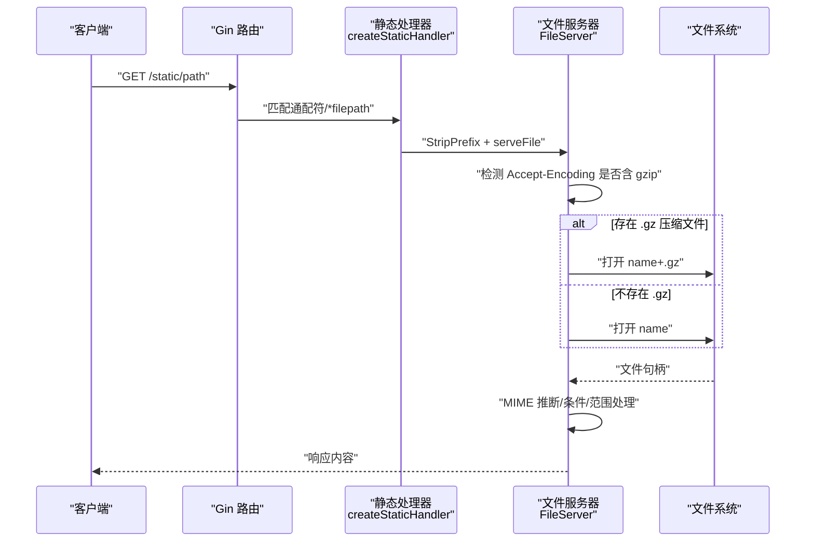
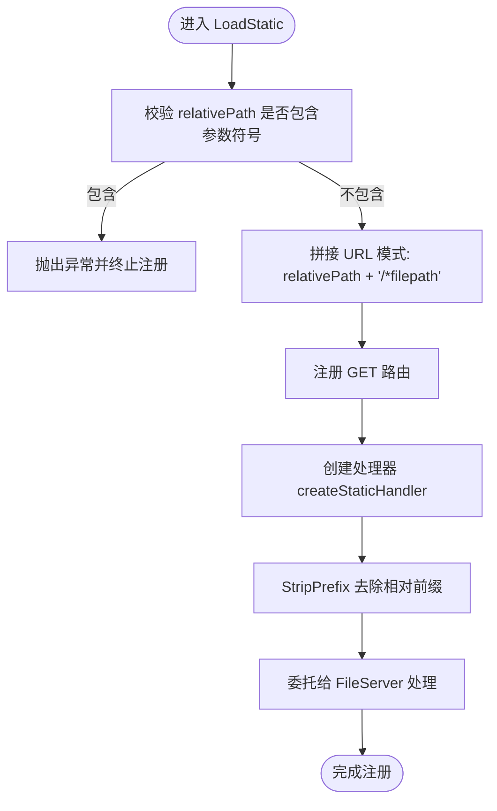
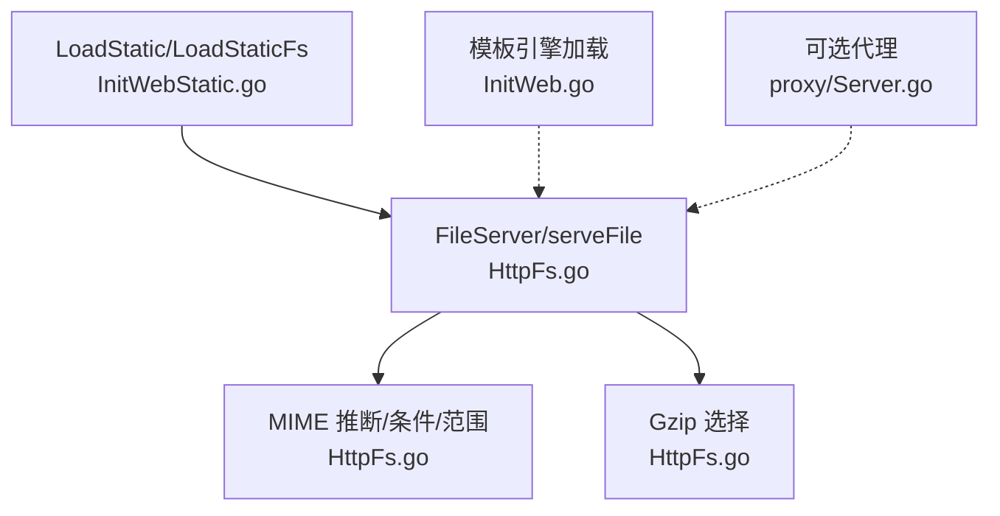

# 静态资源服务

<cite>
**本文引用的文件**
- [fast_web/InitWebStatic.go](file://fast_web/InitWebStatic.go)
- [fast_web/web/HttpFs.go](file://fast_web/web/HttpFs.go)
- [fast_web/InitWeb.go](file://fast_web/InitWeb.go)
- [fast_utils/HttpMediaType.go](file://fast_utils/HttpMediaType.go)
- [fast_web/web/proxy/Server.go](file://fast_web/web/proxy/Server.go)
- [fast_base/InitConfig.go](file://fast_base/InitConfig.go)
</cite>

## 目录
1. [简介](#简介)
2. [项目结构](#项目结构)
3. [核心组件](#核心组件)
4. [架构总览](#架构总览)
5. [组件详解](#组件详解)
6. [依赖关系分析](#依赖关系分析)
7. [性能与优化](#性能与优化)
8. [故障排查指南](#故障排查指南)
9. [结论](#结论)
10. [附录](#附录)

## 简介
本章节面向“Fast-Go 静态资源服务”的使用者与维护者，系统性阐述静态文件服务的配置与实现，覆盖路径映射、文件系统访问、MIME 类型处理、Gzip 压缩机制、模板引擎集成与 HTML 动态渲染、以及静态资源优化策略（缓存控制、CDN 集成、性能监控）与文件上传下载的安全注意事项。文档基于仓库现有代码进行深入解读，帮助读者快速掌握静态资源服务的设计与最佳实践。

## 项目结构
静态资源服务主要分布在以下模块：
- fast_web/InitWebStatic.go：对外暴露 LoadStatic/LoadStaticFs 接口，负责注册静态资源路由与处理器。
- fast_web/web/HttpFs.go：自研 HTTP 文件系统抽象与文件服务器实现，包含 MIME 类型推断、Gzip 优先选择、条件请求处理、范围请求支持等。
- fast_web/InitWeb.go：应用启动阶段加载静态资源与模板引擎，解析配置并注册路由。
- fast_utils/HttpMediaType.go：提供基于扩展名的媒体类型映射工具，便于静态资源响应头设置。
- fast_web/web/proxy/Server.go：可选的反向代理能力，便于开发调试或特殊场景下的网络代理。
- fast_base/InitConfig.go：配置加载与环境变量解析，为静态资源路径与模板路径提供占位符替换基础。

图表来源
- [fast_web/InitWeb.go:80-97](file://fast_web/InitWeb.go#L80-L97)
- [fast_web/InitWebStatic.go:12-27](file://fast_web/InitWebStatic.go#L12-L27)
- [fast_web/web/HttpFs.go:624-713](file://fast_web/web/HttpFs.go#L624-L713)

章节来源
- [fast_web/InitWeb.go:49-111](file://fast_web/InitWeb.go#L49-L111)
- [fast_web/InitWebStatic.go:12-27](file://fast_web/InitWebStatic.go#L12-L27)
- [fast_web/web/HttpFs.go:624-713](file://fast_web/web/HttpFs.go#L624-L713)

## 核心组件
- 静态资源注册器（LoadStatic/LoadStaticFs）
  - 提供相对路径与根目录映射，自动拼接通配符路径，注册 GET 请求处理器。
  - 对 URL 参数进行限制，禁止在静态目录服务中使用参数化路径。
- 文件服务器（FileServer + serveFile）
  - 支持目录重定向、index.html 自动索引、目录列表展示。
  - 优先检测客户端是否支持 gzip，若存在同名 .gz 文件则直接返回压缩内容。
  - 通过条件请求（If-Modified-Since/If-None-Match 等）与范围请求（Range）提升缓存命中与传输效率。
- MIME 类型与媒体类型
  - serveFile 与 serveContent 共同负责 Content-Type 推断与设置。
  - fast_utils/HttpMediaType.go 提供扩展名到媒体类型的映射，可用于自定义场景。
- 模板引擎集成
  - 启动阶段按配置加载模板目录，使用 Delims 分隔符，支持 HTML 动态渲染。
- 配置与路径替换
  - 静态资源路径与模板路径支持 ${execPath} 占位符替换，结合配置系统实现灵活部署。

章节来源
- [fast_web/InitWebStatic.go:12-27](file://fast_web/InitWebStatic.go#L12-L27)
- [fast_web/web/HttpFs.go:624-713](file://fast_web/web/HttpFs.go#L624-L713)
- [fast_web/web/HttpFs.go:252-376](file://fast_web/web/HttpFs.go#L252-L376)
- [fast_utils/HttpMediaType.go:5-55](file://fast_utils/HttpMediaType.go#L5-L55)
- [fast_web/InitWeb.go:92-97](file://fast_web/InitWeb.go#L92-L97)
- [fast_base/InitConfig.go:22-50](file://fast_base/InitConfig.go#L22-L50)

## 架构总览
静态资源服务的整体流程如下：
- 应用启动时，从配置中读取静态资源路径模式与实际物理路径，逐条注册路由。
- 请求到达时，通过 Gin 路由匹配到静态资源处理器。
- 处理器使用自研文件服务器，根据 Accept-Encoding 选择是否存在 .gz 的压缩版本。
- 若为目录，优先返回 index.html；否则根据文件类型推断 MIME 并发送内容。
- 支持条件请求与范围请求，减少带宽消耗并提升缓存效率。

图表来源
- [fast_web/InitWebStatic.go:29-58](file://fast_web/InitWebStatic.go#L29-L58)
- [fast_web/web/HttpFs.go:624-713](file://fast_web/web/HttpFs.go#L624-L713)
- [fast_web/web/HttpFs.go:252-376](file://fast_web/web/HttpFs.go#L252-L376)

## 组件详解

### LoadStatic 与路径映射
- 接口设计
  - LoadStatic(relativePath, root)：内部封装为 gin.Dir(root, false)，再交由 LoadStaticFs 注册。
  - LoadStaticFs(relativePath, fs)：对 relativePath 进行参数校验，禁止包含冒号或星号；拼接 /*filepath 通配符；注册 GET 路由。
- 路由行为
  - 仅注册 GET；通过 http.StripPrefix 去除相对前缀，确保路径正确传递给文件服务器。
  - 在处理器内部，针对特定只读文件系统类型进行 404 标记兜底，随后交由文件服务器完成最终处理。
- 设计要点
  - 禁止在静态目录服务中使用 URL 参数，避免路径解析歧义与安全风险。
  - 通过通配符捕获完整子路径，配合文件服务器实现自然的目录结构映射。

图表来源
- [fast_web/InitWebStatic.go:12-27](file://fast_web/InitWebStatic.go#L12-L27)
- [fast_web/InitWebStatic.go:29-58](file://fast_web/InitWebStatic.go#L29-L58)

章节来源
- [fast_web/InitWebStatic.go:12-27](file://fast_web/InitWebStatic.go#L12-L27)
- [fast_web/InitWebStatic.go:29-58](file://fast_web/InitWebStatic.go#L29-L58)

### HttpFs 文件系统抽象与文件服务器
- 文件系统抽象
  - Dir 实现 FileSystem 接口，Open 时进行路径清洗与安全检查，避免越权访问。
  - 提供 ServeContent/ServeFile 系列方法，统一处理 MIME 类型、条件请求、范围请求与压缩响应。
- 文件服务器核心逻辑（serveFile）
  - 目录重定向：末尾为 index.html 的请求重定向至目录自身；目录末尾缺“/”时进行规范化重定向。
  - 压缩优先：若客户端支持 gzip，优先尝试打开 name+".gz"；否则回退到原始文件。
  - 目录索引：目录下存在 index.html 时优先返回该文件；否则列出目录内容。
  - 条件与范围：结合条件请求与 Range 解析，支持 304/206 等状态码与分片传输。
- MIME 类型处理
  - 若未显式设置 Content-Type，优先根据扩展名推断；若仍不可得，则读取首块内容进行嗅探。
  - 对于 gzip 压缩文件，去除 .gz 后缀参与类型推断，保证响应头与实际内容一致。
- 压缩机制
  - 客户端请求头 Accept-Encoding 包含 gzip 时，优先返回已存在的 .gz 文件。
  - 返回时设置 Content-Encoding:gzip、Vary:Accept-Encoding，并在必要时设置 Content-Length。

图表来源
- [fast_web/web/HttpFs.go:624-713](file://fast_web/web/HttpFs.go#L624-L713)
- [fast_web/web/HttpFs.go:252-376](file://fast_web/web/HttpFs.go#L252-L376)

章节来源
- [fast_web/web/HttpFs.go:624-713](file://fast_web/web/HttpFs.go#L624-L713)
- [fast_web/web/HttpFs.go:252-376](file://fast_web/web/HttpFs.go#L252-L376)

### MIME 类型处理与扩展
- serveContent 与 serveFile 共同负责 Content-Type 的确定与设置：
  - 优先使用显式设置的响应头；
  - 否则依据扩展名推断；
  - 若扩展名未知，读取首块内容进行嗅探；
  - 对 gzip 文件，去除 .gz 后缀参与类型推断，确保一致性。
- fast_utils/HttpMediaType.go 提供扩展名到媒体类型的映射表，适用于非 HTTP 场景或自定义扩展类型需求。

章节来源
- [fast_web/web/HttpFs.go:252-376](file://fast_web/web/HttpFs.go#L252-L376)
- [fast_utils/HttpMediaType.go:5-55](file://fast_utils/HttpMediaType.go#L5-L55)

### 模板引擎集成与 HTML 动态渲染
- 启动阶段按配置加载模板目录，设置自定义分隔符，支持 HTML 动态渲染。
- 与静态资源服务解耦：静态资源走文件服务器，模板渲染走模板引擎，二者可并存。

章节来源
- [fast_web/InitWeb.go:92-97](file://fast_web/InitWeb.go#L92-L97)

### 配置与路径替换
- 静态资源与模板路径支持 ${execPath} 占位符，结合配置加载与环境变量解析，实现跨平台部署的一致性。
- 应用启动时遍历配置中的路径模式与实际位置，逐条注册静态资源路由。

章节来源
- [fast_web/InitWeb.go:80-97](file://fast_web/InitWeb.go#L80-L97)
- [fast_base/InitConfig.go:22-50](file://fast_base/InitConfig.go#L22-L50)

## 依赖关系分析
- 组件内聚与耦合
  - LoadStatic/LoadStaticFs 与 Gin 路由强耦合，但通过 http.StripPrefix 与 FileServer 解耦具体文件系统实现。
  - FileServer 与 serveFile 依赖 MIME 推断与条件/范围处理逻辑，形成高内聚的响应层。
  - 模板引擎与静态资源服务相互独立，通过配置分别启用。
- 外部依赖
  - Gin：路由注册与上下文处理。
  - 标准库 net/http、mime、io/fs 等：HTTP 协议、MIME 与文件系统抽象。
  - 可选代理：用于开发调试或特殊网络场景。

图表来源
- [fast_web/InitWebStatic.go:12-27](file://fast_web/InitWebStatic.go#L12-L27)
- [fast_web/web/HttpFs.go:624-713](file://fast_web/web/HttpFs.go#L624-L713)
- [fast_web/InitWeb.go:92-97](file://fast_web/InitWeb.go#L92-L97)
- [fast_web/web/proxy/Server.go:30-73](file://fast_web/web/proxy/Server.go#L30-L73)

章节来源
- [fast_web/InitWebStatic.go:12-27](file://fast_web/InitWebStatic.go#L12-L27)
- [fast_web/web/HttpFs.go:624-713](file://fast_web/web/HttpFs.go#L624-L713)
- [fast_web/InitWeb.go:92-97](file://fast_web/InitWeb.go#L92-L97)
- [fast_web/web/proxy/Server.go:30-73](file://fast_web/web/proxy/Server.go#L30-L73)

## 性能与优化
- 缓存控制
  - 利用 Last-Modified 与 ETag（由条件请求处理逻辑支持），结合浏览器/CDN 缓存策略，显著降低重复请求的带宽消耗。
  - 对目录与文件分别设置合理的缓存策略，避免缓存穿透。
- CDN 集成
  - 将静态资源托管至 CDN，结合 gzip 压缩与范围请求，进一步提升全球访问速度。
  - 对 index.html 等入口页面建议短缓存，对静态资源（JS/CSS/图片）建议长缓存并采用内容指纹命名策略。
- 压缩与传输
  - 服务端优先返回 .gz 压缩文件，客户端需正确设置 Accept-Encoding:gzip。
  - 对大文件启用范围请求，支持断点续传与多段并行下载。
- 监控与可观测性
  - 记录静态资源访问日志（可复用 Gin 中间件），统计热点文件与错误率。
  - 关注 304/206 等高效响应占比，评估缓存命中效果。
- 安全与合规
  - 严格限制静态目录的可访问范围，避免敏感文件泄露。
  - 对上传目录实施严格的权限控制与内容扫描，防止恶意文件注入。

## 故障排查指南
- 404/403 错误
  - 检查 relativePath 是否包含参数符号，静态目录服务不允许参数化路径。
  - 确认物理路径是否存在、权限是否正确，以及是否被安全策略拦截。
- 目录访问异常
  - 确保目录末尾包含“/”，并确认 index.html 是否存在；若不存在，将返回目录列表。
- 压缩无效
  - 确认客户端请求头 Accept-Encoding 含 gzip；服务端将优先返回 name+.gz。
- 条件请求未生效
  - 检查 If-Modified-Since/If-None-Match 等头部是否正确设置；服务端会据此返回 304 或 206。
- 模板渲染问题
  - 确认模板目录配置正确，分隔符设置与模板文件一致；检查模板语法与数据绑定。

章节来源
- [fast_web/InitWebStatic.go:17-19](file://fast_web/InitWebStatic.go#L17-L19)
- [fast_web/web/HttpFs.go:624-713](file://fast_web/web/HttpFs.go#L624-L713)
- [fast_web/InitWeb.go:92-97](file://fast_web/InitWeb.go#L92-L97)

## 结论
Fast-Go 的静态资源服务通过简洁的路由注册与强大的文件服务器实现，提供了完善的 MIME 类型推断、Gzip 压缩、条件与范围请求支持，并与模板引擎无缝集成。配合缓存控制、CDN 与性能监控策略，可在保证安全性的同时获得卓越的用户体验。建议在生产环境中结合实际业务场景，制定统一的静态资源命名规范与缓存策略，并持续优化压缩与传输链路。

## 附录
- 文件上传下载安全建议
  - 上传目录最小权限原则，仅允许必要的写入与执行权限。
  - 对上传文件进行类型校验与病毒扫描，拒绝可疑扩展名。
  - 采用随机命名与白名单策略，避免路径穿越与直接访问。
  - 对上传文件进行二次处理（如缩略图生成、水印添加），并在下载时设置合适的 Content-Disposition 与缓存策略。
- 参考实现位置
  - 静态资源注册：[fast_web/InitWebStatic.go:12-27](file://fast_web/InitWebStatic.go#L12-L27)
  - 文件服务器与压缩：[fast_web/web/HttpFs.go:624-713](file://fast_web/web/HttpFs.go#L624-L713)
  - MIME 类型推断：[fast_web/web/HttpFs.go:252-376](file://fast_web/web/HttpFs.go#L252-L376)
  - 模板引擎加载：[fast_web/InitWeb.go:92-97](file://fast_web/InitWeb.go#L92-L97)
  - 配置与路径替换：[fast_web/InitWeb.go:80-97](file://fast_web/InitWeb.go#L80-L97)、[fast_base/InitConfig.go:22-50](file://fast_base/InitConfig.go#L22-L50)