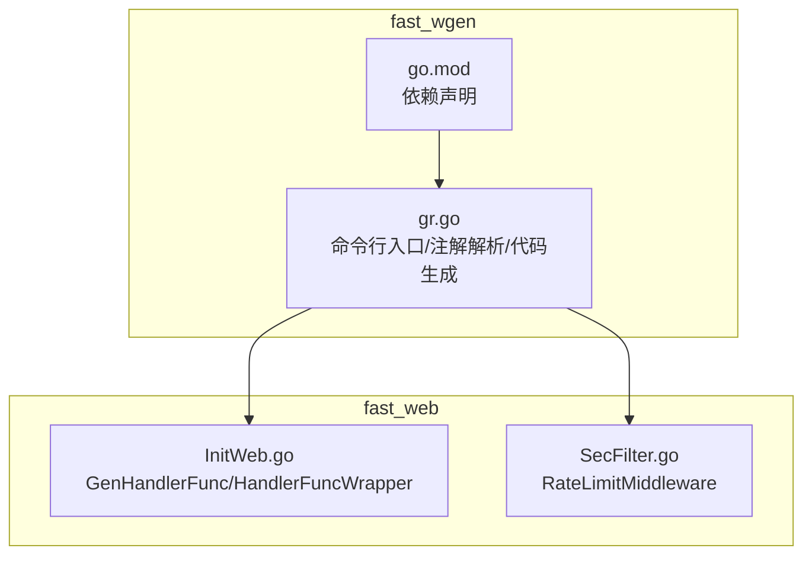
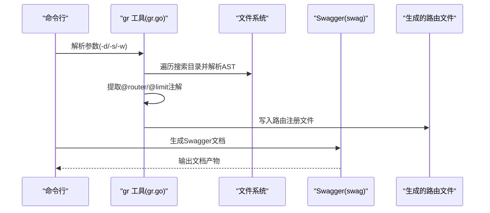
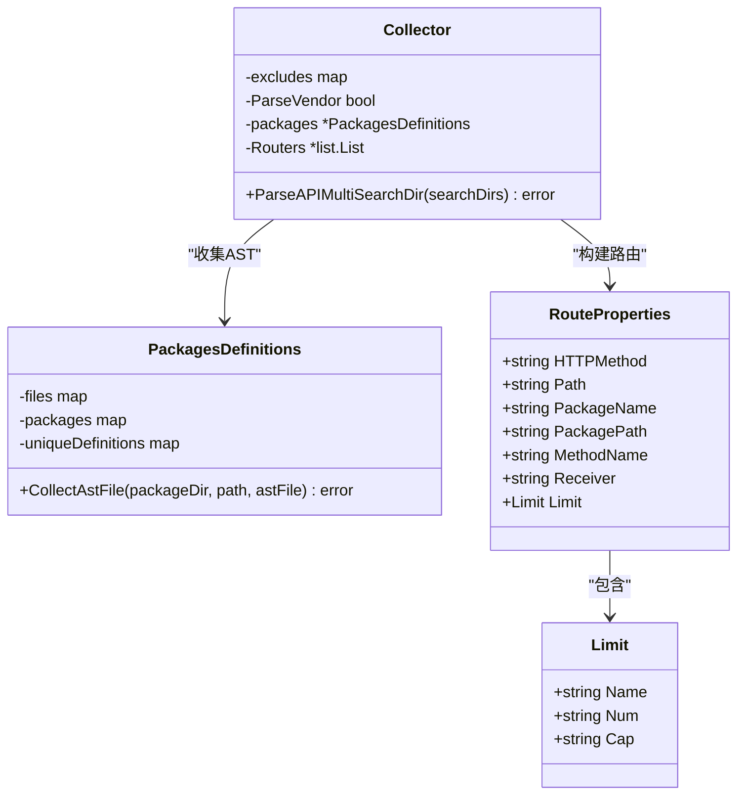
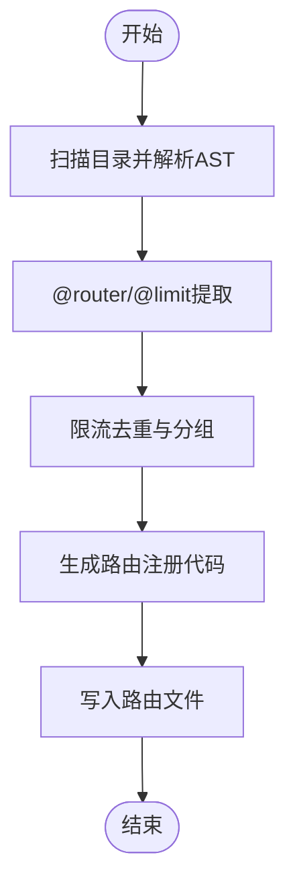
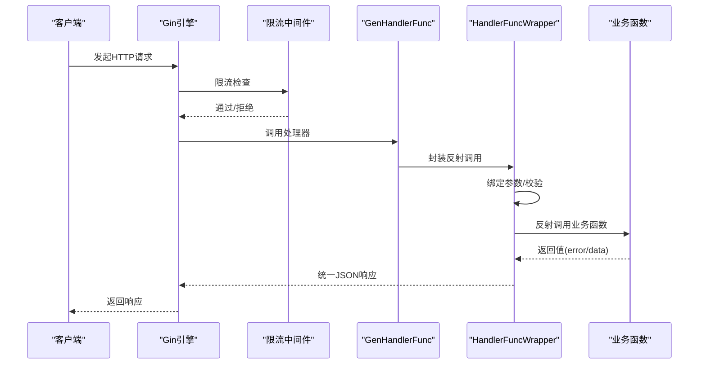
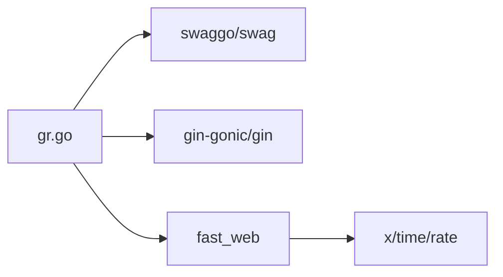

# 代码生成器

<cite>
**本文引用的文件**
- [fast_wgen/gr.go](file://fast_wgen/gr.go)
- [fast_wgen/go.mod](file://fast_wgen/go.mod)
- [Readme.md](file://Readme.md)
- [fast_web/InitWeb.go](file://fast_web/InitWeb.go)
- [fast_web/SecFilter.go](file://fast_web/SecFilter.go)
</cite>

## 目录
1. [简介](#简介)
2. [项目结构](#项目结构)
3. [核心组件](#核心组件)
4. [架构总览](#架构总览)
5. [详细组件分析](#详细组件分析)
6. [依赖分析](#依赖分析)
7. [性能考虑](#性能考虑)
8. [故障排查指南](#故障排查指南)
9. [结论](#结论)
10. [附录](#附录)

## 简介
本文件面向 Fast-Go 代码生成器（简称 gr 工具）的使用者与维护者，系统性讲解其功能与使用方法，覆盖以下主题：
- 路由代码生成：通过注解驱动的方式从源码中抽取路由信息，自动生成 LoadRouter 文件。
- API 文档生成：结合 Swagger 工具链生成接口文档。
- 模板引擎：当前实现为硬编码生成 Go 源文件，未引入外部模板引擎；可基于现有生成流程扩展。
- 工作原理与配置项：命令行参数、注解规范、中间件注入策略。
- 完整流程：从注解编写到代码生成再到运行时加载。
- 自定义扩展：如何在现有生成器基础上扩展新能力。
- 最佳实践与常见问题：性能、稳定性与排错建议。

## 项目结构
Fast-Go 仓库采用多模块工作区组织，与代码生成器直接相关的模块与文件如下：
- fast_wgen：包含 gr 工具源码与构建元数据，负责扫描源码、解析注解并生成路由文件。
- fast_web：提供 Web 层基础设施，包括 Gin 路由容器、统一返回结构、限流中间件与反射封装的处理器适配器。
- Readme.md：包含 swag 初始化与构建示例，指导如何生成 Swagger 文档与编译服务端程序。

图表来源
- [fast_wgen/gr.go:1-531](file://fast_wgen/gr.go#L1-L531)
- [fast_wgen/go.mod:1-31](file://fast_wgen/go.mod#L1-L31)
- [fast_web/InitWeb.go:185-338](file://fast_web/InitWeb.go#L185-L338)
- [fast_web/SecFilter.go:83-100](file://fast_web/SecFilter.go#L83-L100)

章节来源
- [fast_wgen/gr.go:1-531](file://fast_wgen/gr.go#L1-L531)
- [fast_wgen/go.mod:1-31](file://fast_wgen/go.mod#L1-L31)
- [Readme.md:1-67](file://Readme.md#L1-L67)

## 核心组件
- 命令行入口与参数
  - 支持的参数：
    - -d：扫描目录（支持逗号分隔的多个目录）
    - -s：生成的路由文件输出路径
    - -w：是否启用“内置封装”（1 表示启用，将通过反射封装处理器）
  - 参数优先级：命令行 > 主函数注解块中的参数（见 @gendir/@genoutput/@genwrapper）

- 注解规范
  - @router：定义路由路径与 HTTP 方法，格式要求为“路径 [方法]”
  - @limit：定义限流参数，支持三段式（num cap name），缺省时 cap 默认等于 num
  - @gendir/@genoutput/@genwrapper：在 main 函数所在文件的注释块中声明默认扫描目录、输出文件与封装开关

- 解析与生成流程
  - 阶段1：遍历搜索目录，收集 Go 源文件并解析 AST，同时获取包导入路径。
  - 阶段2：遍历文件中的函数声明，匹配注释块，提取 @router 与 @limit 信息，构建路由属性集合。
  - 阶段3：生成路由文件，按需注入限流中间件与反射封装层，输出标准 Go 源文件。

- 运行时适配
  - 生成的路由文件通过 fast_web 提供的 GenHandlerFunc 与 HandlerFuncWrapper 将反射调用转换为 Gin 标准处理器。
  - 限流中间件由 fast_web.SecFilter 提供，支持命名限流与即时限流两种模式。

章节来源
- [fast_wgen/gr.go:20-48](file://fast_wgen/gr.go#L20-L48)
- [fast_wgen/gr.go:194-241](file://fast_wgen/gr.go#L194-L241)
- [fast_wgen/gr.go:354-382](file://fast_wgen/gr.go#L354-L382)
- [fast_wgen/gr.go:406-450](file://fast_wgen/gr.go#L406-L450)
- [fast_wgen/gr.go:50-135](file://fast_wgen/gr.go#L50-L135)
- [fast_web/InitWeb.go:185-338](file://fast_web/InitWeb.go#L185-L338)
- [fast_web/SecFilter.go:83-100](file://fast_web/SecFilter.go#L83-L100)

## 架构总览
下图展示 gr 工具从命令行到生成文件的总体流程，以及生成文件与运行时框架的交互。

图表来源
- [fast_wgen/gr.go:32-48](file://fast_wgen/gr.go#L32-L48)
- [fast_wgen/gr.go:168-192](file://fast_wgen/gr.go#L168-L192)
- [fast_wgen/gr.go:50-135](file://fast_wgen/gr.go#L50-L135)
- [Readme.md:11-15](file://Readme.md#L11-L15)

## 详细组件分析

### 组件一：注解解析与路由收集（Collector）
- 功能要点
  - 多目录扫描：支持以逗号分隔的多个搜索目录。
  - AST 解析：遍历 Go 源文件，收集函数声明与注释块。
  - 注解提取：匹配 @router 与 @limit，构造 RouteProperties 列表。
  - 包路径映射：通过 go list 获取包导入路径，便于生成 import 语句。

图表来源
- [fast_wgen/gr.go:159-192](file://fast_wgen/gr.go#L159-L192)
- [fast_wgen/gr.go:472-530](file://fast_wgen/gr.go#L472-L530)
- [fast_wgen/gr.go:456-470](file://fast_wgen/gr.go#L456-L470)

章节来源
- [fast_wgen/gr.go:168-192](file://fast_wgen/gr.go#L168-L192)
- [fast_wgen/gr.go:244-283](file://fast_wgen/gr.go#L244-L283)
- [fast_wgen/gr.go:334-352](file://fast_wgen/gr.go#L334-L352)
- [fast_wgen/gr.go:384-450](file://fast_wgen/gr.go#L384-L450)

### 组件二：路由生成与中间件注入（MakeRouter）
- 功能要点
  - 生成文件头：导入 gin、reflect、fast_web。
  - 限流中间件去重与分组：同名限流合并参数，不同名即时创建。
  - 路由注册：根据是否带接收者（结构体方法）与是否启用封装，生成不同的调用形式。
  - 输出函数：LoadRouters(gin *gin.Engine)，供应用启动时调用。

图表来源
- [fast_wgen/gr.go:50-135](file://fast_wgen/gr.go#L50-L135)

章节来源
- [fast_wgen/gr.go:50-135](file://fast_wgen/gr.go#L50-L135)

### 组件三：运行时处理器适配（GenHandlerFunc/HandlerFuncWrapper）
- 功能要点
  - GenHandlerFunc：判断是否为原生 gin.HandlerFunc，若是则直接返回；否则进入封装流程。
  - HandlerFuncWrapper：基于反射解析函数签名，自动完成：
    - 参数绑定（JSON/Form）、结构体校验
    - 路径参数、Map 参数处理
    - 返回值统一处理（错误识别、统一响应结构）
  - 与 Gin 中间件协作：可叠加限流中间件与 CORS 等。

图表来源
- [fast_web/InitWeb.go:185-338](file://fast_web/InitWeb.go#L185-L338)
- [fast_web/SecFilter.go:83-100](file://fast_web/SecFilter.go#L83-L100)

章节来源
- [fast_web/InitWeb.go:185-338](file://fast_web/InitWeb.go#L185-L338)
- [fast_web/SecFilter.go:83-100](file://fast_web/SecFilter.go#L83-L100)

### 组件四：Swagger 文档生成（与 gr 协同）
- 功能要点
  - 使用 swag 工具从源码注释生成 OpenAPI 文档。
  - 建议在生成路由文件后执行 swag 初始化，确保文档与路由一致。
  - 构建阶段将服务二进制与静态资源（含 swagger-ui）一起打包。

章节来源
- [Readme.md:11-15](file://Readme.md#L11-L15)

## 依赖分析
- 外部依赖
  - swaggo/swag：用于解析注释并生成 OpenAPI 文档。
  - gin-gonic/gin：Web 框架与路由容器。
  - x/time/rate：令牌桶限流算法。
- 内部依赖
  - fast_web：提供 GenHandlerFunc、HandlerFuncWrapper、RateLimitMiddleware 等运行时能力。
  - fast_base/fast_utils：基础工具与日志等基础设施。

图表来源
- [fast_wgen/go.mod:5](file://fast_wgen/go.mod#L5)
- [fast_wgen/gr.go:7](file://fast_wgen/gr.go#L7)
- [fast_web/SecFilter.go:6](file://fast_web/SecFilter.go#L6)

章节来源
- [fast_wgen/go.mod:1-31](file://fast_wgen/go.mod#L1-L31)
- [fast_wgen/gr.go:3-18](file://fast_wgen/gr.go#L3-L18)

## 性能考虑
- AST 扫描与排序：对所有文件进行排序后逐个处理，时间复杂度近似 O(N log N) 的排序与 O(N) 的遍历。
- 限流中间件：令牌桶算法在高并发下具备良好吞吐与延迟特性，建议对关键接口启用限流。
- 反射封装：HandlerFuncWrapper 在参数绑定与校验上引入额外开销，建议仅在需要统一处理的场景启用封装（-w=1）。
- I/O：生成文件为一次性写入，I/O 成本与文件数量线性相关。

## 故障排查指南
- 目录不存在或不可访问
  - 现象：提示目录不存在并退出。
  - 排查：确认 -d 指定的路径存在且可读。
- 无法解析 @router 注解
  - 现象：无法识别路由定义。
  - 排查：确保注释格式为“路径 [方法]”，且位于函数声明的 doc 注释块内。
- 限流参数缺失
  - 现象：未生成限流中间件或参数不生效。
  - 排查：@limit 缺少参数时会尝试复用已命名限流；若未命名，需提供 num 与 cap。
- 生成文件被覆盖
  - 现象：生成前会删除旧文件，注意备份。
- Swagger 文档不更新
  - 现象：文档与最新路由不一致。
  - 排查：重新执行 swag 初始化，并确保源码注释与路由同步。

章节来源
- [fast_wgen/gr.go:52-57](file://fast_wgen/gr.go#L52-L57)
- [fast_wgen/gr.go:408-411](file://fast_wgen/gr.go#L408-L411)
- [fast_wgen/gr.go:360-382](file://fast_wgen/gr.go#L360-L382)
- [fast_wgen/gr.go:65-72](file://fast_wgen/gr.go#L65-L72)
- [Readme.md:11-15](file://Readme.md#L11-L15)

## 结论
gr 工具通过注解驱动的方式，将路由定义与代码生成解耦，显著提升开发效率与一致性。配合 fast_web 的统一处理器封装与限流中间件，以及 swag 的文档生成，形成从“注解—生成—运行—文档”的完整闭环。建议在团队内统一注解规范与生成流程，持续优化生成模板与中间件策略。

## 附录

### 使用步骤与示例（从注解到生成）
- 步骤概览
  1) 在业务函数上添加 @router 与 @limit 注解。
  2) 运行 gr 工具生成路由文件。
  3) 运行 swag 初始化生成 API 文档。
  4) 编译并运行服务，加载生成的路由。

- 示例参考
  - 命令行示例与文档生成命令参见项目根目录说明。
  - 生成文件的函数签名与导入依赖可参考生成逻辑。

章节来源
- [Readme.md:1-67](file://Readme.md#L1-L67)
- [fast_wgen/gr.go:50-135](file://fast_wgen/gr.go#L50-L135)

### 配置项与注解规范
- 命令行参数
  - -d：扫描目录（支持逗号分隔）
  - -s：输出文件路径
  - -w：是否启用封装（1 启用，0 关闭）
- 注解规范
  - @router：路径 [方法]
  - @limit：num cap name（可选）
  - @gendir/@genoutput/@genwrapper：在 main 函数注释块中声明默认值

章节来源
- [fast_wgen/gr.go:20-22](file://fast_wgen/gr.go#L20-L22)
- [fast_wgen/gr.go:194-241](file://fast_wgen/gr.go#L194-L241)
- [fast_wgen/gr.go:354-382](file://fast_wgen/gr.go#L354-L382)
- [fast_wgen/gr.go:406-450](file://fast_wgen/gr.go#L406-L450)

### 与 Swagger 集成
- 在生成路由文件后，执行 swag 初始化，生成 OpenAPI 文档。
- 构建阶段将文档产物与二进制一起打包，便于发布与调试。

章节来源
- [Readme.md:11-15](file://Readme.md#L11-L15)