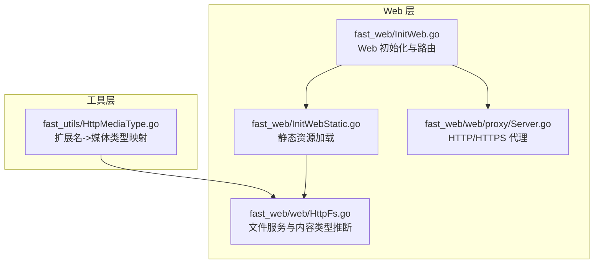
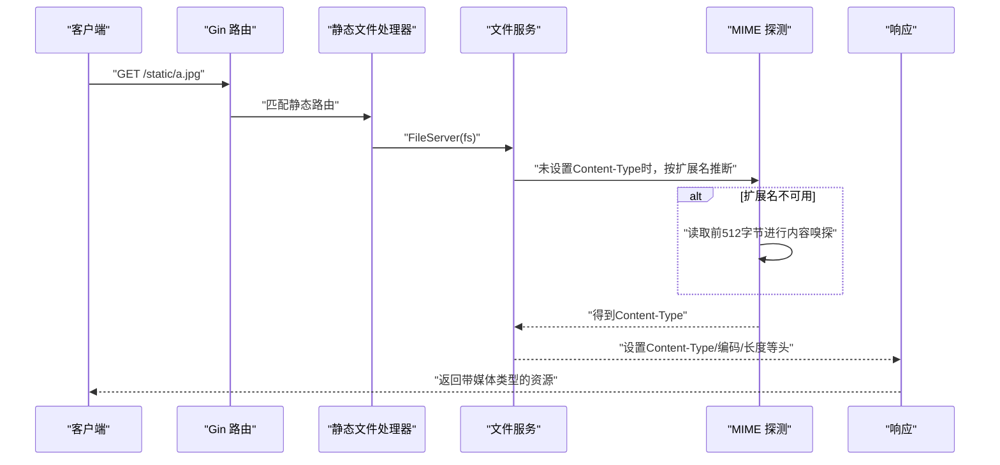
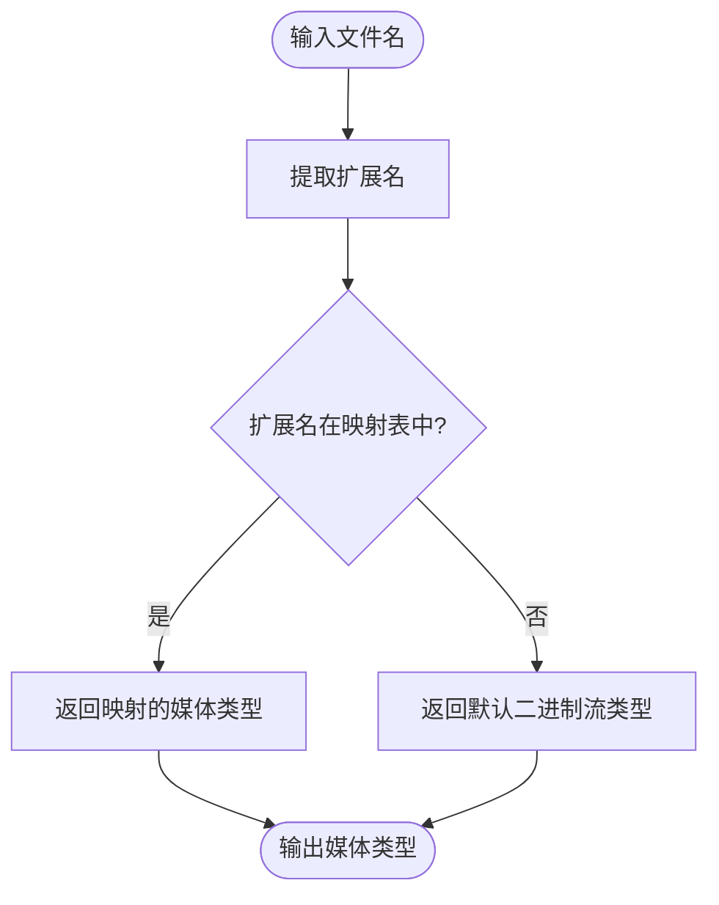
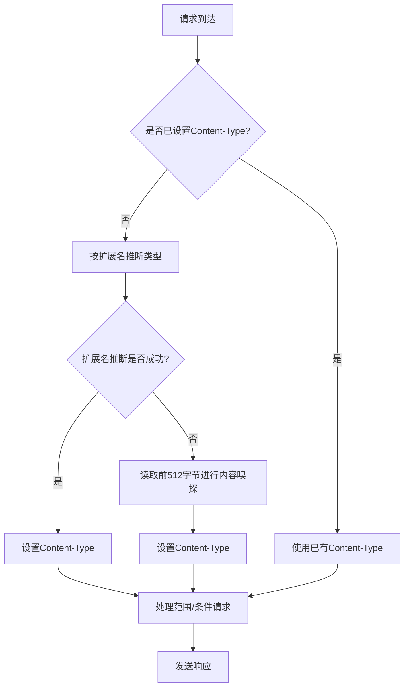
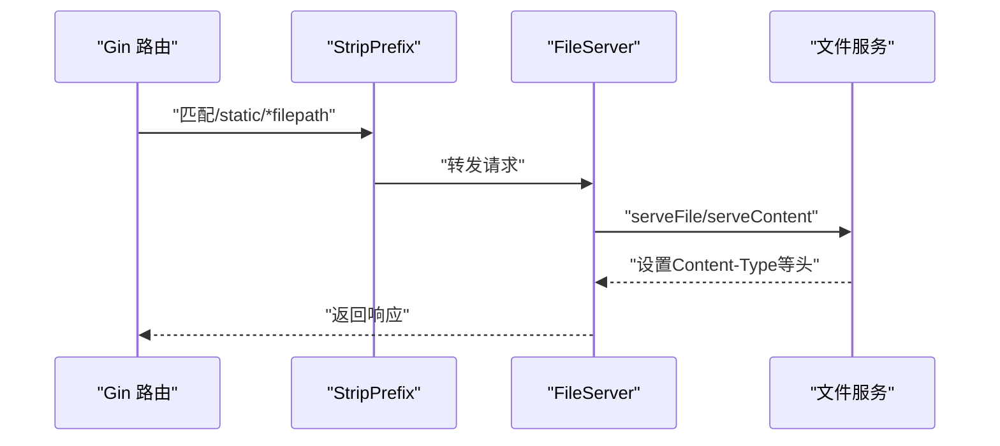
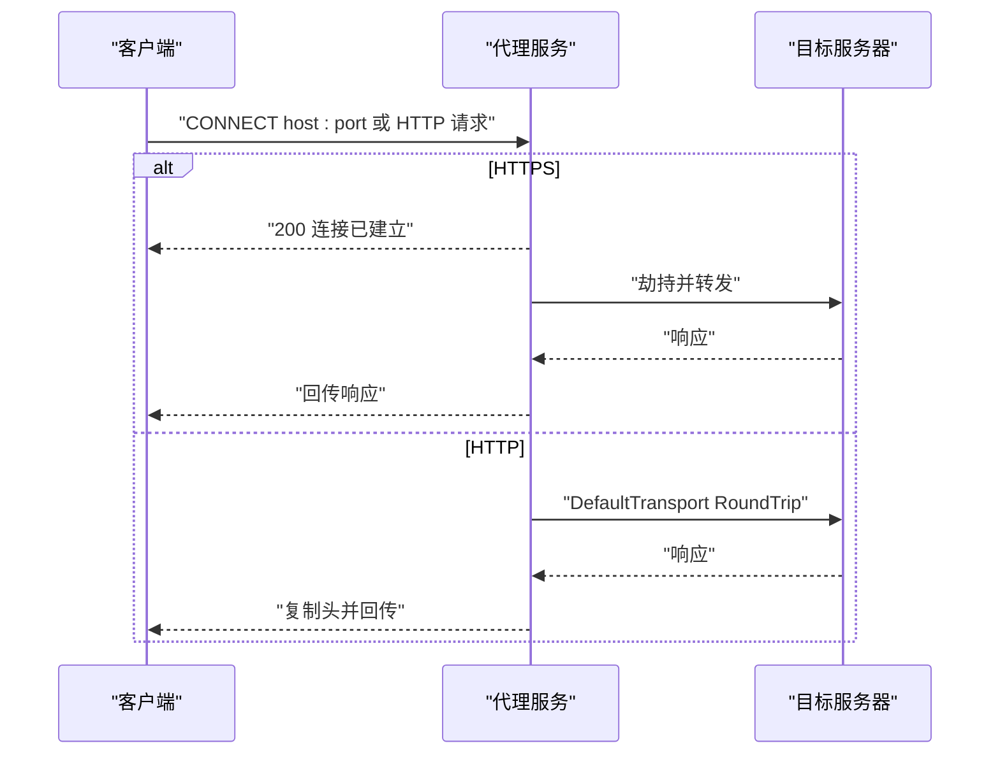
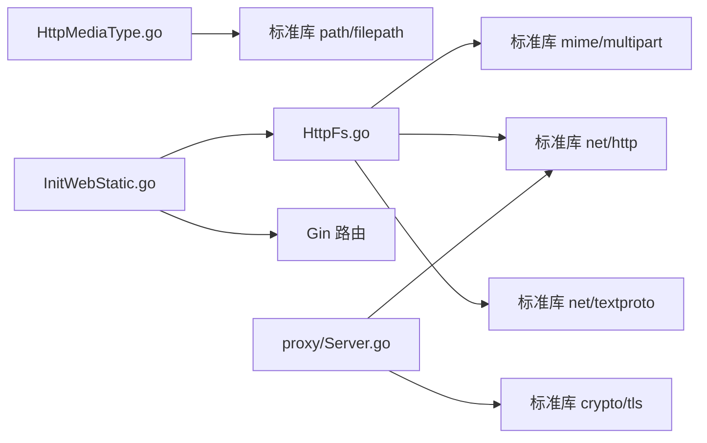

# HTTP 媒体类型

<cite>
**本文引用的文件列表**
- [fast_utils/HttpMediaType.go](file://fast_utils/HttpMediaType.go)
- [fast_web/web/HttpFs.go](file://fast_web/web/HttpFs.go)
- [fast_web/InitWeb.go](file://fast_web/InitWeb.go)
- [fast_web/InitWebStatic.go](file://fast_web/InitWebStatic.go)
- [fast_web/web/proxy/Server.go](file://fast_web/web/proxy/Server.go)
</cite>

## 目录
1. [简介](#简介)
2. [项目结构](#项目结构)
3. [核心组件](#核心组件)
4. [架构总览](#架构总览)
5. [详细组件分析](#详细组件分析)
6. [依赖分析](#依赖分析)
7. [性能考量](#性能考量)
8. [故障排查指南](#故障排查指南)
9. [结论](#结论)
10. [附录](#附录)

## 简介
本文件围绕 HTTP 媒体类型（MIME）处理模块进行系统化说明，涵盖以下主题：
- 内容类型识别与媒体类型处理的实现方法
- 如何根据文件扩展名确定正确的 MIME 类型
- 内容协商机制与浏览器兼容性处理
- 常见文件类型的媒体类型映射表
- 自定义媒体类型的注册与使用方法
- HTTP 响应头设置与内容类型选择的最佳实践

本项目在工具层提供基于扩展名的媒体类型映射，在 Web 层通过标准库 MIME 探测与内容嗅探实现更稳健的内容类型推断，并结合静态资源服务、文件传输与代理场景给出完整的媒体类型处理流程。

## 项目结构
与媒体类型处理直接相关的模块分布如下：
- 工具层：提供基于扩展名的媒体类型映射函数
- Web 层：提供静态文件服务、内容协商与响应头设置
- 代理层：提供 HTTP/HTTPS 代理能力，便于测试与调试

图表来源
- [fast_utils/HttpMediaType.go:1-56](file://fast_utils/HttpMediaType.go#L1-L56)
- [fast_web/web/HttpFs.go:1-1020](file://fast_web/web/HttpFs.go#L1-L1020)
- [fast_web/InitWeb.go:1-367](file://fast_web/InitWeb.go#L1-L367)
- [fast_web/InitWebStatic.go:1-59](file://fast_web/InitWebStatic.go#L1-L59)
- [fast_web/web/proxy/Server.go:1-170](file://fast_web/web/proxy/Server.go#L1-L170)

章节来源
- [fast_utils/HttpMediaType.go:1-56](file://fast_utils/HttpMediaType.go#L1-L56)
- [fast_web/web/HttpFs.go:1-1020](file://fast_web/web/HttpFs.go#L1-L1020)
- [fast_web/InitWeb.go:1-367](file://fast_web/InitWeb.go#L1-L367)
- [fast_web/InitWebStatic.go:1-59](file://fast_web/InitWebStatic.go#L1-L59)
- [fast_web/web/proxy/Server.go:1-170](file://fast_web/web/proxy/Server.go#L1-L170)

## 核心组件
- 扩展名到媒体类型的映射：提供常用文件扩展名与 MIME 类型的映射表，用于快速确定内容类型。
- 文件服务与内容类型推断：在未显式设置 Content-Type 时，优先依据扩展名推断；若扩展名不可用，则进行内容嗅探，最后回退到二进制流类型。
- 静态资源服务：将静态资源目录挂载到指定路径，自动应用上述内容类型推断逻辑。
- 代理服务：支持 HTTP/HTTPS 代理，便于在不同网络环境下验证媒体类型与内容协商行为。

章节来源
- [fast_utils/HttpMediaType.go:5-55](file://fast_utils/HttpMediaType.go#L5-L55)
- [fast_web/web/HttpFs.go:259-287](file://fast_web/web/HttpFs.go#L259-L287)
- [fast_web/InitWebStatic.go:12-27](file://fast_web/InitWebStatic.go#L12-L27)
- [fast_web/web/proxy/Server.go:30-73](file://fast_web/web/proxy/Server.go#L30-L73)

## 架构总览
媒体类型处理在请求生命周期中的关键位置如下：
- 请求进入 Web 层后，静态资源路由匹配到文件系统处理器
- 文件系统处理器根据扩展名或内容嗅探决定 Content-Type
- 若启用压缩，还会设置 Accept-Ranges、Content-Encoding、Vary 等响应头
- 最终将内容与类型写回客户端

图表来源
- [fast_web/InitWebStatic.go:29-58](file://fast_web/InitWebStatic.go#L29-L58)
- [fast_web/web/HttpFs.go:259-287](file://fast_web/web/HttpFs.go#L259-L287)

## 详细组件分析

### 组件一：扩展名到媒体类型的映射
- 功能概述：根据文件扩展名返回对应 MIME 类型；若未命中，默认返回二进制流类型，确保安全兜底。
- 关键点：
  - 映射覆盖常见静态资源类型（图片、音频、视频、文档、压缩包、文本等）
  - 默认类型为二进制流，避免未知扩展名导致的类型误判
- 使用建议：
  - 在业务侧可结合扩展名快速判断，但最终仍建议遵循 Web 层的推断逻辑，以保证一致性与健壮性

图表来源
- [fast_utils/HttpMediaType.go:6-55](file://fast_utils/HttpMediaType.go#L6-L55)

章节来源
- [fast_utils/HttpMediaType.go:5-55](file://fast_utils/HttpMediaType.go#L5-L55)

### 组件二：文件服务与内容类型推断
- 功能概述：在未显式设置 Content-Type 的情况下，优先使用扩展名推断；若扩展名不可用，则进行内容嗅探；最后设置响应头并处理范围请求、条件请求与压缩等。
- 关键点：
  - 未设置 Content-Type 时才进行推断；若已显式设置，则直接使用
  - 嗅探长度固定，读取前若干字节后进行类型判定
  - 支持 Range、If-None-Match、If-Modified-Since 等条件请求
  - 对 gzip 压缩文件自动设置编码与 Vary 头
- 实现要点：
  - 通过标准库 MIME 扩展名推断与内容嗅探相结合
  - 对于多范围请求采用 multipart/byteranges 响应
  - 对于目录列出场景设置 HTML 类型与字符集

图表来源
- [fast_web/web/HttpFs.go:259-287](file://fast_web/web/HttpFs.go#L259-L287)
- [fast_web/web/HttpFs.go:135-172](file://fast_web/web/HttpFs.go#L135-L172)
- [fast_web/web/HttpFs.go:221-376](file://fast_web/web/HttpFs.go#L221-L376)

章节来源
- [fast_web/web/HttpFs.go:259-287](file://fast_web/web/HttpFs.go#L259-L287)
- [fast_web/web/HttpFs.go:135-172](file://fast_web/web/HttpFs.go#L135-L172)
- [fast_web/web/HttpFs.go:221-376](file://fast_web/web/HttpFs.go#L221-L376)

### 组件三：静态资源服务集成
- 功能概述：将静态资源目录挂载到指定路径，自动应用文件服务的类型推断与响应头设置。
- 关键点：
  - 路由模式为相对路径 + 通配符，确保子路径正确解析
  - 通过 StripPrefix 与 FileServer 协作，实现路径裁剪与文件查找
- 使用建议：
  - 将资源根目录与访问前缀合理配置，避免路径冲突
  - 对于目录列表场景，确保返回 HTML 并设置字符集

图表来源
- [fast_web/InitWebStatic.go:12-27](file://fast_web/InitWebStatic.go#L12-L27)
- [fast_web/InitWebStatic.go:29-58](file://fast_web/InitWebStatic.go#L29-L58)

章节来源
- [fast_web/InitWebStatic.go:12-27](file://fast_web/InitWebStatic.go#L12-L27)
- [fast_web/InitWebStatic.go:29-58](file://fast_web/InitWebStatic.go#L29-L58)

### 组件四：代理服务与媒体类型
- 功能概述：提供 HTTP/HTTPS 代理能力，便于在复杂网络环境中验证媒体类型与内容协商行为。
- 关键点：
  - 支持 HTTP CONNECT 与普通 HTTP 请求
  - HTTPS 场景下进行连接劫持与双向转发
  - 可选生成自签名证书，便于本地调试
- 使用建议：
  - 在开发与测试环境开启代理，观察浏览器与客户端对媒体类型的处理差异
  - 注意代理链路中的头复制与状态码传递

图表来源
- [fast_web/web/proxy/Server.go:30-73](file://fast_web/web/proxy/Server.go#L30-L73)
- [fast_web/web/proxy/Server.go:75-110](file://fast_web/web/proxy/Server.go#L75-L110)

章节来源
- [fast_web/web/proxy/Server.go:30-73](file://fast_web/web/proxy/Server.go#L30-L73)
- [fast_web/web/proxy/Server.go:75-110](file://fast_web/web/proxy/Server.go#L75-L110)

## 依赖分析
- 工具层依赖：仅依赖标准库路径处理，简单稳定
- Web 层依赖：依赖标准库 MIME、multipart、net/http、net/textproto 等，实现内容类型推断与响应头管理
- 静态资源依赖：依赖 Gin 路由与 FileServer，实现路径裁剪与文件服务
- 代理依赖：依赖 net/http、crypto/tls 等，实现 HTTP/HTTPS 代理与证书生成

图表来源
- [fast_utils/HttpMediaType.go:3](file://fast_utils/HttpMediaType.go#L3)
- [fast_web/web/HttpFs.go:9-27](file://fast_web/web/HttpFs.go#L9-L27)
- [fast_web/InitWebStatic.go:3-10](file://fast_web/InitWebStatic.go#L3-L10)
- [fast_web/web/proxy/Server.go:3-17](file://fast_web/web/proxy/Server.go#L3-L17)

章节来源
- [fast_utils/HttpMediaType.go:3](file://fast_utils/HttpMediaType.go#L3)
- [fast_web/web/HttpFs.go:9-27](file://fast_web/web/HttpFs.go#L9-L27)
- [fast_web/InitWebStatic.go:3-10](file://fast_web/InitWebStatic.go#L3-L10)
- [fast_web/web/proxy/Server.go:3-17](file://fast_web/web/proxy/Server.go#L3-L17)

## 性能考量
- 扩展名映射：O(1) 查找，开销极低，适合高频场景
- 内容嗅探：读取固定大小的缓冲区进行类型判定，避免全量读取，兼顾准确性与性能
- 压缩与范围请求：在支持 gzip 的场景下，优先使用已压缩文件，减少带宽占用；范围请求可降低大文件传输成本
- 目录列表：返回 HTML 并设置字符集，避免额外的类型推断开销

## 故障排查指南
- 问题：未知扩展名导致类型错误
  - 现象：浏览器或客户端无法正确渲染资源
  - 处理：确认扩展名是否在映射表中；如需自定义，参考“自定义媒体类型注册”章节
- 问题：静态资源返回二进制流
  - 现象：Content-Type 为 application/octet-stream
  - 处理：检查扩展名是否存在；若不存在，考虑添加扩展名或在业务层显式设置类型
- 问题：条件请求未生效
  - 现象：If-None-Match/If-Modified-Since 未触发 304
  - 处理：确认 Last-Modified 与 ETag 是否正确设置；检查客户端请求头是否正确
- 问题：范围请求异常
  - 现象：Range 请求返回 416 或内容不完整
  - 处理：检查 Range 头与 Content-Range 响应；确认文件可寻址

章节来源
- [fast_web/web/HttpFs.go:588-621](file://fast_web/web/HttpFs.go#L588-L621)
- [fast_web/web/HttpFs.go:259-287](file://fast_web/web/HttpFs.go#L259-L287)

## 结论
本项目提供了从扩展名映射到内容嗅探的完整媒体类型处理方案，并在静态资源服务与代理场景中得到良好集成。通过合理的响应头设置与条件请求支持，既保证了浏览器兼容性，又提升了传输效率。建议在实际使用中：
- 优先使用 Web 层的类型推断逻辑，确保一致性
- 对于自定义类型，通过扩展名映射或显式设置 Content-Type 实现
- 在生产环境关注压缩与范围请求带来的性能收益

## 附录

### 常见文件类型的媒体类型映射表
以下映射来源于扩展名映射与标准库 MIME 推断，覆盖常见静态资源类型：
- 图片：webp、jpeg/jpg、png、gif、bmp、ico、svg+xml
- 文本与脚本：html、css、javascript、json、xml、csv、plain
- 音频：mpeg、wav
- 视频：mp4、x-msvideo、x-ms-wmv、x-flv
- 文档：pdf、msword、vnd.openxmlformats-officedocument.wordprocessingml.document、vnd.ms-excel、vnd.openxmlformats-officedocument.spreadsheetml.sheet、vnd.ms-powerpoint、vnd.openxmlformats-officedocument.presentationml.presentation
- 压缩包：zip、x-rar-compressed、x-tar、gzip、x-7z-compressed

章节来源
- [fast_utils/HttpMediaType.go:9-44](file://fast_utils/HttpMediaType.go#L9-L44)

### 自定义媒体类型的注册与使用
- 方案一：扩展名映射
  - 在扩展名映射表中新增自定义扩展名与 MIME 类型
  - 适用于静态资源或业务侧已知扩展名的场景
- 方案二：显式设置 Content-Type
  - 在响应前手动设置 Content-Type，绕过自动推断
  - 适用于动态生成内容或特殊协议场景
- 方案三：内容嗅探增强
  - 若扩展名不可用，内容嗅探可提升准确性
  - 建议在业务层提供足够前缀字节，提高嗅探成功率

章节来源
- [fast_utils/HttpMediaType.go:5-55](file://fast_utils/HttpMediaType.go#L5-L55)
- [fast_web/web/HttpFs.go:259-287](file://fast_web/web/HttpFs.go#L259-L287)

### HTTP 响应头设置与内容类型选择最佳实践
- Content-Type
  - 未设置时优先按扩展名推断；若扩展名不可用则进行内容嗅探
  - 已显式设置时直接使用，避免重复推断
- Content-Encoding 与 Vary
  - 对 gzip 压缩文件设置 Content-Encoding 与 Vary: Accept-Encoding
- Accept-Ranges
  - 支持范围请求时设置 Accept-Ranges: bytes
- 条件请求
  - 正确设置 Last-Modified 与 ETag，配合 If-None-Match/If-Modified-Since
- 目录列表
  - 返回 HTML 并设置 charset=utf-8，确保浏览器正确渲染

章节来源
- [fast_web/web/HttpFs.go:259-287](file://fast_web/web/HttpFs.go#L259-L287)
- [fast_web/web/HttpFs.go:135-172](file://fast_web/web/HttpFs.go#L135-L172)
- [fast_web/web/HttpFs.go:566-586](file://fast_web/web/HttpFs.go#L566-L586)