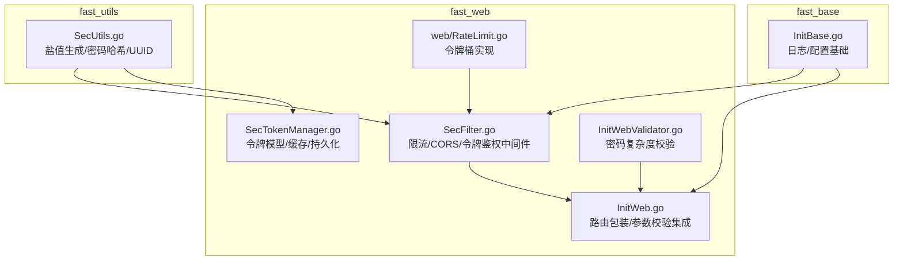
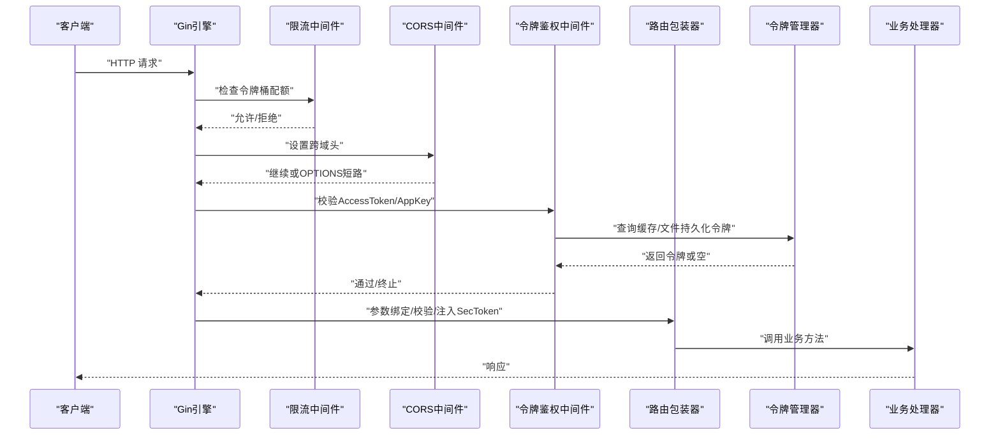
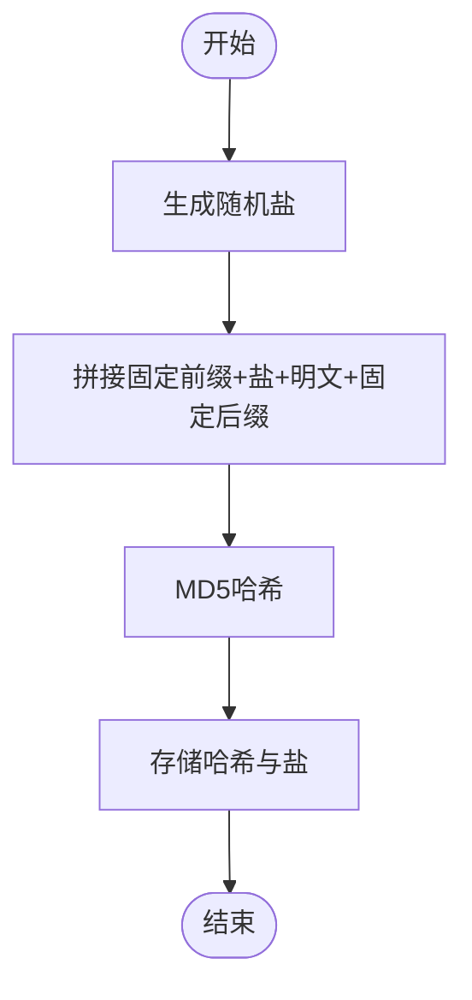
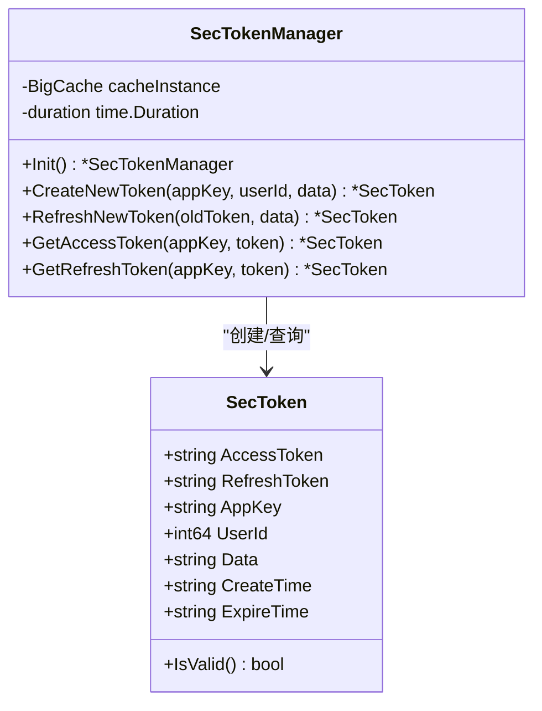
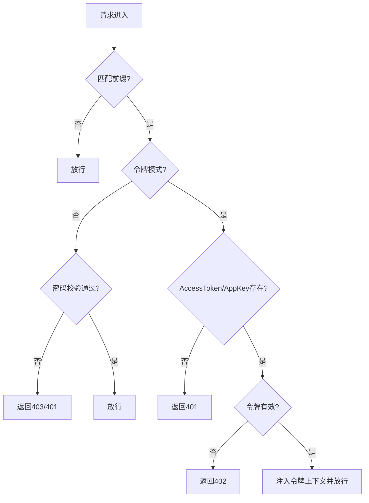
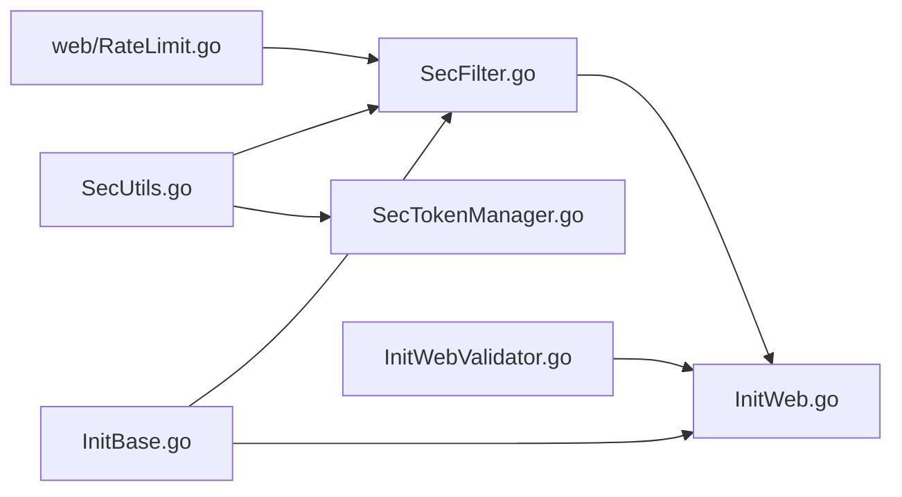

# 安全工具

<cite>
**本文引用的文件**
- [fast_utils/SecUtils.go](file://fast_utils/SecUtils.go)
- [fast_web/SecFilter.go](file://fast_web/SecFilter.go)
- [fast_web/SecTokenManager.go](file://fast_web/SecTokenManager.go)
- [fast_web/InitWeb.go](file://fast_web/InitWeb.go)
- [fast_web/InitWebValidator.go](file://fast_web/InitWebValidator.go)
- [fast_web/web/RateLimit.go](file://fast_web/web/RateLimit.go)
- [fast_base/InitBase.go](file://fast_base/InitBase.go)
- [Readme.md](file://Readme.md)
</cite>

## 目录
1. [简介](#简介)
2. [项目结构](#项目结构)
3. [核心组件](#核心组件)
4. [架构总览](#架构总览)
5. [组件详解](#组件详解)
6. [依赖关系分析](#依赖关系分析)
7. [性能考量](#性能考量)
8. [故障排查指南](#故障排查指南)
9. [结论](#结论)
10. [附录](#附录)

## 简介
本文件系统性梳理与安全相关的工具与机制，覆盖以下方面：
- 密码加密与存储：盐值生成、哈希策略与存储
- 数字签名与完整性：当前实现未提供签名生成/验证能力，仅记录现状与改进建议
- 数据混淆与反混淆：当前实现未提供混淆/反混淆能力，仅记录现状与改进建议
- 访问控制与令牌管理：基于 Gin 中间件的限流、跨域、认证与令牌生命周期管理
- 实际应用场景：Web 接口的鉴权、速率限制、参数校验与日志审计
- 安全最佳实践与常见漏洞防范：结合现有实现总结可落地的安全建议

## 项目结构
围绕“安全工具”的相关模块主要分布在 fast_utils 与 fast_web 两个子包：
- fast_utils：提供通用安全工具，如盐值生成、密码哈希、UUID 生成等
- fast_web：提供 Web 层安全能力，包括限流中间件、CORS、令牌管理、参数校验与路由包装器

图表来源
- [fast_utils/SecUtils.go:1-40](file://fast_utils/SecUtils.go#L1-L40)
- [fast_web/SecFilter.go:1-130](file://fast_web/SecFilter.go#L1-L130)
- [fast_web/SecTokenManager.go:1-216](file://fast_web/SecTokenManager.go#L1-L216)
- [fast_web/InitWeb.go:1-367](file://fast_web/InitWeb.go#L1-L367)
- [fast_web/InitWebValidator.go:1-88](file://fast_web/InitWebValidator.go#L1-L88)
- [fast_web/web/RateLimit.go:1-346](file://fast_web/web/RateLimit.go#L1-L346)
- [fast_base/InitBase.go:1-50](file://fast_base/InitBase.go#L1-L50)

章节来源
- [fast_utils/SecUtils.go:1-40](file://fast_utils/SecUtils.go#L1-L40)
- [fast_web/SecFilter.go:1-130](file://fast_web/SecFilter.go#L1-L130)
- [fast_web/SecTokenManager.go:1-216](file://fast_web/SecTokenManager.go#L1-L216)
- [fast_web/InitWeb.go:1-367](file://fast_web/InitWeb.go#L1-L367)
- [fast_web/InitWebValidator.go:1-88](file://fast_web/InitWebValidator.go#L1-L88)
- [fast_web/web/RateLimit.go:1-346](file://fast_web/web/RateLimit.go#L1-L346)
- [fast_base/InitBase.go:1-50](file://fast_base/InitBase.go#L1-L50)

## 核心组件
- 盐值与密码哈希
  - 提供随机盐生成与基于“固定前缀+盐+明文+固定后缀”的 MD5 哈希策略
  - 建议：MD5 已不推荐用于密码哈希；应迁移到 bcrypt/scrypt/argon2 并引入每用户唯一盐
- 令牌管理
  - 定义 SecToken 结构体，支持 AccessToken/RefreshToken 生命周期管理与缓存持久化
  - 支持按 AppKey+UserId 的维度进行令牌替换与过期处理
- 限流与跨域
  - 提供基于令牌桶的限流中间件与 CORS 中间件
- 参数校验
  - 提供密码复杂度正则校验，确保最小长度与字符集要求
- 路由包装与自动注入
  - 将 SecToken 自动注入到处理器参数中，简化鉴权接入

章节来源
- [fast_utils/SecUtils.go:12-30](file://fast_utils/SecUtils.go#L12-L30)
- [fast_web/SecTokenManager.go:13-34](file://fast_web/SecTokenManager.go#L13-L34)
- [fast_web/SecFilter.go:11-100](file://fast_web/SecFilter.go#L11-L100)
- [fast_web/InitWebValidator.go:59-87](file://fast_web/InitWebValidator.go#L59-L87)
- [fast_web/InitWeb.go:198-338](file://fast_web/InitWeb.go#L198-L338)

## 架构总览
下图展示 Web 请求在进入业务处理前的关键安全控制点与数据流。

图表来源
- [fast_web/SecFilter.go:11-100](file://fast_web/SecFilter.go#L11-L100)
- [fast_web/SecTokenManager.go:90-112](file://fast_web/SecTokenManager.go#L90-L112)
- [fast_web/InitWeb.go:198-338](file://fast_web/InitWeb.go#L198-L338)

## 组件详解

### 组件A：密码加密与存储（fast_utils/SecUtils.go）
- 功能要点
  - 生成指定长度的随机盐（十六进制字符串）
  - 将“固定前缀+盐+明文+固定后缀”拼接后进行 MD5 哈希
  - 返回哈希字符串
- 复杂度与性能
  - 盐生成 O(n)，哈希 O(n)；整体常数级开销
- 安全性评估与改进建议
  - 现状：使用 MD5，强度不足，易受彩虹表与碰撞攻击
  - 建议：迁移至 bcrypt/scrypt/argon2；为每个用户生成独立盐；避免固定前后缀，采用标准 PBKDF2/Argon2 参数
- 使用场景
  - 用户注册/登录时的密码存储与校验流程

图表来源
- [fast_utils/SecUtils.go:12-30](file://fast_utils/SecUtils.go#L12-L30)

章节来源
- [fast_utils/SecUtils.go:12-30](file://fast_utils/SecUtils.go#L12-L30)

### 组件B：令牌模型与生命周期（fast_web/SecTokenManager.go）
- 数据模型
  - AccessToken/RefreshToken/AppKey/UserId/Data/CreateTime/ExpireTime
  - 提供 IsValid() 过期校验
- 生命周期管理
  - 初始化：加载配置，创建 BigCache，定时持久化到文件
  - 创建：清理旧令牌，生成新令牌并写入缓存
  - 刷新：标记旧令牌过期或立即删除，生成新令牌
  - 查询：按 AppKey+前缀+Token 查询并自动过期校验
- 持久化策略
  - 启动时从文件恢复，后台定时刷盘，保证重启后令牌可用性

图表来源
- [fast_web/SecTokenManager.go:13-34](file://fast_web/SecTokenManager.go#L13-L34)
- [fast_web/SecTokenManager.go:90-112](file://fast_web/SecTokenManager.go#L90-L112)
- [fast_web/SecTokenManager.go:114-138](file://fast_web/SecTokenManager.go#L114-L138)
- [fast_web/SecTokenManager.go:191-215](file://fast_web/SecTokenManager.go#L191-L215)

章节来源
- [fast_web/SecTokenManager.go:13-34](file://fast_web/SecTokenManager.go#L13-L34)
- [fast_web/SecTokenManager.go:90-112](file://fast_web/SecTokenManager.go#L90-L112)
- [fast_web/SecTokenManager.go:114-138](file://fast_web/SecTokenManager.go#L114-L138)
- [fast_web/SecTokenManager.go:191-215](file://fast_web/SecTokenManager.go#L191-L215)

### 组件C：访问控制与限流（fast_web/SecFilter.go）
- 限流中间件
  - 基于令牌桶，支持每秒生成令牌数与容量配置
  - 对特定路径前缀生效，非关键接口建议谨慎开启
- 密码模式与令牌模式
  - 密码模式：通过查询参数进行简单校验
  - 令牌模式：从请求头读取 AccessToken/AppKey，校验通过后将令牌对象注入上下文
- CORS 中间件
  - 统一设置允许的 Origin/Methods/Headers/Credentials

图表来源
- [fast_web/SecFilter.go:11-100](file://fast_web/SecFilter.go#L11-L100)

章节来源
- [fast_web/SecFilter.go:11-100](file://fast_web/SecFilter.go#L11-L100)

### 组件D：参数校验与密码强度（fast_web/InitWebValidator.go）
- 密码复杂度规则
  - 至少包含大小写字母与数字，长度不少于 8
- 错误翻译与本地化
  - 注册中文翻译，便于前端展示友好提示

章节来源
- [fast_web/InitWebValidator.go:59-87](file://fast_web/InitWebValidator.go#L59-L87)

### 组件E：路由包装与自动注入（fast_web/InitWeb.go）
- 路由包装器
  - 自动绑定/校验请求参数，支持 JSON/Form
  - 自动注入 SecToken（当处理器参数类型为 SecToken）
- 统一返回结构
  - 将业务返回值封装为统一结构，简化前端处理

章节来源
- [fast_web/InitWeb.go:198-338](file://fast_web/InitWeb.go#L198-L338)

### 组件F：令牌桶限流实现（fast_web/web/RateLimit.go）
- 令牌桶算法
  - 支持按速率/容量构造桶，提供 Take/TakeMaxDuration/Wait 等操作
  - 内部使用整数 tick 与量子（quantum）提升高吞吐场景精度
- 性能特性
  - 取令牌时仅做少量算术运算，常数级延迟

章节来源
- [fast_web/web/RateLimit.go:42-120](file://fast_web/web/RateLimit.go#L42-L120)
- [fast_web/web/RateLimit.go:167-301](file://fast_web/web/RateLimit.go#L167-L301)

## 依赖关系分析
- 模块内聚与耦合
  - fast_utils 与 fast_web 之间通过工具函数与结构体弱耦合
  - fast_web 内部通过中间件与包装器形成清晰的横切关注点
- 外部依赖
  - Gin（Web 框架）、bigcache（高性能缓存）、time/rate（标准库限流）
- 潜在循环依赖
  - 未发现循环导入；各模块职责清晰

图表来源
- [fast_utils/SecUtils.go:1-40](file://fast_utils/SecUtils.go#L1-L40)
- [fast_web/SecFilter.go:1-130](file://fast_web/SecFilter.go#L1-L130)
- [fast_web/SecTokenManager.go:1-216](file://fast_web/SecTokenManager.go#L1-L216)
- [fast_web/InitWeb.go:1-367](file://fast_web/InitWeb.go#L1-L367)
- [fast_web/InitWebValidator.go:1-88](file://fast_web/InitWebValidator.go#L1-L88)
- [fast_web/web/RateLimit.go:1-346](file://fast_web/web/RateLimit.go#L1-L346)
- [fast_base/InitBase.go:1-50](file://fast_base/InitBase.go#L1-L50)

章节来源
- [fast_utils/SecUtils.go:1-40](file://fast_utils/SecUtils.go#L1-L40)
- [fast_web/SecFilter.go:1-130](file://fast_web/SecFilter.go#L1-L130)
- [fast_web/SecTokenManager.go:1-216](file://fast_web/SecTokenManager.go#L1-L216)
- [fast_web/InitWeb.go:1-367](file://fast_web/InitWeb.go#L1-L367)
- [fast_web/InitWebValidator.go:1-88](file://fast_web/InitWebValidator.go#L1-L88)
- [fast_web/web/RateLimit.go:1-346](file://fast_web/web/RateLimit.go#L1-L346)
- [fast_base/InitBase.go:1-50](file://fast_base/InitBase.go#L1-L50)

## 性能考量
- 限流策略
  - 令牌桶算法在高并发下延迟低、吞吐稳定；建议对关键接口启用，避免对全站限流造成不必要的性能损耗
- 缓存与持久化
  - 令牌缓存采用 BigCache，命中率高；定时持久化降低重启丢失风险
- 日志与配置
  - 基础日志与配置模块提供统一的日志级别与输出格式，便于问题定位与性能观测

## 故障排查指南
- 令牌无效或频繁失效
  - 检查令牌过期时间与服务重启后的持久化恢复逻辑
  - 关注令牌刷新流程与旧令牌标记策略
- 限流误杀
  - 调整限流参数（每秒令牌数与容量），优先对关键接口启用
- CORS 问题
  - 确认请求头与方法是否在允许列表中，OPTIONS 预检是否正确处理
- 参数校验失败
  - 检查请求体格式（JSON/Form），确认字段标签与校验规则一致

章节来源
- [fast_web/SecTokenManager.go:90-112](file://fast_web/SecTokenManager.go#L90-L112)
- [fast_web/SecFilter.go:83-100](file://fast_web/SecFilter.go#L83-L100)
- [fast_web/InitWebValidator.go:59-87](file://fast_web/InitWebValidator.go#L59-L87)

## 结论
- 现有实现提供了基础的密码哈希、令牌管理、限流与参数校验能力，满足中小型 Web 应用的安全需求
- 在生产环境中，建议优先升级密码哈希算法、引入数字签名与数据混淆/反混淆能力，并完善安全审计与监控
- 通过中间件与包装器的组合，可快速在业务层落地统一的安全策略

## 附录
- 安全最佳实践
  - 密码存储：使用 bcrypt/scrypt/argon2，每用户唯一盐，定期调整参数
  - 传输安全：强制 HTTPS，严格 HSTS 与安全头配置
  - 输入校验：白名单策略，避免宽泛的正则；参数校验与业务校验双保险
  - 令牌安全：短有效期 AccessToken + 长效 RefreshToken，支持撤销与黑名单
  - 审计与监控：统一日志格式，关键事件打点，异常告警
- 常见漏洞与防范
  - 注入攻击：参数校验 + ORM/SQL 包装；避免动态拼接 SQL
  - 弱口令：强制复杂度与字典检测；限制尝试次数
  - 重放与篡改：引入签名与时间戳校验；服务端校验请求头与签名
  - 信息泄露：最小暴露原则，敏感字段脱敏；错误信息不泄漏内部细节