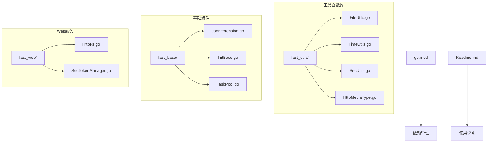
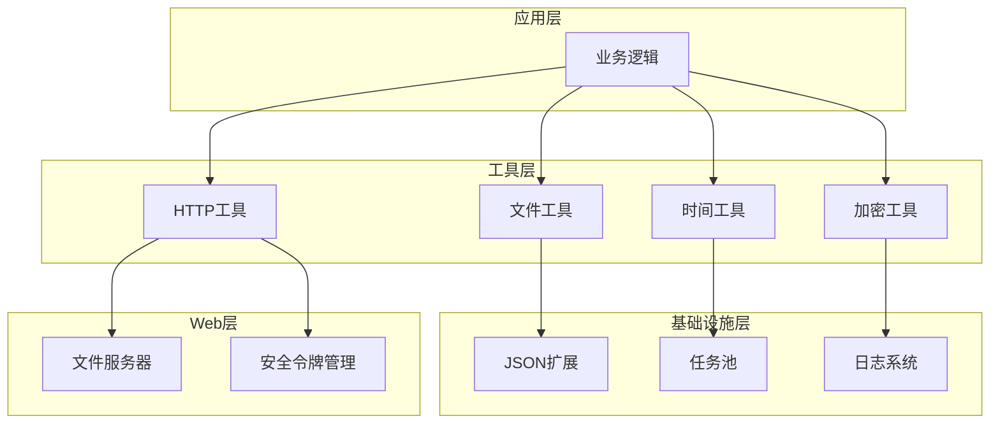
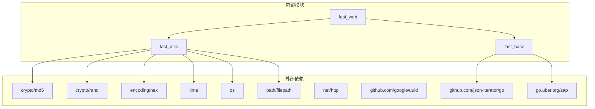

# 工具函数库

<cite>
**本文档引用的文件**
- [FileUtils.go](file://fast_utils/FileUtils.go)
- [TimeUtils.go](file://fast_utils/TimeUtils.go)
- [SecUtils.go](file://fast_utils/SecUtils.go)
- [HttpMediaType.go](file://fast_utils/HttpMediaType.go)
- [JsonExtension.go](file://fast_base/JsonExtension.go)
- [InitBase.go](file://fast_base/InitBase.go)
- [HttpFs.go](file://fast_web/web/HttpFs.go)
- [SecTokenManager.go](file://fast_web/SecTokenManager.go)
- [TaskPool.go](file://fast_base/TaskPool.go)
- [Readme.md](file://Readme.md)
</cite>

## 目录
1. [简介](#简介)
2. [项目结构](#项目结构)
3. [核心组件](#核心组件)
4. [架构概览](#架构概览)
5. [详细组件分析](#详细组件分析)
6. [依赖关系分析](#依赖关系分析)
7. [性能考虑](#性能考虑)
8. [故障排除指南](#故障排除指南)
9. [结论](#结论)

## 简介

Fast-Go 是一个高性能的 Go 语言工具函数库，专注于提供实用的工具函数和基础设施组件。该库经过精心设计，旨在简化开发过程并提高应用程序的性能。主要特点包括：

- **文件操作工具**：提供文件读写、目录操作和媒体类型处理功能
- **时间处理工具**：支持时间格式转换、时区处理和定时任务调度
- **加密工具**：实现安全的密码加密、签名验证和数据保护机制
- **HTTP 媒体类型处理**：支持内容协商和文件传输优化
- **JSON 扩展**：增强 JSON 序列化和反序列化能力

## 项目结构

Fast-Go 采用模块化的项目结构，将不同功能的工具函数组织在独立的包中：

**图表来源**
- [FileUtils.go:1-31](file://fast_utils/FileUtils.go#L1-L31)
- [TimeUtils.go:1-38](file://fast_utils/TimeUtils.go#L1-L38)
- [SecUtils.go:1-40](file://fast_utils/SecUtils.go#L1-L40)
- [HttpMediaType.go:1-56](file://fast_utils/HttpMediaType.go#L1-L56)

**章节来源**
- [FileUtils.go:1-31](file://fast_utils/FileUtils.go#L1-L31)
- [TimeUtils.go:1-38](file://fast_utils/TimeUtils.go#L1-L38)
- [SecUtils.go:1-40](file://fast_utils/SecUtils.go#L1-L40)
- [HttpMediaType.go:1-56](file://fast_utils/HttpMediaType.go#L1-L56)

## 核心组件

### 文件操作工具

文件操作工具提供了基础的文件系统交互功能，包括文件类型检测、MD5 计算和媒体类型识别。

**章节来源**
- [FileUtils.go:12-30](file://fast_utils/FileUtils.go#L12-L30)

### 时间处理工具

时间处理工具专注于时间格式化、解析和转换，支持多种时间格式标准。

**章节来源**
- [TimeUtils.go:7-37](file://fast_utils/TimeUtils.go#L7-L37)

### 加密工具

加密工具实现了安全的密码处理和随机数生成功能，确保数据的安全性。

**章节来源**
- [SecUtils.go:13-39](file://fast_utils/SecUtils.go#L13-L39)

### HTTP 媒体类型处理

HTTP 媒体类型处理工具支持根据文件扩展名自动识别 MIME 类型，优化内容协商。

**章节来源**
- [HttpMediaType.go:5-55](file://fast_utils/HttpMediaType.go#L5-L55)

## 架构概览

Fast-Go 的架构设计遵循单一职责原则，每个模块都有明确的功能边界：

**图表来源**
- [JsonExtension.go:24-25](file://fast_base/JsonExtension.go#L24-L25)
- [TaskPool.go:8-13](file://fast_base/TaskPool.go#L8-L13)
- [HttpFs.go:888-889](file://fast_web/web/HttpFs.go#L888-L889)

## 详细组件分析

### 文件操作工具详解

文件操作工具库提供了三个核心功能：

#### 文件类型检测

`GetFileType` 函数用于提取文件扩展名并转换为小写格式：
- 输入：文件名字符串
- 输出：小写的文件扩展名
- 使用场景：文件类型判断、过滤特定类型的文件

#### 文件 MD5 计算

`GetFileMD5` 函数实现高效的文件内容哈希计算：
- 输入：文件路径
- 输出：MD5 哈希字符串
- 特点：流式读取大文件，内存友好
- 错误处理：文件打开失败时返回空字符串

**章节来源**
- [FileUtils.go:12-30](file://fast_utils/FileUtils.go#L12-L30)

### 时间处理工具详解

时间处理工具提供了统一的时间格式化和解析接口：

#### 时间格式常量

库定义了三种常用的时间格式常量：
- `TIME_YYYY_MM_DD_HH_MM_SS_SSS`：精确到毫秒的时间格式
- `TIME_YYYY_MM_DD_HH_MM_SS`：标准时间格式
- `TIME_YYYY_MM_DD`：日期格式

#### 时间格式化函数

`GetTimeStr`、`GetTimeSSSStr`、`GetDateStr` 提供不同精度的时间格式化：
- 支持可选的 `time.Time` 参数
- 参数为空时使用当前时间
- 返回格式化的字符串

#### 时间解析函数

`ToTime` 函数将字符串解析为 `time.Time` 对象：
- 解析 `TIME_YYYY_MM_DD_HH_MM_SS` 格式的字符串
- 使用本地时区进行解析
- 返回解析后的时间对象

**章节来源**
- [TimeUtils.go:7-37](file://fast_utils/TimeUtils.go#L7-L37)

### 加密工具详解

加密工具库实现了安全的数据处理功能：

#### 随机盐生成

`GenerateSalt` 函数生成指定长度的随机盐值：
- 输入：盐长度（字节）
- 输出：十六进制编码的盐字符串
- 错误处理：随机数生成失败时返回错误

#### 密码加密

`HashPasswordWithSalt` 函数实现密码加盐加密：
- 输入：原始密码和盐值
- 处理：将固定前缀、盐值、密码和固定后缀组合
- 输出：MD5 哈希结果
- 安全特性：使用随机盐值防止彩虹表攻击

#### UUID 生成

`GetUUIDStr` 函数生成标准 UUID 字符串：
- 基于标准库的 UUID 生成器
- 返回格式化的 UUID 字符串

#### 数据类型转换

`IntToStr` 函数将整数转换为字符串：
- 输入：64位整数
- 输出：十进制字符串表示

**章节来源**
- [SecUtils.go:13-39](file://fast_utils/SecUtils.go#L13-L39)

### HTTP 媒体类型处理详解

HTTP 媒体类型处理工具支持广泛的文件类型识别：

#### 媒体类型映射

支持以下文件类型的自动识别：
- 图像文件：`.webp`、`.jpg`、`.jpeg`、`.png`、`.gif`、`.bmp`、`.ico`、`.svg`
- 文本文件：`.html`、`.css`、`.js`、`.json`、`.xml`、`.csv`、`.txt`
- 音频文件：`.mp3`、`.wav`
- 视频文件：`.mp4`、`.avi`、`.wmv`、`.flv`
- 办公文档：`.pdf`、`.doc`、`.docx`、`.xls`、`.xlsx`、`.ppt`、`.pptx`
- 压缩文件：`.zip`、`.rar`、`.tar`、`.gz`、`.7z`

#### 自动识别机制

`GetFileMediaType` 函数实现智能媒体类型识别：
- 提取文件扩展名
- 在预定义映射表中查找对应 MIME 类型
- 未找到时返回默认的二进制流类型

**章节来源**
- [HttpMediaType.go:5-55](file://fast_utils/HttpMediaType.go#L5-L55)

### JSON 扩展工具详解

JSON 扩展工具增强了标准库的 JSON 处理能力：

#### 全局 JSON 配置

使用 `jsoniter` 替代标准库，提供更好的性能：
- 启用模糊解码器，支持字符串和数字互转
- 自动处理空数组作为对象的情况

#### 数据字典转换

`DictCodec` 实现数据字典的自动转换：
- 支持通过 ID 关联到对应的名称
- 自动添加额外的名称字段
- 配合标签系统使用

#### SQL 查询转换

`DictSqlCodec` 实现 SQL 查询的动态转换：
- 支持通过 SQL 查询获取关联数据
- 自动缓存查询结果
- 提供灵活的查询接口

#### 全局类型转换

`JsonExtension` 提供全局的类型转换：
- `int64` 类型自动转换为字符串，解决 JavaScript 精度问题
- 宽容的字符串和数字转换
- 自动处理空值情况

**章节来源**
- [JsonExtension.go:24-346](file://fast_base/JsonExtension.go#L24-L346)

### Web 文件服务器详解

Web 文件服务器提供了完整的静态文件服务功能：

#### 文件服务器实现

`FileServer` 函数创建文件服务器处理器：
- 支持目录浏览功能
- 自动重定向到标准索引页面
- 处理文件权限和安全问题

#### 内容协商机制

服务器实现完整的 HTTP 内容协商：
- 支持条件请求（If-Modified-Since、If-None-Match）
- 处理范围请求（Range）
- 自动设置适当的响应头

#### 安全特性

内置多项安全防护措施：
- 防止路径遍历攻击
- 限制文件访问权限
- 处理特殊文件类型

**章节来源**
- [HttpFs.go:888-889](file://fast_web/web/HttpFs.go#L888-L889)
- [HttpFs.go:624-713](file://fast_web/web/HttpFs.go#L624-L713)

### 任务池管理详解

任务池管理提供了高效的并发处理能力：

#### 通用任务池结构

`TaskPool[T]` 支持泛型的任务池实现：
- 泛型参数 `T` 支持任意数据类型
- 内置通道缓冲机制
- 等待组同步机制

#### 并发工作流程

任务池的工作流程：
- 初始化指定数量的工作协程
- 通过通道分发任务
- 异步执行任务处理函数
- 等待所有任务完成

#### 使用模式

典型使用模式：
- 创建任务池实例
- 设置工作协程数量
- 发送任务到通道
- 等待任务完成

**章节来源**
- [TaskPool.go:8-54](file://fast_base/TaskPool.go#L8-L54)

## 依赖关系分析

Fast-Go 工具库的依赖关系清晰且层次分明：

**图表来源**
- [SecUtils.go:3-10](file://fast_utils/SecUtils.go#L3-L10)
- [JsonExtension.go:3-10](file://fast_base/JsonExtension.go#L3-L10)
- [HttpFs.go:9-27](file://fast_web/web/HttpFs.go#L9-L27)

### 模块间依赖

各模块之间的依赖关系：
- `fast_utils` 作为基础工具模块，被其他模块广泛使用
- `fast_base` 提供基础设施支持，被 `fast_web` 和业务逻辑使用
- `fast_web` 依赖 `fast_utils` 和 `fast_base` 提供完整的 Web 服务功能

**章节来源**
- [SecUtils.go:3-10](file://fast_utils/SecUtils.go#L3-L10)
- [JsonExtension.go:3-10](file://fast_base/JsonExtension.go#L3-L10)
- [HttpFs.go:9-27](file://fast_web/web/HttpFs.go#L9-L27)

## 性能考虑

### 文件操作优化

- **流式处理**：文件 MD5 计算采用流式读取，避免大文件占用过多内存
- **错误短路**：文件操作失败时立即返回，减少不必要的处理开销
- **缓存策略**：媒体类型映射使用预定义的映射表，查询复杂度为 O(1)

### 时间处理优化

- **常量复用**：时间格式常量在编译时确定，运行时无需重复计算
- **零分配**：时间格式化操作尽量避免字符串分配
- **本地时区**：使用本地时区解析，减少时区转换开销

### 加密处理优化

- **随机数生成**：使用系统级随机数生成器，性能优异
- **哈希计算**：MD5 哈希计算采用标准库优化实现
- **内存管理**：盐值生成使用栈分配，减少垃圾回收压力

### JSON 处理优化

- **库选择**：使用 `jsoniter` 替代标准库，提供更好的性能
- **模糊解码**：启用模糊解码器，减少类型转换错误处理开销
- **全局配置**：统一的 JSON 配置减少重复初始化

## 故障排除指南

### 文件操作常见问题

**问题**：文件 MD5 计算返回空字符串
- **原因**：文件打开失败或读取错误
- **解决方案**：检查文件路径和权限，确认文件存在且可读

**问题**：文件类型检测结果不符合预期
- **原因**：文件扩展名大小写不一致
- **解决方案**：使用 `GetFileType` 函数自动转换为小写

### 时间处理常见问题

**问题**：时间解析失败
- **原因**：时间字符串格式不符合预期
- **解决方案**：确保使用库中定义的标准格式常量

**问题**：时区处理异常
- **原因**：本地时区设置不正确
- **解决方案**：检查系统时区配置

### 加密处理常见问题

**问题**：密码加密结果不一致
- **原因**：盐值生成失败或随机数源问题
- **解决方案**：检查随机数生成器状态，重新生成盐值

**问题**：UUID 生成异常
- **原因**：系统 UUID 生成器不可用
- **解决方案**：检查系统支持情况，考虑降级方案

### HTTP 服务常见问题

**问题**：文件服务器返回 404 错误
- **原因**：文件路径不正确或权限不足
- **解决方案**：检查文件路径和访问权限

**问题**：内容协商失败
- **原因**：客户端请求头格式不正确
- **解决方案**：检查客户端请求头设置

**章节来源**
- [FileUtils.go:17-29](file://fast_utils/FileUtils.go#L17-L29)
- [SecUtils.go:13-19](file://fast_utils/SecUtils.go#L13-L19)
- [HttpFs.go:720-729](file://fast_web/web/HttpFs.go#L720-L729)

## 结论

Fast-Go 工具函数库是一个设计精良、功能完善的 Go 语言工具集。其主要优势包括：

**设计优势**
- 模块化架构，职责清晰
- 性能优化，内存友好
- 安全可靠，错误处理完善

**功能特色**
- 覆盖文件操作、时间处理、加密、HTTP 处理等核心需求
- 提供 JSON 扩展增强功能
- 支持并发处理和任务调度

**使用建议**
- 根据具体需求选择合适的工具模块
- 注意错误处理和边界条件
- 合理使用缓存和优化策略
- 遵循安全最佳实践

该库为 Go 语言开发者提供了一个可靠的工具集，可以显著提高开发效率和应用程序性能。