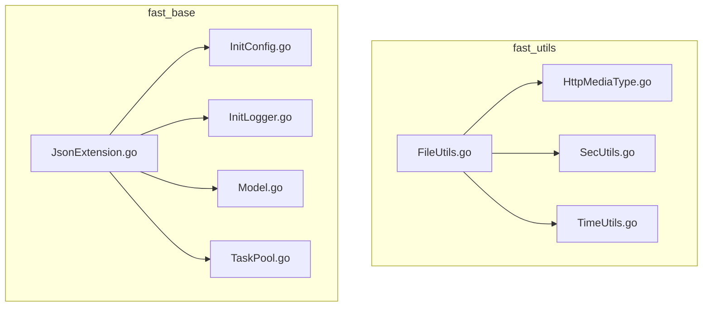
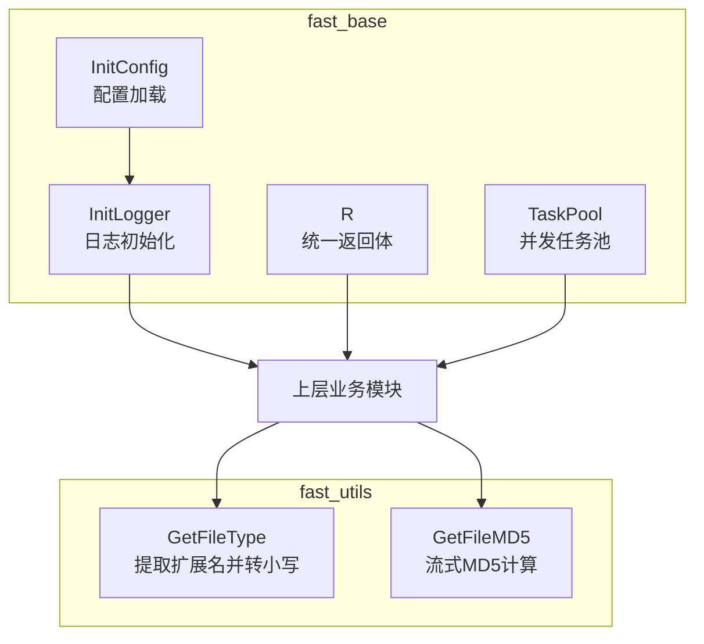
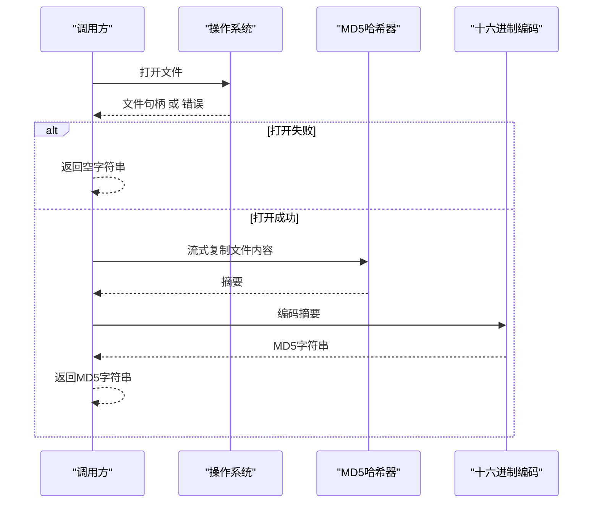
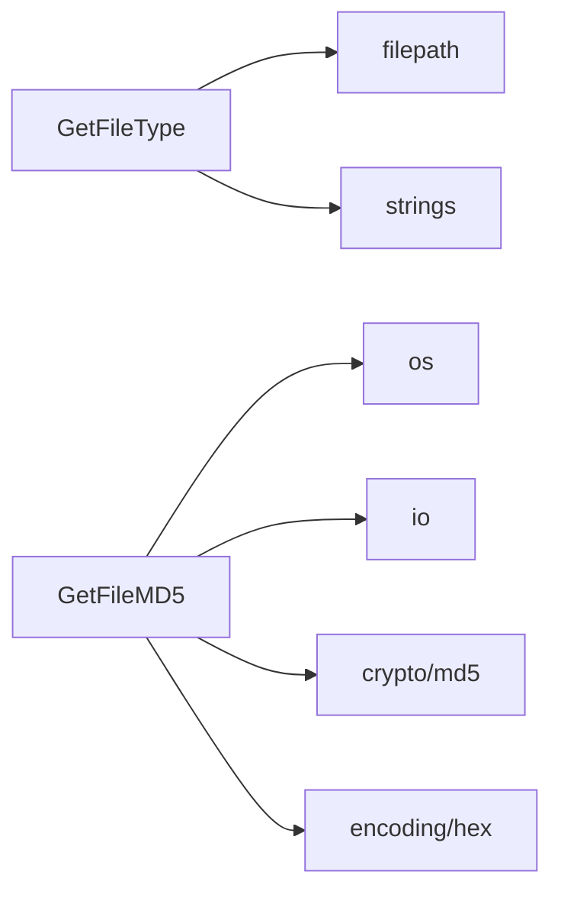

# 文件操作工具

<cite>
**本文引用的文件**
- [FileUtils.go](file://fast_utils/FileUtils.go)
- [HttpMediaType.go](file://fast_utils/HttpMediaType.go)
- [SecUtils.go](file://fast_utils/SecUtils.go)
- [TimeUtils.go](file://fast_utils/TimeUtils.go)
- [JsonExtension.go](file://fast_base/JsonExtension.go)
- [InitConfig.go](file://fast_base/InitConfig.go)
- [InitLogger.go](file://fast_base/InitLogger.go)
- [Model.go](file://fast_base/Model.go)
- [TaskPool.go](file://fast_base/TaskPool.go)
</cite>

## 目录
1. [简介](#简介)
2. [项目结构](#项目结构)
3. [核心组件](#核心组件)
4. [架构总览](#架构总览)
5. [详细组件分析](#详细组件分析)
6. [依赖分析](#依赖分析)
7. [性能考量](#性能考量)
8. [故障排查指南](#故障排查指南)
9. [结论](#结论)
10. [附录](#附录)

## 简介
本文件聚焦于 fast_utils 模块中的文件操作工具，重点讲解两类能力：
- 文件类型获取：通过文件扩展名识别文件类型，统一转换为小写形式，便于后续媒体类型判定与业务处理。
- 文件 MD5 计算：基于流式读取进行 MD5 哈希计算，确保对大文件的内存友好性，并提供稳健的错误处理。

此外，文档还结合项目中 JSON 扩展、配置加载、日志与模型等基础模块，给出最佳实践与性能建议，帮助开发者在实际项目中正确、高效地使用这些工具。

## 项目结构
本项目采用按功能域划分的模块化组织方式，其中 fast_utils 提供通用工具集；fast_base 提供基础设施（配置、日志、模型、任务池等）。文件操作工具位于 fast_utils 中，与其它模块通过清晰的包边界协作。

图表来源
- [FileUtils.go:1-31](file://fast_utils/FileUtils.go#L1-L31)
- [HttpMediaType.go:1-56](file://fast_utils/HttpMediaType.go#L1-L56)
- [SecUtils.go:1-40](file://fast_utils/SecUtils.go#L1-L40)
- [TimeUtils.go:1-38](file://fast_utils/TimeUtils.go#L1-L38)
- [JsonExtension.go:1-346](file://fast_base/JsonExtension.go#L1-L346)
- [InitConfig.go:1-108](file://fast_base/InitConfig.go#L1-L108)
- [InitLogger.go:1-147](file://fast_base/InitLogger.go#L1-L147)
- [Model.go:1-116](file://fast_base/Model.go#L1-L116)
- [TaskPool.go:1-55](file://fast_base/TaskPool.go#L1-L55)

章节来源
- [FileUtils.go:1-31](file://fast_utils/FileUtils.go#L1-L31)
- [HttpMediaType.go:1-56](file://fast_utils/HttpMediaType.go#L1-L56)
- [SecUtils.go:1-40](file://fast_utils/SecUtils.go#L1-L40)
- [TimeUtils.go:1-38](file://fast_utils/TimeUtils.go#L1-L38)
- [JsonExtension.go:1-346](file://fast_base/JsonExtension.go#L1-L346)
- [InitConfig.go:1-108](file://fast_base/InitConfig.go#L1-L108)
- [InitLogger.go:1-147](file://fast_base/InitLogger.go#L1-L147)
- [Model.go:1-116](file://fast_base/Model.go#L1-L116)
- [TaskPool.go:1-55](file://fast_base/TaskPool.go#L1-L55)

## 核心组件
- 文件类型获取：GetFileType(filename string) string
  - 功能：从文件名提取扩展名并转换为小写，便于统一比较与映射。
  - 关键点：使用路径工具提取扩展名，再用字符串工具转换为小写。
- 文件 MD5 计算：GetFileMD5(filename string) string
  - 功能：打开文件，使用流式复制到 MD5 哈希器，最终返回十六进制编码的摘要字符串。
  - 关键点：错误处理覆盖文件打开失败与流复制失败两种情形，失败时返回空字符串。

章节来源
- [FileUtils.go:12-15](file://fast_utils/FileUtils.go#L12-L15)
- [FileUtils.go:17-30](file://fast_utils/FileUtils.go#L17-L30)

## 架构总览
文件操作工具在项目中的定位与交互如下：
- 工具层：fast_utils 提供文件类型与 MD5 计算能力。
- 业务层：上层模块可调用 GetFileType 进行媒体类型判定，或调用 GetFileMD5 进行文件校验与去重。
- 基础设施：fast_base 的配置、日志、模型与任务池为工具的运行提供支撑（如日志记录、统一返回体、并发任务池等）。

图表来源
- [FileUtils.go:12-30](file://fast_utils/FileUtils.go#L12-L30)
- [InitConfig.go:21-50](file://fast_base/InitConfig.go#L21-L50)
- [InitLogger.go:15-44](file://fast_base/InitLogger.go#L15-L44)
- [Model.go:82-116](file://fast_base/Model.go#L82-L116)
- [TaskPool.go:8-55](file://fast_base/TaskPool.go#L8-L55)

## 详细组件分析

### GetFileType 函数详解
- 输入：文件名字符串
- 输出：小写的文件扩展名（含点号），若无扩展名则返回空字符串
- 实现要点
  - 使用路径工具提取扩展名，避免对不含扩展名的文件名产生误判。
  - 使用字符串工具将扩展名转换为小写，确保后续映射与比较的一致性。
- 错误与边界
  - 当文件名不包含扩展名时，返回空字符串，调用方需据此判断“未知类型”。
  - 对于多段扩展名（如 tar.gz），仅返回最后一段扩展名，符合常见约定。
- 使用建议
  - 在需要区分媒体类型前，先调用 GetFileType 获取标准化扩展名，再结合媒体类型映射表进行判定。

图表来源
- [FileUtils.go:12-15](file://fast_utils/FileUtils.go#L12-L15)

章节来源
- [FileUtils.go:12-15](file://fast_utils/FileUtils.go#L12-L15)

### GetFileMD5 函数详解
- 输入：文件路径字符串
- 输出：十六进制编码的 MD5 字符串；失败时返回空字符串
- 实现要点
  - 打开文件：若打开失败，立即返回空字符串。
  - 流式读取：使用流复制将文件内容写入 MD5 哈希器，避免一次性加载至内存，适合大文件。
  - 哈希计算：完成复制后，获取摘要并进行十六进制编码。
  - 错误处理：打开失败与复制失败均返回空字符串，调用方可据此判断失败原因。
- 性能与可靠性
  - 流式处理降低内存占用，提升大文件处理稳定性。
  - 返回空字符串作为失败信号，调用方应显式检查并记录日志。
- 使用建议
  - 在调用前先确认文件存在且可读。
  - 将失败情况纳入统一返回体或日志体系，便于追踪。

图表来源
- [FileUtils.go:17-30](file://fast_utils/FileUtils.go#L17-L30)

章节来源
- [FileUtils.go:17-30](file://fast_utils/FileUtils.go#L17-L30)

### 媒体类型映射与文件类型获取的关系
- GetFileType 仅负责提取并标准化扩展名。
- GetFileMediaType 基于扩展名映射到标准 MIME 类型，若未匹配则返回默认类型。
- 实践建议
  - 先用 GetFileType 获取扩展名，再用 GetFileMediaType 获取媒体类型，形成“扩展名 -> 小写扩展名 -> 媒体类型”的链路。

章节来源
- [HttpMediaType.go:6-55](file://fast_utils/HttpMediaType.go#L6-L55)

### 与项目基础设施的协同
- 配置加载：InitConfig 负责加载配置，为日志、环境与路径提供依据，间接影响文件路径解析与日志记录。
- 日志系统：InitLogger 提供结构化日志能力，建议在文件操作失败时记录详细上下文。
- 统一返回体：Model 提供统一返回体结构，便于在接口层包装文件操作结果。
- 并发任务池：TaskPool 支持并发处理文件任务，适合批量计算 MD5 或类型判定。

章节来源
- [InitConfig.go:21-50](file://fast_base/InitConfig.go#L21-L50)
- [InitLogger.go:15-44](file://fast_base/InitLogger.go#L15-L44)
- [Model.go:82-116](file://fast_base/Model.go#L82-L116)
- [TaskPool.go:8-55](file://fast_base/TaskPool.go#L8-L55)

## 依赖分析
- 文件操作工具内部依赖
  - GetFileType：路径与字符串工具
  - GetFileMD5：文件系统、哈希与编码工具
- 与基础设施的耦合
  - 配置与日志：通过 InitConfig 与 InitLogger 提供的全局配置与日志能力，间接影响文件路径与错误记录。
  - 模型与任务池：通过统一返回体与并发任务池，提升文件操作在接口层与批处理场景下的可用性。

图表来源
- [FileUtils.go:3-10](file://fast_utils/FileUtils.go#L3-L10)

章节来源
- [FileUtils.go:3-10](file://fast_utils/FileUtils.go#L3-L10)

## 性能考量
- 流式读取
  - GetFileMD5 使用 io.Copy 将文件内容分块写入哈希器，避免一次性将整个文件载入内存，适合处理大文件。
- 内存占用
  - 建议在高并发场景下配合 TaskPool 进行批处理，避免阻塞主线程。
- I/O 优化
  - 在 Linux 等系统上，可结合内核页缓存与合适的缓冲策略进一步优化磁盘读取性能。
- 错误快速失败
  - 打开文件与复制阶段的错误均直接返回空字符串，调用方可据此短路处理，减少无效计算。

[本节为通用性能讨论，无需特定文件分析]

## 故障排查指南
- GetFileMD5 返回空字符串
  - 可能原因：文件不可读、路径错误、权限不足、磁盘空间不足。
  - 建议措施：在调用前后记录日志，包含文件路径与错误信息；必要时回退到更详细的错误类型（如区分“文件不存在”与“权限不足”）。
- GetFileType 返回空字符串
  - 可能原因：文件名不含扩展名或路径不合法。
  - 建议措施：在业务层对“未知类型”进行兜底处理（如默认二进制流类型）。
- 日志与返回体
  - 使用 InitLogger 记录关键事件与错误；使用 Model 的统一返回体对外呈现结果，便于前端与监控系统消费。

章节来源
- [InitLogger.go:15-44](file://fast_base/InitLogger.go#L15-L44)
- [Model.go:82-116](file://fast_base/Model.go#L82-L116)

## 结论
- GetFileType 与 GetFileMD5 构成了文件操作工具的核心能力：前者提供标准化的扩展名，后者提供可靠的流式 MD5 计算。
- 在项目中，这两项能力可与配置、日志、模型与任务池等基础设施协同工作，形成稳定、可扩展的文件处理链路。
- 建议在生产环境中重视错误处理与日志记录，并结合并发任务池实现高效的批量处理。

[本节为总结性内容，无需特定文件分析]

## 附录
- 使用示例（步骤说明）
  - 获取文件类型
    - 步骤：调用 GetFileType 获取扩展名；若为空，按业务规则处理（如默认类型）。
    - 参考路径：[FileUtils.go:12-15](file://fast_utils/FileUtils.go#L12-L15)
  - 计算文件 MD5
    - 步骤：调用 GetFileMD5；若返回空字符串，记录日志并提示用户检查文件路径与权限。
    - 参考路径：[FileUtils.go:17-30](file://fast_utils/FileUtils.go#L17-L30)
  - 媒体类型判定
    - 步骤：先用 GetFileType 获取扩展名，再用 GetFileMediaType 获取 MIME 类型。
    - 参考路径：[HttpMediaType.go:6-55](file://fast_utils/HttpMediaType.go#L6-L55)
  - 集成基础设施
    - 步骤：在 InitConfig 与 InitLogger 初始化后，使用统一返回体与日志记录文件操作结果。
    - 参考路径：[InitConfig.go:21-50](file://fast_base/InitConfig.go#L21-L50), [InitLogger.go:15-44](file://fast_base/InitLogger.go#L15-L44), [Model.go:82-116](file://fast_base/Model.go#L82-L116)

章节来源
- [FileUtils.go:12-30](file://fast_utils/FileUtils.go#L12-L30)
- [HttpMediaType.go:6-55](file://fast_utils/HttpMediaType.go#L6-L55)
- [InitConfig.go:21-50](file://fast_base/InitConfig.go#L21-L50)
- [InitLogger.go:15-44](file://fast_base/InitLogger.go#L15-L44)
- [Model.go:82-116](file://fast_base/Model.go#L82-L116)