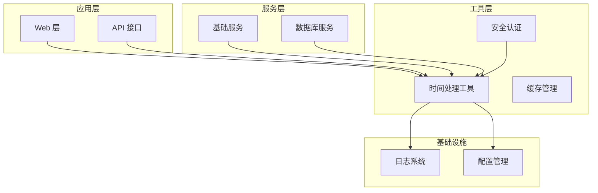
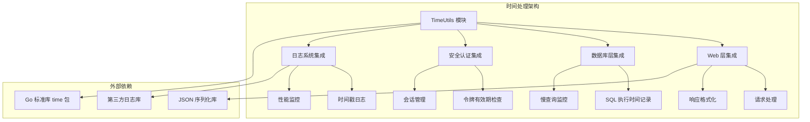
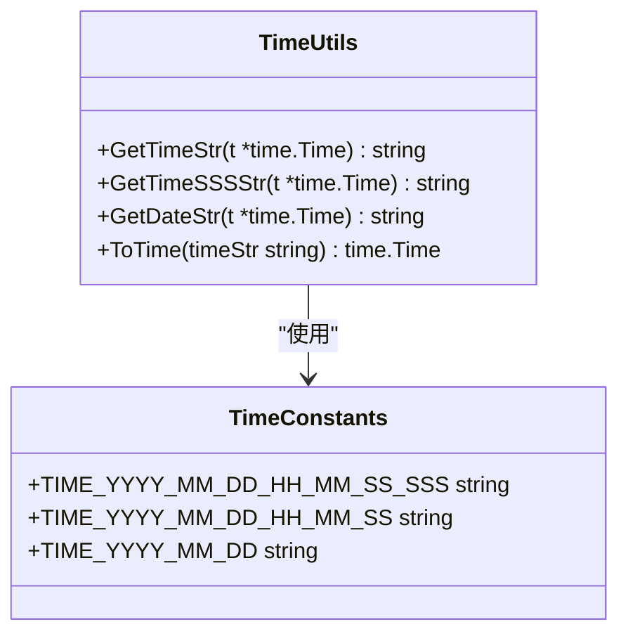
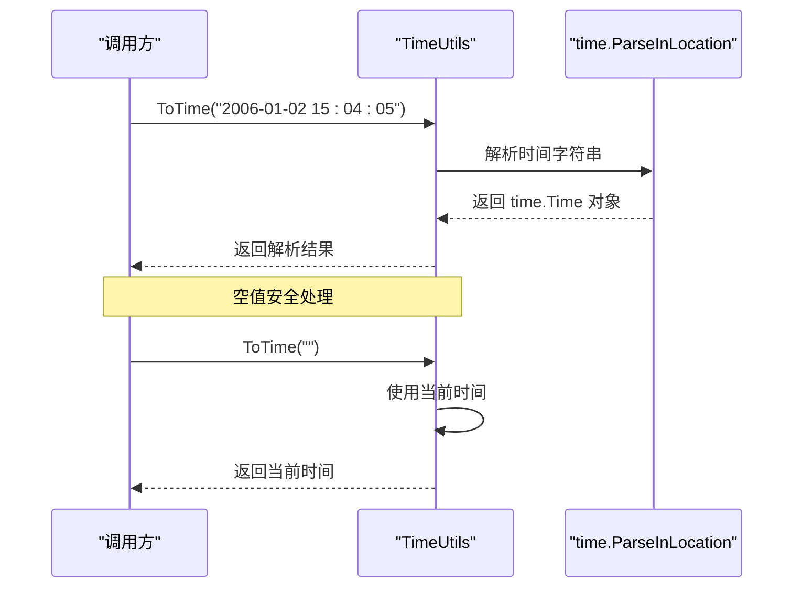
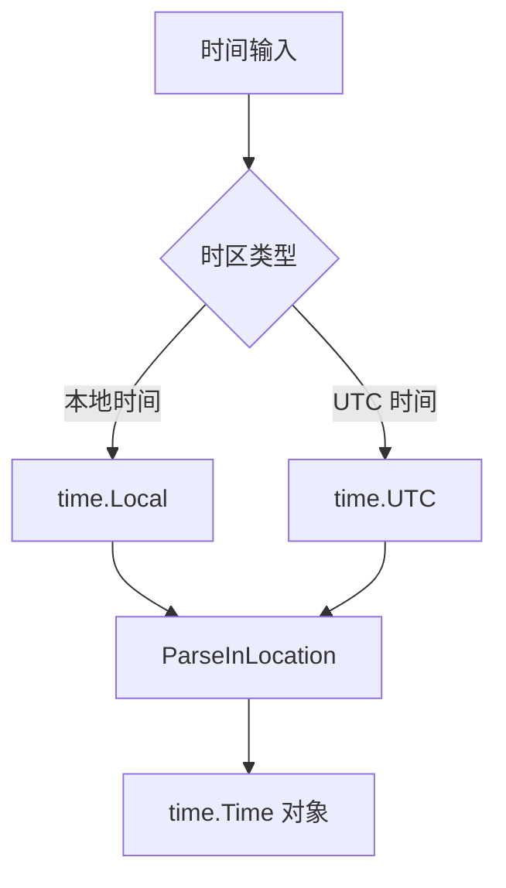
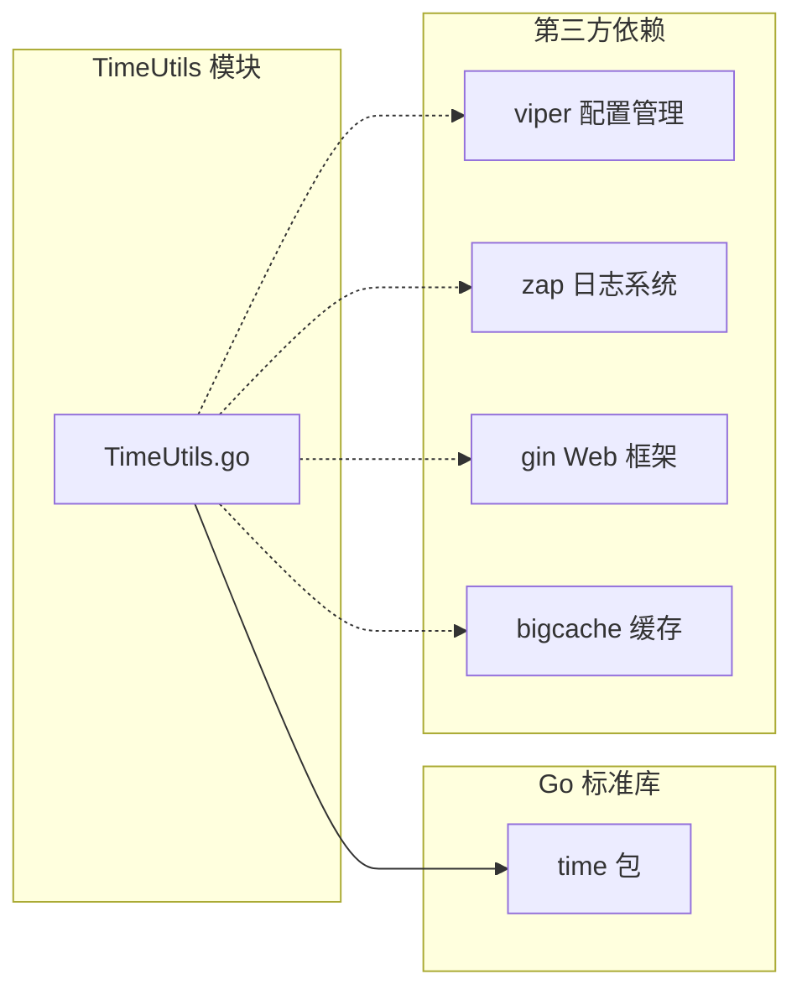

# 时间处理工具

<cite>
**本文档引用的文件**
- [TimeUtils.go](file://fast_utils/TimeUtils.go)
- [InitWebEx.go](file://fast_web/InitWebEx.go)
- [SecTokenManager.go](file://fast_web/SecTokenManager.go)
- [HttpFs.go](file://fast_web/web/HttpFs.go)
- [TaskPool.go](file://fast_base/TaskPool.go)
- [InitBase.go](file://fast_base/InitBase.go)
- [InitDB.go](file://fast_db/InitDB.go)
- [InitDBSnowFlake.go](file://fast_db/InitDBSnowFlake.go)
- [go.mod](file://fast_web/go.mod)
- [Readme.md](file://Readme.md)
</cite>

## 目录
1. [简介](#简介)
2. [项目结构](#项目结构)
3. [核心组件](#核心组件)
4. [架构概览](#架构概览)
5. [详细组件分析](#详细组件分析)
6. [依赖分析](#依赖分析)
7. [性能考虑](#性能考虑)
8. [故障排除指南](#故障排除指南)
9. [结论](#结论)

## 简介

时间处理工具模块是 fast_go 框架中的核心基础设施之一，专门负责时间格式转换、时区处理和时间戳操作。该模块提供了简洁而强大的时间处理能力，支持标准时间格式和自定义格式的处理，为整个系统的定时任务调度、日志记录、缓存管理和安全令牌验证等功能提供基础支撑。

本模块的设计遵循了 Go 语言的最佳实践，采用常量定义时间格式、提供空值安全的格式化函数，并通过统一的接口简化时间处理的复杂性。模块中的每个函数都经过精心设计，确保在各种使用场景下都能提供可靠的时间处理能力。

## 项目结构

时间处理工具模块位于 fast_utils 包中，与 Web 层、数据库层和基础服务层都有紧密的集成关系。整个项目的结构体现了清晰的分层架构：

**图表来源**
- [TimeUtils.go:1-38](file://fast_utils/TimeUtils.go#L1-L38)
- [InitWebEx.go:55-109](file://fast_web/InitWebEx.go#L55-L109)
- [SecTokenManager.go:1-56](file://fast_web/SecTokenManager.go#L1-L56)

**章节来源**
- [TimeUtils.go:1-38](file://fast_utils/TimeUtils.go#L1-L38)
- [InitWebEx.go:55-109](file://fast_web/InitWebEx.go#L55-L109)
- [SecTokenManager.go:1-56](file://fast_web/SecTokenManager.go#L1-L56)

## 核心组件

时间处理工具模块的核心由四个主要组件构成，每个组件都承担着特定的时间处理职责：

### 时间格式化组件
提供多种时间格式化的便捷函数，支持标准格式和毫秒级精度格式的转换。

### 时间解析组件  
负责将字符串格式的时间转换为 time.Time 对象，支持指定时区的解析。

### 时区处理组件
通过 time.Local 和 time.UTC 提供本地时间和 UTC 时间的转换能力。

### 边界情况处理组件
确保在空指针、无效输入等边界情况下提供安全的默认行为。

**章节来源**
- [TimeUtils.go:7-37](file://fast_utils/TimeUtils.go#L7-L37)

## 架构概览

时间处理工具模块在整个系统架构中扮演着基础设施的角色，为各个子系统提供统一的时间处理能力：

**图表来源**
- [TimeUtils.go:3-5](file://fast_utils/TimeUtils.go#L3-L5)
- [InitWebEx.go:119-146](file://fast_web/InitWebEx.go#L119-L146)
- [SecTokenManager.go:23-27](file://fast_web/SecTokenManager.go#L23-L27)

## 详细组件分析

### 时间格式化组件

时间格式化组件提供了三种主要的格式化函数，每种函数都针对不同的使用场景进行了优化：

#### GetTimeStr 函数
负责将 time.Time 对象格式化为标准时间字符串 "2006-01-02 15:04:05" 格式。该函数具有空值安全特性，当传入 nil 指针时会自动使用当前时间。

#### GetTimeSSSStr 函数  
提供毫秒级精度的时间格式化，输出格式为 "2006-01-02 15:04:05.000"。同样具备空值安全机制，确保在任何情况下都能返回有效的时间字符串。

#### GetDateStr 函数
专注于日期格式化，将时间对象转换为 "2006-01-02" 格式的纯日期字符串。

**图表来源**
- [TimeUtils.go:13-37](file://fast_utils/TimeUtils.go#L13-L37)

**章节来源**
- [TimeUtils.go:13-32](file://fast_utils/TimeUtils.go#L13-L32)

### 时间解析组件

时间解析组件的核心是 ToTime 函数，它负责将字符串格式的时间转换为 time.Time 对象。该函数使用 time.ParseInLocation 进行解析，确保时间解析与本地时区保持一致。

**图表来源**
- [TimeUtils.go:34-37](file://fast_utils/TimeUtils.go#L34-L37)

**章节来源**
- [TimeUtils.go:34-37](file://fast_utils/TimeUtils.go#L34-L37)

### 时区处理组件

模块中的时区处理主要通过 time.Local 和 time.UTC 来实现。虽然当前版本的实现相对简单，但为未来的扩展预留了空间。

**图表来源**
- [TimeUtils.go:35](file://fast_utils/TimeUtils.go#L35)

**章节来源**
- [TimeUtils.go:35](file://fast_utils/TimeUtils.go#L35)

### 边界情况处理组件

边界情况处理是时间处理工具模块的重要特性，确保在各种异常情况下都能提供稳定的行为：

#### 空指针处理
所有格式化函数都检查输入的 time.Time 指针是否为 nil，如果为 nil 则使用当前时间作为替代。

#### 错误处理策略
时间解析函数采用"静默失败"的策略，当解析失败时返回零值时间对象。这种设计简化了调用方的错误处理逻辑。

**章节来源**
- [TimeUtils.go:14-17](file://fast_utils/TimeUtils.go#L14-L17)
- [TimeUtils.go:21-24](file://fast_utils/TimeUtils.go#L21-L24)
- [TimeUtils.go:28-31](file://fast_utils/TimeUtils.go#L28-L31)

## 依赖分析

时间处理工具模块的依赖关系相对简单，主要依赖于 Go 标准库的 time 包：

**图表来源**
- [TimeUtils.go:3-5](file://fast_utils/TimeUtils.go#L3-L5)
- [go.mod:11-14](file://fast_web/go.mod#L11-L14)

**章节来源**
- [go.mod:11-14](file://fast_web/go.mod#L11-L14)

### 外部依赖集成

时间处理工具模块与多个外部组件有集成关系：

#### Web 层集成
Web 层在日志记录和请求处理中广泛使用时间处理功能，特别是在格式化时间戳和计算请求延迟方面。

#### 数据库层集成  
数据库层利用时间处理功能进行 SQL 执行时间记录和慢查询监控。

#### 安全认证集成
安全令牌管理器使用时间处理功能来验证令牌的有效期。

**章节来源**
- [InitWebEx.go:119-146](file://fast_web/InitWebEx.go#L119-L146)
- [SecTokenManager.go:23-27](file://fast_web/SecTokenManager.go#L23-L27)

## 性能考虑

时间处理工具模块在设计时充分考虑了性能因素：

### 内存效率
- 使用常量定义时间格式，避免重复分配字符串
- 格式化函数直接返回字符串，减少中间对象的创建

### 计算效率
- 时间格式化操作都是 O(1) 复杂度
- 解析操作基于 Go 标准库，经过高度优化

### 并发安全性
- 所有函数都是纯函数，没有共享状态
- 格式化操作不修改输入参数

## 故障排除指南

### 常见问题及解决方案

#### 时间解析失败
当传入的时间字符串格式不正确时，ToTime 函数会返回零值时间对象。建议在调用前验证时间字符串的格式。

#### 时区相关问题
如果发现时间显示与预期不符，检查服务器的时区配置。可以通过设置环境变量 TZ 来调整时区。

#### 性能问题
如果发现时间处理成为瓶颈，可以考虑：
- 复用 time.Time 对象而不是频繁创建
- 在高频调用场景下缓存格式化结果

**章节来源**
- [Readme.md:64](file://Readme.md#L64)

## 结论

时间处理工具模块为 fast_go 框架提供了坚实的时间处理基础。其简洁而强大的设计使得开发者能够轻松处理各种时间相关的场景，从简单的格式化到复杂的时区转换。

模块的主要优势包括：
- **易用性**：提供直观的 API 接口
- **可靠性**：完善的边界情况处理
- **性能**：高效的实现和内存使用
- **可扩展性**：为未来功能扩展预留空间

随着系统的不断发展，时间处理工具模块将继续演进，为构建高性能、可靠的应用程序提供强有力的支持。