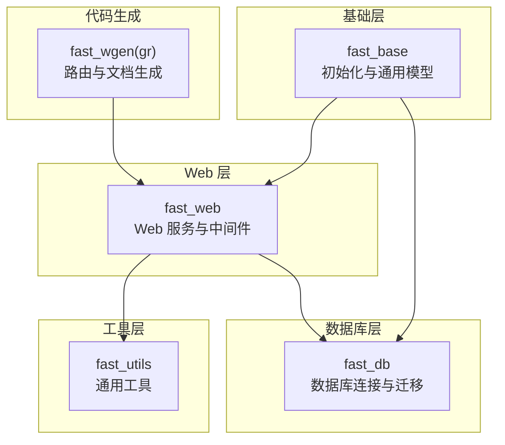
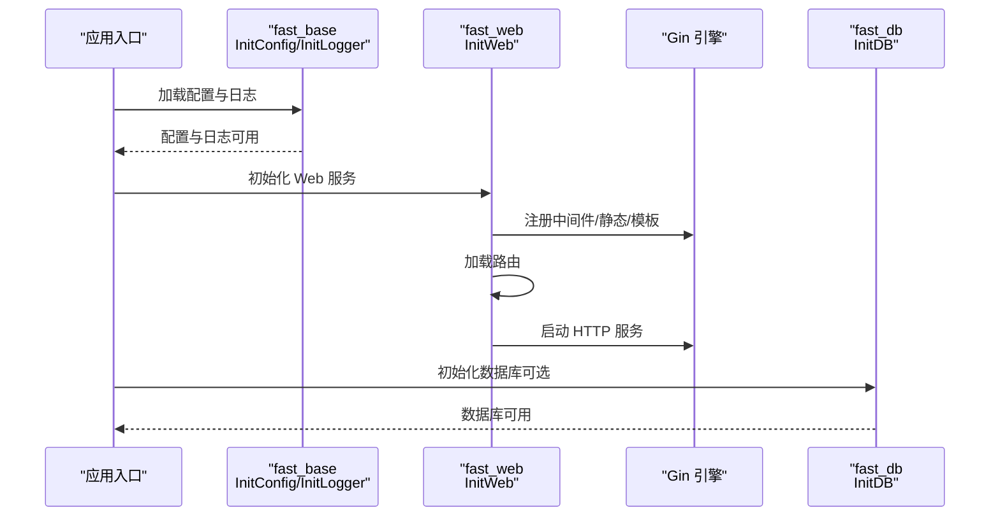
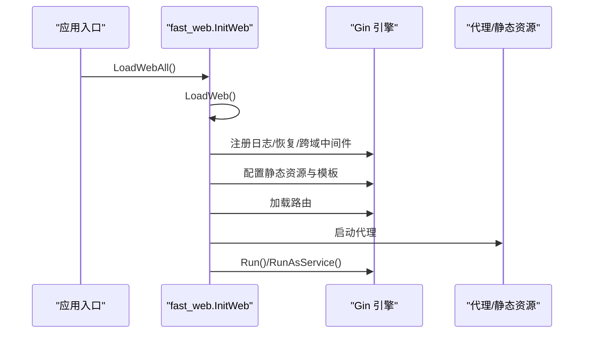
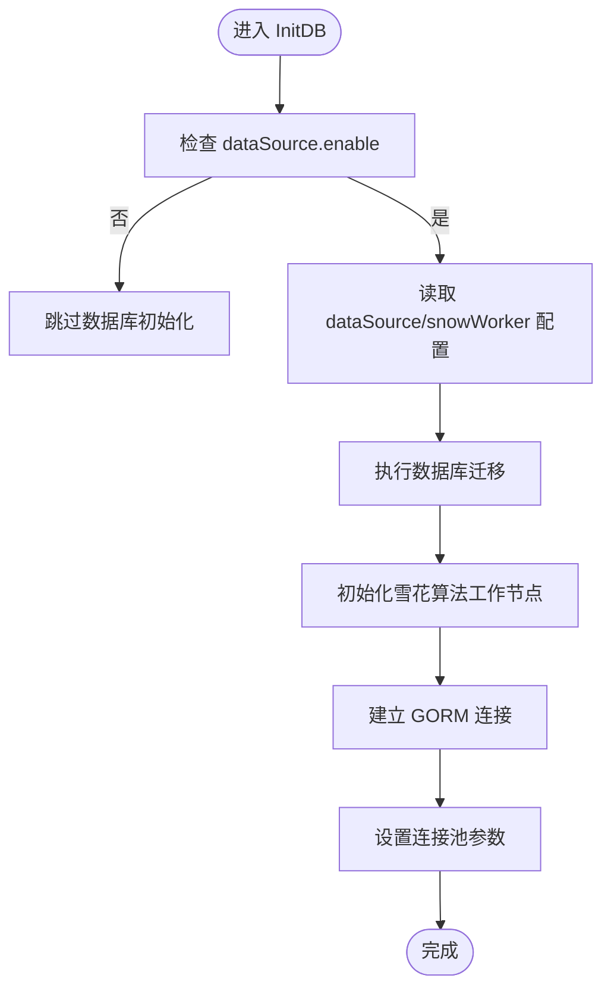
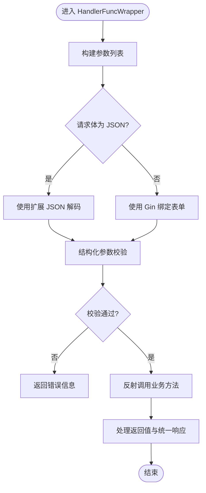
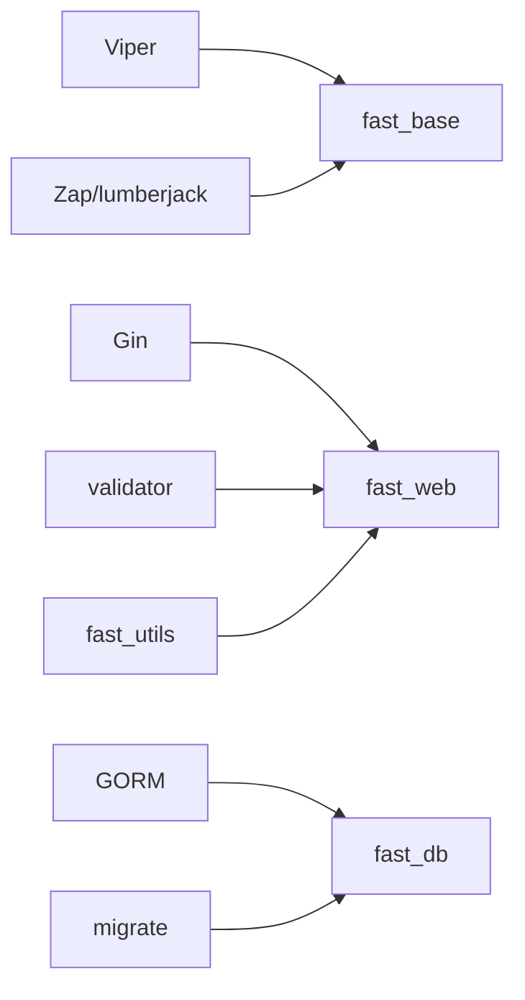

# 快速开始

<cite>
**本文引用的文件**
- [fast_base/InitBase.go](file://fast_base/InitBase.go)
- [fast_base/InitConfig.go](file://fast_base/InitConfig.go)
- [fast_base/InitLogger.go](file://fast_base/InitLogger.go)
- [fast_base/Model.go](file://fast_base/Model.go)
- [fast_db/InitDB.go](file://fast_db/InitDB.go)
- [fast_db/InitDBMigrate.go](file://fast_db/InitDBMigrate.go)
- [fast_web/InitWeb.go](file://fast_web/InitWeb.go)
- [fast_web/InitWebEx.go](file://fast_web/InitWebEx.go)
- [fast_web/InitWebStatic.go](file://fast_web/InitWebStatic.go)
- [fast_web/InitWebValidator.go](file://fast_web/InitWebValidator.go)
- [fast_web/SecFilter.go](file://fast_web/SecFilter.go)
- [fast_utils/HttpMediaType.go](file://fast_utils/HttpMediaType.go)
- [fast_utils/SecUtils.go](file://fast_utils/SecUtils.go)
- [Readme.md](file://Readme.md)
- [fast_wgen/gr.go](file://fast_wgen/gr.go)
</cite>

## 目录
1. [简介](#简介)
2. [项目结构](#项目结构)
3. [核心组件](#核心组件)
4. [架构总览](#架构总览)
5. [详细组件解析](#详细组件解析)
6. [依赖关系分析](#依赖关系分析)
7. [性能注意事项](#性能注意事项)
8. [故障排查指南](#故障排查指南)
9. [结论](#结论)
10. [附录](#附录)

## 简介
本指南面向新手开发者，帮助你在约 15 分钟内完成 Fast-Go 框架项目的初始化与首个 Web 服务的启动。你将了解环境要求、安装步骤、基础配置、项目结构以及如何使用 InitBase、InitConfig、InitWeb、InitDB 等核心初始化函数，掌握配置文件结构与关键参数，并学会常见初始化错误的排查与修复。

## 项目结构
Fast-Go 采用多模块分层设计，围绕“基础能力（fast_base）—Web 层（fast_web）—数据库（fast_db）—工具集（fast_utils）—代码生成（fast_wgen）”组织，便于按需组合使用。

图表来源
- [fast_base/InitBase.go:1-50](file://fast_base/InitBase.go#L1-L50)
- [fast_web/InitWeb.go:1-120](file://fast_web/InitWeb.go#L1-L120)
- [fast_db/InitDB.go:1-120](file://fast_db/InitDB.go#L1-L120)
- [fast_utils/HttpMediaType.go:1-56](file://fast_utils/HttpMediaType.go#L1-L56)
- [fast_wgen/gr.go:1-60](file://fast_wgen/gr.go#L1-L60)

章节来源
- [fast_base/InitBase.go:1-50](file://fast_base/InitBase.go#L1-L50)
- [fast_web/InitWeb.go:1-120](file://fast_web/InitWeb.go#L1-L120)
- [fast_db/InitDB.go:1-120](file://fast_db/InitDB.go#L1-L120)
- [fast_utils/HttpMediaType.go:1-56](file://fast_utils/HttpMediaType.go#L1-L56)
- [fast_wgen/gr.go:1-60](file://fast_wgen/gr.go#L1-L60)

## 核心组件
- 初始化基座（InitBase）
  - 提供全局日志、配置、环境等基础能力的默认值与类型定义。
- 配置加载（InitConfig）
  - 支持多路径 YAML 配置读取、环境变量覆盖、命令行参数注入与默认值回退。
- 日志系统（InitLogger）
  - 基于 Zap 与 lumberjack 的结构化日志，支持控制台与文件输出、切割与颜色。
- Web 服务（InitWeb）
  - 基于 Gin 的 Web 服务初始化、中间件、静态资源、模板、路由加载与优雅关闭。
- 数据库（InitDB）
  - 基于 GORM 的 MySQL 连接、命名策略、连接池、慢查询日志与迁移。
- 工具集（fast_utils）
  - HTTP 媒体类型、安全工具、时间工具等辅助能力。
- 代码生成（fast_wgen/gr）
  - 路由与文档生成工具，提升开发效率。

章节来源
- [fast_base/InitBase.go:1-50](file://fast_base/InitBase.go#L1-L50)
- [fast_base/InitConfig.go:1-108](file://fast_base/InitConfig.go#L1-L108)
- [fast_base/InitLogger.go:1-147](file://fast_base/InitLogger.go#L1-L147)
- [fast_web/InitWeb.go:1-120](file://fast_web/InitWeb.go#L1-L120)
- [fast_db/InitDB.go:1-120](file://fast_db/InitDB.go#L1-L120)
- [fast_utils/HttpMediaType.go:1-56](file://fast_utils/HttpMediaType.go#L1-L56)
- [fast_wgen/gr.go:1-60](file://fast_wgen/gr.go#L1-L60)

## 架构总览
下图展示了从应用启动到服务运行的关键流程：初始化配置与日志 → 加载 Web 服务 → 注册中间件与静态资源 → 加载路由 → 启动 HTTP 服务。

图表来源
- [fast_base/InitConfig.go:21-50](file://fast_base/InitConfig.go#L21-L50)
- [fast_base/InitLogger.go:15-44](file://fast_base/InitLogger.go#L15-L44)
- [fast_web/InitWeb.go:42-111](file://fast_web/InitWeb.go#L42-L111)
- [fast_db/InitDB.go:18-100](file://fast_db/InitDB.go#L18-L100)

章节来源
- [fast_base/InitConfig.go:21-50](file://fast_base/InitConfig.go#L21-L50)
- [fast_base/InitLogger.go:15-44](file://fast_base/InitLogger.go#L15-L44)
- [fast_web/InitWeb.go:42-111](file://fast_web/InitWeb.go#L42-L111)
- [fast_db/InitDB.go:18-100](file://fast_db/InitDB.go#L18-L100)

## 详细组件解析

### 环境要求与安装
- Go 版本
  - 建议使用 Go 1.26.2 或更高版本，以获得最佳兼容性与性能。
- 依赖工具
  - 安装路由与文档生成工具：参见代码生成模块的安装说明。
- 项目工作区
  - 使用仓库根目录作为工作区，遵循模块化结构进行开发。

章节来源
- [Readme.md:1-67](file://Readme.md#L1-L67)
- [fast_wgen/gr.go:24-31](file://fast_wgen/gr.go#L24-L31)

### 初始化流程（15 分钟上手）
- 步骤 1：创建项目目录与基础结构
  - 在工作区创建你的业务模块目录（例如 app/yourapp），并在其中编写业务逻辑与路由。
- 步骤 2：初始化配置与日志
  - 在项目根目录创建 conf/application.yaml（或按需创建 application-dev.yaml 等环境配置），随后在应用入口调用配置加载与日志初始化。
- 步骤 3：初始化 Web 服务
  - 调用 Web 初始化函数，注册中间件、静态资源、模板与路由，然后启动服务。
- 步骤 4：可选初始化数据库
  - 若需要数据库，配置 dataSource 与 snowWorker，调用数据库初始化函数，自动执行迁移与连接池配置。
- 步骤 5：启动与验证
  - 启动服务后，访问默认端口确认服务正常运行；若启用数据库，可在日志中观察连接与迁移信息。

章节来源
- [fast_base/InitConfig.go:21-50](file://fast_base/InitConfig.go#L21-L50)
- [fast_base/InitLogger.go:15-44](file://fast_base/InitLogger.go#L15-L44)
- [fast_web/InitWeb.go:42-111](file://fast_web/InitWeb.go#L42-L111)
- [fast_db/InitDB.go:18-100](file://fast_db/InitDB.go#L18-L100)

### 配置文件结构与关键参数
- 配置加载顺序（优先级从高到低）
  - 显示设置（Set）
  - 命令行参数（-env）
  - 环境变量（GO_ENV）
  - 配置文件（YAML）
  - 默认值
- 关键配置项（示例说明）
  - server.address：监听地址与端口
  - server.cross.allow：是否开启跨域
  - server.static.pathPatterns / resLocations：静态资源路径与映射
  - server.template：模板 glob 路径
  - log.level / log.format / log.path / log.stdout：日志级别、格式、输出路径与控制台开关
  - dataSource.enable / dataSource.dns / dataSource.maxOpenConns / dataSource.maxIdleConns / dataSource.maxIdleTime / dataSource.connMaxLifetime / dataSource.logLevel：数据库开关、连接串、连接池与日志级别
  - snowWorker.workId：雪花 ID 工作节点
  - env：环境标识（dev/test/prod）

章节来源
- [fast_base/InitConfig.go:13-87](file://fast_base/InitConfig.go#L13-L87)
- [fast_base/InitBase.go:16-49](file://fast_base/InitBase.go#L16-L49)
- [fast_web/InitWeb.go:49-98](file://fast_web/InitWeb.go#L49-L98)
- [fast_db/InitDB.go:42-89](file://fast_db/InitDB.go#L42-L89)

### 核心初始化函数使用说明
- InitBase（基础能力）
  - 提供全局日志、配置、环境等默认值与类型定义，供其他模块共享。
- InitConfig（配置加载）
  - 读取 YAML 配置、合并多环境配置、解析命令行与环境变量。
- InitLogger（日志初始化）
  - 基于 Zap 与 lumberjack 初始化结构化日志，支持文件切割与控制台输出。
- InitWeb（Web 服务）
  - 初始化 Gin 引擎、注册中间件（日志、恢复、跨域、限流）、静态资源、模板、路由加载与优雅关闭。
- InitDB（数据库）
  - 解析 dataSource/snowWorker 配置，执行数据库迁移，建立 GORM 连接与连接池，集成 Zap 日志。

章节来源
- [fast_base/InitBase.go:1-50](file://fast_base/InitBase.go#L1-L50)
- [fast_base/InitConfig.go:21-50](file://fast_base/InitConfig.go#L21-L50)
- [fast_base/InitLogger.go:15-44](file://fast_base/InitLogger.go#L15-L44)
- [fast_web/InitWeb.go:42-111](file://fast_web/InitWeb.go#L42-L111)
- [fast_db/InitDB.go:18-100](file://fast_db/InitDB.go#L18-L100)

### Web 服务启动序列

图表来源
- [fast_web/InitWeb.go:42-111](file://fast_web/InitWeb.go#L42-L111)
- [fast_web/InitWebEx.go:51-109](file://fast_web/InitWebEx.go#L51-L109)
- [fast_web/InitWebStatic.go:12-27](file://fast_web/InitWebStatic.go#L12-L27)

章节来源
- [fast_web/InitWeb.go:42-111](file://fast_web/InitWeb.go#L42-L111)
- [fast_web/InitWebEx.go:51-109](file://fast_web/InitWebEx.go#L51-L109)
- [fast_web/InitWebStatic.go:12-27](file://fast_web/InitWebStatic.go#L12-L27)

### 数据库初始化流程

图表来源
- [fast_db/InitDB.go:18-100](file://fast_db/InitDB.go#L18-L100)
- [fast_db/InitDBMigrate.go:12-28](file://fast_db/InitDBMigrate.go#L12-L28)

章节来源
- [fast_db/InitDB.go:18-100](file://fast_db/InitDB.go#L18-L100)
- [fast_db/InitDBMigrate.go:12-28](file://fast_db/InitDBMigrate.go#L12-L28)

### 参数绑定与校验流程

图表来源
- [fast_web/InitWeb.go:198-338](file://fast_web/InitWeb.go#L198-L338)
- [fast_web/InitWebValidator.go:67-87](file://fast_web/InitWebValidator.go#L67-L87)

章节来源
- [fast_web/InitWeb.go:198-338](file://fast_web/InitWeb.go#L198-L338)
- [fast_web/InitWebValidator.go:67-87](file://fast_web/InitWebValidator.go#L67-L87)

### 安全与限流中间件
- CORS 中间件：设置跨域头，支持 OPTIONS 预检。
- 限流中间件：基于令牌桶算法，可按接口粒度或全局使用。
- 认证中间件：支持基于密码与基于 Token 的访问控制，自动注入 AccessToken。

章节来源
- [fast_web/SecFilter.go:11-130](file://fast_web/SecFilter.go#L11-L130)
- [fast_web/InitWeb.go:67-73](file://fast_web/InitWeb.go#L67-L73)

### 代码生成（gr）与路由加载
- 使用 gr 工具扫描指定目录，自动生成路由加载文件，支持限流中间件自动注入。
- 生成文件通过反射包装，统一参数绑定、校验与响应格式。

章节来源
- [fast_wgen/gr.go:50-135](file://fast_wgen/gr.go#L50-L135)
- [fast_web/InitWeb.go:122-184](file://fast_web/InitWeb.go#L122-L184)

## 依赖关系分析
- 模块耦合
  - fast_web 依赖 fast_base（配置、日志、统一返回结构）与 fast_db（可选数据库）。
  - fast_db 依赖 fast_base（配置解析与日志）。
  - fast_web 与 fast_utils 通过工具函数协作（如媒体类型识别）。
- 外部依赖
  - Gin、Zap、lumberjack、Viper、GORM、validator、migrate 等。

图表来源
- [fast_base/InitConfig.go:3-11](file://fast_base/InitConfig.go#L3-L11)
- [fast_base/InitLogger.go:3-13](file://fast_base/InitLogger.go#L3-L13)
- [fast_web/InitWeb.go:3-17](file://fast_web/InitWeb.go#L3-L17)
- [fast_db/InitDB.go:3-16](file://fast_db/InitDB.go#L3-L16)
- [fast_web/InitWebValidator.go:3-11](file://fast_web/InitWebValidator.go#L3-L11)
- [fast_db/InitDBMigrate.go:3-10](file://fast_db/InitDBMigrate.go#L3-L10)

章节来源
- [fast_base/InitConfig.go:3-11](file://fast_base/InitConfig.go#L3-L11)
- [fast_base/InitLogger.go:3-13](file://fast_base/InitLogger.go#L3-L13)
- [fast_web/InitWeb.go:3-17](file://fast_web/InitWeb.go#L3-L17)
- [fast_db/InitDB.go:3-16](file://fast_db/InitDB.go#L3-L16)
- [fast_web/InitWebValidator.go:3-11](file://fast_web/InitWebValidator.go#L3-L11)
- [fast_db/InitDBMigrate.go:3-10](file://fast_db/InitDBMigrate.go#L3-L10)

## 性能注意事项
- 日志级别与输出
  - 生产环境建议使用 info 或更高级别，避免过多 debug 日志影响性能。
- 数据库连接池
  - 合理设置 maxOpenConns、maxIdleConns、connMaxLifetime 与 maxIdleTime，避免连接泄漏或频繁重建。
- Web 中间件
  - 仅对关键接口启用限流，减少全局限流带来的额外开销。
- JSON 序列化
  - 使用统一渲染器，避免重复创建编码器实例。

## 故障排查指南
- 启动失败：找不到配置文件
  - 确认 conf/application.yaml 存在，且路径包含在搜索路径中（当前目录、可执行目录、bin/conf 等）。
- 数据库连接失败
  - 检查 dataSource.dns 与网络连通性；确认迁移脚本存在且可访问；查看日志中的错误堆栈。
- 路由未生效
  - 确认已调用路由加载函数；检查 gr 生成文件是否正确；核对 @router 注释与路径格式。
- 跨域或鉴权问题
  - 检查 server.cross.allow 与认证头（AccessToken/AppKey）是否正确传递。
- 日志输出异常
  - 检查 log.path 与权限，确认 lumberjack 能正常创建与切割文件。

章节来源
- [fast_base/InitConfig.go:52-63](file://fast_base/InitConfig.go#L52-L63)
- [fast_db/InitDB.go:59-61](file://fast_db/InitDB.go#L59-L61)
- [fast_web/InitWeb.go:122-184](file://fast_web/InitWeb.go#L122-L184)
- [fast_web/SecFilter.go:115-130](file://fast_web/SecFilter.go#L115-L130)
- [fast_base/InitLogger.go:78-110](file://fast_base/InitLogger.go#L78-L110)

## 结论
通过本指南，你可以在 15 分钟内完成 Fast-Go 项目的初始化与首个 Web 服务的启动。建议在开发过程中：
- 使用 InitBase/InitConfig/InitLogger/InitWeb/InitDB 的标准流程进行初始化；
- 通过 conf 下的 YAML 文件集中管理配置；
- 使用 gr 工具自动生成路由，提升开发效率；
- 在生产环境中合理配置日志、数据库与中间件，确保稳定性与性能。

## 附录
- 常用命令
  - 安装代码生成工具：参见 fast_wgen/gr.go 中的安装说明。
  - 启动服务：在项目根目录执行二进制，或使用容器镜像运行。
- Docker 示例
  - 参考仓库中的 Dockerfile 与命令，将构建产物与配置拷贝至运行目录后启动。

章节来源
- [Readme.md:27-67](file://Readme.md#L27-L67)
- [fast_wgen/gr.go:24-31](file://fast_wgen/gr.go#L24-L31)