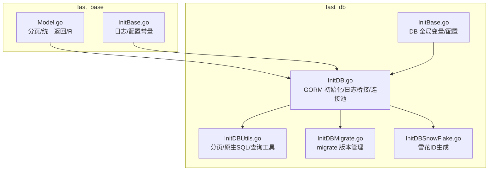
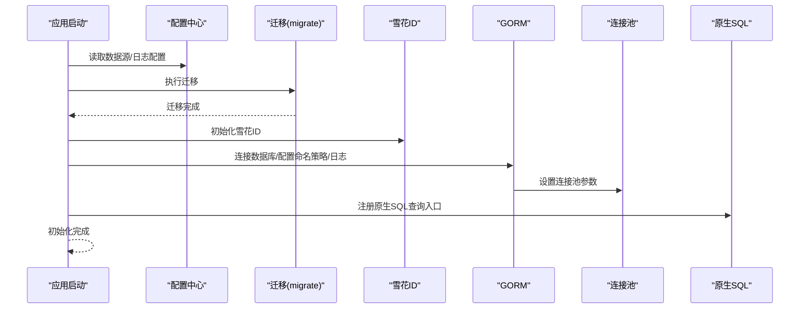
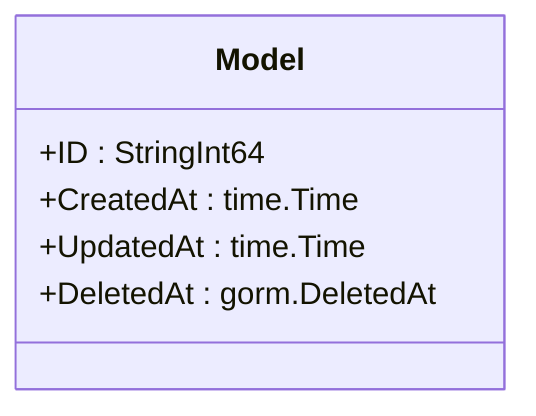
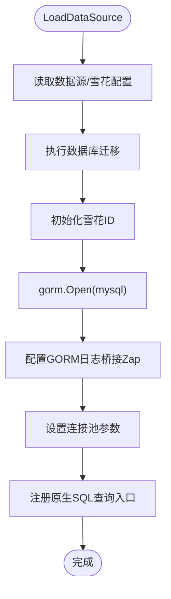
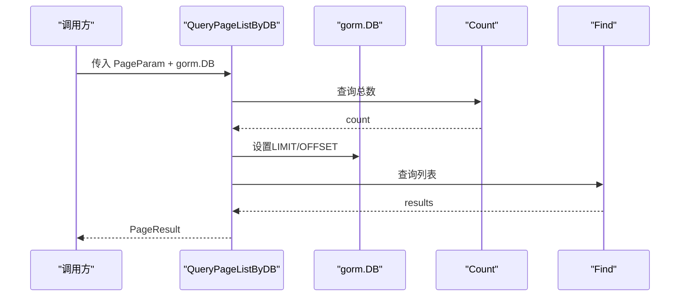
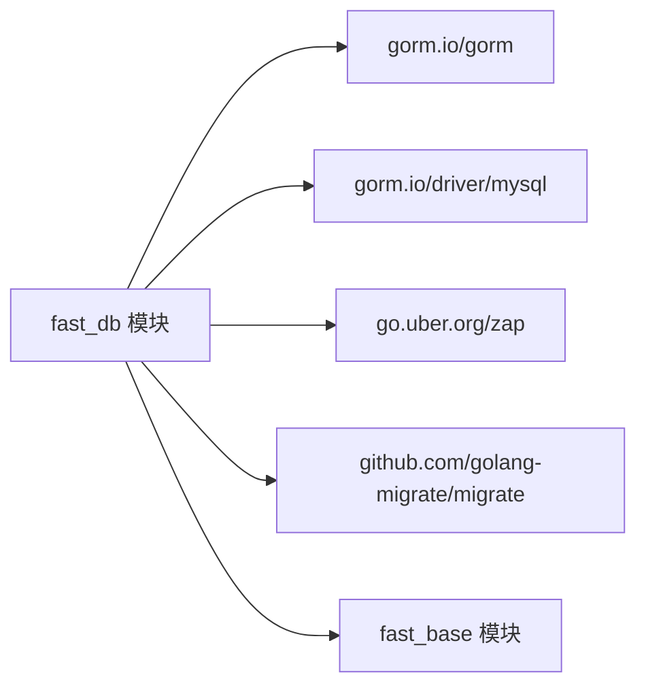

# GORM ORM 使用

<cite>
**本文引用的文件**
- [fast_base/Model.go](file://fast_base/Model.go)
- [fast_base/InitBase.go](file://fast_base/InitBase.go)
- [fast_db/InitBase.go](file://fast_db/InitBase.go)
- [fast_db/InitDB.go](file://fast_db/InitDB.go)
- [fast_db/InitDBUtils.go](file://fast_db/InitDBUtils.go)
- [fast_db/InitDBMigrate.go](file://fast_db/InitDBMigrate.go)
- [fast_db/InitDBSnowFlake.go](file://fast_db/InitDBSnowFlake.go)
- [fast_db/go.mod](file://fast_db/go.mod)
</cite>

## 目录
1. [简介](#简介)
2. [项目结构](#项目结构)
3. [核心组件](#核心组件)
4. [架构总览](#架构总览)
5. [详细组件分析](#详细组件分析)
6. [依赖分析](#依赖分析)
7. [性能考虑](#性能考虑)
8. [故障排查指南](#故障排查指南)
9. [结论](#结论)
10. [附录](#附录)

## 简介
本指南围绕 Fast-Go 项目中的 GORM ORM 使用展开，系统介绍 Model 基类设计（主键、时间戳、软删除）、基础 CRUD、分页查询、原生 SQL 与 GORM 混合开发、事务与错误处理等主题。文档以仓库现有实现为依据，结合图示帮助读者快速上手并在生产环境中安全落地。

## 项目结构
- fast_base：提供通用模型、分页、统一返回体、日志与配置等基础设施。
- fast_db：负责数据库连接、日志桥接、迁移、分页工具、原生 SQL 工具、雪花 ID 生成等。



图表来源
- [fast_base/Model.go:1-116](file://fast_base/Model.go#L1-L116)
- [fast_base/InitBase.go:1-50](file://fast_base/InitBase.go#L1-L50)
- [fast_db/InitBase.go:1-39](file://fast_db/InitBase.go#L1-L39)
- [fast_db/InitDB.go:1-238](file://fast_db/InitDB.go#L1-L238)
- [fast_db/InitDBUtils.go:1-123](file://fast_db/InitDBUtils.go#L1-L123)
- [fast_db/InitDBMigrate.go:1-69](file://fast_db/InitDBMigrate.go#L1-L69)
- [fast_db/InitDBSnowFlake.go:1-102](file://fast_db/InitDBSnowFlake.go#L1-L102)

章节来源
- [fast_base/Model.go:1-116](file://fast_base/Model.go#L1-L116)
- [fast_db/InitDB.go:1-238](file://fast_db/InitDB.go#L1-L238)

## 核心组件
- Model 基类：提供统一主键、CreatedAt/UpdatedAt 时间戳、DeletedAt 软删除索引。
- 分页与统一返回：泛型分页容器、分页参数校验、统一响应体。
- 数据库初始化：GORM 连接、命名策略、日志桥接、连接池配置。
- 查询工具：分页查询、原生 SQL 查询、按 ID/条件查询、存在性与计数。
- 迁移：基于 migrate 的版本管理。
- 雪花 ID：分布式自增主键生成。

章节来源
- [fast_base/Model.go:102-107](file://fast_base/Model.go#L102-L107)
- [fast_base/Model.go:10-55](file://fast_base/Model.go#L10-L55)
- [fast_base/Model.go:82-115](file://fast_base/Model.go#L82-L115)
- [fast_db/InitDB.go:18-100](file://fast_db/InitDB.go#L18-L100)
- [fast_db/InitDBUtils.go:10-78](file://fast_db/InitDBUtils.go#L10-L78)
- [fast_db/InitDBMigrate.go:12-28](file://fast_db/InitDBMigrate.go#L12-L28)
- [fast_db/InitDBSnowFlake.go:20-86](file://fast_db/InitDBSnowFlake.go#L20-L86)

## 架构总览
GORM 在本项目中的职责与交互如下：
- 初始化阶段：读取配置 → 迁移数据库 → 启动雪花 ID → 建立 GORM 连接 → 配置连接池 → 注册原生 SQL 查询入口。
- 查询阶段：优先使用 GORM 链式 API；复杂场景下拼接原生 SQL 并结合分页工具。
- 日志阶段：GORM 日志桥接到 Zap，支持慢查询阈值与彩色输出。
- 运维阶段：通过 migrate 管理版本变更。



图表来源
- [fast_db/InitDB.go:18-100](file://fast_db/InitDB.go#L18-L100)
- [fast_db/InitDBMigrate.go:12-28](file://fast_db/InitDBMigrate.go#L12-L28)
- [fast_db/InitDBSnowFlake.go:27-38](file://fast_db/InitDBSnowFlake.go#L27-L38)

## 详细组件分析

### Model 基类设计与使用
- 主键：采用自定义字符串整型类型，实现数据库驱动接口，便于前后端传输与持久化。
- 时间戳：CreatedAt/UpdatedAt 自动维护。
- 软删除：DeletedAt 字段配合索引，支持逻辑删除与恢复。
- 建议：业务模型继承该基类，即可获得统一的生命周期字段与主键能力。



图表来源
- [fast_base/Model.go:102-107](file://fast_base/Model.go#L102-L107)

章节来源
- [fast_base/Model.go:57-80](file://fast_base/Model.go#L57-L80)
- [fast_base/Model.go:102-107](file://fast_base/Model.go#L102-L107)

### 分页与统一返回
- 分页参数：支持 pageIndex/pageSize 校验与默认值。
- 分页结果：封装总数、总页数、列表与分页参数。
- 统一返回：R 结构体提供成功/错误模板与便捷方法。

```mermaid
classDiagram
class PageParam {
+GetIndex() int
+GetSize() int
}
class PageParams {
+PageIndex : int
+PageSize : int
+GetIndex() int
+GetSize() int
}
class PageResult_T {
+PageParams
+TotalPages : int
+TotalRows : int
+List : []T
+From(PageParam) *PageResult_T
+Set(count, list) void
}
class R {
+Code : int
+Message : string
+Data : interface{}
+SetData(value) R
+SetMessage(message) R
+SetCode(code) R
}
PageParam <|.. PageParams
PageResult_T --> PageParams
```

图表来源
- [fast_base/Model.go:10-55](file://fast_base/Model.go#L10-L55)
- [fast_base/Model.go:82-115](file://fast_base/Model.go#L82-L115)

章节来源
- [fast_base/Model.go:10-55](file://fast_base/Model.go#L10-L55)
- [fast_base/Model.go:82-115](file://fast_base/Model.go#L82-L115)

### 数据库初始化与日志桥接
- 配置读取：从配置中心读取数据源与雪花工作参数。
- 迁移：启动时自动执行迁移，确保表结构一致。
- GORM 初始化：设置命名策略（单数表名）、预编译语句、日志桥接。
- 连接池：最大打开连接数、空闲连接数、空闲与生命周期。
- 原生 SQL 入口：注册字典查询函数，供运行时调用。



图表来源
- [fast_db/InitDB.go:18-100](file://fast_db/InitDB.go#L18-L100)

章节来源
- [fast_db/InitDB.go:18-100](file://fast_db/InitDB.go#L18-L100)

### 查询工具与分页实现
- QueryPageListByDB：传入 gorm.DB，自动统计总数并分页查询。
- QueryPageListBySql：传入 SQL 与参数，自动拼接 LIMIT 并统计总数。
- GetListBySql：直接执行 SQL 返回切片。
- GetById/GetOne：按主键或原生 SQL 查询单条记录。
- CheckExists/CountNum：存在性检查与计数。
- removeOrderBy：移除 SQL 中的 ORDER BY 子句以统计总数。



图表来源
- [fast_db/InitDBUtils.go:10-30](file://fast_db/InitDBUtils.go#L10-L30)

章节来源
- [fast_db/InitDBUtils.go:10-78](file://fast_db/InitDBUtils.go#L10-L78)
- [fast_db/InitDBUtils.go:115-122](file://fast_db/InitDBUtils.go#L115-L122)

### 原生 SQL 与 GORM 混合开发
- 原生 SQL：通过 Raw + Scan 执行任意 SQL，适合复杂查询与性能敏感场景。
- 混合策略：优先 GORM 链式 API，复杂聚合/联表/子查询时使用原生 SQL。
- 注意事项：分页时需手动统计总数，避免重复执行全表扫描。

章节来源
- [fast_db/InitDBUtils.go:32-78](file://fast_db/InitDBUtils.go#L32-L78)

### 迁移与版本管理
- 使用 migrate 库与文件源进行版本管理。
- 支持一次性迁移与逐步迁移两种模式。
- 异常时记录致命日志并中断启动。

章节来源
- [fast_db/InitDBMigrate.go:12-28](file://fast_db/InitDBMigrate.go#L12-L28)
- [fast_db/InitDBMigrate.go:30-68](file://fast_db/InitDBMigrate.go#L30-L68)

### 雪花 ID 生成
- 多表/多结构体隔离工作节点，保证不同实体的 ID 不冲突。
- 支持数值与字符串两种返回形式。
- 与 GORM 主键类型配合，可直接作为 Model.ID 的来源。

章节来源
- [fast_db/InitDBSnowFlake.go:20-86](file://fast_db/InitDBSnowFlake.go#L20-L86)

## 依赖分析
- fast_db 对 gorm.io/gorm、gorm.io/driver/mysql、zap、migrate 等外部库有直接依赖。
- fast_base 为 fast_db 提供日志、配置、通用模型等基础能力。



图表来源
- [fast_db/go.mod:5-11](file://fast_db/go.mod#L5-L11)

章节来源
- [fast_db/go.mod:5-11](file://fast_db/go.mod#L5-L11)

## 性能考虑
- 连接池：合理设置最大打开连接数、空闲连接数与生命周期，避免过载或频繁重建连接。
- 预编译：开启 PrepareStmt，减少解析开销。
- 命名策略：单数表名减少歧义，提升可读性。
- 慢查询：通过自定义日志器记录慢查询，定位热点 SQL。
- 分页：避免深度分页，必要时使用游标或反向键优化。

章节来源
- [fast_db/InitDB.go:42-88](file://fast_db/InitDB.go#L42-L88)
- [fast_db/InitDB.go:110-150](file://fast_db/InitDB.go#L110-L150)

## 故障排查指南
- 连接失败：检查数据源配置与网络连通性，确认 DNS 拼装正确。
- 迁移失败：查看迁移日志，确认迁移脚本与目标数据库兼容。
- 慢查询：根据日志阈值定位慢 SQL，优化索引与查询计划。
- 错误返回：统一使用 R 结构体，便于前端与监控系统识别。
- 存在性与计数：使用 CheckExists/CountNum 快速判断与统计。

章节来源
- [fast_db/InitDB.go:59-61](file://fast_db/InitDB.go#L59-L61)
- [fast_db/InitDBMigrate.go:19-27](file://fast_db/InitDBMigrate.go#L19-L27)
- [fast_db/InitDBUtils.go:96-113](file://fast_db/InitDBUtils.go#L96-L113)
- [fast_base/Model.go:110-115](file://fast_base/Model.go#L110-L115)

## 结论
Fast-Go 在 fast_db 中对 GORM 进行了完善的封装与工程化配置，提供了统一的 Model 基类、分页与返回体、原生 SQL 工具、迁移与日志桥接等能力。遵循本文档的使用方式，可在保证性能与可观测性的前提下，高效完成常见与复杂的数据库操作。

## 附录
- 基础 CRUD 示例路径
  - 创建：使用 GORM 链式 API 插入记录，结合雪花 ID 作为主键来源。
  - 查询：优先使用 First/Find/Scopes，复杂场景使用 Raw + Scan。
  - 更新：使用 Updates/Where/Select 精准更新字段。
  - 删除：使用 Delete/Where 或软删除字段。
- 关联与预加载
  - 使用 Joins/Preload/Select 控制联表与字段选择，避免 N+1 查询。
- 条件、排序、分页与聚合
  - Where/Order/Limit/Offset 组合实现条件与排序；Count/Group/Having 实现聚合。
- 事务与错误处理
  - 使用 Transaction 包裹多步写操作；捕获并记录错误，返回统一 R 结构体。
- 原生 SQL 与 GORM 混合
  - 复杂查询优先原生 SQL，再用 GORM 封装为工具函数复用。