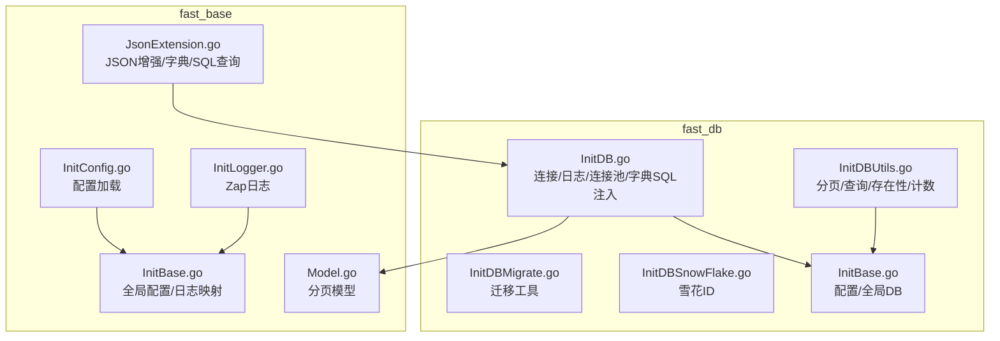
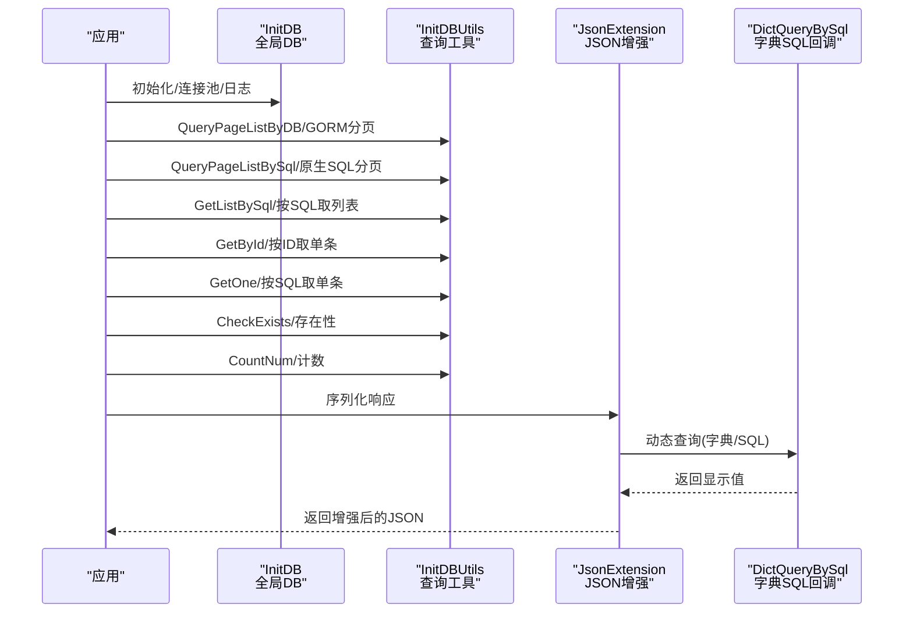
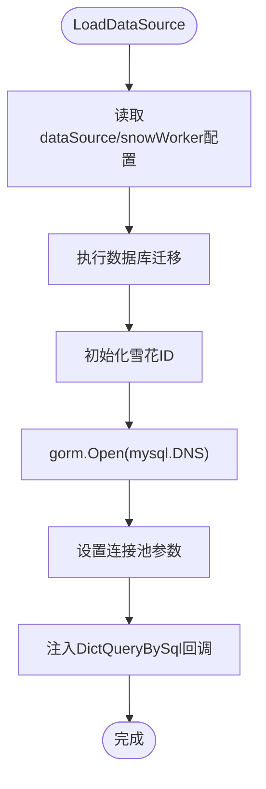
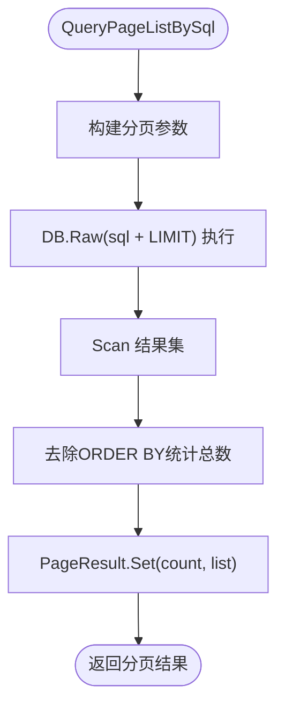
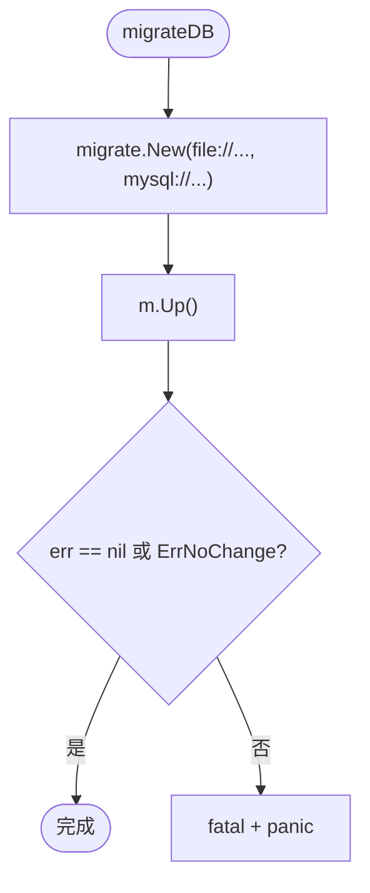
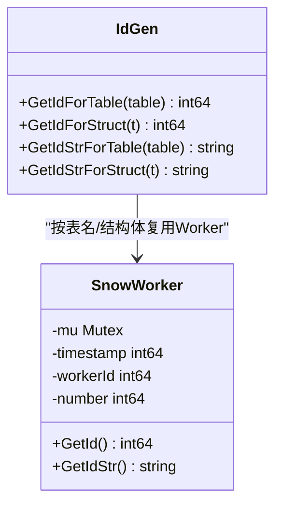
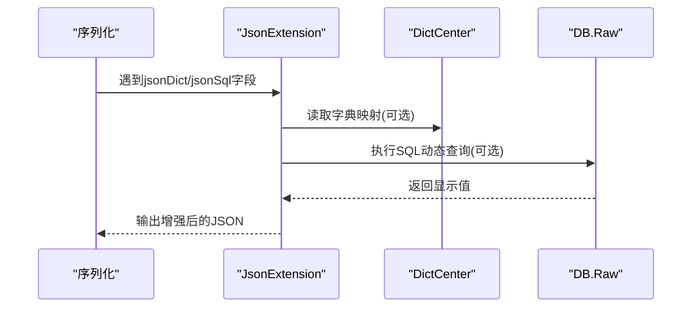
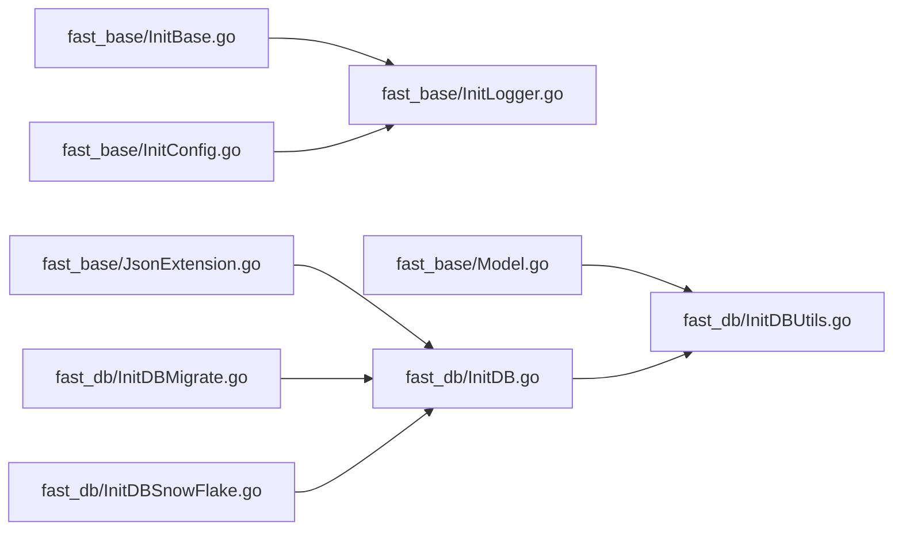

# 数据库工具函数

<cite>
**本文引用的文件**
- [fast_db/InitDBUtils.go](file://fast_db/InitDBUtils.go)
- [fast_db/InitDB.go](file://fast_db/InitDB.go)
- [fast_db/InitBase.go](file://fast_db/InitBase.go)
- [fast_db/InitDBMigrate.go](file://fast_db/InitDBMigrate.go)
- [fast_db/InitDBSnowFlake.go](file://fast_db/InitDBSnowFlake.go)
- [fast_base/Model.go](file://fast_base/Model.go)
- [fast_base/JsonExtension.go](file://fast_base/JsonExtension.go)
- [fast_base/InitBase.go](file://fast_base/InitBase.go)
- [fast_base/InitConfig.go](file://fast_base/InitConfig.go)
- [fast_base/InitLogger.go](file://fast_base/InitLogger.go)
</cite>

## 目录
1. [简介](#简介)
2. [项目结构](#项目结构)
3. [核心组件](#核心组件)
4. [架构总览](#架构总览)
5. [详细组件分析](#详细组件分析)
6. [依赖分析](#依赖分析)
7. [性能考量](#性能考量)
8. [故障排查指南](#故障排查指南)
9. [结论](#结论)
10. [附录：API 参考与使用示例](#附录api-参考与使用示例)

## 简介
本指南聚焦于 Fast-Go 的数据库工具函数与配套能力，覆盖：
- SQL 查询执行与分页封装
- 直接 SQL 批量查询与存在性/计数查询
- 字典中心与数据库的集成：动态字典查询与 JSON 层增强
- 性能监控与诊断：慢查询日志、连接池配置、迁移工具
- 连接状态检查、查询优化建议与常见问题处理
- 使用工具函数简化常见数据库操作，提升开发效率

## 项目结构
数据库相关能力主要分布在 fast_db 与 fast_base 两个模块：
- fast_db：数据库连接、日志器、迁移、雪花 ID、工具函数
- fast_base：分页模型、JSON 扩展（含字典与 SQL 动态查询）、全局配置与日志

图表来源
- [fast_db/InitDB.go:18-100](file://fast_db/InitDB.go#L18-L100)
- [fast_db/InitDBUtils.go:10-122](file://fast_db/InitDBUtils.go#L10-L122)
- [fast_db/InitDBMigrate.go:12-28](file://fast_db/InitDBMigrate.go#L12-L28)
- [fast_db/InitDBSnowFlake.go:20-102](file://fast_db/InitDBSnowFlake.go#L20-L102)
- [fast_db/InitBase.go:9-39](file://fast_db/InitBase.go#L9-L39)
- [fast_base/Model.go:10-55](file://fast_base/Model.go#L10-L55)
- [fast_base/JsonExtension.go:24-103](file://fast_base/JsonExtension.go#L24-L103)
- [fast_base/InitBase.go:9-50](file://fast_base/InitBase.go#L9-L50)
- [fast_base/InitConfig.go:21-50](file://fast_base/InitConfig.go#L21-L50)
- [fast_base/InitLogger.go:15-44](file://fast_base/InitLogger.go#L15-L44)

章节来源
- [fast_db/InitDB.go:18-100](file://fast_db/InitDB.go#L18-L100)
- [fast_db/InitDBUtils.go:10-122](file://fast_db/InitDBUtils.go#L10-L122)
- [fast_db/InitDBMigrate.go:12-28](file://fast_db/InitDBMigrate.go#L12-L28)
- [fast_db/InitDBSnowFlake.go:20-102](file://fast_db/InitDBSnowFlake.go#L20-L102)
- [fast_base/Model.go:10-55](file://fast_base/Model.go#L10-L55)
- [fast_base/JsonExtension.go:24-103](file://fast_base/JsonExtension.go#L24-L103)
- [fast_base/InitBase.go:9-50](file://fast_base/InitBase.go#L9-L50)
- [fast_base/InitConfig.go:21-50](file://fast_base/InitConfig.go#L21-L50)
- [fast_base/InitLogger.go:15-44](file://fast_base/InitLogger.go#L15-L44)

## 核心组件
- 数据库连接与日志器
  - 初始化数据源、连接池、慢查询日志与 Zap 集成
  - 注入字典 SQL 查询回调，打通 JSON 层动态查询
- 工具函数
  - 分页查询（GORM 条件与原生 SQL）
  - 直接 SQL 查询列表、按 ID/条件取单条、存在性判断、计数
- 迁移工具
  - 基于 golang-migrate 的自动迁移与逐步迁移
- 雪花 ID
  - 基于表名/结构体的分布式自增 ID 生成
- JSON 扩展
  - 数据字典映射、SQL 动态查询、int64 字符串化、容错反序列化

章节来源
- [fast_db/InitDB.go:18-100](file://fast_db/InitDB.go#L18-L100)
- [fast_db/InitDBUtils.go:10-122](file://fast_db/InitDBUtils.go#L10-L122)
- [fast_db/InitDBMigrate.go:12-28](file://fast_db/InitDBMigrate.go#L12-L28)
- [fast_db/InitDBSnowFlake.go:20-102](file://fast_db/InitDBSnowFlake.go#L20-L102)
- [fast_base/JsonExtension.go:24-103](file://fast_base/JsonExtension.go#L24-L103)

## 架构总览
数据库层通过 InitDB 初始化全局 gorm.DB，配置连接池与慢日志；工具函数围绕 DB 提供统一查询入口；JSON 扩展在序列化阶段调用注入的 DictQueryBySql，实现“字典/SQL 动态查询”的零样板代码。

图表来源
- [fast_db/InitDB.go:18-100](file://fast_db/InitDB.go#L18-L100)
- [fast_db/InitDBUtils.go:10-122](file://fast_db/InitDBUtils.go#L10-L122)
- [fast_base/JsonExtension.go:75-103](file://fast_base/JsonExtension.go#L75-L103)

## 详细组件分析

### 组件一：数据库连接与日志器（InitDB）
- 连接初始化
  - 读取配置 dataSource，构造 DNS，打开 gorm 连接
  - 设置命名策略（单数表名）、预编译语句
- 连接池配置
  - 最大打开连接数、最大空闲连接数、空闲最大时长、生命周期
- 慢查询日志
  - 自定义 GormLogger，桥接 Zap，支持彩色输出与调用者定位
  - 按日志级别映射，区分 info/warn/error
- 字典 SQL 注入
  - 在 DB 初始化时，向 fast_base.DictQueryBySql 注入回调，基于 DB.Raw 执行 SQL 并返回字符串

图表来源
- [fast_db/InitDB.go:18-100](file://fast_db/InitDB.go#L18-L100)

章节来源
- [fast_db/InitDB.go:18-100](file://fast_db/InitDB.go#L18-L100)

### 组件二：数据库工具函数（InitDBUtils）
- 分页查询（GORM 条件）
  - 支持传入 PageParam，先 Count 再 Limit/Offset 查询，封装为 PageResult
- 分页查询（原生 SQL）
  - 拼接 LIMIT，执行 Raw 查询；通过去除 ORDER BY 的子查询统计总数
- 列表查询（原生 SQL）
  - 直接执行 Raw 查询并 Scan 结果
- 单条查询
  - GetById：按主键取单条
  - GetOne：按 SQL 取单条
- 存在性与计数
  - CheckExists：统计 > 0 则存在，异常时记录日志
  - CountNum：返回整型计数
- 辅助函数
  - removeOrderBy：去除 SQL 中的 ORDER BY 子句，用于统计

图表来源
- [fast_db/InitDBUtils.go:32-63](file://fast_db/InitDBUtils.go#L32-L63)

章节来源
- [fast_db/InitDBUtils.go:10-122](file://fast_db/InitDBUtils.go#L10-L122)

### 组件三：迁移工具（InitDBMigrate）
- 自动迁移
  - 基于文件源与 MySQL 驱动，执行 Up，捕获 ErrNoChange
- 逐步迁移（辅助）
  - 打开 SQL 连接，Ping 成功后执行 Up

图表来源
- [fast_db/InitDBMigrate.go:12-28](file://fast_db/InitDBMigrate.go#L12-L28)

章节来源
- [fast_db/InitDBMigrate.go:12-28](file://fast_db/InitDBMigrate.go#L12-L28)

### 组件四：雪花 ID（InitDBSnowFlake）
- 基于表名/结构体的 Worker 管理
- 生成策略包含时间戳、工作节点、序列号位移
- 提供 int64 与字符串两种返回形式

图表来源
- [fast_db/InitDBSnowFlake.go:20-102](file://fast_db/InitDBSnowFlake.go#L20-L102)

章节来源
- [fast_db/InitDBSnowFlake.go:20-102](file://fast_db/InitDBSnowFlake.go#L20-L102)

### 组件五：JSON 扩展与字典中心（JsonExtension + InitDictCenter）
- JSON 扩展能力
  - int64 序列化为字符串，避免 JS 精度丢失
  - 容错反序列化：字符串/数字互转
  - 数据字典映射：通过 jsonDict 标签自动追加显示字段
  - SQL 动态查询：通过 jsonSql 标签在序列化时按 SQL 查询显示值
- 字典中心与回调注入
  - fast_base.InitDictCenter 定义 DictCenter 全局字典
  - fast_db.InitDB 在 DB 初始化时注入 DictQueryBySql，基于 DB.Raw 执行 SQL 返回字符串
  - fast_base.JsonExtension 通过 DictQueryBySql 实现运行时查询

图表来源
- [fast_base/JsonExtension.go:24-103](file://fast_base/JsonExtension.go#L24-L103)
- [fast_db/InitDB.go:92-99](file://fast_db/InitDB.go#L92-L99)
- [fast_base/InitDictCenter.go:3-5](file://fast_base/InitDictCenter.go#L3-L5)

章节来源
- [fast_base/JsonExtension.go:24-103](file://fast_base/JsonExtension.go#L24-L103)
- [fast_db/InitDB.go:92-99](file://fast_db/InitDB.go#L92-L99)
- [fast_base/InitDictCenter.go:3-5](file://fast_base/InitDictCenter.go#L3-L5)

### 组件六：分页模型（Model.go）
- PageParam/PageParams：分页索引与大小的约定接口与默认实现
- PageResult[T]：封装分页结果，包含总数、总页数、列表指针

章节来源
- [fast_base/Model.go:10-55](file://fast_base/Model.go#L10-L55)

## 依赖分析
- fast_db/InitDB 依赖 fast_base 的配置、日志、DictQueryBySql 回调
- fast_db/InitDBUtils 依赖 fast_base 的 PageParam/PageResult 与 gorm.DB
- fast_base/JsonExtension 依赖 fast_base/InitDictCenter 与 fast_db/InitDB 的 DictQueryBySql 注入
- fast_db/InitDBMigrate 依赖 golang-migrate 与 MySQL 驱动
- fast_db/InitDBSnowFlake 为独立 ID 生成模块

图表来源
- [fast_db/InitDB.go:18-100](file://fast_db/InitDB.go#L18-L100)
- [fast_db/InitDBUtils.go:10-122](file://fast_db/InitDBUtils.go#L10-L122)
- [fast_db/InitDBMigrate.go:12-28](file://fast_db/InitDBMigrate.go#L12-L28)
- [fast_db/InitDBSnowFlake.go:20-102](file://fast_db/InitDBSnowFlake.go#L20-L102)
- [fast_base/JsonExtension.go:24-103](file://fast_base/JsonExtension.go#L24-L103)
- [fast_base/Model.go:10-55](file://fast_base/Model.go#L10-L55)
- [fast_base/InitBase.go:9-50](file://fast_base/InitBase.go#L9-L50)
- [fast_base/InitConfig.go:21-50](file://fast_base/InitConfig.go#L21-L50)
- [fast_base/InitLogger.go:15-44](file://fast_base/InitLogger.go#L15-L44)

## 性能考量
- 连接池
  - MaxOpenConns、MaxIdleConns、ConnMaxLifetime、MaxIdleTime 需结合 MySQL max_connections 与业务并发调优
- 预编译语句
  - PrepareStmt=true 降低解析开销，适合高频重复 SQL
- 慢查询日志
  - SlowThreshold 与日志级别联动，生产建议 Warn/Info 级别开启
- 分页查询
  - 原生 SQL 分页需确保统计 SQL 去除 ORDER BY，避免重复排序导致的额外开销
- JSON 扩展
  - jsonSql 会在序列化阶段触发 SQL 查询，建议谨慎使用或配合缓存策略

章节来源
- [fast_db/InitDB.go:42-89](file://fast_db/InitDB.go#L42-L89)
- [fast_db/InitDBUtils.go:32-63](file://fast_db/InitDBUtils.go#L32-L63)
- [fast_base/JsonExtension.go:75-103](file://fast_base/JsonExtension.go#L75-L103)

## 故障排查指南
- 连接失败
  - 检查 DNS 构造、用户名密码、网络连通性；查看 panic 日志
- 迁移失败
  - 查看 fatal 输出与具体错误；确认 migration 文件路径与 MySQL 连接
- 慢查询
  - 关注慢查询日志，定位耗时 SQL；结合 EXPLAIN 分析
- 存在性/计数异常
  - CheckExists 会记录异常日志；确认 SQL 正确性与权限
- JSON 动态查询异常
  - 若 DictQueryBySql 未注入或 SQL 报错，序列化阶段会返回空值或错误字符串

章节来源
- [fast_db/InitDB.go:59-61](file://fast_db/InitDB.go#L59-L61)
- [fast_db/InitDBMigrate.go:19-27](file://fast_db/InitDBMigrate.go#L19-L27)
- [fast_db/InitDBUtils.go:96-107](file://fast_db/InitDBUtils.go#L96-L107)
- [fast_base/JsonExtension.go:94-101](file://fast_base/JsonExtension.go#L94-L101)

## 结论
Fast-Go 的数据库工具函数以 InitDB 为核心，提供稳定连接、可观测日志与便捷工具，配合 JSON 扩展实现“所见即所得”的字典与动态查询体验。通过合理的连接池与慢日志策略，可有效提升数据库性能与稳定性。

## 附录：API 参考与使用示例

- 分页查询（GORM 条件）
  - 输入：PageParam、*gorm.DB
  - 输出：PageResult[T]
  - 示例路径：[QueryPageListByDB:11-30](file://fast_db/InitDBUtils.go#L11-L30)
- 分页查询（原生 SQL）
  - 输入：PageParam、SQL、参数
  - 输出：PageResult[T]
  - 示例路径：[QueryPageListBySql:33-63](file://fast_db/InitDBUtils.go#L33-L63)
- 列表查询（原生 SQL）
  - 输入：SQL、参数
  - 输出：[]T
  - 示例路径：[GetListBySql:66-78](file://fast_db/InitDBUtils.go#L66-L78)
- 单条查询
  - 按 ID：[GetById:80-86](file://fast_db/InitDBUtils.go#L80-L86)
  - 按 SQL：[GetOne:88-94](file://fast_db/InitDBUtils.go#L88-L94)
- 存在性与计数
  - [CheckExists:96-107](file://fast_db/InitDBUtils.go#L96-L107)
  - [CountNum:109-113](file://fast_db/InitDBUtils.go#L109-L113)
- 连接与日志
  - 初始化：[LoadDataSource:19-100](file://fast_db/InitDB.go#L19-L100)
  - 连接池参数：[SetMaxOpenConns/SetMaxIdleConns/SetConnMaxIdleTime/SetConnMaxLifetime:67-88](file://fast_db/InitDB.go#L67-L88)
- 迁移
  - 自动迁移：[migrateDB:12-28](file://fast_db/InitDBMigrate.go#L12-L28)
  - 逐步迁移：[migrateDBStepByStep:30-68](file://fast_db/InitDBMigrate.go#L30-L68)
- 雪花 ID
  - [GetIdForTable:44-59](file://fast_db/InitDBSnowFlake.go#L44-L59)
  - [GetIdForStruct:61-67](file://fast_db/InitDBSnowFlake.go#L61-L67)
  - [GetIdStrForTable:93-96](file://fast_db/InitDBSnowFlake.go#L93-L96)
  - [GetIdStrForStruct:98-101](file://fast_db/InitDBSnowFlake.go#L98-L101)
- JSON 扩展与字典
  - 注册扩展：[RegisterExtension:48-48](file://fast_base/JsonExtension.go#L48-L48)
  - 数据字典映射：[jsonDict 标签:207-274](file://fast_base/JsonExtension.go#L207-L274)
  - SQL 动态查询：[jsonSql 标签:239-272](file://fast_base/JsonExtension.go#L239-L272)
  - 字典中心：[DictCenter:3-5](file://fast_base/InitDictCenter.go#L3-L5)
  - 回调注入：[DictQueryBySql 注入:92-99](file://fast_db/InitDB.go#L92-L99)