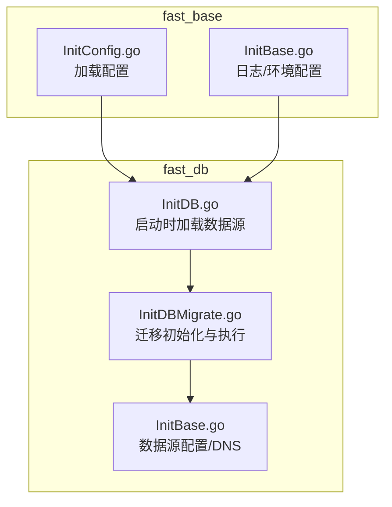
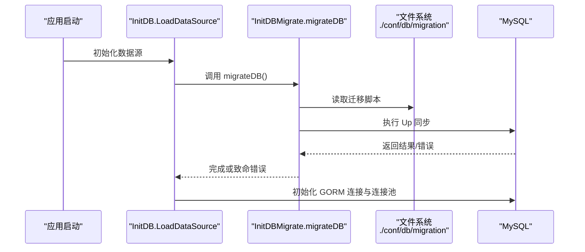
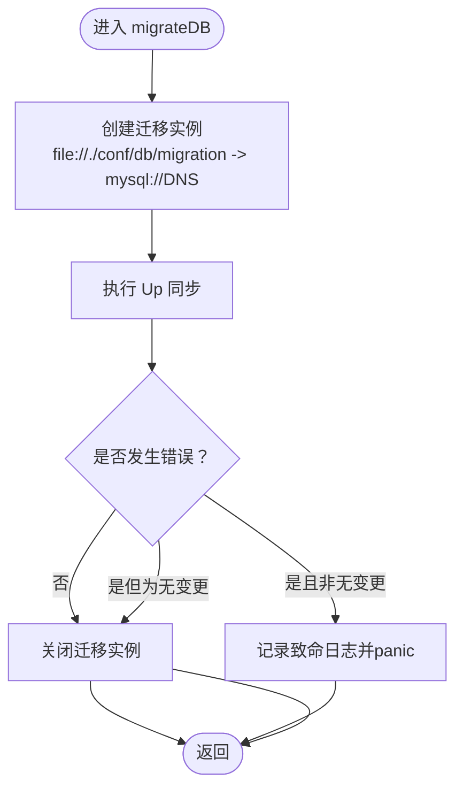
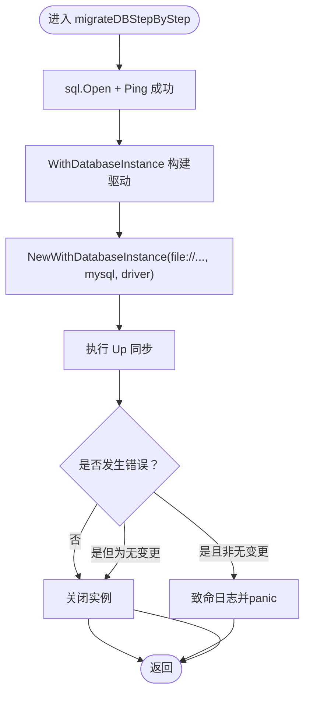
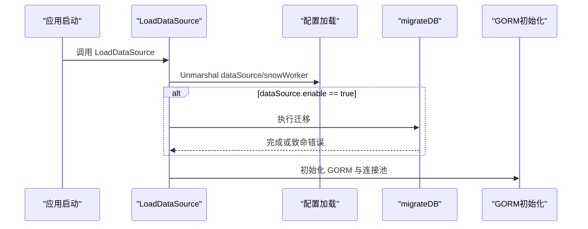
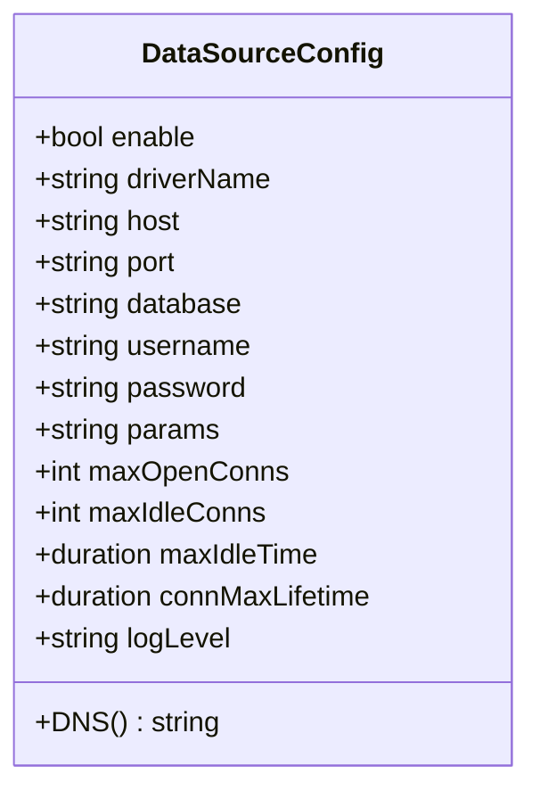
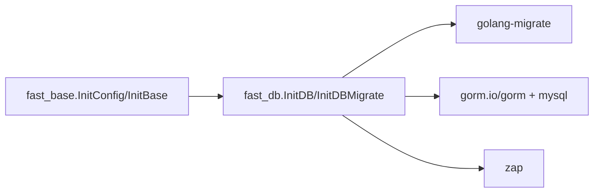

# 数据库迁移

<cite>
**本文引用的文件**
- [fast_db/InitDBMigrate.go](file://fast_db/InitDBMigrate.go)
- [fast_db/InitDB.go](file://fast_db/InitDB.go)
- [fast_db/InitBase.go](file://fast_db/InitBase.go)
- [fast_base/InitConfig.go](file://fast_base/InitConfig.go)
- [fast_base/InitBase.go](file://fast_base/InitBase.go)
- [fast_db/go.mod](file://fast_db/go.mod)
- [Readme.md](file://Readme.md)
</cite>

## 目录
1. [简介](#简介)
2. [项目结构](#项目结构)
3. [核心组件](#核心组件)
4. [架构总览](#架构总览)
5. [详细组件分析](#详细组件分析)
6. [依赖分析](#依赖分析)
7. [性能考虑](#性能考虑)
8. [故障排查指南](#故障排查指南)
9. [结论](#结论)
10. [附录](#附录)

## 简介
本文件面向使用 Fast-Go 的开发者，系统性说明数据库迁移的概念、在应用启动时的自动执行机制、迁移脚本的编写规范、完整迁移操作示例（创建表、修改表结构、添加字段、删除表）、版本控制与回滚策略、数据迁移最佳实践（备份、测试、生产部署注意事项），以及复杂场景与常见问题的解决方案。  
本系统基于 gorm v1 与 golang-migrate v4 实现，MySQL 作为目标数据库，迁移脚本位于 conf/db/migration 目录，应用启动时由 fast_db 模块自动加载并执行。

## 项目结构
- 迁移入口与执行逻辑集中在 fast_db 模块：
  - fast_db/InitDBMigrate.go：封装迁移初始化与执行，提供一次性执行与逐步执行两种模式。
  - fast_db/InitDB.go：应用启动时加载数据源，其中调用迁移函数以确保数据库 schema 在连接前完成同步。
  - fast_db/InitBase.go：数据源配置结构体与 DNS 构造方法。
- 配置加载与日志：
  - fast_base/InitConfig.go：统一加载配置（含 dataSource、snowWorker 等）。
  - fast_base/InitBase.go：日志与环境配置等基础能力。
- 依赖声明：
  - fast_db/go.mod：声明 gorm、migrate、zap 等依赖。

**图表来源**
- [fast_db/InitDB.go:19-31](file://fast_db/InitDB.go#L19-L31)
- [fast_db/InitDBMigrate.go:12-28](file://fast_db/InitDBMigrate.go#L12-L28)
- [fast_db/InitBase.go:9-33](file://fast_db/InitBase.go#L9-L33)
- [fast_base/InitConfig.go:21-50](file://fast_base/InitConfig.go#L21-L50)
- [fast_base/InitBase.go:9-50](file://fast_base/InitBase.go#L9-L50)

**章节来源**
- [fast_db/InitDB.go:19-31](file://fast_db/InitDB.go#L19-L31)
- [fast_db/InitDBMigrate.go:12-28](file://fast_db/InitDBMigrate.go#L12-L28)
- [fast_db/InitBase.go:9-33](file://fast_db/InitBase.go#L9-L33)
- [fast_base/InitConfig.go:21-50](file://fast_base/InitConfig.go#L21-L50)
- [fast_base/InitBase.go:9-50](file://fast_base/InitBase.go#L9-L50)

## 核心组件
- 迁移初始化与执行
  - migrateDB：使用文件源与 MySQL 目标，自动执行 Up，遇到非“无变更”错误即终止并记录致命日志。
  - migrateDBStepByStep：显式连接数据库、Ping 成功后，使用 WithDatabaseInstance 创建迁移实例并执行 Up。
- 数据源加载与迁移触发
  - LoadDataSource：加载 dataSource 配置，若启用则先执行 migrateDB，再初始化 GORM 连接与连接池。
- 数据源配置
  - DataSourceConfig：包含驱动、主机、端口、数据库、用户名、密码、参数、连接池与日志级别等。
  - DNS：拼接 MySQL 连接字符串。
- 配置与日志
  - fast_base 提供统一配置加载与日志级别映射，迁移过程中的错误会以致命日志输出。

**章节来源**
- [fast_db/InitDBMigrate.go:12-28](file://fast_db/InitDBMigrate.go#L12-L28)
- [fast_db/InitDBMigrate.go:30-68](file://fast_db/InitDBMigrate.go#L30-L68)
- [fast_db/InitDB.go:19-31](file://fast_db/InitDB.go#L19-L31)
- [fast_db/InitBase.go:9-33](file://fast_db/InitBase.go#L9-L33)
- [fast_base/InitConfig.go:21-50](file://fast_base/InitConfig.go#L21-L50)
- [fast_base/InitBase.go:22-50](file://fast_base/InitBase.go#L22-L50)

## 架构总览
应用启动流程中，fast_db/InitDB.go 调用 migrateDB，后者通过 golang-migrate 将 conf/db/migration 目录下的迁移脚本同步至数据库。迁移完成后，继续初始化 GORM 连接与连接池。

**图表来源**
- [fast_db/InitDB.go:19-31](file://fast_db/InitDB.go#L19-L31)
- [fast_db/InitDBMigrate.go:12-28](file://fast_db/InitDBMigrate.go#L12-L28)

**章节来源**
- [fast_db/InitDB.go:19-31](file://fast_db/InitDB.go#L19-L31)
- [fast_db/InitDBMigrate.go:12-28](file://fast_db/InitDBMigrate.go#L12-L28)

## 详细组件分析

### 组件一：迁移初始化与执行（migrateDB）
- 功能要点
  - 使用文件源（file://）与 MySQL 目标（mysql://DNS）构造迁移实例。
  - 执行 Up 同步；忽略“无变更”错误，其他错误视为致命并终止。
  - 关闭迁移句柄，避免资源泄漏。
- 错误处理
  - 连接或 Up 失败时，记录致命日志并触发 panic，确保启动失败。
- 适用场景
  - 生产环境首次启动或容器启动时，确保 schema 与脚本一致。

**图表来源**
- [fast_db/InitDBMigrate.go:12-28](file://fast_db/InitDBMigrate.go#L12-L28)

**章节来源**
- [fast_db/InitDBMigrate.go:12-28](file://fast_db/InitDBMigrate.go#L12-L28)

### 组件二：逐步迁移（migrateDBStepByStep）
- 功能要点
  - 显式打开数据库连接并 Ping 成功后，使用 WithDatabaseInstance 创建迁移实例。
  - 执行 Up 并对错误进行相同处理（忽略无变更，其余致命）。
- 适用场景
  - 需要更细粒度控制或诊断阶段，便于分步验证。

**图表来源**
- [fast_db/InitDBMigrate.go:30-68](file://fast_db/InitDBMigrate.go#L30-L68)

**章节来源**
- [fast_db/InitDBMigrate.go:30-68](file://fast_db/InitDBMigrate.go#L30-L68)

### 组件三：应用启动时的数据源加载与迁移触发（LoadDataSource）
- 功能要点
  - 从配置中心加载 dataSource 与 snowWorker。
  - 若启用数据库，则先执行 migrateDB，再初始化 GORM、连接池与日志。
- 与迁移的关系
  - 保证应用启动时数据库 schema 已按脚本同步，避免运行期 schema 不一致导致的异常。

**图表来源**
- [fast_db/InitDB.go:19-31](file://fast_db/InitDB.go#L19-L31)
- [fast_db/InitDBMigrate.go:12-28](file://fast_db/InitDBMigrate.go#L12-L28)

**章节来源**
- [fast_db/InitDB.go:19-31](file://fast_db/InitDB.go#L19-L31)

### 组件四：数据源配置与 DNS（DataSourceConfig）
- 关键字段
  - enable：是否启用数据库。
  - driverName/host/port/database/username/password/params：连接参数。
  - maxOpenConns/maxIdleConns/maxIdleTime/connMaxLifetime：连接池参数。
  - logLevel：日志级别。
- DNS：将上述字段拼接为 MySQL 连接字符串，供迁移与 GORM 使用。

**图表来源**
- [fast_db/InitBase.go:15-33](file://fast_db/InitBase.go#L15-L33)

**章节来源**
- [fast_db/InitBase.go:9-33](file://fast_db/InitBase.go#L9-L33)

## 依赖分析
- 外部依赖
  - golang-migrate/migrate/v4：提供迁移工具链（Up、down、版本跟踪等）。
  - gorm.io/driver/mysql 与 gorm.io/gorm：ORM 与 MySQL 驱动。
  - go.uber.org/zap：日志框架。
- 模块间耦合
  - fast_db 依赖 fast_base 的配置与日志。
  - 迁移执行依赖 DataSourceConfig.DNS 提供的连接串。
- 版本与兼容性
  - fast_db/go.mod 明确列出依赖版本，确保迁移与 ORM 的稳定配合。

**图表来源**
- [fast_db/go.mod:5-11](file://fast_db/go.mod#L5-L11)
- [fast_base/InitConfig.go:21-50](file://fast_base/InitConfig.go#L21-L50)
- [fast_db/InitDB.go:19-31](file://fast_db/InitDB.go#L19-L31)

**章节来源**
- [fast_db/go.mod:5-11](file://fast_db/go.mod#L5-L11)
- [fast_base/InitConfig.go:21-50](file://fast_base/InitConfig.go#L21-L50)
- [fast_db/InitDB.go:19-31](file://fast_db/InitDB.go#L19-L31)

## 性能考虑
- 迁移执行时机
  - 在 GORM 初始化之前完成，避免运行期因 schema 不一致引发的额外开销与错误。
- 连接池配置
  - LoadDataSource 中设置最大打开连接数、空闲连接数、空闲与生命周期，建议结合业务并发与 MySQL max_connections 调优。
- 日志级别
  - DataSourceConfig.logLevel 控制迁移与 ORM 日志输出，生产环境建议使用 info/warn，避免过多 I/O。

**章节来源**
- [fast_db/InitDB.go:67-89](file://fast_db/InitDB.go#L67-L89)
- [fast_db/InitBase.go:24-28](file://fast_db/InitBase.go#L24-L28)

## 故障排查指南
- 启动即失败（致命日志）
  - 症状：启动日志出现致命错误并 panic。
  - 排查：确认 conf/db/migration 目录存在且脚本命名符合 golang-migrate 规范；检查 DataSourceConfig.DNS 拼接是否正确；确认数据库可达。
- “无变更”提示
  - 症状：日志提示无变更。
  - 说明：表示数据库 schema 已与脚本一致，无需进一步操作。
- 迁移失败（非“无变更”）
  - 症状：Up 执行报错。
  - 排查：检查最近一次迁移脚本内容、数据库权限、字符集/时区参数；必要时使用 migrateDBStepByStep 分步定位。
- 数据库不可达
  - 症状：Ping 失败或连接超时。
  - 排查：核对 host/port/username/password/database/params；确认网络连通与防火墙策略。

**章节来源**
- [fast_db/InitDBMigrate.go:19-27](file://fast_db/InitDBMigrate.go#L19-L27)
- [fast_db/InitDBMigrate.go:37-44](file://fast_db/InitDBMigrate.go#L37-L44)
- [fast_db/InitBase.go:31-33](file://fast_db/InitBase.go#L31-L33)

## 结论
Fast-Go 的数据库迁移体系以 golang-migrate 为核心，在应用启动阶段自动执行 Up，确保 schema 与脚本保持一致。通过清晰的配置结构与日志机制，开发者可以快速定位问题并安全地在不同环境中部署。建议在生产环境遵循“先迁移、后服务”的原则，并结合备份与测试流程保障稳定性。

## 附录

### 迁移脚本编写规范（基于 golang-migrate）
- 目录位置
  - conf/db/migration：存放迁移脚本，由 migrateDB 自动扫描。
- 文件命名
  - 使用递增序号前缀（例如 000001_init.up.sql、000001_init.down.sql），确保顺序与依赖明确。
- 上下文
  - up 脚本：创建表、索引、约束等。
  - down 脚本：逆向删除，确保幂等与可回滚。
- 字符集与时区
  - 建议在脚本中显式指定字符集与排序规则，避免跨环境差异。
- 幂等性
  - 对于可能重复执行的迁移，使用 IF NOT EXISTS 或条件判断，避免重复创建对象。

### 迁移操作示例（步骤说明）
以下为常见迁移场景的操作步骤，具体 SQL 内容请在 up/down 脚本中实现：
- 创建表
  - 步骤：编写 up 脚本创建表与主键；编写 down 脚本删除表。
- 修改表结构
  - 步骤：up 中执行 ALTER TABLE 添加列/修改列/重命名；down 中回滚到上一状态。
- 添加索引
  - 步骤：up 中创建索引；down 中删除索引。
- 删除表
  - 步骤：up 中 DROP TABLE；down 中重建表结构（如需）。
- 添加字段
  - 步骤：up 中 ADD COLUMN；down 中 DROP COLUMN。
- 约束设置
  - 步骤：up 中添加外键/唯一/非空等约束；down 中先删除依赖对象再删除约束。

### 版本控制与回滚策略
- 版本控制
  - golang-migrate 通过文件名与数据库内版本表维护版本号，建议每次变更新增独立脚本文件。
- 回滚
  - 使用 down 脚本逐版本回滚；生产环境谨慎回滚，建议先在测试环境验证。
- 并发迁移
  - 多节点部署时，确保同一时间只有一个实例执行 Up，避免冲突。

### 数据迁移最佳实践
- 备份
  - 迁移前对生产库进行全量备份，确保可恢复。
- 测试
  - 在预生产环境完整演练迁移流程，覆盖 up/down。
- 发布窗口
  - 选择低峰时段执行迁移，缩短停机时间。
- 监控与告警
  - 关注迁移日志与数据库连接池指标，及时发现异常。
- 回滚预案
  - 准备 down 脚本与人工干预流程，确保可快速回退。

### 复杂场景与常见问题
- 跨版本升级
  - 将大改动拆分为多个小版本脚本，逐步演进。
- 大表在线DDL
  - 使用工具或 MySQL 语法尽量减少锁表时间，必要时分批处理。
- 字段默认值变更
  - 注意对已有数据的影响，必要时补充数据修复脚本。
- 外键与索引冲突
  - 先删除依赖对象或临时禁用约束，再执行结构变更。