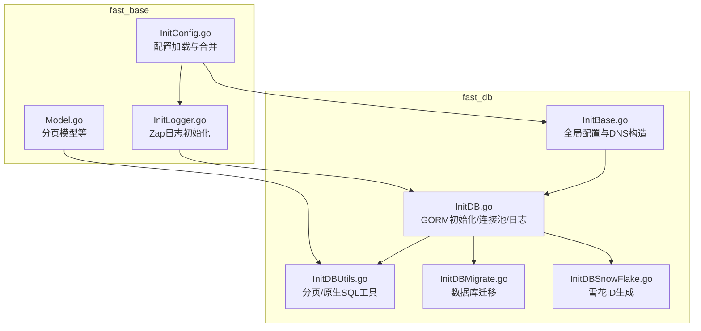
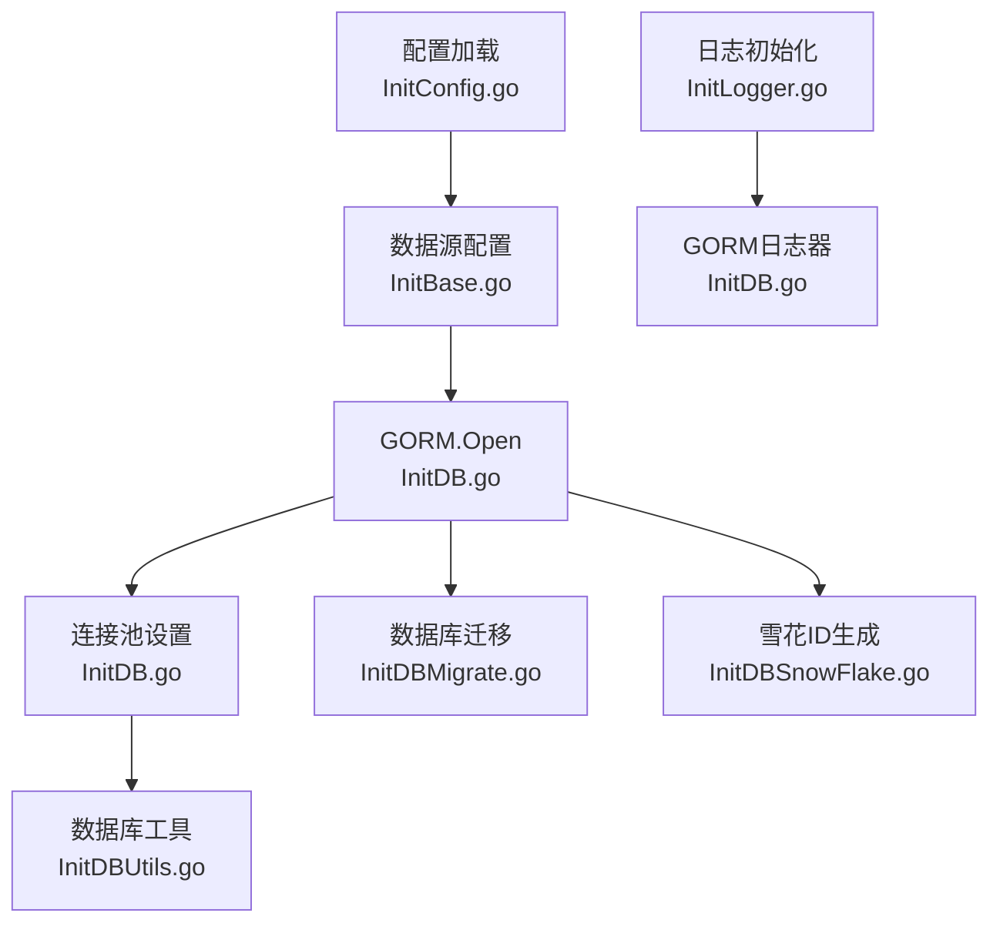
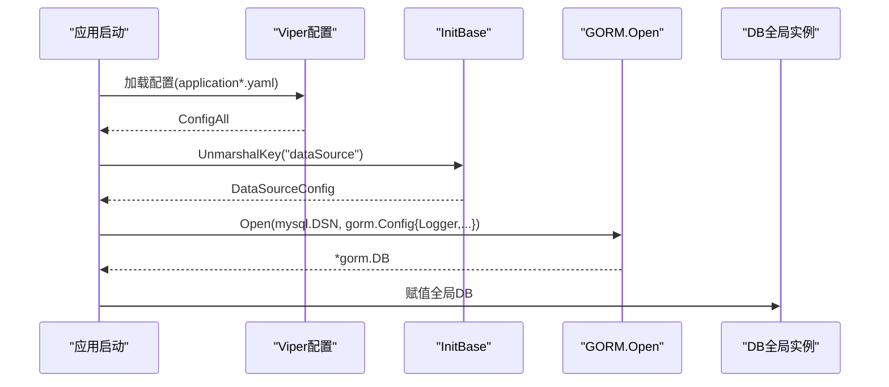
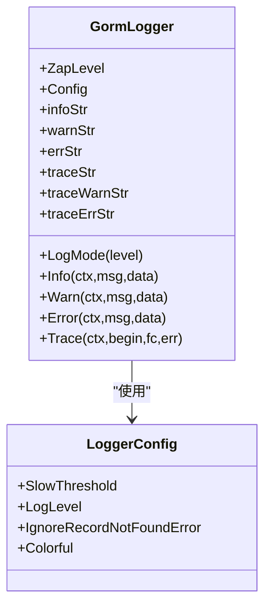
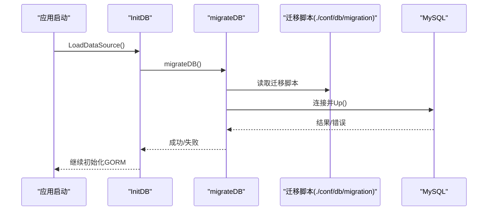
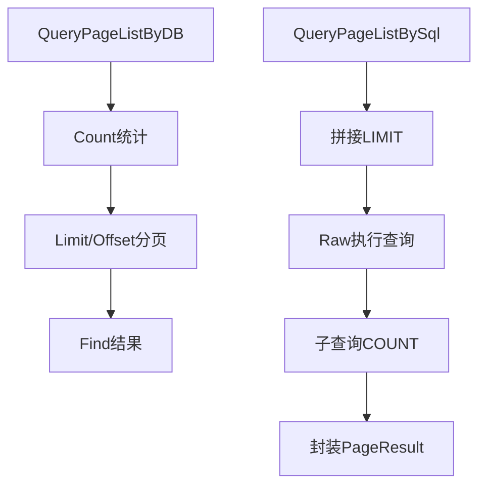
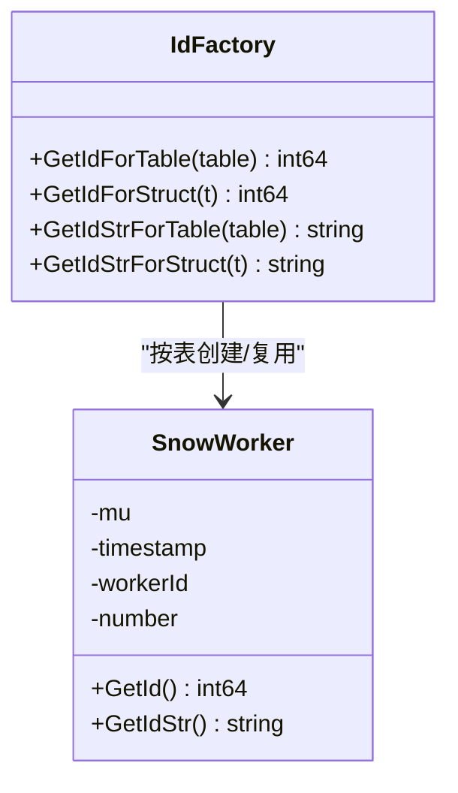
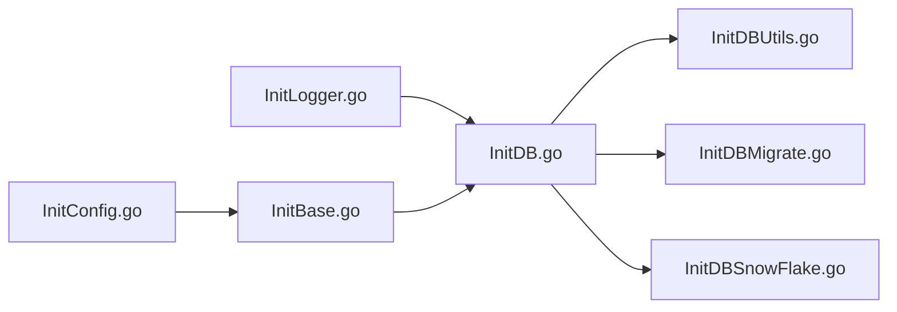

# 数据库连接管理

<cite>
**本文引用的文件**
- [fast_db/InitDB.go](file://fast_db/InitDB.go)
- [fast_db/InitBase.go](file://fast_db/InitBase.go)
- [fast_db/InitDBUtils.go](file://fast_db/InitDBUtils.go)
- [fast_db/InitDBMigrate.go](file://fast_db/InitDBMigrate.go)
- [fast_db/InitDBSnowFlake.go](file://fast_db/InitDBSnowFlake.go)
- [fast_base/InitConfig.go](file://fast_base/InitConfig.go)
- [fast_base/InitLogger.go](file://fast_base/InitLogger.go)
- [fast_base/Model.go](file://fast_base/Model.go)
</cite>

## 目录
1. [简介](#简介)
2. [项目结构](#项目结构)
3. [核心组件](#核心组件)
4. [架构总览](#架构总览)
5. [详细组件分析](#详细组件分析)
6. [依赖分析](#依赖分析)
7. [性能考虑](#性能考虑)
8. [故障排查指南](#故障排查指南)
9. [结论](#结论)
10. [附录](#附录)

## 简介
本文件面向 Fast-Go 项目的数据库连接管理子系统，聚焦于 GORM ORM 的初始化流程、配置项解析、连接池参数、日志系统集成（含慢查询日志）、以及连接故障处理与监控建议。文档以代码为依据，提供可操作的配置示例与性能调优建议，帮助读者快速理解并安全地部署生产环境。

## 项目结构
Fast-Go 将数据库相关能力集中在 fast_db 模块，围绕 GORM 初始化、连接池、日志、迁移与分布式 ID（雪花算法）展开；基础配置与日志由 fast_base 提供。

图表来源
- [fast_db/InitBase.go:1-39](file://fast_db/InitBase.go#L1-L39)
- [fast_db/InitDB.go:1-238](file://fast_db/InitDB.go#L1-L238)
- [fast_db/InitDBUtils.go:1-123](file://fast_db/InitDBUtils.go#L1-L123)
- [fast_db/InitDBMigrate.go:1-69](file://fast_db/InitDBMigrate.go#L1-L69)
- [fast_db/InitDBSnowFlake.go:1-102](file://fast_db/InitDBSnowFlake.go#L1-L102)
- [fast_base/InitConfig.go:1-108](file://fast_base/InitConfig.go#L1-L108)
- [fast_base/InitLogger.go:1-147](file://fast_base/InitLogger.go#L1-L147)
- [fast_base/Model.go:1-116](file://fast_base/Model.go#L1-L116)

章节来源
- [fast_db/InitDB.go:18-100](file://fast_db/InitDB.go#L18-L100)
- [fast_db/InitBase.go:9-39](file://fast_db/InitBase.go#L9-L39)
- [fast_base/InitConfig.go:21-50](file://fast_base/InitConfig.go#L21-L50)
- [fast_base/InitLogger.go:15-44](file://fast_base/InitLogger.go#L15-L44)

## 核心组件
- GORM 初始化与配置
  - 通过 viper 读取 dataSource 配置，构造 DNS 并初始化 GORM。
  - 使用自定义 Logger 集成 Zap，并支持慢查询阈值与彩色输出。
- 连接池配置
  - MaxOpenConns、MaxIdleConns、MaxIdleTime、ConnMaxLifetime 的设置与约束。
- 数据库日志与慢查询
  - 自定义 GormLogger，将 GORM 日志映射到 Zap，并按阈值输出慢查询。
- 数据库迁移
  - 使用 golang-migrate 在启动时同步数据库结构。
- 工具与模型
  - 提供分页查询、原生 SQL 查询、存在性检查、计数等常用工具。
  - 分页模型 PageResult 支持泛型封装。

章节来源
- [fast_db/InitDB.go:42-89](file://fast_db/InitDB.go#L42-L89)
- [fast_db/InitDB.go:110-150](file://fast_db/InitDB.go#L110-L150)
- [fast_db/InitDB.go:152-238](file://fast_db/InitDB.go#L152-L238)
- [fast_db/InitDBMigrate.go:12-28](file://fast_db/InitDBMigrate.go#L12-L28)
- [fast_db/InitDBUtils.go:10-123](file://fast_db/InitDBUtils.go#L10-L123)
- [fast_base/Model.go:34-56](file://fast_base/Model.go#L34-L56)

## 架构总览
下图展示数据库模块在应用中的角色与交互：配置加载、日志初始化、GORM 初始化、连接池与日志器、迁移与工具层。

图表来源
- [fast_base/InitConfig.go:21-50](file://fast_base/InitConfig.go#L21-L50)
- [fast_db/InitBase.go:9-39](file://fast_db/InitBase.go#L9-L39)
- [fast_base/InitLogger.go:15-44](file://fast_base/InitLogger.go#L15-L44)
- [fast_db/InitDB.go:42-89](file://fast_db/InitDB.go#L42-L89)
- [fast_db/InitDBMigrate.go:12-28](file://fast_db/InitDBMigrate.go#L12-L28)
- [fast_db/InitDBUtils.go:10-123](file://fast_db/InitDBUtils.go#L10-L123)
- [fast_db/InitDBSnowFlake.go:20-86](file://fast_db/InitDBSnowFlake.go#L20-L86)

## 详细组件分析

### GORM 初始化与配置
- 配置来源
  - 通过 viper 读取 dataSource 键，反序列化为 DataSourceConfig。
  - 默认启用数据库，日志级别为 info，驱动为 mysql，字符集与时间解析参数已预设。
- DNS 构建
  - 使用 DataSourceConfig.DNS() 拼接用户名、密码、主机、端口、数据库与参数。
- GORM 初始化
  - 使用 mysql.Open(driver) 与 gorm.Config：
    - 命名策略：单数表名。
    - PrepareStmt：开启预编译语句以提升性能。
    - Logger：注入自定义 GormLogger，支持慢查询阈值、忽略特定错误、彩色输出。
- 全局 DB 实例
  - 初始化后将 *gorm.DB 赋值给全局变量，供后续模块使用。

图表来源
- [fast_base/InitConfig.go:21-50](file://fast_base/InitConfig.go#L21-L50)
- [fast_db/InitBase.go:21-33](file://fast_db/InitBase.go#L21-L33)
- [fast_db/InitDB.go:42-64](file://fast_db/InitDB.go#L42-L64)

章节来源
- [fast_db/InitDB.go:19-64](file://fast_db/InitDB.go#L19-L64)
- [fast_db/InitBase.go:9-33](file://fast_db/InitBase.go#L9-L33)

### 连接池配置参数详解
- MaxOpenConns
  - 连接池最大并发打开连接数。应小于或等于 MySQL max_connections。
- MaxIdleConns
  - 连接池最大空闲连接数。必须小于 MaxOpenConns，超出部分会被回收。
- MaxIdleTime
  - 空闲连接最大空闲时长（秒）。到达阈值即强制关闭，即使当前空闲数小于 MaxIdleConns。
- ConnMaxLifetime
  - 连接最大存活时长（秒）。必须小于 MySQL wait_timeout，避免保留被服务器主动关闭的连接。

图表来源
- [fast_db/InitDB.go:66-89](file://fast_db/InitDB.go#L66-L89)

章节来源
- [fast_db/InitDB.go:66-89](file://fast_db/InitDB.go#L66-L89)

### 数据库日志系统与慢查询
- 日志级别映射
  - 将 Zap 日志级别映射为 GORM 日志级别，Silent/Error/Warn/Info 对应不同输出粒度。
- 慢查询阈值
  - 默认慢查询阈值为 200ms，仅在 Warn/Info 级别下输出慢查询记录。
- 彩色输出
  - 根据全局日志配置决定是否启用彩色输出。
- 记录细节
  - 输出耗时（毫秒）、影响行数、SQL 语句；对 NotFound 错误可选择忽略。

图表来源
- [fast_db/InitDB.go:110-150](file://fast_db/InitDB.go#L110-L150)
- [fast_db/InitDB.go:152-238](file://fast_db/InitDB.go#L152-L238)

章节来源
- [fast_db/InitDB.go:110-150](file://fast_db/InitDB.go#L110-L150)
- [fast_db/InitDB.go:188-225](file://fast_db/InitDB.go#L188-L225)

### 数据库迁移
- 迁移触发时机
  - 在 GORM 初始化前执行，确保数据库结构与代码一致。
- 迁移方式
  - 使用 golang-migrate 从文件系统源读取迁移脚本，连接 MySQL 执行 Up()。
- 错误处理
  - 遇到错误立即记录 Fatal 并中断启动；无变更则跳过。

图表来源
- [fast_db/InitDB.go:29-31](file://fast_db/InitDB.go#L29-L31)
- [fast_db/InitDBMigrate.go:12-28](file://fast_db/InitDBMigrate.go#L12-L28)

章节来源
- [fast_db/InitDBMigrate.go:12-28](file://fast_db/InitDBMigrate.go#L12-L28)

### 数据库工具与模型
- 分页查询
  - QueryPageListByDB：基于 gorm.DB 统计总数并分页查询。
  - QueryPageListBySql：拼接 LIMIT 并统计子查询总数，封装 PageResult。
- 原生 SQL
  - GetListBySql：执行原生 SQL 返回切片。
  - GetOne/GetById：按条件查询单条记录。
  - CheckExists/CountNum：存在性检查与计数。
- 分页模型
  - PageResult[T]：封装 pageIndex/pageSize/totalPages/totalRows/list。

图表来源
- [fast_db/InitDBUtils.go:10-63](file://fast_db/InitDBUtils.go#L10-L63)
- [fast_base/Model.go:34-56](file://fast_base/Model.go#L34-L56)

章节来源
- [fast_db/InitDBUtils.go:10-123](file://fast_db/InitDBUtils.go#L10-L123)
- [fast_base/Model.go:34-56](file://fast_base/Model.go#L34-L56)

### 雪花算法（分布式 ID）
- 适用场景
  - 为业务表提供全局唯一、趋势递增的 ID，减少热点与跨节点 Join。
- 关键点
  - 不同表维护独立 SnowWorker，避免竞争。
  - 生成规则包含时间戳、工作节点与序列号，支持字符串与整型两种返回形式。

图表来源
- [fast_db/InitDBSnowFlake.go:20-86](file://fast_db/InitDBSnowFlake.go#L20-L86)

章节来源
- [fast_db/InitDBSnowFlake.go:20-86](file://fast_db/InitDBSnowFlake.go#L20-L86)

## 依赖分析
- 模块内聚与耦合
  - fast_db 内部各文件职责清晰：配置、初始化、工具、迁移、ID。
  - InitDB 依赖 InitBase（配置）、InitLogger（Zap）、InitConfig（配置加载）。
- 外部依赖
  - GORM、mysql 驱动、golang-migrate、Zap、lumberjack。
- 循环依赖
  - 未见循环导入；InitDB 通过全局 DB 暴露给工具层，属于单向依赖。

图表来源
- [fast_base/InitConfig.go:21-50](file://fast_base/InitConfig.go#L21-L50)
- [fast_base/InitLogger.go:15-44](file://fast_base/InitLogger.go#L15-L44)
- [fast_db/InitBase.go:9-39](file://fast_db/InitBase.go#L9-L39)
- [fast_db/InitDB.go:42-89](file://fast_db/InitDB.go#L42-L89)
- [fast_db/InitDBUtils.go:10-123](file://fast_db/InitDBUtils.go#L10-L123)
- [fast_db/InitDBMigrate.go:12-28](file://fast_db/InitDBMigrate.go#L12-L28)
- [fast_db/InitDBSnowFlake.go:20-86](file://fast_db/InitDBSnowFlake.go#L20-L86)

章节来源
- [fast_db/InitDB.go:42-89](file://fast_db/InitDB.go#L42-L89)
- [fast_db/InitDBUtils.go:10-123](file://fast_db/InitDBUtils.go#L10-L123)
- [fast_db/InitDBMigrate.go:12-28](file://fast_db/InitDBMigrate.go#L12-L28)
- [fast_db/InitDBSnowFlake.go:20-86](file://fast_db/InitDBSnowFlake.go#L20-L86)

## 性能考虑
- 连接池参数建议
  - MaxOpenConns：建议不超过 MySQL max_connections 的 70%~80%，结合 CPU 核心数与磁盘 IOPS 综合评估。
  - MaxIdleConns：建议为 MaxOpenConns 的 20%~30%，避免过度空闲造成资源占用。
  - MaxIdleTime：建议设为 0 或与业务空闲周期匹配，避免频繁重建连接。
  - ConnMaxLifetime：建议小于 MySQL wait_timeout（默认 8h），防止持有“假活”连接。
- GORM 优化
  - 启用 PrepareStmt，减少解析开销。
  - 使用单数表名与命名策略统一，降低维护成本。
- 日志与慢查询
  - 生产环境建议 Info 级别，慢查询阈值 200ms~500ms，避免噪声。
  - 彩色输出仅在开发环境开启，生产环境关闭以减少开销。
- 迁移与一致性
  - 启动阶段执行迁移，确保结构稳定后再放量流量。
- 雪花 ID
  - 按表维度分配 workerId，避免高并发下热点。

[本节为通用建议，无需具体文件引用]

## 故障排查指南
- 连接失败
  - 症状：启动 panic，提示连接数据库失败。
  - 排查：核对 dataSource 配置（host/port/database/username/password/params），确认 DNS 拼接正确；检查网络连通与 MySQL 权限。
- 迁移失败
  - 症状：启动时报 migration failed 或同步失败。
  - 排查：检查 ./conf/db/migration 下脚本是否完整；确认迁移源路径与 MySQL 连接串正确；查看具体错误并修复脚本。
- 慢查询过多
  - 症状：日志中出现大量慢查询记录。
  - 排查：优化 SQL（索引、分页、避免 N+1）；适当提高慢查询阈值；关注业务高峰时段。
- 连接池耗尽或抖动
  - 症状：请求堆积、超时增多。
  - 排查：增大 MaxOpenConns；缩短 ConnMaxLifetime；检查业务是否存在长时间事务或未释放连接。
- 日志级别与输出
  - 症状：日志过多或过少。
  - 排查：调整 dataSource.logLevel 与全局 log.level；确认 Zap 彩色输出与文件切割配置。

章节来源
- [fast_db/InitDB.go:59-61](file://fast_db/InitDB.go#L59-L61)
- [fast_db/InitDBMigrate.go:19-27](file://fast_db/InitDBMigrate.go#L19-L27)
- [fast_db/InitDB.go:188-225](file://fast_db/InitDB.go#L188-L225)

## 结论
Fast-Go 的数据库模块以 GORM 为核心，结合自定义日志器、连接池与迁移机制，提供了生产可用的数据库接入方案。通过合理的连接池参数、慢查询阈值与日志级别，可在性能与可观测性之间取得平衡。配合分页工具与雪花 ID，能够支撑常见业务场景的高并发需求。

[本节为总结，无需具体文件引用]

## 附录

### 配置项与默认值（摘自代码）
- 数据源配置（DataSourceConfig）
  - enable: true
  - driverName: mysql
  - host: 127.0.0.1
  - port: 3306
  - database: （需在配置文件中设置）
  - username: （需在配置文件中设置）
  - password: （需在配置文件中设置）
  - params: charset=utf8mb4&parseTime=true
  - maxIdleConns: 5
  - maxOpenConns: 100
  - maxIdleTime: 0 秒
  - connMaxLifetime: 3600 秒
  - logLevel: info
- 日志配置（来自 fast_base）
  - log.level: 默认从配置读取，未命中回退到 info
  - log.format: json 或 console
  - log.path: 日志目录
  - log.stdout: 是否同时输出到标准输出
  - log.fileMaxSize: 单文件大小(MB)
  - log.fileMaxBackups: 备份数量
  - log.maxAge: 保留天数
  - log.compress: 是否压缩

章节来源
- [fast_db/InitBase.go:9-33](file://fast_db/InitBase.go#L9-L33)
- [fast_base/InitConfig.go:21-50](file://fast_base/InitConfig.go#L21-L50)
- [fast_base/InitLogger.go:47-110](file://fast_base/InitLogger.go#L47-L110)

### 配置示例（路径与键）
- 配置文件位置
  - ./conf/application.yaml（默认）
  - ./conf/application-{env}.yaml（按环境加载）
- 关键键名
  - dataSource.enable
  - dataSource.driverName
  - dataSource.host
  - dataSource.port
  - dataSource.database
  - dataSource.username
  - dataSource.password
  - dataSource.params
  - dataSource.maxIdleConns
  - dataSource.maxOpenConns
  - dataSource.maxIdleTime
  - dataSource.connMaxLifetime
  - dataSource.logLevel
  - log.level
  - log.format
  - log.path
  - log.stdout
  - log.fileMaxSize
  - log.fileMaxBackups
  - log.maxAge
  - log.compress

章节来源
- [fast_base/InitConfig.go:52-63](file://fast_base/InitConfig.go#L52-L63)
- [fast_db/InitBase.go:15-33](file://fast_db/InitBase.go#L15-L33)
- [fast_base/InitLogger.go:47-110](file://fast_base/InitLogger.go#L47-L110)