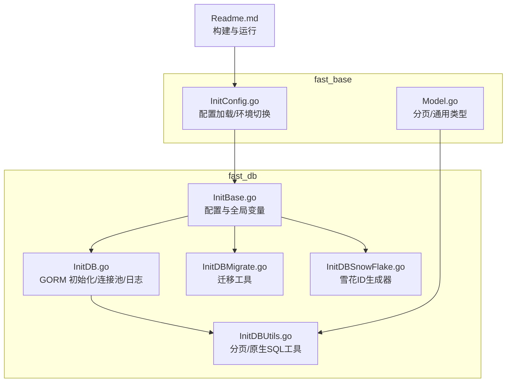
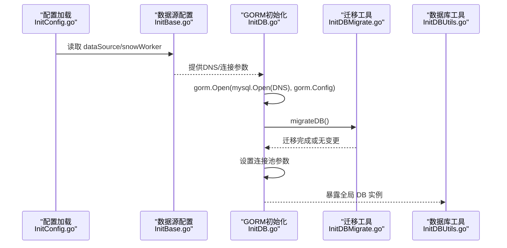
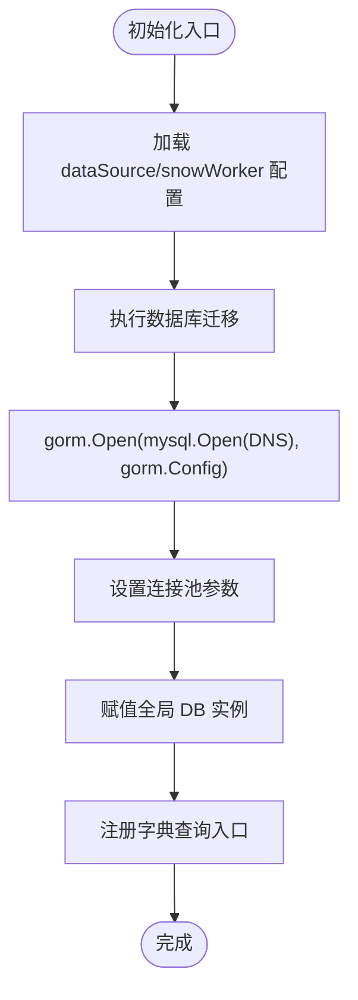
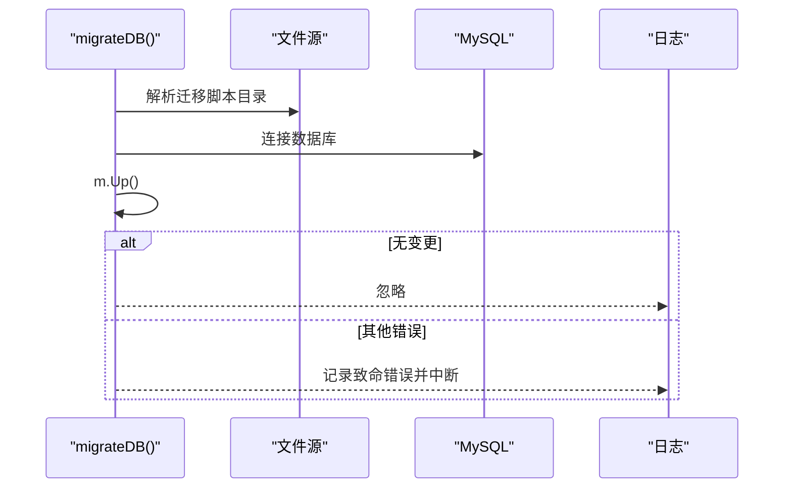
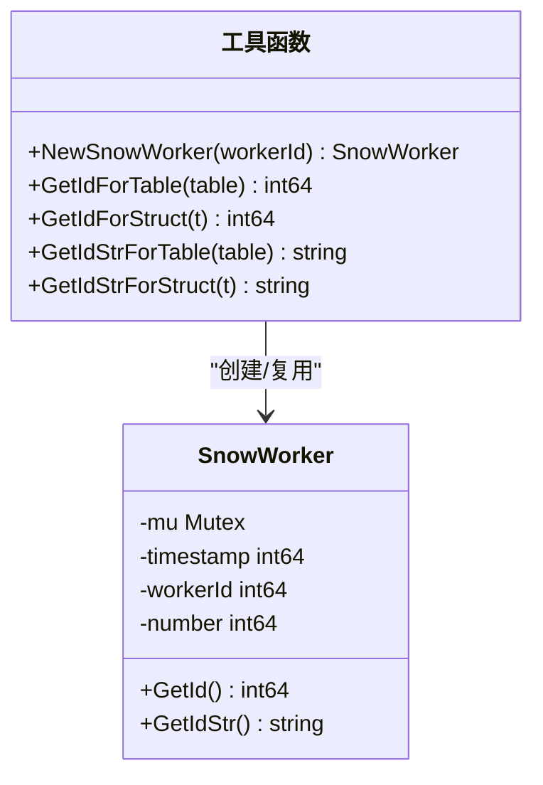
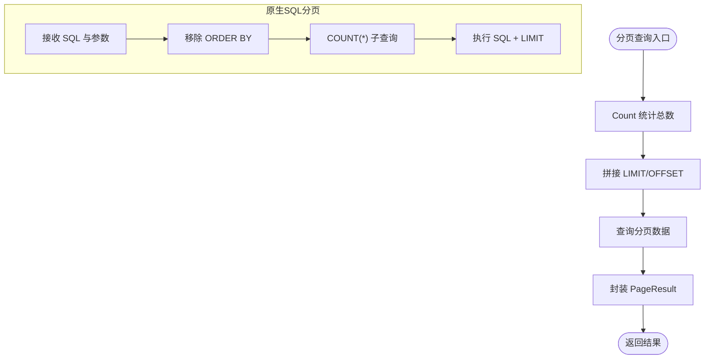
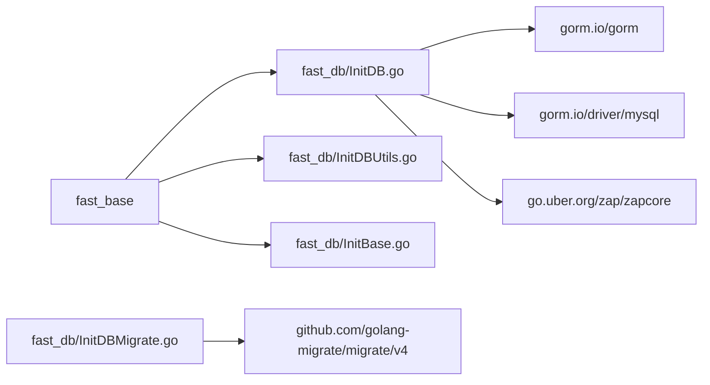

# 数据库集成

<cite>
**本文引用的文件**
- [fast_db/InitDB.go](file://fast_db/InitDB.go)
- [fast_db/InitDBMigrate.go](file://fast_db/InitDBMigrate.go)
- [fast_db/InitDBSnowFlake.go](file://fast_db/InitDBSnowFlake.go)
- [fast_db/InitDBUtils.go](file://fast_db/InitDBUtils.go)
- [fast_db/InitBase.go](file://fast_db/InitBase.go)
- [fast_base/Model.go](file://fast_base/Model.go)
- [fast_base/InitConfig.go](file://fast_base/InitConfig.go)
- [Readme.md](file://Readme.md)
</cite>

## 目录
1. [简介](#简介)
2. [项目结构](#项目结构)
3. [核心组件](#核心组件)
4. [架构总览](#架构总览)
5. [详细组件分析](#详细组件分析)
6. [依赖分析](#依赖分析)
7. [性能考虑](#性能考虑)
8. [故障排查指南](#故障排查指南)
9. [结论](#结论)
10. [附录](#附录)

## 简介
本文件面向 Fast-Go 项目的数据库集成，围绕 GORM ORM 的集成与配置、数据库连接池与日志、事务与性能优化、数据迁移系统、雪花 ID 生成器、模型设计最佳实践、CRUD 与复杂查询示例、以及连接配置与环境切换策略进行系统化说明。目标是帮助开发者快速理解并正确使用数据库层能力。

## 项目结构
数据库相关能力主要集中在 fast_db 模块，配合 fast_base 提供的通用模型与配置加载机制：
- fast_db/InitDB.go：GORM 初始化、连接池、日志桥接、全局 DB 实例
- fast_db/InitDBMigrate.go：基于 golang-migrate 的数据库迁移
- fast_db/InitDBSnowFlake.go：雪花 ID 生成器（含按表/结构体维度的多实例）
- fast_db/InitDBUtils.go：分页查询、原生 SQL 查询、存在性与计数等常用工具
- fast_db/InitBase.go：数据源配置、DNS 构造、全局变量声明
- fast_base/Model.go：分页参数/结果、字符串化整型等通用类型
- fast_base/InitConfig.go：配置加载与环境切换
- Readme.md：项目构建与运行说明（含环境变量）

图表来源
- [fast_db/InitDB.go:1-238](file://fast_db/InitDB.go#L1-L238)
- [fast_db/InitDBMigrate.go:1-69](file://fast_db/InitDBMigrate.go#L1-L69)
- [fast_db/InitDBSnowFlake.go:1-102](file://fast_db/InitDBSnowFlake.go#L1-L102)
- [fast_db/InitDBUtils.go:1-123](file://fast_db/InitDBUtils.go#L1-L123)
- [fast_db/InitBase.go:1-39](file://fast_db/InitBase.go#L1-L39)
- [fast_base/Model.go:1-116](file://fast_base/Model.go#L1-L116)
- [fast_base/InitConfig.go:1-108](file://fast_base/InitConfig.go#L1-L108)
- [Readme.md:1-67](file://Readme.md#L1-L67)

章节来源
- [fast_db/InitDB.go:1-238](file://fast_db/InitDB.go#L1-L238)
- [fast_db/InitDBMigrate.go:1-69](file://fast_db/InitDBMigrate.go#L1-L69)
- [fast_db/InitDBSnowFlake.go:1-102](file://fast_db/InitDBSnowFlake.go#L1-L102)
- [fast_db/InitDBUtils.go:1-123](file://fast_db/InitDBUtils.go#L1-L123)
- [fast_db/InitBase.go:1-39](file://fast_db/InitBase.go#L1-L39)
- [fast_base/Model.go:1-116](file://fast_base/Model.go#L1-L116)
- [fast_base/InitConfig.go:1-108](file://fast_base/InitConfig.go#L1-L108)
- [Readme.md:1-67](file://Readme.md#L1-L67)

## 核心组件
- GORM 初始化与全局 DB：负责连接 MySQL、命名策略、预编译语句、慢查询日志、全局 DB 实例与连接池参数设置
- 数据库迁移：基于 golang-migrate 的 up 同步与逐步执行模式
- 雪花 ID 生成器：支持按表/结构体维度的多实例，线程安全，毫秒级时间戳
- 数据库工具集：分页查询、原生 SQL 查询、存在性与计数、单条记录获取等
- 配置与模型：数据源配置、DNS 构造、分页参数/结果、字符串化整型

章节来源
- [fast_db/InitDB.go:18-100](file://fast_db/InitDB.go#L18-L100)
- [fast_db/InitDBMigrate.go:12-28](file://fast_db/InitDBMigrate.go#L12-L28)
- [fast_db/InitDBSnowFlake.go:20-86](file://fast_db/InitDBSnowFlake.go#L20-L86)
- [fast_db/InitDBUtils.go:10-123](file://fast_db/InitDBUtils.go#L10-L123)
- [fast_db/InitBase.go:9-38](file://fast_db/InitBase.go#L9-L38)
- [fast_base/Model.go:10-55](file://fast_base/Model.go#L10-L55)

## 架构总览
下图展示数据库集成的整体流程：配置加载 → 数据源解析 → GORM 初始化 → 迁移执行 → 全局 DB 可用 → 工具函数与业务使用。

图表来源
- [fast_base/InitConfig.go:21-50](file://fast_base/InitConfig.go#L21-L50)
- [fast_db/InitBase.go:9-38](file://fast_db/InitBase.go#L9-L38)
- [fast_db/InitDB.go:19-100](file://fast_db/InitDB.go#L19-L100)
- [fast_db/InitDBMigrate.go:12-28](file://fast_db/InitDBMigrate.go#L12-L28)
- [fast_db/InitDBUtils.go:10-30](file://fast_db/InitDBUtils.go#L10-L30)

## 详细组件分析

### GORM 集成与配置
- 连接与命名策略：使用 MySQL 驱动，开启单数表名；启用 PrepareStmt 提升执行效率
- 日志桥接：将 GORM 日志映射到 Zap，支持慢查询阈值、颜色输出、层级过滤
- 全局 DB：初始化后赋值为全局实例，供后续工具与业务使用
- 连接池：最大打开连接数、最大空闲连接数、最大空闲时长、最大生命周期
- 字典查询：提供按 SQL 返回单值的便捷入口

图表来源
- [fast_db/InitDB.go:19-100](file://fast_db/InitDB.go#L19-L100)

章节来源
- [fast_db/InitDB.go:18-100](file://fast_db/InitDB.go#L18-L100)

### 数据库迁移系统
- 迁移入口：基于文件源与 MySQL 目标，执行 up 同步，忽略“无变更”错误
- 逐步执行：显式打开数据库、Ping、构造驱动、创建迁移实例并执行 up
- 失败处理：非“无变更”的错误均记录致命日志并中断

图表来源
- [fast_db/InitDBMigrate.go:12-28](file://fast_db/InitDBMigrate.go#L12-L28)

章节来源
- [fast_db/InitDBMigrate.go:12-28](file://fast_db/InitDBMigrate.go#L12-L28)

### 雪花算法 ID 生成器
- 参数与常量：工作节点位宽、序号位宽、起始时间戳、位移计算
- 多实例：按表名/结构体类型维护独立 SnowWorker，线程安全
- 生成逻辑：毫秒时间戳 + 工作节点 + 序号，支持递增与阻塞等待下一毫秒

图表来源
- [fast_db/InitDBSnowFlake.go:20-102](file://fast_db/InitDBSnowFlake.go#L20-L102)

章节来源
- [fast_db/InitDBSnowFlake.go:20-102](file://fast_db/InitDBSnowFlake.go#L20-L102)

### 数据库工具集（分页与原生 SQL）
- 分页查询（GORM）：统计总数、拼接 LIMIT/OFFSET、封装 PageResult
- 分页查询（原生 SQL）：拼接 LIMIT、构造 COUNT 子查询、移除 ORDER BY 以避免重复排序
- 原生 SQL 列表：直接执行 SQL 并扫描到切片
- 单条获取：Raw + First
- 存在性与计数：Count 封装

图表来源
- [fast_db/InitDBUtils.go:10-123](file://fast_db/InitDBUtils.go#L10-L123)

章节来源
- [fast_db/InitDBUtils.go:10-123](file://fast_db/InitDBUtils.go#L10-L123)

### 模型与配置
- 数据源配置：启用开关、驱动名、主机端口、数据库名、用户名密码、连接池参数、日志级别
- DNS 构造：统一拼接连接串
- 分页模型：PageParam/PageResult 泛型封装，支持页码与页大小校正
- 字符串化整型：实现 driver.Valuer/Scanner，适配 JSON 序列化

章节来源
- [fast_db/InitBase.go:9-38](file://fast_db/InitBase.go#L9-L38)
- [fast_base/Model.go:10-55](file://fast_base/Model.go#L10-L55)

## 依赖分析
- fast_db 对 fast_base 的依赖：配置加载、日志级别映射、分页模型、通用返回结构
- GORM 与 MySQL 驱动：ORM 核心与驱动
- golang-migrate：迁移工具链
- 日志桥接：GORM 日志到 Zap

图表来源
- [fast_db/InitDB.go:3-16](file://fast_db/InitDB.go#L3-L16)
- [fast_db/InitDBMigrate.go:3-10](file://fast_db/InitDBMigrate.go#L3-L10)
- [fast_base/InitConfig.go:1-108](file://fast_base/InitConfig.go#L1-L108)

章节来源
- [fast_db/InitDB.go:3-16](file://fast_db/InitDB.go#L3-L16)
- [fast_db/InitDBMigrate.go:3-10](file://fast_db/InitDBMigrate.go#L3-L10)
- [fast_base/InitConfig.go:1-108](file://fast_base/InitConfig.go#L1-L108)

## 性能考虑
- 连接池参数建议
  - 最大打开连接数：应小于数据库 max_connections，结合 CPU 核心数与磁盘 I/O 调整
  - 最大空闲连接数：应小于最大打开连接数
  - 最大空闲时长：建议设为 0 或按业务场景评估
  - 最大生命周期：应小于数据库 wait_timeout，避免持有被服务端回收的连接
- 预编译语句：开启 PrepareStmt，减少解析开销
- 慢查询阈值：合理设置慢查询阈值，结合日志级别定位热点 SQL
- 分页查询：原生 SQL 分页需移除 ORDER BY 以避免重复排序；COUNT 子查询避免对完整结果集排序
- 雪花 ID：按表/结构体维度复用 Worker，避免跨节点冲突；在高并发下可考虑多节点不同 workId

章节来源
- [fast_db/InitDB.go:66-88](file://fast_db/InitDB.go#L66-L88)
- [fast_db/InitDBUtils.go:32-63](file://fast_db/InitDBUtils.go#L32-L63)
- [fast_db/InitDBSnowFlake.go:20-86](file://fast_db/InitDBSnowFlake.go#L20-L86)

## 故障排查指南
- 连接失败：检查 DNS 拼接、网络连通性、数据库凭据与 wait_timeout 设置
- 迁移失败：确认迁移脚本目录路径、数据库连接、权限；关注“无变更”与其它错误分支
- 慢查询：根据日志中的慢查询阈值与 SQL 执行时间定位；优化索引与查询计划
- 连接池异常：核对最大打开/空闲连接数与生命周期设置；观察数据库 processlist
- 雪花 ID 冲突：确保不同节点 workId 不同；检查起始时间戳一致性

章节来源
- [fast_db/InitDB.go:59-61](file://fast_db/InitDB.go#L59-L61)
- [fast_db/InitDBMigrate.go:19-27](file://fast_db/InitDBMigrate.go#L19-L27)
- [fast_db/InitDBSnowFlake.go:28-30](file://fast_db/InitDBSnowFlake.go#L28-L30)

## 结论
Fast-Go 的数据库集成以 GORM 为核心，结合自定义日志桥接、完善的连接池参数、迁移工具与雪花 ID 生成器，提供了稳定高效的数据库访问能力。配合 fast_base 的配置与模型抽象，能够快速落地分页查询、原生 SQL、存在性与计数等常见需求。建议在生产环境中依据数据库资源与业务负载，精细化调优连接池与慢查询阈值，并规范迁移脚本与 ID 生成策略。

## 附录

### 配置项与环境切换
- 配置加载顺序（优先级从高到低）：命令行参数 > 环境变量 > 默认配置文件
- 环境标识：支持通过命令行 -env 或环境变量 GO_ENV 切换环境配置文件
- 数据源配置键：dataSource（启用、驱动、主机、端口、数据库、用户、密码、参数、连接池、日志级别）、snowWorker（workId）

章节来源
- [fast_base/InitConfig.go:13-87](file://fast_base/InitConfig.go#L13-L87)
- [fast_db/InitBase.go:9-38](file://fast_db/InitBase.go#L9-L38)

### 连接配置与运行
- 构建与运行：参考项目 Readme 的 Docker 构建与启动步骤，设置环境参数与挂载目录
- 环境切换：通过 --env=docker 等参数选择对应环境配置

章节来源
- [Readme.md:25-67](file://Readme.md#L25-L67)