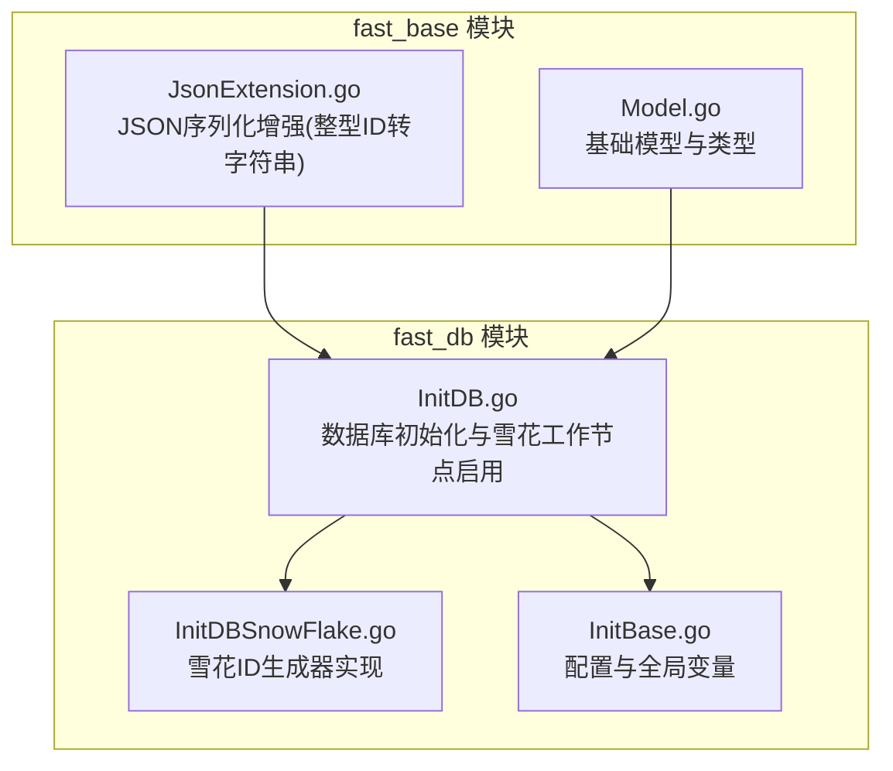
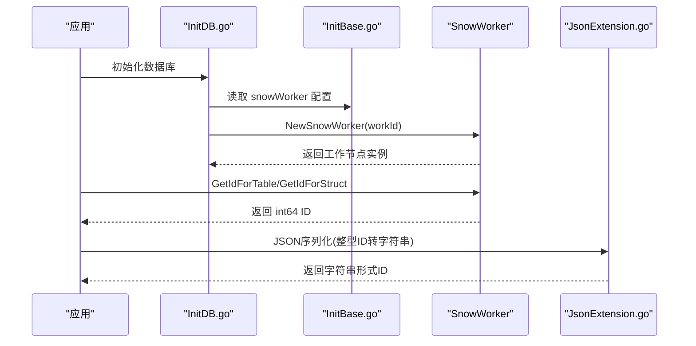
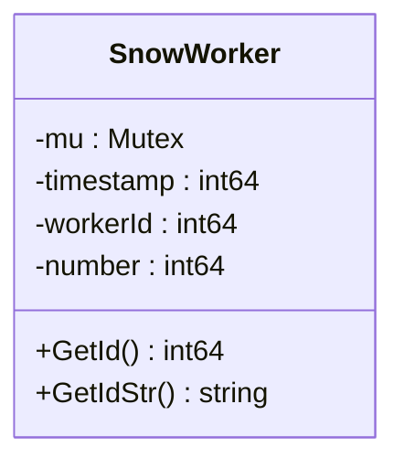
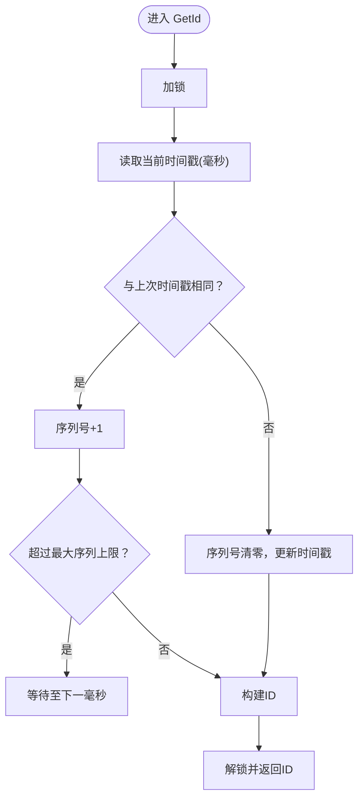
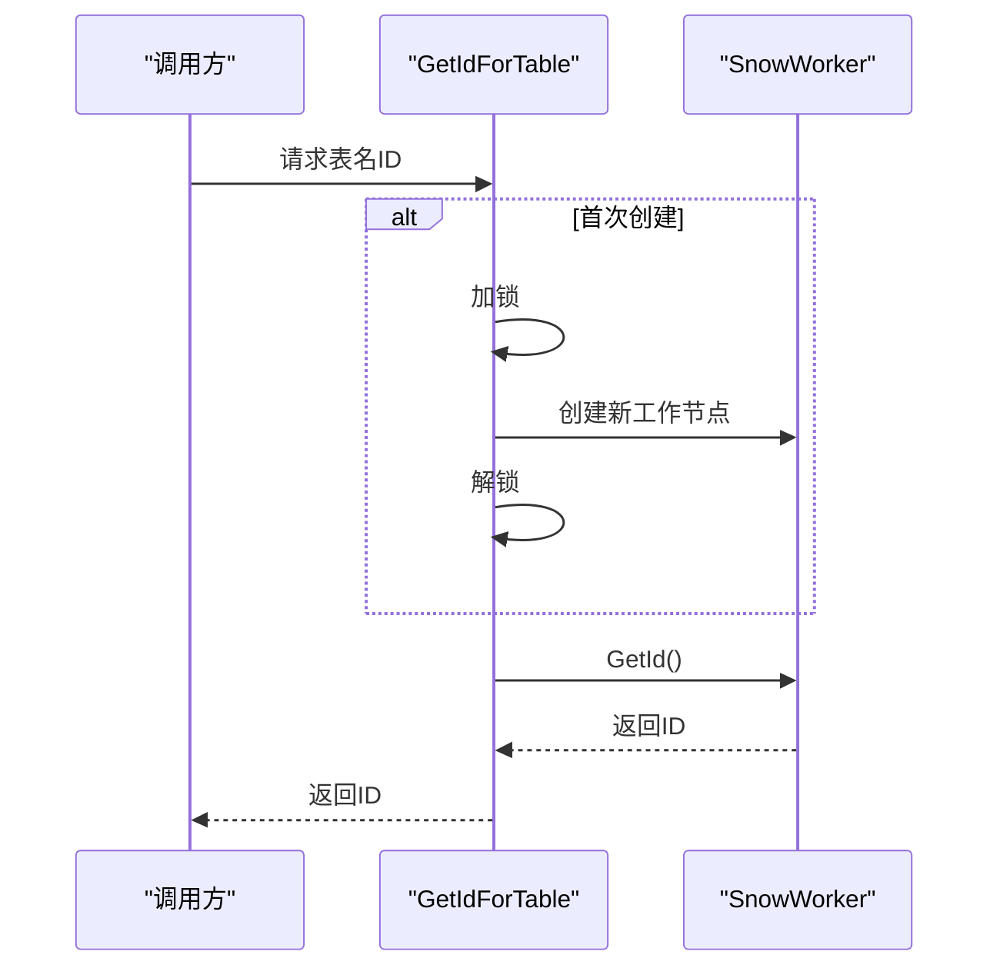
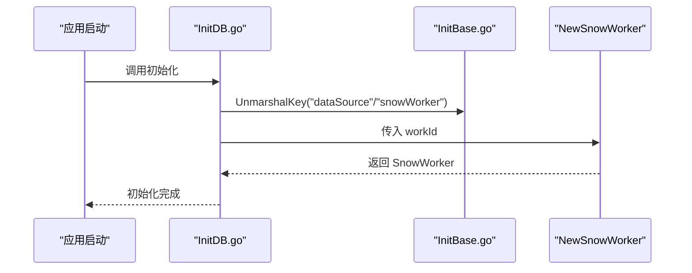
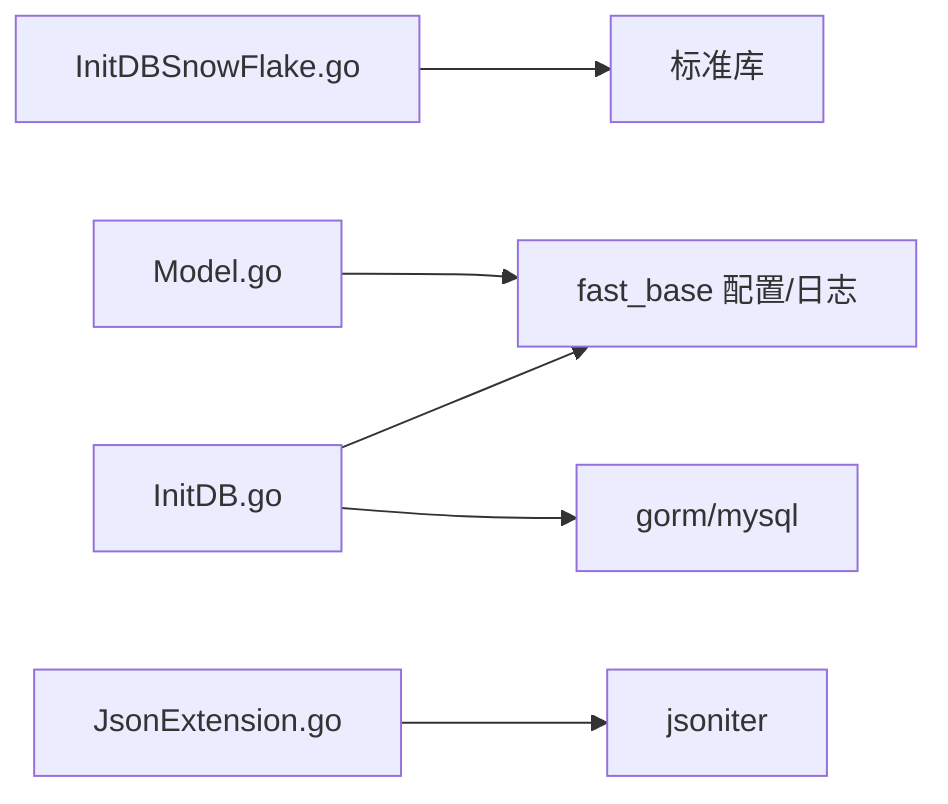

# 雪花算法 ID 生成器

<cite>
**本文引用的文件**
- [fast_db/InitDBSnowFlake.go](file://fast_db/InitDBSnowFlake.go)
- [fast_db/InitBase.go](file://fast_db/InitBase.go)
- [fast_db/InitDB.go](file://fast_db/InitDB.go)
- [fast_base/JsonExtension.go](file://fast_base/JsonExtension.go)
- [fast_base/Model.go](file://fast_base/Model.go)
</cite>

## 目录
1. [简介](#简介)
2. [项目结构](#项目结构)
3. [核心组件](#核心组件)
4. [架构总览](#架构总览)
5. [组件详解](#组件详解)
6. [依赖关系分析](#依赖关系分析)
7. [性能与并发特性](#性能与并发特性)
8. [使用示例与最佳实践](#使用示例与最佳实践)
9. [故障排查与调试](#故障排查与调试)
10. [结论](#结论)

## 简介
本文件面向 Fast-Go 雪花算法 ID 生成器，系统性阐述其原理、实现细节、配置方法、使用方式、时序特性、分布式唯一性保障、性能与并发表现，以及常见问题排查。该实现采用毫秒级时间戳、工作进程 ID 与序列号组合，确保在单机与多实例部署下具备强可排序性与唯一性。

## 项目结构
雪花算法相关代码集中在 fast_db 模块中，配合 fast_base 的 JSON 序列化扩展，保证 ID 在前后端传输时不丢失精度；数据库连接与雪花工作节点初始化在 fast_db 的初始化流程中完成。

图表来源
- [fast_db/InitDBSnowFlake.go:1-102](file://fast_db/InitDBSnowFlake.go#L1-L102)
- [fast_db/InitBase.go:1-39](file://fast_db/InitBase.go#L1-L39)
- [fast_db/InitDB.go:1-237](file://fast_db/InitDB.go#L1-L237)
- [fast_base/JsonExtension.go:1-346](file://fast_base/JsonExtension.go#L1-L346)
- [fast_base/Model.go:1-116](file://fast_base/Model.go#L1-L116)

章节来源
- [fast_db/InitDBSnowFlake.go:1-102](file://fast_db/InitDBSnowFlake.go#L1-L102)
- [fast_db/InitBase.go:1-39](file://fast_db/InitBase.go#L1-L39)
- [fast_db/InitDB.go:1-237](file://fast_db/InitDB.go#L1-L237)
- [fast_base/JsonExtension.go:1-346](file://fast_base/JsonExtension.go#L1-L346)
- [fast_base/Model.go:1-116](file://fast_base/Model.go#L1-L116)

## 核心组件
- 雪花工作节点 SnowWorker：负责生成单调递增的 64 位 ID，内部维护时间戳、工作进程 ID 与序列号。
- 全局配置与工厂：
  - SnowWorkerConfig：包含 WorkId（工作进程 ID）、CenterId（中心 ID，当前实现未使用）。
  - NewSnowWorker：按配置创建工作节点。
- 多表/结构体 ID 获取：
  - GetIdForTable：按表名维度隔离序列号，避免不同表共享同一序列。
  - GetIdForStruct：基于结构体类型名获取 ID。
- 字符串形式 ID：
  - GetIdStrForTable/GetIdStrForStruct：返回十进制字符串形式的 ID，便于传输与展示。

章节来源
- [fast_db/InitDBSnowFlake.go:19-101](file://fast_db/InitDBSnowFlake.go#L19-L101)
- [fast_db/InitBase.go:9-38](file://fast_db/InitBase.go#L9-L38)

## 架构总览
雪花 ID 生成器在数据库初始化阶段启用，通过配置 snowWorker.workId 指定工作节点 ID。随后，业务层可通过表名或结构体类型获取 ID，也可直接使用全局 SnowMaker 生成。

图表来源
- [fast_db/InitDB.go:19-34](file://fast_db/InitDB.go#L19-L34)
- [fast_db/InitDBSnowFlake.go:27-86](file://fast_db/InitDBSnowFlake.go#L27-L86)
- [fast_base/JsonExtension.go:110-122](file://fast_base/JsonExtension.go#L110-L122)

## 组件详解

### 雪花算法组成与位宽
- 时间戳：毫秒级，从固定纪元 startTime 开始计算，向左移位至高位。
- 工作进程 ID：当前实现使用 10 位，最大支持 1024 个节点。
- 序列号：12 位，每毫秒最多 4096 个 ID。
- 总长度：10+12+22=44 位有效位，剩余 20 位为保留位，确保 ID 长度为 64 位。

图表来源
- [fast_db/InitDBSnowFlake.go:20-25](file://fast_db/InitDBSnowFlake.go#L20-L25)

章节来源
- [fast_db/InitDBSnowFlake.go:10-18](file://fast_db/InitDBSnowFlake.go#L10-L18)

### ID 生成流程（含并发与回拨处理）
- 获取当前时间戳（毫秒），若与上次相同，则序列号自增；超过上限则等待下一毫秒。
- 若时间戳前进，则序列号清零。
- 最终 ID 由三部分拼接而成：(now-startTime)<<timeShift | (workerId<<workerShift) | number。

图表来源
- [fast_db/InitDBSnowFlake.go:69-86](file://fast_db/InitDBSnowFlake.go#L69-L86)

章节来源
- [fast_db/InitDBSnowFlake.go:69-86](file://fast_db/InitDBSnowFlake.go#L69-L86)

### 多表/结构体维度的 ID 生成
- GetIdForTable：按表名维护独立的 SnowWorker，避免不同表共享同一序列号。
- GetIdForStruct：通过反射获取结构体类型名，再委托给 GetIdForTable。
- 并发安全：首次创建时使用互斥锁保护，防止重复创建。

图表来源
- [fast_db/InitDBSnowFlake.go:44-59](file://fast_db/InitDBSnowFlake.go#L44-L59)
- [fast_db/InitDBSnowFlake.go:61-67](file://fast_db/InitDBSnowFlake.go#L61-L67)

章节来源
- [fast_db/InitDBSnowFlake.go:44-67](file://fast_db/InitDBSnowFlake.go#L44-L67)

### 配置与初始化
- 配置项：
  - dataSource.enable：是否启用数据库与雪花。
  - dataSource.logLevel：数据库日志级别。
  - snowWorker.workId：工作进程 ID（0~1023）。
  - snowWorker.centerId：中心 ID（当前未使用）。
- 初始化流程：
  - 读取配置后，创建 SnowWorker 并赋值到全局变量 SnowMaker。
  - 同时初始化数据库连接与迁移。

图表来源
- [fast_db/InitDB.go:21-33](file://fast_db/InitDB.go#L21-L33)
- [fast_db/InitBase.go:9-10](file://fast_db/InitBase.go#L9-L10)
- [fast_db/InitDBSnowFlake.go:27-38](file://fast_db/InitDBSnowFlake.go#L27-L38)

章节来源
- [fast_db/InitDB.go:21-33](file://fast_db/InitDB.go#L21-L33)
- [fast_db/InitBase.go:9-10](file://fast_db/InitBase.go#L9-L10)
- [fast_db/InitDBSnowFlake.go:27-38](file://fast_db/InitDBSnowFlake.go#L27-L38)

### JSON 序列化与前端兼容
- 由于前端 JavaScript 对大整数精度有限，fast_base 的 JSON 扩展将 int64 自动序列化为字符串，避免精度丢失。
- 该机制对雪花 ID 的传输非常友好，确保 ID 在网络传输与前端展示时保持准确。

章节来源
- [fast_base/JsonExtension.go:110-122](file://fast_base/JsonExtension.go#L110-L122)

## 依赖关系分析
- fast_db/InitDBSnowFlake.go 仅依赖标准库（反射、字符串转换、同步与时间）。
- fast_db/InitDB.go 依赖 fast_base 配置与日志、gorm、mysql 驱动等外部库。
- fast_base/JsonExtension.go 依赖 jsoniter 与反射，用于增强序列化行为。
- fast_base/Model.go 提供基础模型与类型，与雪花 ID 生成无直接耦合。

图表来源
- [fast_db/InitDBSnowFlake.go:3-8](file://fast_db/InitDBSnowFlake.go#L3-L8)
- [fast_db/InitDB.go:3-16](file://fast_db/InitDB.go#L3-L16)
- [fast_base/JsonExtension.go:3-10](file://fast_base/JsonExtension.go#L3-L10)
- [fast_base/Model.go:3-7](file://fast_base/Model.go#L3-L7)

章节来源
- [fast_db/InitDBSnowFlake.go:3-8](file://fast_db/InitDBSnowFlake.go#L3-L8)
- [fast_db/InitDB.go:3-16](file://fast_db/InitDB.go#L3-L16)
- [fast_base/JsonExtension.go:3-10](file://fast_base/JsonExtension.go#L3-L10)
- [fast_base/Model.go:3-7](file://fast_base/Model.go#L3-L7)

## 性能与并发特性
- 并发安全：每个 SnowWorker 内部使用互斥锁保护，GetId 为原子操作。
- 毫秒级吞吐：单节点每毫秒最多 4096 个 ID（2^12），在高并发下不会出现冲突。
- 回拨处理：当序列号溢出时，循环等待直至时间戳前进，避免生成重复 ID。
- 多表隔离：按表名维护独立工作节点，降低热点冲突概率。
- 前端传输：JSON 层自动将 int64 转字符串，避免精度问题。

章节来源
- [fast_db/InitDBSnowFlake.go:69-86](file://fast_db/InitDBSnowFlake.go#L69-L86)
- [fast_db/InitDBSnowFlake.go:44-59](file://fast_db/InitDBSnowFlake.go#L44-L59)
- [fast_base/JsonExtension.go:110-122](file://fast_base/JsonExtension.go#L110-L122)

## 使用示例与最佳实践

### 在模型中集成雪花 ID
- 方案一：使用表名维度生成
  - 调用 GetIdForTable(tableName) 获取 ID。
  - 适用于多表、多实体场景，天然隔离序列。
- 方案二：使用结构体维度生成
  - 调用 GetIdForStruct(model) 获取 ID。
  - 通过反射获取类型名，适合结构体驱动的建模。

章节来源
- [fast_db/InitDBSnowFlake.go:44-67](file://fast_db/InitDBSnowFlake.go#L44-L67)

### 自定义 ID 生成策略
- 工作进程 ID 分配
  - 在 snowWorker.workId 中配置，范围 0~1023。
  - 集群环境下，每个实例分配唯一 workId，确保全局唯一。
- 中心 ID（CenterId）
  - 当前实现未使用，可保留以备未来扩展。
- 全局工作节点
  - 初始化后可通过全局变量 SnowMaker 直接生成 ID。

章节来源
- [fast_db/InitBase.go:9-10](file://fast_db/InitBase.go#L9-L10)
- [fast_db/InitDB.go:32-33](file://fast_db/InitDB.go#L32-L33)

### 在高并发场景下的建议
- 控制单机 workId 数量，避免热点冲突。
- 如需跨实例唯一，确保每个实例的 workId 唯一。
- 使用 GetIdForTable 按表隔离，减少序列竞争。

章节来源
- [fast_db/InitDBSnowFlake.go:44-59](file://fast_db/InitDBSnowFlake.go#L44-L59)
- [fast_db/InitDB.go:32-33](file://fast_db/InitDB.go#L32-L33)

## 故障排查与调试

### 常见问题定位
- 生成重复 ID
  - 检查时间回拨：若系统时间被回拨，可能导致序列号重置失败。
  - 检查 workId 越界：workId 必须在 0~1023 范围内。
- 并发冲突
  - 确认 GetId 调用路径使用了正确的隔离维度（表名或结构体）。
- 前端显示异常
  - 确保 JSON 序列化启用整型转字符串逻辑，避免精度丢失。

章节来源
- [fast_db/InitDBSnowFlake.go:27-30](file://fast_db/InitDBSnowFlake.go#L27-L30)
- [fast_db/InitDBSnowFlake.go:75-79](file://fast_db/InitDBSnowFlake.go#L75-L79)
- [fast_base/JsonExtension.go:110-122](file://fast_base/JsonExtension.go#L110-L122)

### 调试建议
- 打印时间戳与序列号变化轨迹，确认毫秒级推进与序列上限处理。
- 在多实例部署时，核对各实例的 workId 是否唯一。
- 使用字符串形式 ID 进行日志记录，便于跨语言/跨平台一致性验证。

章节来源
- [fast_db/InitDBSnowFlake.go:69-86](file://fast_db/InitDBSnowFlake.go#L69-L86)
- [fast_db/InitDBSnowFlake.go:93-101](file://fast_db/InitDBSnowFlake.go#L93-L101)

## 结论
Fast-Go 雪花算法 ID 生成器以简洁稳定的实现满足高并发与分布式场景下的唯一性需求。通过毫秒级时间戳、10 位工作进程 ID 与 12 位序列号的组合，既保证了 ID 的单调递增与可排序性，又在多表/多结构体维度上提供了良好的隔离能力。配合 fast_base 的 JSON 序列化增强，可在前后端之间可靠传递大整数 ID。在集群部署中，只需为每个实例分配唯一的 workId，即可实现全局唯一且可追踪的 ID 生成。