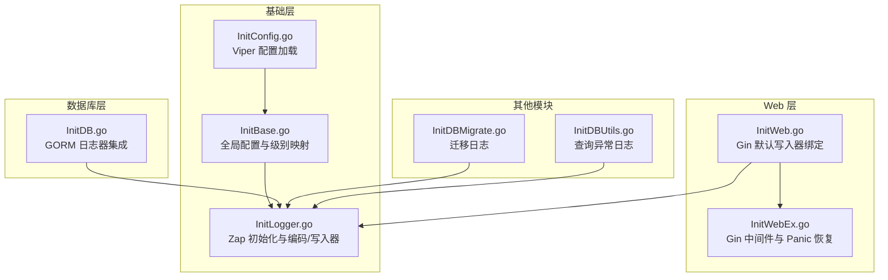
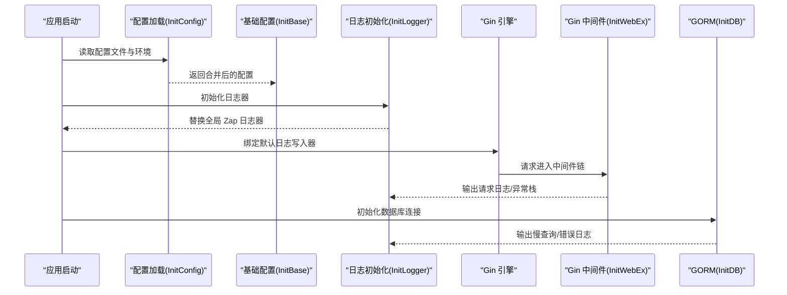
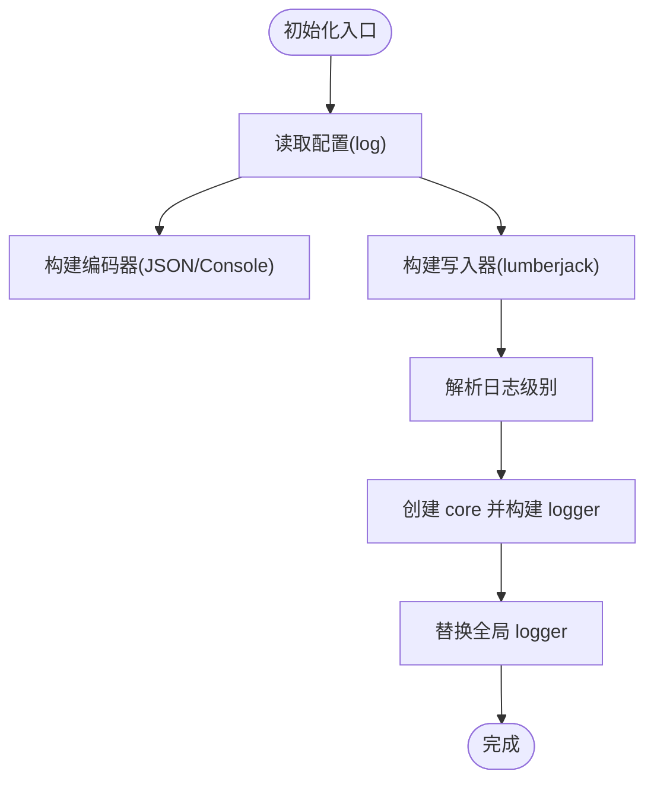
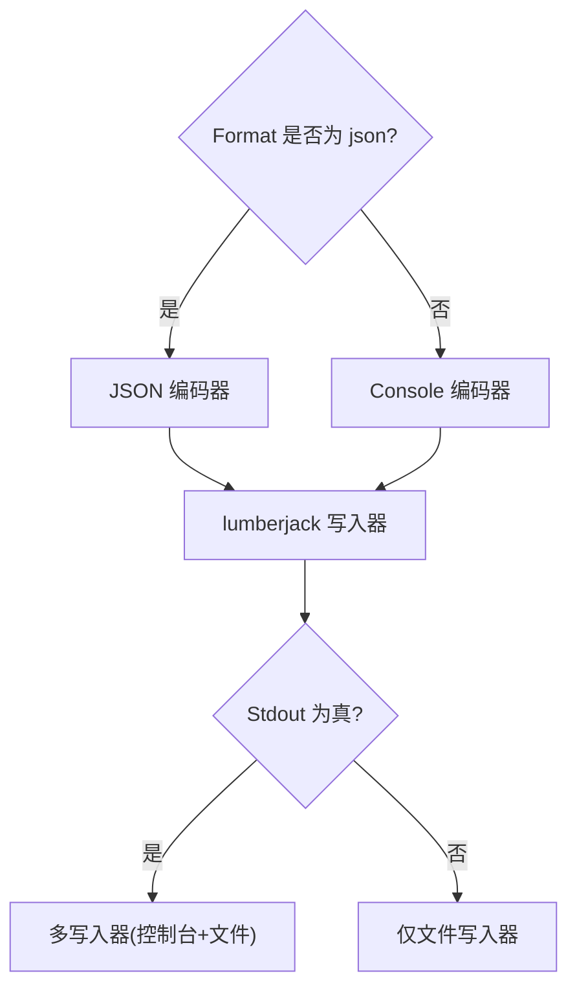
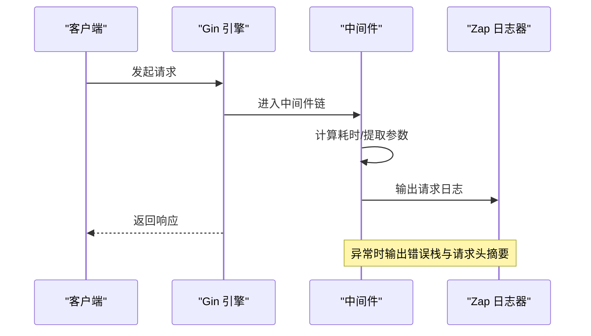
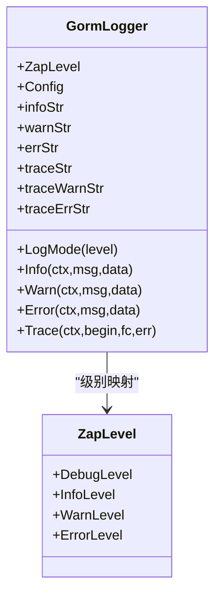
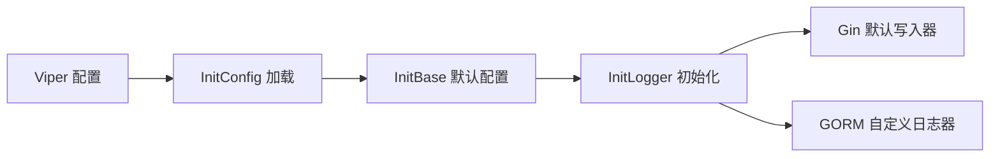

# 日志系统

<cite>
**本文引用的文件**
- [fast_base/InitLogger.go](file://fast_base/InitLogger.go)
- [fast_base/InitBase.go](file://fast_base/InitBase.go)
- [fast_base/InitConfig.go](file://fast_base/InitConfig.go)
- [fast_db/InitDB.go](file://fast_db/InitDB.go)
- [fast_web/InitWebEx.go](file://fast_web/InitWebEx.go)
- [fast_web/InitWeb.go](file://fast_web/InitWeb.go)
- [fast_db/InitDBMigrate.go](file://fast_db/InitDBMigrate.go)
- [fast_db/InitDBUtils.go](file://fast_db/InitDBUtils.go)
</cite>

## 目录
1. [简介](#简介)
2. [项目结构](#项目结构)
3. [核心组件](#核心组件)
4. [架构总览](#架构总览)
5. [详细组件分析](#详细组件分析)
6. [依赖关系分析](#依赖关系分析)
7. [性能考量](#性能考量)
8. [故障排查指南](#故障排查指南)
9. [结论](#结论)
10. [附录](#附录)

## 简介
本文件面向 Fast-Go 的日志系统，基于 Zap 构建结构化日志记录能力，结合 lumberjack 实现文件轮转与压缩，覆盖 Gin Web 层与 GORM 数据库层的日志集成。文档重点涵盖：
- 日志级别、格式化输出与性能优化
- 日志配置项（文件轮转、压缩、保留策略）
- 场景化日志使用（业务日志、错误日志、调试日志）
- 上下文与调用方信息传递、异常恢复与日志聚合思路
- 性能调优与内存使用优化
- 完整配置示例与实际使用场景的代码路径指引

## 项目结构
日志系统主要分布在基础模块与业务模块中：
- 基础日志初始化与配置：fast_base/InitLogger.go、fast_base/InitBase.go、fast_base/InitConfig.go
- Web 层日志中间件与异常恢复：fast_web/InitWeb.go、fast_web/InitWebEx.go
- 数据库层日志集成（GORM）：fast_db/InitDB.go
- 其他模块日志使用示例：fast_db/InitDBMigrate.go、fast_db/InitDBUtils.go

**图表来源**
- [fast_base/InitBase.go:17-40](file://fast_base/InitBase.go#L17-L40)
- [fast_base/InitLogger.go:15-44](file://fast_base/InitLogger.go#L15-L44)
- [fast_base/InitConfig.go:21-50](file://fast_base/InitConfig.go#L21-L50)
- [fast_web/InitWeb.go:50-111](file://fast_web/InitWeb.go#L50-L111)
- [fast_web/InitWebEx.go:52-109](file://fast_web/InitWebEx.go#L52-L109)
- [fast_db/InitDB.go:42-58](file://fast_db/InitDB.go#L42-L58)
- [fast_db/InitDBMigrate.go:12-28](file://fast_db/InitDBMigrate.go#L12-L28)
- [fast_db/InitDBUtils.go:90-106](file://fast_db/InitDBUtils.go#L90-L106)

**章节来源**
- [fast_base/InitLogger.go:15-44](file://fast_base/InitLogger.go#L15-L44)
- [fast_base/InitBase.go:17-40](file://fast_base/InitBase.go#L17-L40)
- [fast_base/InitConfig.go:21-50](file://fast_base/InitConfig.go#L21-L50)
- [fast_web/InitWeb.go:50-111](file://fast_web/InitWeb.go#L50-L111)
- [fast_web/InitWebEx.go:52-109](file://fast_web/InitWebEx.go#L52-L109)
- [fast_db/InitDB.go:42-58](file://fast_db/InitDB.go#L42-L58)
- [fast_db/InitDBMigrate.go:12-28](file://fast_db/InitDBMigrate.go#L12-L28)
- [fast_db/InitDBUtils.go:90-106](file://fast_db/InitDBUtils.go#L90-L106)

## 核心组件
- 全局日志器与级别映射：在基础模块中定义全局 Logger、日志级别映射与默认日志配置，便于各模块共享。
- 日志初始化：加载配置、构建编码器、选择写入器（文件/控制台）、设置级别并替换全局 Zap 日志器。
- 编码器与写入器：支持 JSON 与 Console 两种格式；写入器通过 lumberjack 实现文件轮转与压缩。
- Web 中间件：将 Gin 默认日志与错误输出桥接到 Zap，并按配置输出彩色日志。
- GORM 集成：将 GORM 日志桥接到 Zap，支持慢查询阈值、级别映射与调用方信息。

**章节来源**
- [fast_base/InitBase.go:9-40](file://fast_base/InitBase.go#L9-L40)
- [fast_base/InitLogger.go:15-44](file://fast_base/InitLogger.go#L15-L44)
- [fast_web/InitWebEx.go:20-49](file://fast_web/InitWebEx.go#L20-L49)
- [fast_db/InitDB.go:110-150](file://fast_db/InitDB.go#L110-L150)

## 架构总览
下图展示从应用启动到日志落盘的关键流程，以及 Web/GORM 对 Zap 的集成方式。

**图表来源**
- [fast_base/InitConfig.go:21-50](file://fast_base/InitConfig.go#L21-L50)
- [fast_base/InitBase.go:17-40](file://fast_base/InitBase.go#L17-L40)
- [fast_base/InitLogger.go:15-44](file://fast_base/InitLogger.go#L15-L44)
- [fast_web/InitWeb.go:50-111](file://fast_web/InitWeb.go#L50-L111)
- [fast_web/InitWebEx.go:52-109](file://fast_web/InitWebEx.go#L52-L109)
- [fast_db/InitDB.go:42-58](file://fast_db/InitDB.go#L42-L58)

## 详细组件分析

### 日志初始化与配置（InitLogger）
- 配置来源：从 ConfigAll 中解出 log 节点，构造日志配置。
- 编码器：生产环境编码器，时间格式自定义，级别大写；支持 JSON 与 Console 两种格式。
- 写入器：lumberjack 实现文件轮转（单文件大小上限、备份数量、保留天数、本地时区、压缩）；可同时输出到控制台。
- 级别：从 LogLevelMap 解析，缺省为 info。
- 全局替换：zap.ReplaceGlobals 替换全局日志器，便于直接使用 zap.S()/zap.L()。

**图表来源**
- [fast_base/InitLogger.go:18-43](file://fast_base/InitLogger.go#L18-L43)

**章节来源**
- [fast_base/InitLogger.go:15-44](file://fast_base/InitLogger.go#L15-L44)
- [fast_base/InitBase.go:17-40](file://fast_base/InitBase.go#L17-L40)

### 编码器与写入器（InitLogger）
- 编码器：生产编码器配置，时间格式为“年-月-日 时:分:秒.毫秒”，级别大写；当 Format 为 json 时采用 JSON 编码器。
- 写入器：lumberjack 配置项包括 Filename、MaxSize、MaxBackups、MaxAge、LocalTime、Compress；Stdout 为 true 时同时写控制台。

**图表来源**
- [fast_base/InitLogger.go:47-110](file://fast_base/InitLogger.go#L47-L110)

**章节来源**
- [fast_base/InitLogger.go:47-110](file://fast_base/InitLogger.go#L47-L110)

### Web 中间件与异常恢复（InitWebEx）
- Gin 默认写入器绑定：将 gin.DefaultWriter 与 gin.DefaultErrorWriter 绑定到自定义 LogWriter，统一走 Zap。
- 请求日志中间件：收集路径、方法、状态码、耗时、客户端 IP、错误信息等，格式化输出；支持彩色输出。
- 异常恢复中间件：捕获 panic，输出请求头摘要、错误栈，区分“Broken Pipe”等场景。

**图表来源**
- [fast_web/InitWeb.go:50-111](file://fast_web/InitWeb.go#L50-L111)
- [fast_web/InitWebEx.go:52-109](file://fast_web/InitWebEx.go#L52-L109)
- [fast_web/InitWebEx.go:149-224](file://fast_web/InitWebEx.go#L149-L224)

**章节来源**
- [fast_web/InitWeb.go:50-111](file://fast_web/InitWeb.go#L50-L111)
- [fast_web/InitWebEx.go:20-49](file://fast_web/InitWebEx.go#L20-L49)
- [fast_web/InitWebEx.go:149-224](file://fast_web/InitWebEx.go#L149-L224)

### GORM 日志集成（InitDB）
- 自定义 GORM 日志器：将 GORM 的 Info/Warn/Error 与 Zap 级别映射；支持彩色输出；Trace 输出慢查询耗时与影响行数。
- 调用方信息：通过 findGormCaller 定位真实调用方文件/行号，提升定位效率。
- 配置联动：GORM 日志级别与全局日志级别保持一致，慢查询阈值可按需调整。

**图表来源**
- [fast_db/InitDB.go:152-187](file://fast_db/InitDB.go#L152-L187)
- [fast_db/InitDB.go:227-237](file://fast_db/InitDB.go#L227-L237)

**章节来源**
- [fast_db/InitDB.go:110-150](file://fast_db/InitDB.go#L110-L150)
- [fast_db/InitDB.go:167-187](file://fast_db/InitDB.go#L167-L187)
- [fast_db/InitDB.go:188-225](file://fast_db/InitDB.go#L188-L225)
- [fast_db/InitDB.go:227-237](file://fast_db/InitDB.go#L227-L237)

### 其他模块日志使用示例
- 数据库迁移：迁移失败与 Ping 失败时使用 Fatal 输出终止流程。
- 查询异常：查询异常时输出 Info 日志，便于审计与问题定位。
- Web 启动与静态资源：启动目录、模板路径、静态资源路径变更等均输出 Info/Warn/Error 日志。

**章节来源**
- [fast_db/InitDBMigrate.go:12-28](file://fast_db/InitDBMigrate.go#L12-L28)
- [fast_db/InitDBUtils.go:90-106](file://fast_db/InitDBUtils.go#L90-L106)
- [fast_web/InitWeb.go:56-108](file://fast_web/InitWeb.go#L56-L108)

## 依赖关系分析
- 配置来源：InitConfig 通过 Viper 从多处路径加载 YAML 配置，支持命令行、环境变量、配置文件与默认值合并。
- 日志配置：InitLogger 从 ConfigAll 中解出 log 节点，结合 InitBase 的默认配置与级别映射。
- Web/GORM 集成：Gin 默认写入器与中间件将请求日志与异常恢复统一接入 Zap；GORM 通过自定义 Logger 将 SQL 日志桥接至 Zap。

**图表来源**
- [fast_base/InitConfig.go:21-50](file://fast_base/InitConfig.go#L21-L50)
- [fast_base/InitBase.go:17-40](file://fast_base/InitBase.go#L17-L40)
- [fast_base/InitLogger.go:15-44](file://fast_base/InitLogger.go#L15-L44)
- [fast_web/InitWeb.go:50-111](file://fast_web/InitWeb.go#L50-L111)
- [fast_db/InitDB.go:42-58](file://fast_db/InitDB.go#L42-L58)

**章节来源**
- [fast_base/InitConfig.go:21-50](file://fast_base/InitConfig.go#L21-L50)
- [fast_base/InitBase.go:17-40](file://fast_base/InitBase.go#L17-L40)
- [fast_base/InitLogger.go:15-44](file://fast_base/InitLogger.go#L15-L44)
- [fast_web/InitWeb.go:50-111](file://fast_web/InitWeb.go#L50-L111)
- [fast_db/InitDB.go:42-58](file://fast_db/InitDB.go#L42-L58)

## 性能考量
- 编码与写入器
  - JSON 编码器在高吞吐场景下 CPU 开销略高于 Console，但利于日志聚合与检索；Console 更轻量。
  - lumberjack 轮转参数建议：
    - MaxSize：按峰值 QPS 与消息长度估算单文件增长速度，建议 10–50MB
    - MaxBackups：按日均日志量与保留策略估算，建议 10–100
    - MaxAge：按合规与磁盘空间估算，建议 7–30 天
    - Compress：开启压缩可节省磁盘，但增加 CPU；建议在高 IO 带宽场景开启
- 级别与采样
  - 生产环境建议 Info/Warn 级别，避免 Debug 造成大量 IO
  - 对高频事件可考虑采样或条件输出，减少不必要的日志
- Gin/GORM 集成
  - Gin 中间件仅在必要时格式化消息，避免无谓拼接
  - GORM Trace 仅在慢查询阈值触发时输出，避免频繁 IO
- 内存与 GC
  - 避免在日志中拼接大型结构体；必要时延迟求值
  - 控制每条日志字段数量，减少临时对象分配

[本节为通用性能指导，无需特定文件引用]

## 故障排查指南
- 日志未输出到文件
  - 检查日志路径是否存在，若不存在将尝试创建；确认权限与磁盘空间
  - 确认 Stdout 与文件写入器配置是否正确
- 日志级别无效
  - 确认配置中的 Level 是否在 LogLevelMap 中；缺省为 info
- Gin 请求日志缺失
  - 确认 gin.DefaultWriter 已绑定到 LogWriter；检查中间件顺序
- GORM 慢查询未输出
  - 检查 SlowThreshold 与 LogLevel 映射；确认数据库连接已启用自定义 Logger
- Panic 未捕获
  - 确认已注册 ginRecovery 中间件；检查异常恢复逻辑与输出级别

**章节来源**
- [fast_base/InitLogger.go:78-110](file://fast_base/InitLogger.go#L78-L110)
- [fast_base/InitBase.go:35-40](file://fast_base/InitBase.go#L35-L40)
- [fast_web/InitWeb.go:50-111](file://fast_web/InitWeb.go#L50-L111)
- [fast_web/InitWebEx.go:149-224](file://fast_web/InitWebEx.go#L149-L224)
- [fast_db/InitDB.go:110-150](file://fast_db/InitDB.go#L110-L150)

## 结论
Fast-Go 的日志体系以 Zap 为核心，结合 lumberjack 实现高效稳定的文件轮转与压缩；通过 Gin 与 GORM 的深度集成，形成统一的结构化日志输出。配合灵活的配置与级别映射，可在不同环境中平衡可观测性与性能。建议在生产环境采用 JSON 格式、合理设置轮转参数与级别，并对高频日志进行采样或条件输出，以获得最佳的性能与可观测性。

[本节为总结性内容，无需特定文件引用]

## 附录

### 日志配置项与含义
- Level：日志级别（debug/info/warn/error）
- Format：输出格式（json/console）
- Path：日志文件路径
- FileName：日志文件名
- FileMaxSize：单文件最大大小（MB）
- FileMaxBackups：备份数量
- MaxAge：保留天数
- Compress：是否压缩
- Stdout：是否同时输出到控制台
- Color：是否启用彩色输出

**章节来源**
- [fast_base/InitBase.go:22-33](file://fast_base/InitBase.go#L22-L33)

### 场景化日志使用模式
- 业务日志
  - 使用 Info/Warn 记录关键业务事件与异常；避免 Debug 产生过多 IO
- 错误日志
  - 使用 Error/Fatal 输出严重错误与不可恢复异常；配合 Panic 恢复中间件输出堆栈
- 调试日志
  - 在开发/测试环境启用 Debug；生产环境谨慎开启

**章节来源**
- [fast_web/InitWebEx.go:149-224](file://fast_web/InitWebEx.go#L149-L224)
- [fast_db/InitDBMigrate.go:12-28](file://fast_db/InitDBMigrate.go#L12-L28)
- [fast_db/InitDBUtils.go:90-106](file://fast_db/InitDBUtils.go#L90-L106)

### 日志上下文传递与调用方信息
- Gin 中间件通过 findGinCaller 定位真实调用方，确保日志文件/行号准确
- GORM 日志器通过 findGormCaller 定位 SQL 执行位置，便于快速定位问题

**章节来源**
- [fast_web/InitWebEx.go:38-49](file://fast_web/InitWebEx.go#L38-L49)
- [fast_db/InitDB.go:227-237](file://fast_db/InitDB.go#L227-L237)

### 日志聚合与分布式追踪建议
- 结构化输出：建议使用 JSON 格式，便于日志收集与检索
- 关键字段：在业务日志中加入 trace_id、span_id、tenant_id 等上下文字段
- 收集与存储：结合集中式日志系统（如 ELK/Fluentd/Loki）与指标系统（如 Prometheus）进行统一分析

[本节为概念性建议，无需特定文件引用]