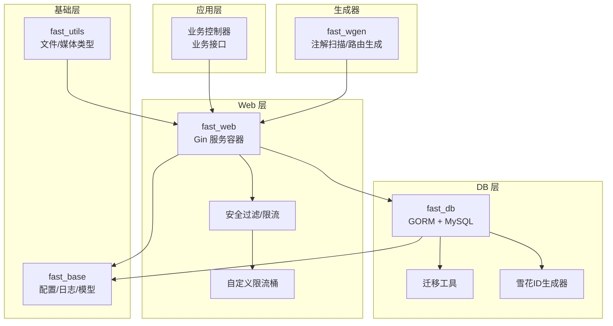
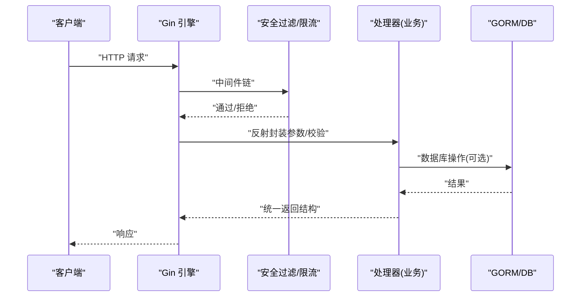
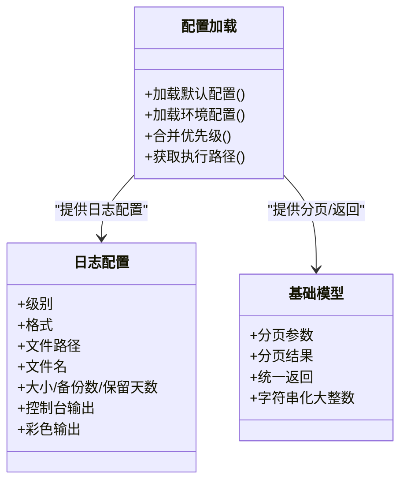
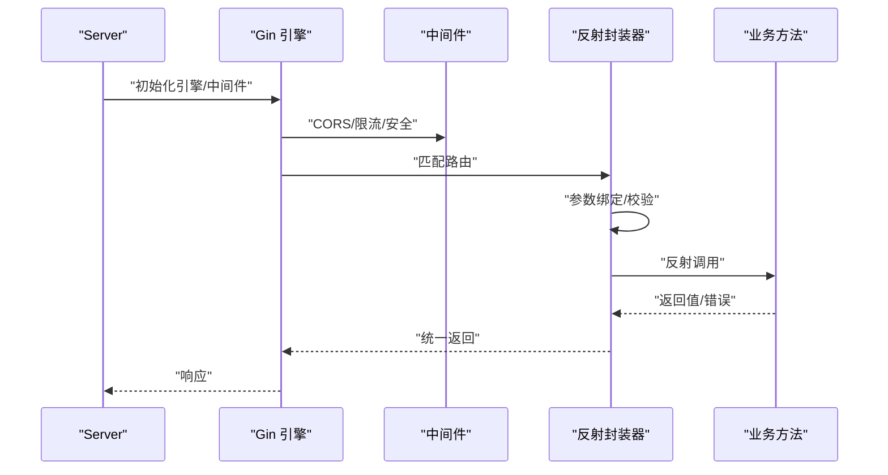
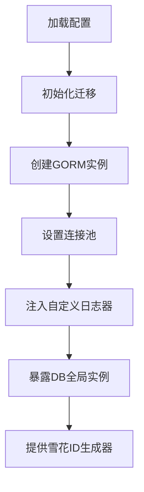
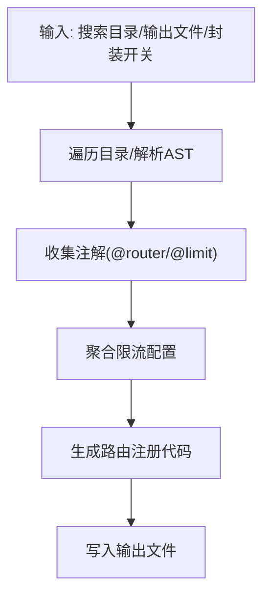
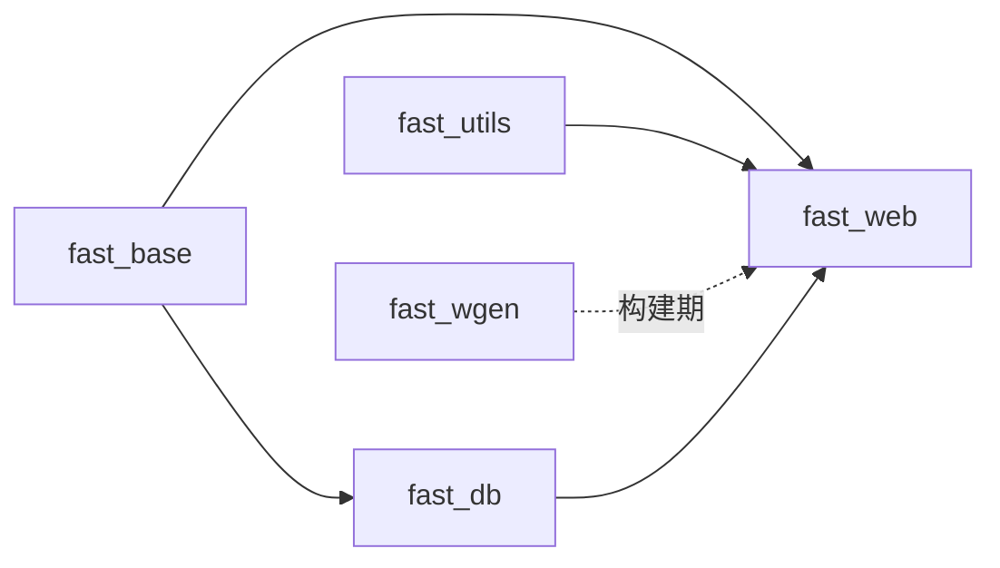

# 核心模块

<cite>
**本文引用的文件**
- [fast_base/InitBase.go](file://fast_base/InitBase.go)
- [fast_base/InitConfig.go](file://fast_base/InitConfig.go)
- [fast_base/Model.go](file://fast_base/Model.go)
- [fast_web/InitBase.go](file://fast_web/InitBase.go)
- [fast_web/InitWeb.go](file://fast_web/InitWeb.go)
- [fast_web/SecFilter.go](file://fast_web/SecFilter.go)
- [fast_web/SecTokenManager.go](file://fast_web/SecTokenManager.go)
- [fast_web/web/RateLimit.go](file://fast_web/web/RateLimit.go)
- [fast_db/InitBase.go](file://fast_db/InitBase.go)
- [fast_db/InitDB.go](file://fast_db/InitDB.go)
- [fast_db/InitDBMigrate.go](file://fast_db/InitDBMigrate.go)
- [fast_db/InitDBSnowFlake.go](file://fast_db/InitDBSnowFlake.go)
- [fast_utils/FileUtils.go](file://fast_utils/FileUtils.go)
- [fast_utils/HttpMediaType.go](file://fast_utils/HttpMediaType.go)
- [fast_wgen/gr.go](file://fast_wgen/gr.go)
</cite>

## 目录
1. [简介](#简介)
2. [项目结构](#项目结构)
3. [核心组件](#核心组件)
4. [架构总览](#架构总览)
5. [详细组件分析](#详细组件分析)
6. [依赖分析](#依赖分析)
7. [性能考虑](#性能考虑)
8. [故障排查指南](#故障排查指南)
9. [结论](#结论)
10. [附录](#附录)

## 简介
本文件面向 Fast-Go 框架的核心模块，系统性梳理基础设施模块 fast_base、Web 服务模块 fast_web、数据库模块 fast_db、工具库模块 fast_utils、代码生成器模块 fast_wgen 的功能定位、架构设计与相互关系。文档重点解释模块化理念如何实现松耦合与高内聚，给出配置项、扩展点与自定义方法，并提供使用示例与最佳实践建议。

## 项目结构
Fast-Go 采用“按领域/职责”的模块化组织方式，各模块边界清晰、职责单一：
- fast_base：提供配置加载、日志、基础模型与通用工具能力，为其他模块提供基础设施。
- fast_web：基于 Gin 构建 Web 服务，提供路由装载、安全过滤、限流、模板与静态资源等能力。
- fast_db：基于 GORM 封装数据库连接、连接池、日志桥接、迁移与雪花 ID 生成。
- fast_utils：提供文件与 HTTP 媒体类型等通用工具。
- fast_wgen：代码生成器，扫描注解生成路由注册代码，降低手写样板代码成本。

图表来源
- [fast_web/InitWeb.go:42-111](file://fast_web/InitWeb.go#L42-L111)
- [fast_db/InitDB.go:18-100](file://fast_db/InitDB.go#L18-L100)
- [fast_wgen/gr.go:50-135](file://fast_wgen/gr.go#L50-L135)

章节来源
- [fast_web/InitWeb.go:42-111](file://fast_web/InitWeb.go#L42-L111)
- [fast_db/InitDB.go:18-100](file://fast_db/InitDB.go#L18-L100)
- [fast_wgen/gr.go:50-135](file://fast_wgen/gr.go#L50-L135)

## 核心组件
- fast_base：集中式配置加载、日志初始化、基础模型（分页、统一返回）、执行路径与环境常量。
- fast_web：Web 服务容器、路由装载、安全过滤（CORS、Token、密码）、限流中间件、模板与静态资源。
- fast_db：数据源配置、GORM 初始化、连接池、慢查询日志桥接、数据库迁移、雪花 ID。
- fast_utils：文件类型与媒体类型判断等工具。
- fast_wgen：注解扫描、限流分组、路由生成器，输出可直接运行的路由注册代码。

章节来源
- [fast_base/InitBase.go:9-50](file://fast_base/InitBase.go#L9-L50)
- [fast_web/InitBase.go:7-46](file://fast_web/InitBase.go#L7-L46)
- [fast_db/InitBase.go:9-39](file://fast_db/InitBase.go#L9-L39)
- [fast_utils/FileUtils.go:12-30](file://fast_utils/FileUtils.go#L12-L30)
- [fast_wgen/gr.go:50-135](file://fast_wgen/gr.go#L50-L135)

## 架构总览
Fast-Go 通过模块化实现“上层业务只关心控制器，下层基础设施自动装配”的目标。fast_base 提供统一配置与日志；fast_web 负责网络层与安全；fast_db 负责数据持久化；fast_utils 提供通用工具；fast_wgen 通过注解驱动生成路由，减少重复劳动。

图表来源
- [fast_web/InitWeb.go:186-338](file://fast_web/InitWeb.go#L186-L338)
- [fast_db/InitDB.go:188-225](file://fast_db/InitDB.go#L188-L225)

## 详细组件分析

### fast_base 基础设施模块
- 职责
  - 配置加载：支持多路径 YAML、命令行、环境变量、默认值与合并策略。
  - 日志：Zap 集成，支持级别映射、彩色输出、文件切割。
  - 基础模型：分页参数/结果、统一返回结构、字符串化大整数类型。
- 关键点
  - 配置优先级与合并策略明确，便于多环境部署。
  - 日志级别映射与输出控制，便于生产与开发环境切换。
  - 统一返回结构与分页模型，保证 API 输出一致性。

图表来源
- [fast_base/InitConfig.go:21-108](file://fast_base/InitConfig.go#L21-L108)
- [fast_base/InitBase.go:16-50](file://fast_base/InitBase.go#L16-L50)
- [fast_base/Model.go:9-116](file://fast_base/Model.go#L9-L116)

章节来源
- [fast_base/InitConfig.go:21-108](file://fast_base/InitConfig.go#L21-L108)
- [fast_base/InitBase.go:16-50](file://fast_base/InitBase.go#L16-L50)
- [fast_base/Model.go:9-116](file://fast_base/Model.go#L9-L116)

### fast_web Web 服务模块
- 职责
  - Web 容器初始化：Gin 引擎、日志与错误输出、跨域、静态资源、模板。
  - 路由装载：支持注解生成与反射封装的统一处理器。
  - 安全与限流：CORS、Token 校验、密码校验、限流中间件与自定义限流桶。
- 关键点
  - HandlerFuncWrapper 通过反射解析参数、绑定结构体、校验并调用业务方法。
  - 统一返回结构，简化业务返回。
  - 支持服务化运行与优雅关闭。

图表来源
- [fast_web/InitWeb.go:42-111](file://fast_web/InitWeb.go#L42-L111)
- [fast_web/SecFilter.go:11-100](file://fast_web/SecFilter.go#L11-L100)
- [fast_web/SecTokenManager.go:90-112](file://fast_web/SecTokenManager.go#L90-L112)

章节来源
- [fast_web/InitBase.go:7-46](file://fast_web/InitBase.go#L7-L46)
- [fast_web/InitWeb.go:42-111](file://fast_web/InitWeb.go#L42-L111)
- [fast_web/SecFilter.go:11-100](file://fast_web/SecFilter.go#L11-L100)
- [fast_web/SecTokenManager.go:90-112](file://fast_web/SecTokenManager.go#L90-L112)

### fast_db 数据库模块
- 职责
  - 数据源配置与 GORM 初始化：DNS、命名策略、连接池、慢查询日志桥接。
  - 迁移：基于 golang-migrate 的版本管理。
  - 雪花 ID：分布式唯一 ID 生成器。
- 关键点
  - 自定义 GormLogger 将 SQL 日志桥接到 Zap，支持级别映射与彩色输出。
  - 连接池参数与生命周期配置，适配不同负载场景。
  - 雪花 ID 与表/结构体绑定，避免冲突。

图表来源
- [fast_db/InitDB.go:18-100](file://fast_db/InitDB.go#L18-L100)
- [fast_db/InitDBMigrate.go:12-28](file://fast_db/InitDBMigrate.go#L12-L28)
- [fast_db/InitDBSnowFlake.go:27-102](file://fast_db/InitDBSnowFlake.go#L27-L102)

章节来源
- [fast_db/InitBase.go:9-39](file://fast_db/InitBase.go#L9-L39)
- [fast_db/InitDB.go:18-100](file://fast_db/InitDB.go#L18-L100)
- [fast_db/InitDBMigrate.go:12-28](file://fast_db/InitDBMigrate.go#L12-L28)
- [fast_db/InitDBSnowFlake.go:27-102](file://fast_db/InitDBSnowFlake.go#L27-L102)

### fast_utils 工具库模块
- 职责
  - 文件类型与媒体类型判断，便于静态资源与上传文件处理。
- 关键点
  - 基于扩展名映射常见媒体类型，缺失时回退为二进制流。

章节来源
- [fast_utils/FileUtils.go:12-30](file://fast_utils/FileUtils.go#L12-L30)
- [fast_utils/HttpMediaType.go:6-55](file://fast_utils/HttpMediaType.go#L6-L55)

### fast_wgen 代码生成器模块
- 职责
  - 扫描注解（如 @router、@limit），生成路由注册代码，自动注入限流中间件。
- 关键点
  - 支持多搜索目录、AST 解析、限流分组与导入头生成。
  - 可选择是否包裹一层内置封装，提升兼容性。

图表来源
- [fast_wgen/gr.go:50-135](file://fast_wgen/gr.go#L50-L135)
- [fast_wgen/gr.go:168-192](file://fast_wgen/gr.go#L168-L192)
- [fast_wgen/gr.go:384-450](file://fast_wgen/gr.go#L384-L450)

章节来源
- [fast_wgen/gr.go:50-135](file://fast_wgen/gr.go#L50-L135)
- [fast_wgen/gr.go:168-192](file://fast_wgen/gr.go#L168-L192)
- [fast_wgen/gr.go:384-450](file://fast_wgen/gr.go#L384-L450)

## 依赖分析
- 模块内聚与松耦合
  - fast_base 仅提供配置与日志，不依赖 Web/DB，确保高内聚低耦合。
  - fast_web 通过 fast_base 的配置与日志工作，不直接依赖 fast_db，业务可选依赖。
  - fast_db 依赖 fast_base 的日志与配置，不反向依赖 Web。
  - fast_utils 为纯工具模块，无循环依赖。
  - fast_wgen 仅在构建期使用，不参与运行时依赖。
- 外部依赖
  - fast_web：Gin、Zap、bigcache、rate。
  - fast_db：GORM、MySQL 驱动、migrate、Zap。
  - fast_wgen：go/ast、go/parser、swag、标准库。

图表来源
- [fast_web/InitWeb.go:42-111](file://fast_web/InitWeb.go#L42-L111)
- [fast_db/InitDB.go:18-100](file://fast_db/InitDB.go#L18-L100)

章节来源
- [fast_web/InitWeb.go:42-111](file://fast_web/InitWeb.go#L42-L111)
- [fast_db/InitDB.go:18-100](file://fast_db/InitDB.go#L18-L100)

## 性能考虑
- 连接池与生命周期
  - 合理设置最大打开/空闲连接数与生命周期，避免连接泄漏或抖动。
  - 慢查询阈值与日志级别需结合生产环境调整，避免日志风暴。
- 反射封装成本
  - HandlerFuncWrapper 在参数绑定与校验上有一定开销，建议对高频接口评估是否降级为原生 Gin 处理器。
- 限流策略
  - 简单限流使用 Token Bucket（rate.Limiter），复杂场景可结合 fast_web/web/RateLimit.go 的桶实现。
- 雪花 ID
  - 多表/多结构体共享 WorkerId 时需谨慎，避免冲突；建议按表/模块分配 WorkerId。

## 故障排查指南
- 配置加载失败
  - 检查配置文件路径与环境变量，确认优先级顺序与合并逻辑。
- 数据库连接失败
  - 校验 DNS、账号密码、网络连通性；检查连接池参数与 MySQL 服务端配置。
- 日志输出异常
  - 校验日志级别映射与输出路径，确认文件切割与权限。
- 路由生成异常
  - 确认注解格式（@router/@limit）正确，搜索目录存在且可读。
- 安全与限流
  - CORS 未生效检查中间件顺序；Token 校验失败检查 Header 与缓存持久化文件。

章节来源
- [fast_base/InitConfig.go:65-87](file://fast_base/InitConfig.go#L65-L87)
- [fast_db/InitDB.go:59-61](file://fast_db/InitDB.go#L59-L61)
- [fast_web/SecFilter.go:11-100](file://fast_web/SecFilter.go#L11-L100)
- [fast_wgen/gr.go:168-192](file://fast_wgen/gr.go#L168-L192)

## 结论
Fast-Go 通过模块化设计实现了清晰的职责边界与可插拔能力。fast_base 提供统一配置与日志，fast_web 负责网络与安全，fast_db 负责数据持久化，fast_utils 提供通用工具，fast_wgen 通过注解驱动提升开发效率。遵循本文的配置、扩展与最佳实践建议，可在保证性能与稳定性的同时快速迭代业务。

## 附录

### 配置项与扩展点速览
- fast_base
  - 配置加载：支持多路径 YAML、命令行、环境变量、默认值。
  - 日志：级别、格式、文件路径、大小、备份数、保留天数、控制台输出、彩色输出。
  - 基础模型：分页参数/结果、统一返回结构、字符串化大整数。
- fast_web
  - 服务器：主机、端口、模板、静态资源、会话时长、日志级别。
  - 安全：CORS、Token 校验、密码校验、限流中间件。
  - 路由：注解生成、反射封装、统一返回。
- fast_db
  - 数据源：启用、驱动、主机、端口、库名、账号、参数、连接池、日志级别。
  - 迁移：文件源与 MySQL 目标。
  - 雪花 ID：WorkerId、CenterId。
- fast_utils
  - 文件类型：扩展名到 MIME 映射。
- fast_wgen
  - 参数：扫描目录、输出文件、是否封装。

章节来源
- [fast_base/InitConfig.go:21-108](file://fast_base/InitConfig.go#L21-L108)
- [fast_base/InitBase.go:16-50](file://fast_base/InitBase.go#L16-L50)
- [fast_web/InitBase.go:7-46](file://fast_web/InitBase.go#L7-L46)
- [fast_db/InitBase.go:9-39](file://fast_db/InitBase.go#L9-L39)
- [fast_utils/HttpMediaType.go:6-55](file://fast_utils/HttpMediaType.go#L6-L55)
- [fast_wgen/gr.go:20-48](file://fast_wgen/gr.go#L20-L48)

### 使用示例与最佳实践
- 快速启动 Web 服务
  - 步骤：加载配置与日志 → 初始化验证器 → 初始化 Web → 注册路由 → 运行。
  - 参考路径：[fast_web/InitWeb.go:42-111](file://fast_web/InitWeb.go#L42-L111)
- 安全与限流
  - CORS：按需启用；Token 校验：在受保护路径上启用；限流：对关键接口单独配置。
  - 参考路径：[fast_web/SecFilter.go:11-100](file://fast_web/SecFilter.go#L11-L100)
- 数据库初始化
  - 启用数据源 → 迁移 → 初始化雪花 ID → 设置连接池 → 注入日志器。
  - 参考路径：[fast_db/InitDB.go:18-100](file://fast_db/InitDB.go#L18-L100)
- 路由生成
  - 使用注解 @router 与 @limit，指定扫描目录与输出文件，生成后直接运行。
  - 参考路径：[fast_wgen/gr.go:50-135](file://fast_wgen/gr.go#L50-L135)