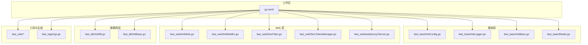
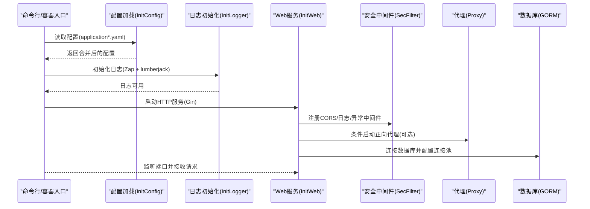
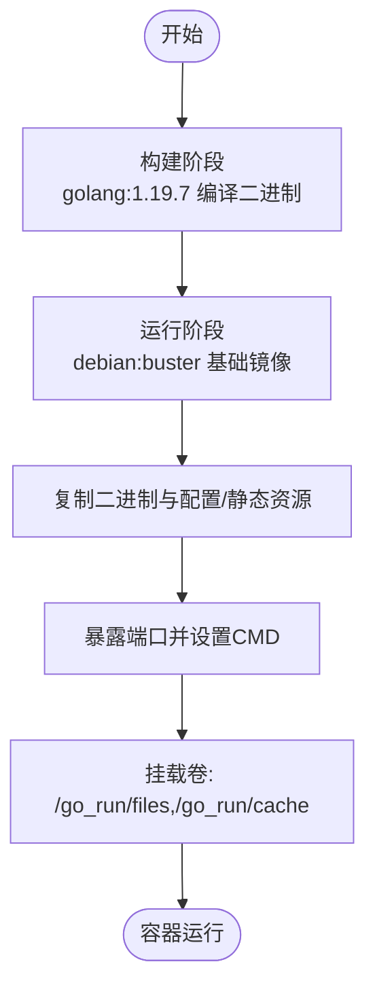
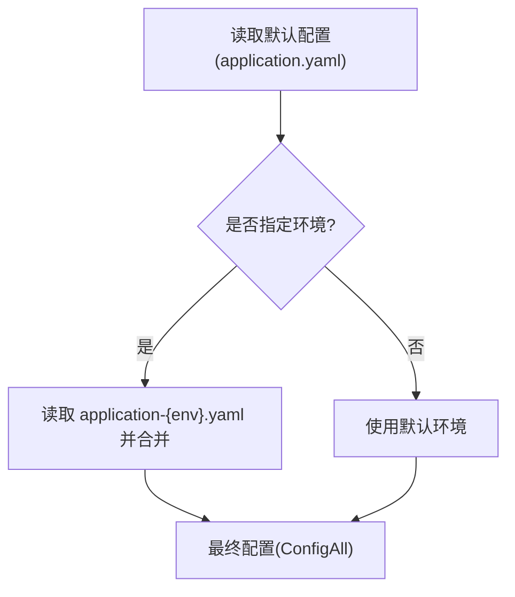
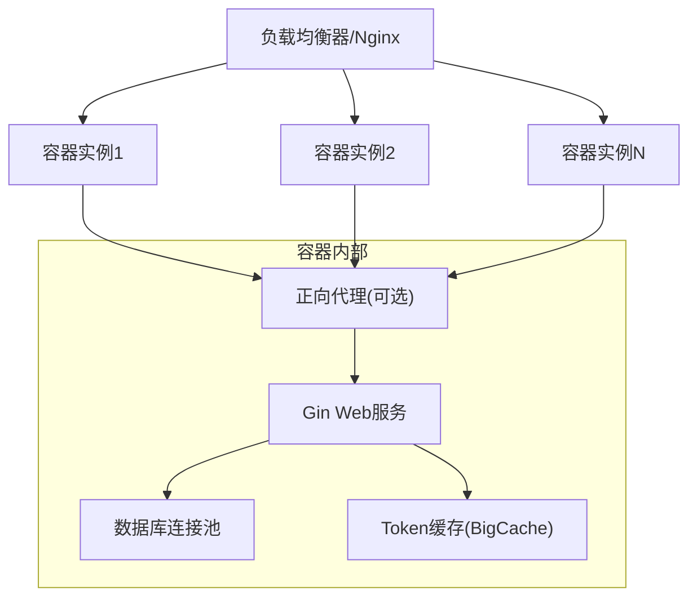
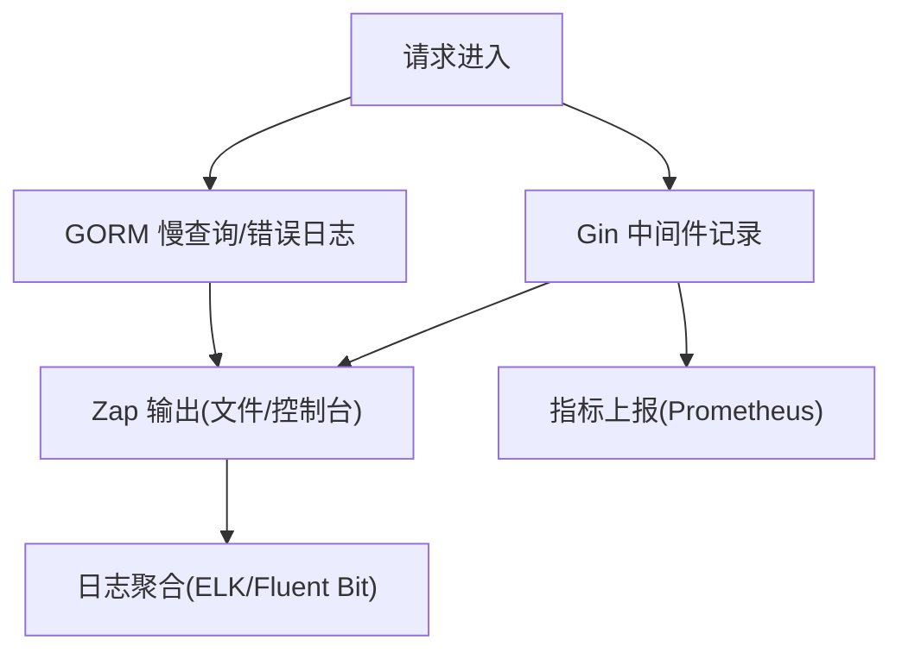
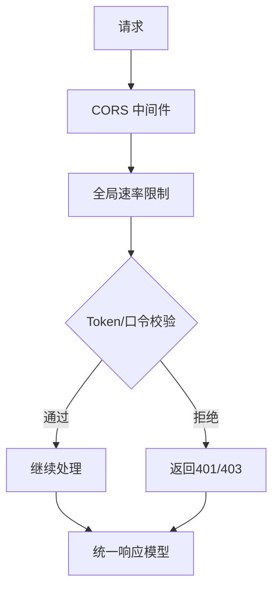
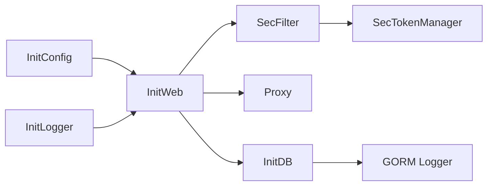

# 部署指南

<cite>
**本文引用的文件**   
- [Readme.md](file://Readme.md)
- [go.work](file://go.work)
- [fast_base/InitConfig.go](file://fast_base/InitConfig.go)
- [fast_base/InitLogger.go](file://fast_base/InitLogger.go)
- [fast_base/InitBase.go](file://fast_base/InitBase.go)
- [fast_web/InitWeb.go](file://fast_web/InitWeb.go)
- [fast_web/InitWebEx.go](file://fast_web/InitWebEx.go)
- [fast_web/SecFilter.go](file://fast_web/SecFilter.go)
- [fast_web/SecTokenManager.go](file://fast_web/SecTokenManager.go)
- [fast_web/web/proxy/Server.go](file://fast_web/web/proxy/Server.go)
- [fast_db/InitDB.go](file://fast_db/InitDB.go)
- [fast_db/InitBase.go](file://fast_db/InitBase.go)
- [fast_base/Model.go](file://fast_base/Model.go)
</cite>

## 目录
1. [简介](#简介)
2. [项目结构](#项目结构)
3. [核心组件](#核心组件)
4. [架构总览](#架构总览)
5. [详细组件分析](#详细组件分析)
6. [依赖关系分析](#依赖关系分析)
7. [性能考量](#性能考量)
8. [故障排除指南](#故障排除指南)
9. [结论](#结论)
10. [附录](#附录)

## 简介
本指南面向 Fast-Go 应用程序的完整部署，覆盖 Docker 容器化、镜像构建与运行、多环境配置策略（开发/测试/生产）、负载均衡与反向代理、高可用设计、监控与日志、性能观测、自动化流水线与安全加固。文档基于仓库现有代码与说明进行梳理，确保读者能按步骤完成从本地到生产的落地部署。

## 项目结构
Fast-Go 采用多模块工作区组织，核心模块包括基础能力、Web 服务、数据库、工具集与代码生成器。工作区通过 go.work 管理模块依赖，便于在容器内复用与构建。

图表来源
- [go.work:1-10](file://go.work#L1-L10)
- [fast_base/InitConfig.go:1-108](file://fast_base/InitConfig.go#L1-L108)
- [fast_base/InitLogger.go:1-147](file://fast_base/InitLogger.go#L1-L147)
- [fast_base/InitBase.go:1-50](file://fast_base/InitBase.go#L1-L50)
- [fast_web/InitWeb.go:1-367](file://fast_web/InitWeb.go#L1-L367)
- [fast_web/InitWebEx.go:1-318](file://fast_web/InitWebEx.go#L1-L318)
- [fast_web/SecFilter.go:1-130](file://fast_web/SecFilter.go#L1-L130)
- [fast_web/SecTokenManager.go:1-216](file://fast_web/SecTokenManager.go#L1-L216)
- [fast_web/web/proxy/Server.go:1-170](file://fast_web/web/proxy/Server.go#L1-L170)
- [fast_db/InitDB.go:1-238](file://fast_db/InitDB.go#L1-L238)
- [fast_db/InitBase.go:1-38](file://fast_db/InitBase.go#L1-L38)
- [fast_base/Model.go:1-116](file://fast_base/Model.go#L1-L116)

章节来源
- [go.work:1-10](file://go.work#L1-L10)

## 核心组件
- 配置加载与环境切换：通过 Viper 从多路径读取 YAML 配置，支持命令行参数、环境变量与配置文件合并；支持多环境 profile（如 docker/dev/test/prod）。
- 日志系统：基于 Zap + lumberjack，支持 JSON/控制台输出、按大小/数量/天数切割、彩色输出。
- Web 服务：基于 Gin，内置日志与异常中间件、CORS、静态资源与模板、优雅关闭、反向代理（可选）。
- 安全与限流：内置 Token 校验与缓存、密码口令限流、全局速率限制中间件。
- 数据库：基于 GORM，支持慢查询日志、连接池配置、雪花 ID 生成器。
- 统一返回模型：统一响应结构，便于前端与监控系统消费。

章节来源
- [fast_base/InitConfig.go:21-87](file://fast_base/InitConfig.go#L21-L87)
- [fast_base/InitLogger.go:15-110](file://fast_base/InitLogger.go#L15-L110)
- [fast_web/InitWeb.go:42-111](file://fast_web/InitWeb.go#L42-L111)
- [fast_web/SecFilter.go:11-100](file://fast_web/SecFilter.go#L11-L100)
- [fast_web/SecTokenManager.go:90-112](file://fast_web/SecTokenManager.go#L90-L112)
- [fast_db/InitDB.go:18-100](file://fast_db/InitDB.go#L18-L100)
- [fast_base/Model.go:82-116](file://fast_base/Model.go#L82-L116)

## 架构总览
下图展示应用启动与运行的关键路径：配置加载 → 日志初始化 → Web 服务启动 → 可选代理 → 数据库连接与池化 → 请求处理与安全中间件。

图表来源
- [fast_base/InitConfig.go:21-87](file://fast_base/InitConfig.go#L21-L87)
- [fast_base/InitLogger.go:15-110](file://fast_base/InitLogger.go#L15-L110)
- [fast_web/InitWeb.go:42-111](file://fast_web/InitWeb.go#L42-L111)
- [fast_web/SecFilter.go:11-100](file://fast_web/SecFilter.go#L11-L100)
- [fast_web/web/proxy/Server.go:30-73](file://fast_web/web/proxy/Server.go#L30-L73)
- [fast_db/InitDB.go:18-100](file://fast_db/InitDB.go#L18-L100)

## 详细组件分析

### Docker 容器化与镜像构建
- 基础镜像与编译阶段：使用多阶段构建，第一阶段使用 Go 官方镜像编译二进制，第二阶段使用 Debian 发行版运行时镜像，仅拷贝必要文件与配置。
- 端口暴露与运行命令：容器暴露指定端口并在 CMD 中传入环境参数（如 --env=docker），同时挂载外部目录（如文件/缓存）。
- 关键点：构建上下文需包含工作区与源码；运行时需映射端口与挂载卷；时区通过环境变量设置。

图表来源
- [Readme.md:27-65](file://Readme.md#L27-L65)

章节来源
- [Readme.md:25-65](file://Readme.md#L25-L65)

### 多环境配置策略
- 环境选择优先级：命令行参数 > 环境变量 > 配置文件中的默认 env 字段 > 默认值。
- 配置文件发现路径：当前目录、可执行文件所在目录、bin/conf 等多路径；支持 application.yaml 与 application-{env}.yaml 合并。
- 常见环境：
  - 开发(dev)：较低日志级别、开启调试、可启用代理。
  - 测试(test)：中等日志级别、连接测试数据库、适度限流。
  - 生产(prod)：严格日志级别、禁用调试、最小化暴露面、连接生产数据库。

图表来源
- [fast_base/InitConfig.go:21-87](file://fast_base/InitConfig.go#L21-L87)

章节来源
- [fast_base/InitConfig.go:13-87](file://fast_base/InitConfig.go#L13-L87)

### 负载均衡、反向代理与高可用
- 反向代理：Web 层可选启动正向代理服务，支持 HTTP/HTTPS，具备 TLS 证书生成能力；可用于内网穿透或上游转发。
- 高可用：建议在容器外层使用负载均衡器（如 Nginx/HAProxy/K8s Service）分发流量至多个容器实例；容器内监听健康端口，结合健康检查与优雅关闭。
- 限流与安全：内置全局速率限制与 Token 校验，配合 CORS 与异常中间件提升稳定性与安全性。

图表来源
- [fast_web/web/proxy/Server.go:30-73](file://fast_web/web/proxy/Server.go#L30-L73)
- [fast_web/InitWeb.go:340-367](file://fast_web/InitWeb.go#L340-L367)
- [fast_web/SecFilter.go:11-100](file://fast_web/SecFilter.go#L11-L100)
- [fast_web/SecTokenManager.go:90-112](file://fast_web/SecTokenManager.go#L90-L112)

章节来源
- [fast_web/web/proxy/Server.go:1-170](file://fast_web/web/proxy/Server.go#L1-L170)
- [fast_web/InitWeb.go:340-367](file://fast_web/InitWeb.go#L340-L367)
- [fast_web/SecFilter.go:11-100](file://fast_web/SecFilter.go#L11-L100)
- [fast_web/SecTokenManager.go:90-112](file://fast_web/SecTokenManager.go#L90-L112)

### 监控指标、日志聚合与性能观测
- 日志：Zap 输出到控制台与文件，支持 JSON/文本格式、按大小/数量/天数切割、彩色输出；日志级别与格式可配置。
- 性能观测：Gin 中间件记录请求耗时、状态码、客户端 IP、路径等；GORM 自定义日志器将慢查询与错误输出到 Zap。
- 建议：接入集中式日志系统（如 ELK/Fluent Bit/Loki）与指标系统（如 Prometheus + Grafana），采集应用日志与指标，设置告警阈值。

图表来源
- [fast_web/InitWebEx.go:51-146](file://fast_web/InitWebEx.go#L51-L146)
- [fast_db/InitDB.go:109-225](file://fast_db/InitDB.go#L109-L225)
- [fast_base/InitLogger.go:15-110](file://fast_base/InitLogger.go#L15-L110)

章节来源
- [fast_web/InitWebEx.go:51-146](file://fast_web/InitWebEx.go#L51-L146)
- [fast_db/InitDB.go:109-225](file://fast_db/InitDB.go#L109-L225)
- [fast_base/InitLogger.go:15-110](file://fast_base/InitLogger.go#L15-L110)

### 安全加固与合规
- 认证与授权：Token 管理器基于 BigCache 实现，支持 AccessToken/RefreshToken，定时刷盘持久化，过期自动清理。
- 限流与防护：全局速率限制、按路径前缀的密码口令校验、CORS 放通策略、异常中间件捕获 Panic 并记录堆栈。
- 配置安全：敏感信息通过环境变量注入，避免硬编码；生产环境禁用调试输出，最小化暴露面。
- 合规建议：启用 HTTPS、定期轮换密钥与证书、审计日志、最小权限原则、输入校验与参数绑定。

图表来源
- [fast_web/SecFilter.go:11-100](file://fast_web/SecFilter.go#L11-L100)
- [fast_web/SecTokenManager.go:90-112](file://fast_web/SecTokenManager.go#L90-L112)
- [fast_base/Model.go:82-116](file://fast_base/Model.go#L82-L116)

章节来源
- [fast_web/SecFilter.go:11-100](file://fast_web/SecFilter.go#L11-L100)
- [fast_web/SecTokenManager.go:90-112](file://fast_web/SecTokenManager.go#L90-L112)
- [fast_base/Model.go:82-116](file://fast_base/Model.go#L82-L116)

### 自动化部署流水线与 CI/CD 集成
- 构建：在 CI 中执行多阶段构建，缓存 Go 模块，产出精简运行时镜像。
- 测试：在构建后执行单元测试与集成测试，确保配置与依赖正确。
- 打包：将镜像推送到镜像仓库，附带语义化标签（如版本/分支/提交哈希）。
- 部署：在目标环境拉起容器，挂载配置与持久化卷，配置健康检查与优雅关闭。
- 回滚：支持蓝绿/金丝雀发布，失败自动回滚。

（本节为通用实践说明，不直接分析具体文件）

## 依赖关系分析
- 模块耦合：Web 层依赖基础层（配置/日志/模型），数据库层依赖基础层（日志级别映射），安全中间件与 Token 管理器贯穿 Web 层。
- 外部依赖：Gin、Viper、Zap、lumberjack、GORM、BigCache、time/rate 等。
- 配置依赖：Web 与 DB 的行为受配置项控制（主机、端口、日志级别、连接池、慢查询阈值等）。

图表来源
- [fast_base/InitConfig.go:21-87](file://fast_base/InitConfig.go#L21-L87)
- [fast_base/InitLogger.go:15-110](file://fast_base/InitLogger.go#L15-L110)
- [fast_web/InitWeb.go:42-111](file://fast_web/InitWeb.go#L42-L111)
- [fast_web/SecFilter.go:11-100](file://fast_web/SecFilter.go#L11-L100)
- [fast_web/web/proxy/Server.go:30-73](file://fast_web/web/proxy/Server.go#L30-L73)
- [fast_db/InitDB.go:18-100](file://fast_db/InitDB.go#L18-L100)
- [fast_web/SecTokenManager.go:90-112](file://fast_web/SecTokenManager.go#L90-L112)

章节来源
- [fast_web/InitWeb.go:42-111](file://fast_web/InitWeb.go#L42-L111)
- [fast_db/InitDB.go:18-100](file://fast_db/InitDB.go#L18-L100)

## 性能考量
- 连接池：合理设置最大打开/空闲连接数与生命周期，避免数据库连接抖动。
- 日志：生产环境降低日志级别与输出频率，避免 IO 放大；启用 JSON 便于结构化采集。
- 中间件：仅在必要路径启用限流与校验，减少链路开销。
- 缓存：Token 缓存持久化与定时刷盘，平衡一致性与性能。
- 代理：仅在需要时启用正向代理，避免额外网络跳数。

（本节提供通用指导，不直接分析具体文件）

## 故障排除指南
- 启动失败：检查配置文件路径与权限、端口占用、时区设置；确认环境参数与配置合并顺序。
- 日志异常：确认日志路径存在且可写、切割参数合理、编码格式匹配。
- 数据库连接：核对 DNS、账号密码、网络连通性、连接池参数；关注慢查询日志。
- 代理不可用：确认代理端口配置、TLS 证书生成与权限、上游可达性。
- 安全拦截：核对 Token/口令校验规则、CORS 放通范围、异常中间件是否生效。

章节来源
- [fast_base/InitConfig.go:52-87](file://fast_base/InitConfig.go#L52-L87)
- [fast_base/InitLogger.go:78-110](file://fast_base/InitLogger.go#L78-L110)
- [fast_db/InitDB.go:18-100](file://fast_db/InitDB.go#L18-L100)
- [fast_web/web/proxy/Server.go:30-73](file://fast_web/web/proxy/Server.go#L30-L73)
- [fast_web/SecFilter.go:11-100](file://fast_web/SecFilter.go#L11-L100)

## 结论
通过多阶段 Docker 构建、灵活的多环境配置、完善的日志与数据库连接池、以及可选的反向代理与安全中间件，Fast-Go 能够在开发、测试与生产环境中稳定运行。建议结合负载均衡与集中式监控体系，持续优化性能与可观测性，并落实安全加固与合规要求。

## 附录
- 常用命令与参数
  - 构建镜像：在 CI 中执行多阶段构建，缓存模块。
  - 运行容器：映射端口与挂载卷，设置环境参数与时区。
  - 健康检查：暴露健康端点，结合容器编排平台进行探活。
- 配置清单
  - server.host/port/logLevel/static/template/session/upload 等。
  - dataSource.enable/host/port/database/username/password/params/maxOpenConns/maxIdleConns 等。
  - log.level/format/path/filename/fileMaxSize/fileMaxBackups/maxAge/compress/stdout/color 等。
  - ProxyPort/ProxyUseSSL 等代理相关。

章节来源
- [fast_web/InitBase.go:7-39](file://fast_web/InitBase.go#L7-L39)
- [fast_db/InitBase.go:9-38](file://fast_db/InitBase.go#L9-L38)
- [fast_base/InitBase.go:16-40](file://fast_base/InitBase.go#L16-L40)
- [fast_web/web/proxy/Server.go:34-48](file://fast_web/web/proxy/Server.go#L34-L48)