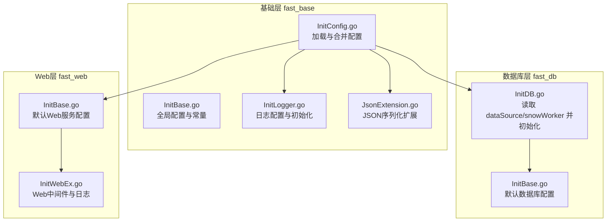
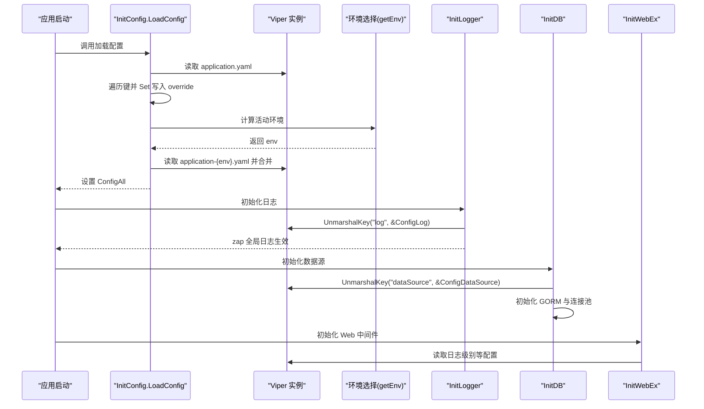
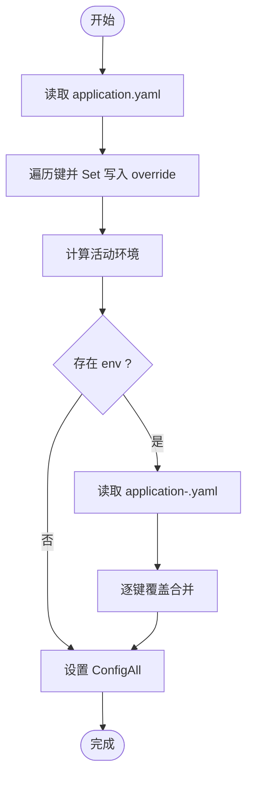
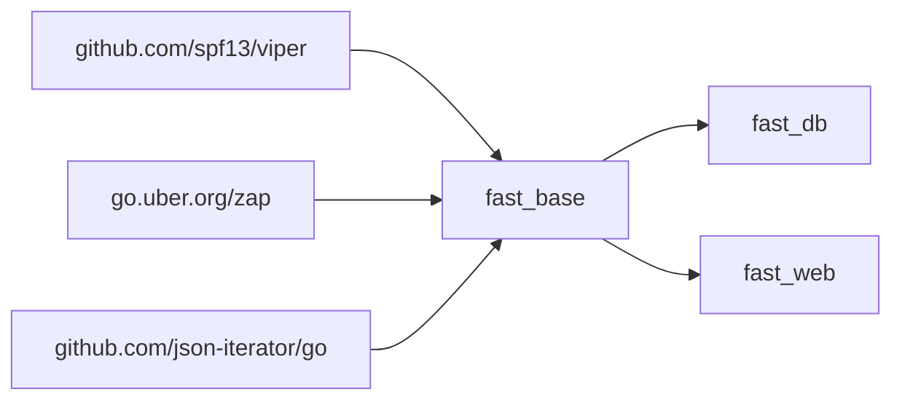

# 配置管理

<cite>
**本文引用的文件**
- [fast_base/InitConfig.go](file://fast_base/InitConfig.go)
- [fast_base/InitBase.go](file://fast_base/InitBase.go)
- [fast_base/InitLogger.go](file://fast_base/InitLogger.go)
- [fast_base/JsonExtension.go](file://fast_base/JsonExtension.go)
- [fast_db/InitBase.go](file://fast_db/InitBase.go)
- [fast_db/InitDB.go](file://fast_db/InitDB.go)
- [fast_web/InitBase.go](file://fast_web/InitBase.go)
- [fast_web/InitWebEx.go](file://fast_web/InitWebEx.go)
- [fast_base/go.mod](file://fast_base/go.mod)
- [fast_db/go.mod](file://fast_db/go.mod)
- [fast_web/go.mod](file://fast_web/go.mod)
- [Readme.md](file://Readme.md)
</cite>

## 目录
1. [简介](#简介)
2. [项目结构](#项目结构)
3. [核心组件](#核心组件)
4. [架构总览](#架构总览)
5. [组件详解](#组件详解)
6. [依赖关系分析](#依赖关系分析)
7. [性能考量](#性能考量)
8. [故障排查指南](#故障排查指南)
9. [结论](#结论)
10. [附录](#附录)

## 简介
本文件系统性阐述 Fast-Go 的配置管理系统，重点覆盖：
- 多环境配置支持与优先级规则
- 动态配置加载与环境变量覆盖机制
- Viper 配置系统在项目中的使用与扩展
- 不同部署环境（开发、测试、生产、容器）的配置策略
- 配置热更新、配置验证与安全注意事项
- 配置文件格式（YAML/JSON/ENV）的使用与最佳实践
- 完整配置示例与常见场景解决方案

## 项目结构
Fast-Go 将配置管理集中在基础模块 fast_base 中，其他模块（如 fast_db、fast_web）按需读取配置并应用到各自子系统。

图表来源
- [fast_base/InitConfig.go:21-50](file://fast_base/InitConfig.go#L21-L50)
- [fast_base/InitLogger.go:15-44](file://fast_base/InitLogger.go#L15-L44)
- [fast_base/JsonExtension.go:24-26](file://fast_base/JsonExtension.go#L24-L26)
- [fast_db/InitDB.go:19-23](file://fast_db/InitDB.go#L19-L23)
- [fast_db/InitBase.go:9-13](file://fast_db/InitBase.go#L9-L13)
- [fast_web/InitBase.go:7-14](file://fast_web/InitBase.go#L7-L14)
- [fast_web/InitWebEx.go:55-109](file://fast_web/InitWebEx.go#L55-L109)

章节来源
- [fast_base/InitConfig.go:21-50](file://fast_base/InitConfig.go#L21-L50)
- [fast_base/InitBase.go:13-21](file://fast_base/InitBase.go#L13-L21)
- [fast_db/InitDB.go:19-23](file://fast_db/InitDB.go#L19-L23)
- [fast_web/InitBase.go:7-14](file://fast_web/InitBase.go#L7-L14)

## 核心组件
- 配置加载与合并：统一入口加载 application.yaml 及 application-{env}.yaml，按优先级合并，形成最终 ConfigAll。
- 环境选择：命令行参数 > 环境变量 > 配置文件键值 > 默认值。
- 日志配置：从 ConfigAll 解析 log 节点，结合 zap 初始化日志系统。
- JSON 扩展：注册 jsoniter 扩展，增强 int64 字符串化、容错反序列化等能力。
- 数据库配置：从 ConfigAll 解析 dataSource 与 snowWorker，驱动 GORM 初始化连接池与日志。
- Web 服务配置：默认 ServerConfig，结合静态资源、会话、上传目录等。

章节来源
- [fast_base/InitConfig.go:21-50](file://fast_base/InitConfig.go#L21-L50)
- [fast_base/InitBase.go:13-21](file://fast_base/InitBase.go#L13-L21)
- [fast_base/InitLogger.go:15-44](file://fast_base/InitLogger.go#L15-L44)
- [fast_base/JsonExtension.go:24-26](file://fast_base/JsonExtension.go#L24-L26)
- [fast_db/InitDB.go:19-23](file://fast_db/InitDB.go#L19-L23)
- [fast_web/InitBase.go:7-14](file://fast_web/InitBase.go#L7-L14)

## 架构总览
下图展示配置从加载到各模块消费的关键流程。

图表来源
- [fast_base/InitConfig.go:21-50](file://fast_base/InitConfig.go#L21-L50)
- [fast_base/InitLogger.go:15-44](file://fast_base/InitLogger.go#L15-L44)
- [fast_db/InitDB.go:19-23](file://fast_db/InitDB.go#L19-L23)
- [fast_web/InitWebEx.go:55-109](file://fast_web/InitWebEx.go#L55-L109)

## 组件详解

### 配置加载与多环境合并
- 配置文件定位：优先从 ./conf、根目录、可执行文件所在目录、bin/conf 等路径查找 YAML。
- 合并策略：先加载 application.yaml，遍历所有键并显式 Set 写入 override，再加载 application-{env}.yaml 并逐键覆盖，最终形成 ConfigAll。
- 环境选择顺序：命令行参数 -env > 环境变量 GO_ENV > 配置文件键 env > 默认值。

图表来源
- [fast_base/InitConfig.go:21-50](file://fast_base/InitConfig.go#L21-L50)
- [fast_base/InitConfig.go:65-87](file://fast_base/InitConfig.go#L65-L87)

章节来源
- [fast_base/InitConfig.go:21-50](file://fast_base/InitConfig.go#L21-L50)
- [fast_base/InitConfig.go:52-63](file://fast_base/InitConfig.go#L52-L63)
- [fast_base/InitConfig.go:65-87](file://fast_base/InitConfig.go#L65-L87)

### 环境变量覆盖与优先级
- Viper 多数据源优先级（同键冲突时）：显式 Set > 命令行 flag > 环境变量 > 配置文件 > K/V 存储 > 默认值。
- 在 Fast-Go 中，通过显式 Set 将 application.yaml 的键提升到 override 层，确保 application-{env}.yaml 的合并行为符合预期。

章节来源
- [fast_base/InitConfig.go:13-19](file://fast_base/InitConfig.go#L13-L19)
- [fast_base/InitConfig.go:26-31](file://fast_base/InitConfig.go#L26-L31)

### 日志配置与初始化
- 从 ConfigAll 解析 log 节点到 ConfigLog 结构体。
- 基于配置选择 JSON 或 Console 编码器，配置文件切割与控制台输出。
- 使用 zap.ReplaceGlobals 替换全局日志实例，便于全局调用。

章节来源
- [fast_base/InitLogger.go:15-44](file://fast_base/InitLogger.go#L15-L44)
- [fast_base/InitLogger.go:46-76](file://fast_base/InitLogger.go#L46-L76)
- [fast_base/InitLogger.go:78-110](file://fast_base/InitLogger.go#L78-L110)
- [fast_base/InitBase.go:16-33](file://fast_base/InitBase.go#L16-L33)

### JSON 序列化扩展
- 注册 jsoniter 扩展，实现：
  - int64 序列化为字符串，避免前端 JS 精度丢失
  - 宽松反序列化：字符串与数字互转、空数组作为对象等
- 通过结构体标签可启用字典映射与 SQL 查询映射字段增强。

章节来源
- [fast_base/JsonExtension.go:24-26](file://fast_base/JsonExtension.go#L24-L26)
- [fast_base/JsonExtension.go:110-122](file://fast_base/JsonExtension.go#L110-L122)
- [fast_base/JsonExtension.go:124-204](file://fast_base/JsonExtension.go#L124-L204)
- [fast_base/JsonExtension.go:206-274](file://fast_base/JsonExtension.go#L206-L274)

### 数据库配置与 GORM 初始化
- 从 ConfigAll 解析 dataSource 与 snowWorker，构造 DNS 并初始化 GORM。
- 支持慢查询阈值、日志级别、连接池参数等配置项。
- 通过自定义 logger 集成 zap 日志。

章节来源
- [fast_db/InitDB.go:19-23](file://fast_db/InitDB.go#L19-L23)
- [fast_db/InitDB.go:42-58](file://fast_db/InitDB.go#L42-L58)
- [fast_db/InitDB.go:66-76](file://fast_db/InitDB.go#L66-L76)
- [fast_db/InitBase.go:9-29](file://fast_db/InitBase.go#L9-L29)

### Web 服务配置与中间件
- 默认 ServerConfig 包含 host、port、静态资源、会话、上传目录、日志级别等。
- Web 中间件按日志级别动态过滤输出，结合 ConfigLog 的颜色与格式配置。

章节来源
- [fast_web/InitBase.go:7-25](file://fast_web/InitBase.go#L7-L25)
- [fast_web/InitWebEx.go:55-109](file://fast_web/InitWebEx.go#L55-L109)

### 配置文件格式与最佳实践
- 文件格式：YAML（.yaml/.yml），默认读取 application.yaml 与 application-{env}.yaml。
- 路径优先级：./conf > 根目录 > 可执行文件目录 > bin/conf。
- 环境变量：GO_ENV 与命令行 -env 优先覆盖配置文件中的 env 键。
- JSON/ENV：可通过环境变量覆盖具体键值，适合容器化部署。

章节来源
- [fast_base/InitConfig.go:52-63](file://fast_base/InitConfig.go#L52-L63)
- [fast_base/InitConfig.go:65-87](file://fast_base/InitConfig.go#L65-L87)
- [Readme.md:59-60](file://Readme.md#L59-L60)

## 依赖关系分析
- fast_base 依赖 viper、zap、json-iterator 等，负责配置加载、日志与 JSON 扩展。
- fast_db 依赖 fast_base 的 ConfigAll，解析 dataSource 与 snowWorker。
- fast_web 依赖 fast_base 的日志与全局配置，解析 ServerConfig 并集成中间件。

图表来源
- [fast_base/go.mod:5-11](file://fast_base/go.mod#L5-L11)
- [fast_db/go.mod:5-11](file://fast_db/go.mod#L5-L11)
- [fast_web/go.mod:5-15](file://fast_web/go.mod#L5-L15)

章节来源
- [fast_base/go.mod:5-11](file://fast_base/go.mod#L5-L11)
- [fast_db/go.mod:5-11](file://fast_db/go.mod#L5-L11)
- [fast_web/go.mod:5-15](file://fast_web/go.mod#L5-L15)

## 性能考量
- 配置加载仅在启动阶段执行一次，避免重复 IO。
- 合并前对 application.yaml 的键进行显式 Set，减少后续合并复杂度。
- 日志编码器与写入器在初始化时一次性构建，运行期仅做级别判断与写入。
- GORM 连接池参数与慢查询阈值通过配置集中管理，便于按环境调优。

## 故障排查指南
- 配置未生效
  - 检查配置文件路径是否在搜索路径内（./conf、根目录、可执行文件目录、bin/conf）。
  - 确认环境变量 GO_ENV 或命令行 -env 是否正确传递。
  - 核对 application-{env}.yaml 的键名与类型是否与 ConfigAll.UnmarshalKey 的目标结构一致。
- 日志异常
  - 检查 log 节点配置（路径、文件名、级别、格式、颜色）。
  - 确认日志目录可写且切割参数合理。
- 数据库连接失败
  - 核对 dataSource 的 DNS 组装与连接参数。
  - 检查连接池参数与慢查询阈值设置。
- JSON 反序列化报错
  - 使用 jsoniter 宽松模式，确认输入数据类型与期望类型匹配。
  - 对于 int/string/float 的混合输入，确保字段具备容错解码能力。

章节来源
- [fast_base/InitConfig.go:52-63](file://fast_base/InitConfig.go#L52-L63)
- [fast_base/InitLogger.go:78-110](file://fast_base/InitLogger.go#L78-L110)
- [fast_db/InitDB.go:36-58](file://fast_db/InitDB.go#L36-L58)
- [fast_base/JsonExtension.go:124-204](file://fast_base/JsonExtension.go#L124-L204)

## 结论
Fast-Go 的配置体系以 Viper 为核心，结合显式 Set 与多环境合并策略，实现了清晰的优先级与可维护性。配合 jsoniter 扩展与 zap 日志，满足生产级的可观测性与兼容性需求。通过合理的环境变量覆盖与容器化参数注入，可在不同部署环境中灵活切换配置。

## 附录

### 不同环境的配置策略
- 开发环境（dev）
  - 使用 application-dev.yaml 覆盖开发专用端口、日志级别、数据库连接等。
  - 建议开启详细日志与调试输出。
- 测试环境（test）
  - 使用 application-test.yaml，隔离数据库与缓存，缩短超时与重试。
- 生产环境（prod）
  - 使用 application-prod.yaml，最小化日志输出，严格连接池与慢查询阈值。
- 容器环境（docker）
  - 通过命令行参数 -env=docker 或环境变量 GO_ENV=prod 注入环境。
  - 使用 -v 挂载配置目录，或通过环境变量覆盖敏感键。

章节来源
- [fast_base/InitConfig.go:33-43](file://fast_base/InitConfig.go#L33-L43)
- [fast_base/InitConfig.go:65-87](file://fast_base/InitConfig.go#L65-L87)
- [Readme.md:59-60](file://Readme.md#L59-L60)

### 配置热更新建议
- 当前实现为启动时一次性加载，若需热更新，建议引入外部配置中心（如 etcd）并监听变更事件，结合 viper 的 Watch 功能实现增量刷新。
- 对于日志与数据库等已初始化组件，需设计优雅降级与重建流程，避免中断业务。

### 配置验证与安全
- 验证：在加载后对关键键（如 dataSource.DNS、log.path）进行存在性与可达性检查。
- 安全：敏感信息（密码、密钥）建议通过环境变量注入；避免将明文写入仓库；使用只读挂载配置卷。

### 配置示例与常见场景
- 示例：application.yaml
  - 包含 log、env、dataSource、snowWorker、server 等节点。
- 场景 A：本地开发
  - application-dev.yaml 覆盖 dataSource 与 server 端口，日志级别 debug。
- 场景 B：容器部署
  - 通过 -env=docker 选择 application-docker.yaml，使用环境变量覆盖数据库凭据。
- 场景 C：灰度发布
  - 新增 application-canary.yaml，按百分比流量切换。

章节来源
- [fast_base/InitBase.go:16-21](file://fast_base/InitBase.go#L16-L21)
- [fast_db/InitBase.go:9-29](file://fast_db/InitBase.go#L9-L29)
- [fast_web/InitBase.go:7-14](file://fast_web/InitBase.go#L7-L14)
- [Readme.md:59-60](file://Readme.md#L59-L60)