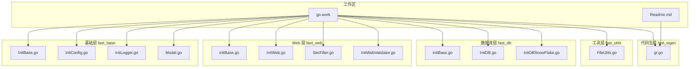
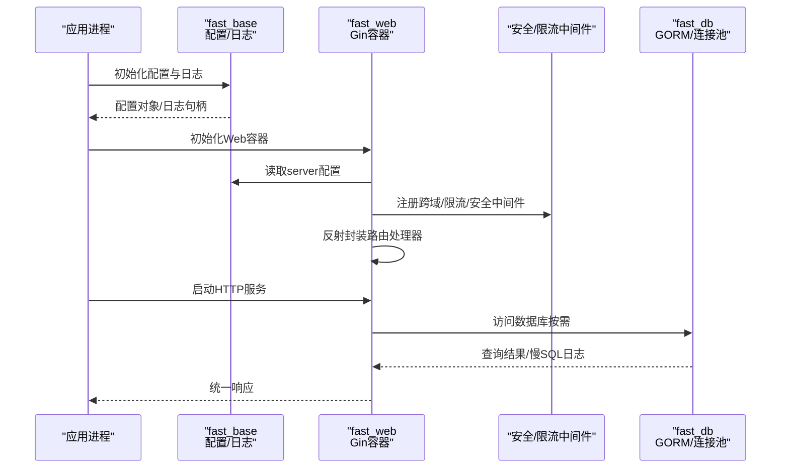
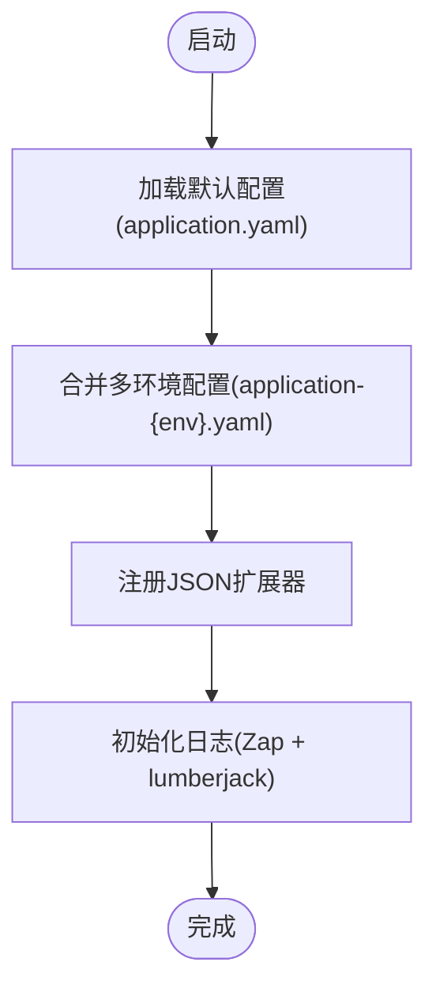
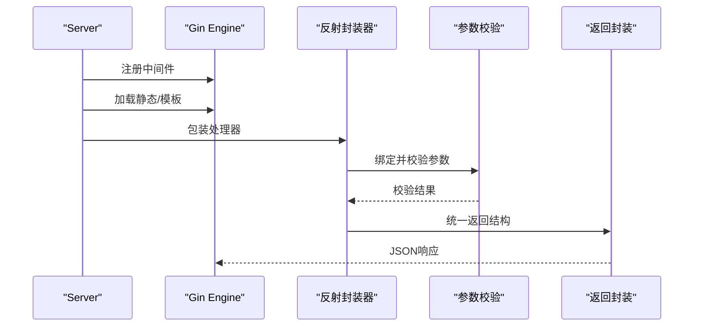
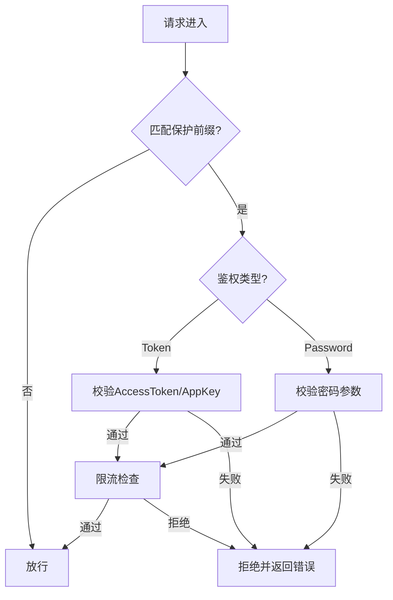
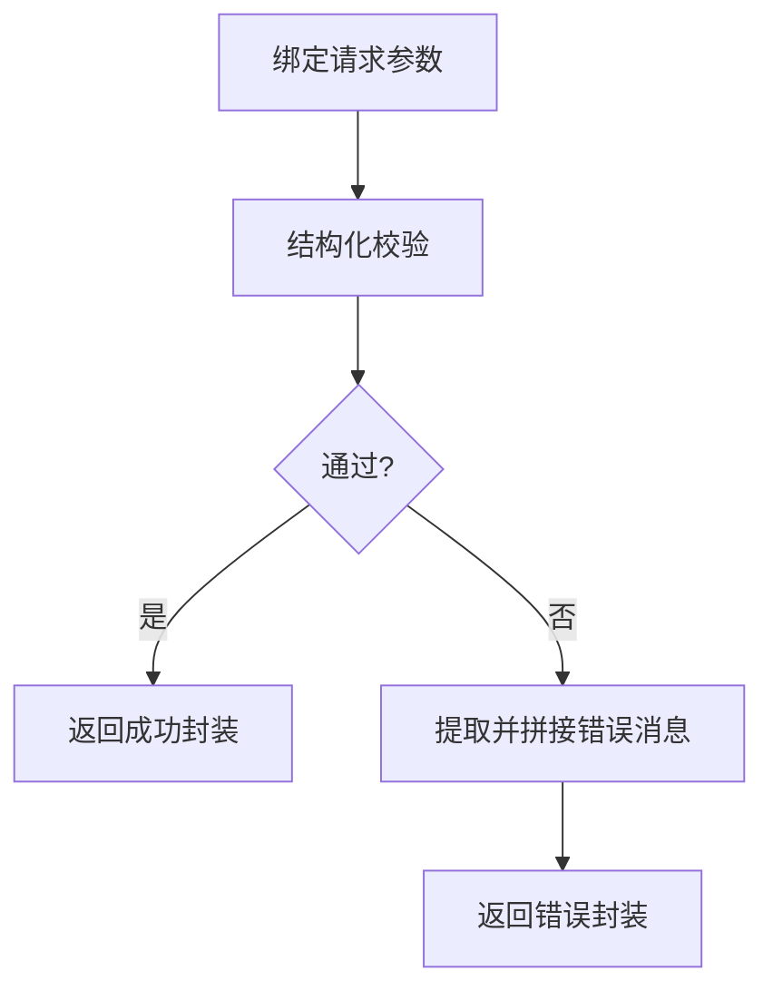
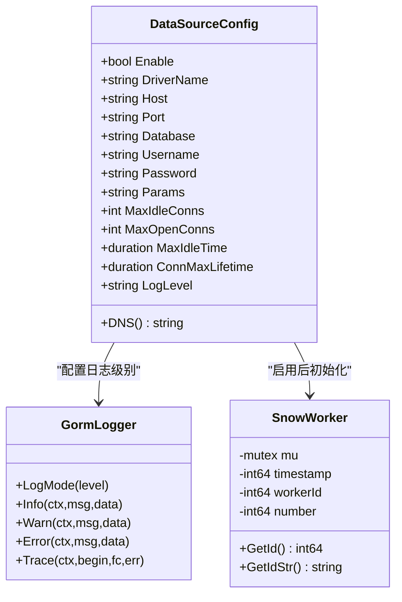
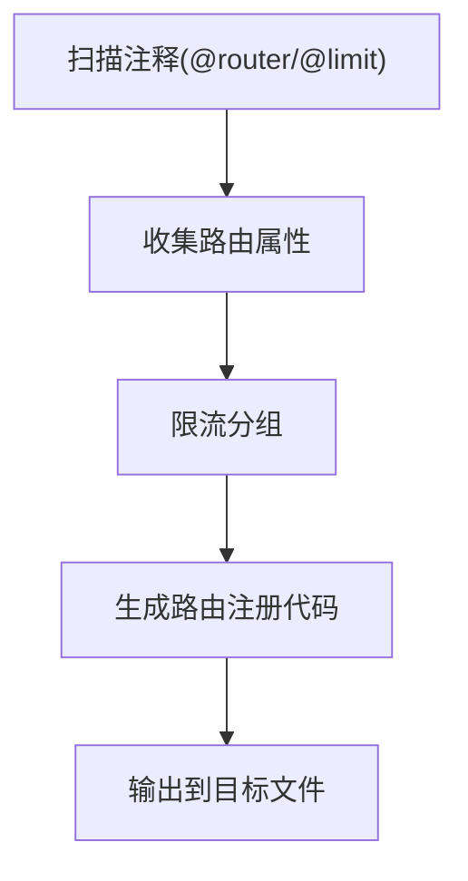
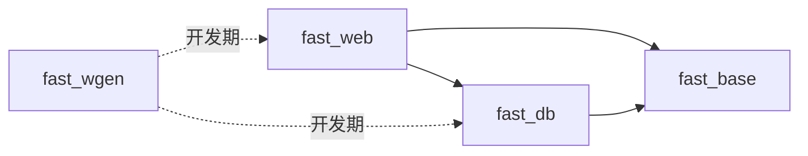

# 项目概述

<cite>
**本文引用的文件**
- [Readme.md](file://Readme.md)
- [go.work](file://go.work)
- [fast_base/InitBase.go](file://fast_base/InitBase.go)
- [fast_base/InitConfig.go](file://fast_base/InitConfig.go)
- [fast_base/InitLogger.go](file://fast_base/InitLogger.go)
- [fast_base/Model.go](file://fast_base/Model.go)
- [fast_web/InitBase.go](file://fast_web/InitBase.go)
- [fast_web/InitWeb.go](file://fast_web/InitWeb.go)
- [fast_web/SecFilter.go](file://fast_web/SecFilter.go)
- [fast_web/InitWebValidator.go](file://fast_web/InitWebValidator.go)
- [fast_db/InitBase.go](file://fast_db/InitBase.go)
- [fast_db/InitDB.go](file://fast_db/InitDB.go)
- [fast_db/InitDBSnowFlake.go](file://fast_db/InitDBSnowFlake.go)
- [fast_utils/FileUtils.go](file://fast_utils/FileUtils.go)
- [fast_wgen/gr.go](file://fast_wgen/gr.go)
</cite>

## 目录
1. [引言](#引言)
2. [项目结构](#项目结构)
3. [核心组件](#核心组件)
4. [架构总览](#架构总览)
5. [详细组件分析](#详细组件分析)
6. [依赖分析](#依赖分析)
7. [性能考虑](#性能考虑)
8. [故障排查指南](#故障排查指南)
9. [结论](#结论)
10. [附录](#附录)

## 引言
Fast-Go 是一个面向企业级的 Go 微服务开发框架，旨在通过模块化设计与约定式开发，显著降低微服务构建成本。它围绕 Gin Web 框架、Viper 配置管理、Zap 日志系统、GORM ORM 等成熟生态展开，提供自动路由生成、统一返回模型、参数校验与国际化、安全过滤与限流、数据库连接池与雪花 ID 等能力，帮助团队快速搭建稳定、可观测、易维护的微服务应用。

本项目在企业级应用场景中具备良好适配性：支持多环境配置、容器化部署、Swagger 文档生成、跨域与安全中间件、数据库迁移与慢查询日志等，满足从开发到生产的全流程需求。

## 项目结构
项目采用多模块工作区组织，按职责划分为基础能力层、Web 层、数据库层、工具层与代码生成器层，形成清晰的分层与解耦：

- 工作区与根配置
  - 工作区文件定义了多模块聚合与依赖范围
  - 根目录 Readme 提供了构建、运行与打包的指引

- 模块划分
  - fast_base：全局配置、日志、统一返回模型、执行路径等基础设施
  - fast_web：Web 服务容器、路由加载、参数解析与校验、安全过滤、限流、跨域等
  - fast_db：数据源配置、GORM 初始化、连接池、慢查询日志桥接、雪花 ID
  - fast_utils：通用工具（文件、时间、加密等）
  - fast_wgen：基于注释的路由代码生成器（结合 swag）

图表来源
- [go.work](file://go.work)
- [Readme.md](file://Readme.md)
- [fast_base/InitBase.go](file://fast_base/InitBase.go)
- [fast_base/InitConfig.go](file://fast_base/InitConfig.go)
- [fast_base/InitLogger.go](file://fast_base/InitLogger.go)
- [fast_base/Model.go](file://fast_base/Model.go)
- [fast_web/InitBase.go](file://fast_web/InitBase.go)
- [fast_web/InitWeb.go](file://fast_web/InitWeb.go)
- [fast_web/SecFilter.go](file://fast_web/SecFilter.go)
- [fast_web/InitWebValidator.go](file://fast_web/InitWebValidator.go)
- [fast_db/InitBase.go](file://fast_db/InitBase.go)
- [fast_db/InitDB.go](file://fast_db/InitDB.go)
- [fast_db/InitDBSnowFlake.go](file://fast_db/InitDBSnowFlake.go)
- [fast_utils/FileUtils.go](file://fast_utils/FileUtils.go)
- [fast_wgen/gr.go](file://fast_wgen/gr.go)

章节来源
- [Readme.md:1-67](file://Readme.md#L1-L67)
- [go.work](file://go.work)

## 核心组件
- 配置中心（Viper）
  - 支持多数据源优先级：命令行 > 环境变量 > 配置文件 > 默认值
  - 自动加载 application(.yaml) 与多环境 application-{env}.yaml
  - 提供执行路径解析与 YAML 配置路径搜索

- 日志系统（Zap + lumberjack）
  - 支持 JSON/Console 输出、彩色控制台、文件切割、保留策略
  - 与 Gin 错误输出联动，统一日志级别映射

- Web 容器（Gin）
  - 中间件：日志、恢复、跨域、限流、安全过滤
  - 路由加载：反射封装统一参数绑定、校验与返回
  - 静态资源与模板加载

- 参数校验（validator v10 + 国际化）
  - 支持结构体标签、自定义校验器与中文翻译
  - 返回统一错误消息格式

- 数据库（GORM + MySQL）
  - 连接池配置、慢查询日志桥接到 Zap
  - 数据库迁移、命名策略、雪花 ID 生成

- 代码生成（fast_wgen + swag）
  - 基于注释扫描生成路由注册代码，支持限流中间件注入

章节来源
- [fast_base/InitConfig.go:21-108](file://fast_base/InitConfig.go#L21-L108)
- [fast_base/InitLogger.go:15-147](file://fast_base/InitLogger.go#L15-L147)
- [fast_web/InitWeb.go:42-111](file://fast_web/InitWeb.go#L42-L111)
- [fast_web/InitWebValidator.go:67-88](file://fast_web/InitWebValidator.go#L67-L88)
- [fast_db/InitDB.go:18-100](file://fast_db/InitDB.go#L18-L100)
- [fast_wgen/gr.go:50-135](file://fast_wgen/gr.go#L50-L135)

## 架构总览
下图展示了从应用启动到请求处理的关键流程，以及各模块之间的交互关系。

图表来源
- [fast_base/InitConfig.go:21-50](file://fast_base/InitConfig.go#L21-L50)
- [fast_base/InitLogger.go:15-44](file://fast_base/InitLogger.go#L15-L44)
- [fast_web/InitWeb.go:49-111](file://fast_web/InitWeb.go#L49-L111)
- [fast_web/SecFilter.go:11-16](file://fast_web/SecFilter.go#L11-L16)
- [fast_db/InitDB.go:18-64](file://fast_db/InitDB.go#L18-L64)

## 详细组件分析

### 配置与日志子系统
- 配置加载
  - 多数据源优先级与环境选择逻辑
  - YAML 配置路径搜索与合并
- 日志系统
  - 编码器选择（JSON/Console）、文件切割与保留
  - 与 Gin 错误输出联动、调用方追踪

图表来源
- [fast_base/InitConfig.go:21-50](file://fast_base/InitConfig.go#L21-L50)
- [fast_base/InitLogger.go:15-44](file://fast_base/InitLogger.go#L15-L44)

章节来源
- [fast_base/InitConfig.go:21-108](file://fast_base/InitConfig.go#L21-L108)
- [fast_base/InitLogger.go:15-147](file://fast_base/InitLogger.go#L15-L147)

### Web 容器与路由处理
- 容器初始化
  - 读取 server 配置、设置 Gin Writer/ErrorWriter
  - 注册中间件：日志、恢复、跨域、静态资源、模板
- 路由加载
  - 反射扫描方法，自动推导 HTTP 方法与路径
  - 统一封装处理器：参数绑定、校验、返回统一结构
- 服务运行
  - 支持普通启动与服务模式，优雅关闭与代理启动

图表来源
- [fast_web/InitWeb.go:49-111](file://fast_web/InitWeb.go#L49-L111)
- [fast_web/InitWeb.go:186-338](file://fast_web/InitWeb.go#L186-L338)

章节来源
- [fast_web/InitBase.go:7-46](file://fast_web/InitBase.go#L7-L46)
- [fast_web/InitWeb.go:42-111](file://fast_web/InitWeb.go#L42-L111)
- [fast_web/InitWeb.go:186-338](file://fast_web/InitWeb.go#L186-L338)

### 安全与限流
- 限流中间件
  - 基于令牌桶的全局限流，可按前缀区分限流范围
- Token/密码保护
  - 支持基于 AppKey/AccessToken 的鉴权与白名单
- 跨域中间件
  - 标准 CORS 头部与预检处理

图表来源
- [fast_web/SecFilter.go:11-16](file://fast_web/SecFilter.go#L11-L16)
- [fast_web/SecFilter.go:39-81](file://fast_web/SecFilter.go#L39-L81)
- [fast_web/SecFilter.go:115-130](file://fast_web/SecFilter.go#L115-L130)

章节来源
- [fast_web/SecFilter.go:11-130](file://fast_web/SecFilter.go#L11-L130)

### 参数校验与国际化
- 校验器初始化
  - 注册中文翻译器与默认翻译
  - 自定义标签名解析与规则（如密码强度）
- 错误消息处理
  - 支持结构体实现接口提供自定义消息映射
  - 统一拼接错误信息返回

图表来源
- [fast_web/InitWebValidator.go:22-49](file://fast_web/InitWebValidator.go#L22-L49)
- [fast_web/InitWebValidator.go:59-88](file://fast_web/InitWebValidator.go#L59-L88)

章节来源
- [fast_web/InitWebValidator.go:13-88](file://fast_web/InitWebValidator.go#L13-L88)

### 数据库与雪花 ID
- 数据源配置
  - 支持启用开关、驱动、主机、端口、账号、参数、连接池与日志级别
  - DNS 拼装与 GORM 初始化
- GORM 集成
  - 命名策略、PrepareStmt、慢查询阈值与日志桥接
  - 连接池参数设置与心跳
- 雪花 ID
  - 基于时间戳、工作节点与序列号的分布式 ID 生成
  - 支持表级/结构体级 ID 生成

图表来源
- [fast_db/InitBase.go:9-39](file://fast_db/InitBase.go#L9-L39)
- [fast_db/InitDB.go:18-100](file://fast_db/InitDB.go#L18-L100)
- [fast_db/InitDBSnowFlake.go:20-102](file://fast_db/InitDBSnowFlake.go#L20-L102)

章节来源
- [fast_db/InitBase.go:9-39](file://fast_db/InitBase.go#L9-L39)
- [fast_db/InitDB.go:18-238](file://fast_db/InitDB.go#L18-L238)
- [fast_db/InitDBSnowFlake.go:1-102](file://fast_db/InitDBSnowFlake.go#L1-L102)

### 代码生成与文档
- 路由生成器
  - 扫描注释（@router/@limit）生成路由注册代码
  - 支持限流中间件分组与注入
- 文档生成
  - 结合 swag 生成 Swagger 文档

图表来源
- [fast_wgen/gr.go:50-135](file://fast_wgen/gr.go#L50-L135)
- [fast_wgen/gr.go:384-450](file://fast_wgen/gr.go#L384-L450)

章节来源
- [fast_wgen/gr.go:1-531](file://fast_wgen/gr.go#L1-L531)

## 依赖分析
- 模块内聚与耦合
  - fast_web 依赖 fast_base（配置、日志、统一返回），与 fast_db 解耦（按需引入）
  - fast_db 依赖 fast_base（日志级别映射、统一返回）
  - fast_wgen 仅在开发期使用，不参与运行时依赖
- 外部依赖
  - Gin、Viper、Zap、GORM、validator、swag 等均为生产级稳定库

图表来源
- [fast_web/InitWeb.go:3-17](file://fast_web/InitWeb.go#L3-L17)
- [fast_db/InitDB.go:3-16](file://fast_db/InitDB.go#L3-L16)
- [fast_wgen/gr.go:3-18](file://fast_wgen/gr.go#L3-L18)

章节来源
- [fast_web/InitWeb.go:3-17](file://fast_web/InitWeb.go#L3-L17)
- [fast_db/InitDB.go:3-16](file://fast_db/InitDB.go#L3-L16)
- [fast_wgen/gr.go:3-18](file://fast_wgen/gr.go#L3-L18)

## 性能考虑
- 日志与网络
  - 使用 lumberjack 切割日志，避免单文件过大；控制台输出与文件输出可并行
  - Gin 中间件顺序影响性能，建议将限流与鉴权前置
- 数据库
  - 合理设置连接池参数，避免过小导致排队、过大导致数据库压力
  - 慢查询阈值与日志级别需平衡可观测性与性能
- 生成器
  - 路由生成器在构建期运行，不影响运行时性能

## 故障排查指南
- 配置未生效
  - 检查命令行参数、环境变量与配置文件优先级
  - 确认 application.yaml 与多环境文件路径正确
- 日志异常
  - 检查日志路径、权限与切割配置
  - 确认编码器格式与级别映射
- 路由未注册
  - 确认注释格式与扫描路径
  - 检查生成文件是否被正确导入
- 数据库连接失败
  - 校验 DNS 拼装与账号权限
  - 检查连接池参数与数据库状态
- 参数校验失败
  - 检查结构体标签与自定义校验规则
  - 确认中文翻译是否正确注册

章节来源
- [fast_base/InitConfig.go:65-87](file://fast_base/InitConfig.go#L65-L87)
- [fast_base/InitLogger.go:78-110](file://fast_base/InitLogger.go#L78-L110)
- [fast_wgen/gr.go:384-450](file://fast_wgen/gr.go#L384-L450)
- [fast_db/InitDB.go:35-64](file://fast_db/InitDB.go#L35-L64)
- [fast_web/InitWebValidator.go:67-88](file://fast_web/InitWebValidator.go#L67-L88)

## 结论
Fast-Go 通过模块化与约定式开发，将微服务常见能力标准化：配置、日志、Web 容器、参数校验、安全与限流、数据库与 ID 生成、代码生成与文档。它既适合初学者快速上手，也为有经验的开发者提供了高内聚、低耦合的扩展空间。配合容器化与多环境配置，可在企业级环境中高效落地。

## 附录

### 快速开始指南
- 安装与准备
  - 安装代码生成器（gr），确保可执行文件可用
  - 准备配置文件 application.yaml 与多环境文件
- 启动步骤
  - 运行代码生成器，扫描注释生成路由文件
  - 启动应用，加载配置与日志
  - 初始化 Web 容器，注册中间件与路由
  - 可选：启动数据库连接与迁移
- Docker 部署
  - 使用根目录提供的 Dockerfile 构建镜像
  - 挂载配置与静态资源目录，指定环境参数

章节来源
- [Readme.md:13-67](file://Readme.md#L13-L67)
- [fast_wgen/gr.go:32-48](file://fast_wgen/gr.go#L32-L48)
- [fast_base/InitConfig.go:21-50](file://fast_base/InitConfig.go#L21-L50)
- [fast_web/InitWeb.go:42-111](file://fast_web/InitWeb.go#L42-L111)
- [fast_db/InitDB.go:18-64](file://fast_db/InitDB.go#L18-L64)